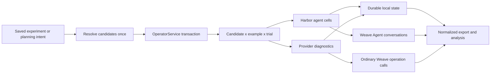
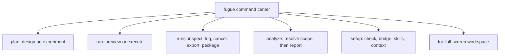
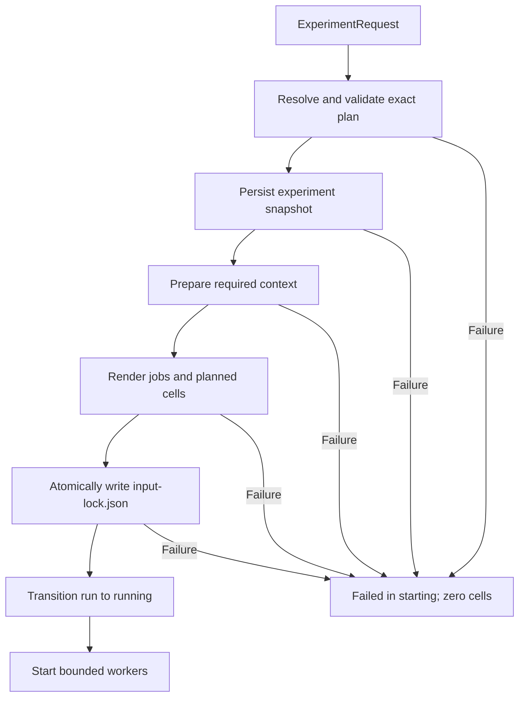
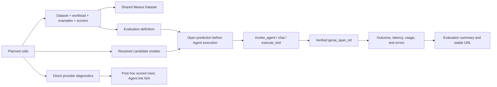
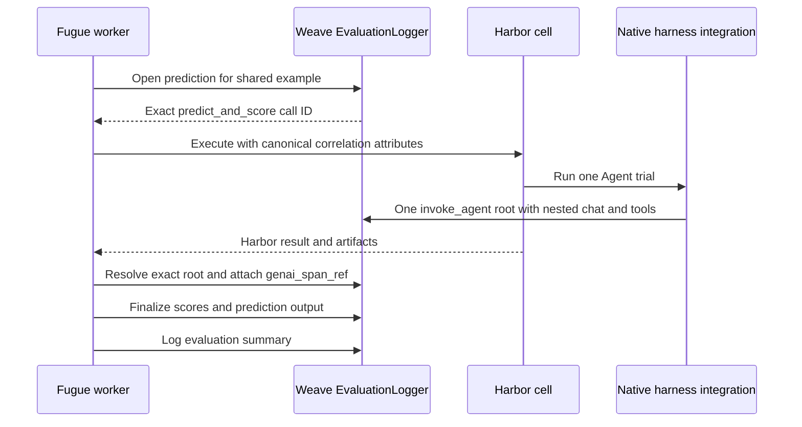
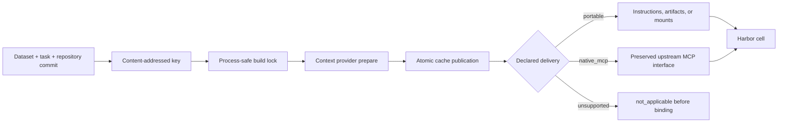
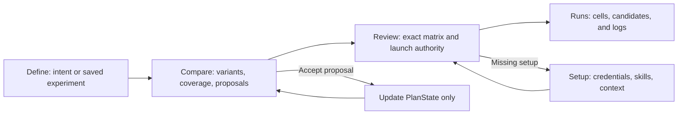
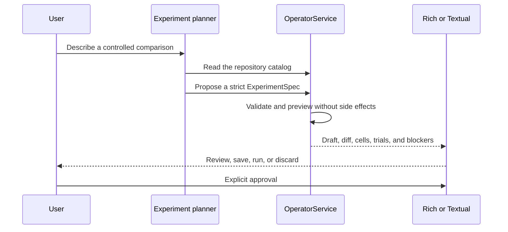
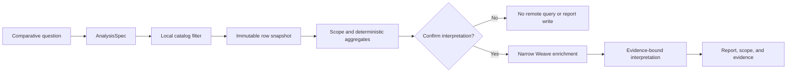
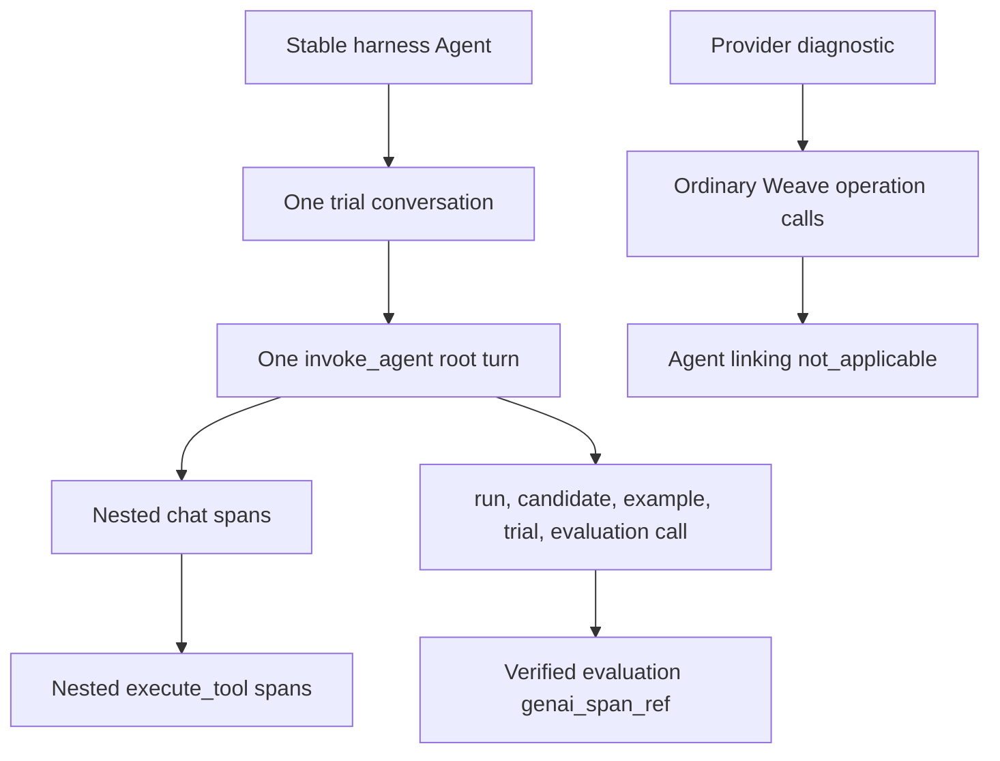

# Fugue

Fugue is a local-first operator for controlled agent experiments. It resolves
an experiment into comparable candidates, renders Harbor jobs, executes the
exact matrix, records native W&B Weave traces, and exports reproducible results.
Fugue 0.1 supports Hermes, OpenClaw, Claude Code, and Codex on Python 3.12+.

The core workflow is deliberately small:

1. Define or load an experiment.
2. Preview the exact candidate × task × trial matrix.
3. Prepare reviewed skills and declared context explicitly.
4. Run through the durable operator transaction.
5. Inspect candidates and export normalized JSONL.

Generated evaluations, self-evaluation, automated curation, and candidate
serving are advanced or experimental extensions. None runs implicitly.



## Install

[`uv`](https://docs.astral.sh/uv/) is the recommended environment manager.

```bash
uv venv --python 3.12
source .venv/bin/activate
uv sync --extra dev
```

Keep credentials outside the checkout and pass their existing path directly to
`--env-file`. Fugue reads the file but never copies it into runtime artifacts,
snapshots, jobs, or Git. `.env.example` lists the supported names:

```dotenv
WANDB_API_KEY=
WANDB_ENTITY=
WANDB_PROJECT=fugue-experiments

OPENAI_API_KEY=
ANTHROPIC_API_KEY=
FUGUE_MODEL=openai/gpt-5
```

Model selection precedence is CLI override, experiment configuration,
environment, then Fugue’s default. Builder and judge models are independent
roles and must be selected explicitly when their features are used.



## Preview and run

Preview never downloads sources, prepares context, calls a model, writes job
configuration, or mutates runtime state:

```bash
fugue run pilot --preview
```

Check dependencies and prepare only what the selected experiment requires:

```bash
fugue setup --experiment pilot --check
fugue setup --experiment pilot --skills
fugue setup --experiment repo-memory-impact --prepare \
  --env-file /path/to/existing/.env
```

`--check` is observational. `--prepare` is the plan-resolved state-changing
boundary: it content-locks remote workload data, context indexes, harness
runtimes, and unique task images for the selected architecture. Repeated setup
reuses verified locks. `--prepare-context` remains a narrower adapter-only
action. Preview and active trials never install, download, build, pull, start a
service, or use the Docker socket. Graphiti has a separate local Neo4j lifecycle:

```bash
fugue setup --experiment repo-memory-impact --systems graphiti \
  --start-services --env-file /path/to/existing/.env
fugue setup --experiment repo-memory-impact --systems graphiti \
  --service-status --env-file /path/to/existing/.env
fugue setup --experiment repo-memory-impact --systems graphiti \
  --stop-services --env-file /path/to/existing/.env
```

When Graphiti credentials are absent, Fugue generates an ignored mode-0600
credential file and resolves host and Harbor endpoints internally. Stopping the
service preserves its named data volume; 0.1.1 has no destructive purge action.

Remote skills are fetched for review but not executed. Approve one exact
reviewed digest before it can enter a run:

```bash
fugue setup --approve-skill hallmark=sha256:REVIEWED_DIGEST \
  --acknowledge-risk network-access
```

Start a run and wait, or return while the same durable worker continues:

```bash
fugue run pilot
fugue run pilot --detach
```

Before the first cell starts, `OperatorService` resolves the full plan,
persists the experiment snapshot, prepares context, renders jobs, plans cells,
and atomically writes `.fugue/runtime/RUN_ID/input-lock.json`. A failure before
that commit leaves the run failed in its `starting` phase and executes no cell.



## Inspect runs

Run operations use nested actions:

```bash
fugue runs
fugue runs RUN_ID
fugue runs RUN_ID logs
fugue runs RUN_ID logs --follow
fugue runs RUN_ID cancel
fugue runs RUN_ID export --out reports/run.jsonl --fetch-weave
fugue runs RUN_ID open agents
fugue runs RUN_ID open evaluation
fugue runs RUN_ID open evaluation --cell CELL_ID
```

Each run groups cells by behavioral candidate and shows deterministic benchmark
passes and failures separately from execution failures, unscored cells,
pending cells, and not-applicable cells. Completeness follows the execution
lifecycle; packageability follows the benchmark outcome. The terminal displays
a unique candidate prefix; JSON and snapshots retain the full SHA-256
identifier.

Live runs publish one Weave evaluation per candidate and workload. Fugue keeps
the returned evaluation URLs in the run manifest and attaches each verified
agent root to its prediction with Weave's GenAI span reference. Open the
evaluation to compare candidates, then select a prediction to navigate into the
linked agent conversation and trace.





This follows Weave's documented [EvaluationLogger](https://docs.wandb.ai/weave/guides/evaluation/evaluation_logger),
[Agent data model](https://docs.wandb.ai/weave/guides/tracking/trace-agents),
[supported Agent integrations](https://docs.wandb.ai/weave/guides/tracking/trace-agent-integrations),
and [Agent activity views](https://docs.wandb.ai/weave/guides/tracking/view-agent-activity).
Only agent-backed predictions receive conversation deep links. Retrieval and
continuity diagnostics remain ordinary Weave operations and report Agent
linking as `not_applicable`; Fugue never constructs undocumented URLs or fake
Agent conversations.

Candidate identity contains only behavior-affecting inputs: harness, provider
and model route, prompt digest, reviewed skill digests, context definition and
delivery, typed integrations, and advanced agent configuration. Experiment
names, variant IDs and labels, preset names, run names, judge/scorer state, and
trial ordinals do not affect it. Runtime, Harbor, concurrency, and tracing
policy instead affect a separate execution fingerprint.

Fugue preserves each harness's native model protocol: Hermes and OpenClaw use
Chat Completions, Claude Code uses Messages, and Codex uses Responses. A
provider is called directly when it exposes that protocol; otherwise a local
LiteLLM bridge translates the wire format without changing candidate identity.
Bridged runs fail preflight unless the running container uses the pinned image
digest and exact locked configuration. The snapshot, per-trial metadata, and
Agent root attributes record the expected protocol, direct-or-bridge endpoint
class, and upstream host so exported evidence can reconcile the route.

Model routing and tool delivery remain independent. Each Codex native-MCP cell
receives a new, isolated `CODEX_HOME` containing only its resolved allowlisted
servers; MCP payloads never pass through the model bridge. Fugue never reads or
mutates the user's global Codex credentials, skills, configuration, or MCP
definitions, and it never downgrades native MCP to portable instructions. The
locked runtime contains Codex 0.143.0 and weave-codex 0.1.1; trial startup
verifies the exact MCP inventory before the model turn.

## Experiment contract

Saved experiments live in `configs/fugue/experiments/`. The public YAML schema
is strict: use `skills`, use `context.delivery`, and select typed integrations.
Raw MCP server configuration is an internal rendering detail.

```yaml
id: search-comparison
title: Repository search comparison
manifest: datasets/pilot.yaml
model: openai/gpt-5
harnesses: [codex]

integrations:
  - id: shared-observer

variants:
  - id: baseline
    label: Baseline
    context: {system_id: none, delivery: portable}

  - id: treatment
    label: Reviewed search treatment
    prompt_id: search-instructions
    skills: [hallmark]
    context: {system_id: agentsmd, delivery: portable}
    integrations:
      - id: repository-search
        config: {top_k: 10}
```

Experiment integrations apply to every variant. Variant integrations are
additions. Duplicate IDs in the effective list are rejected; there is no
inherit/replace/null tri-state. To vary configuration, declare the integration
only on the variants that need it.

Context definitions declare their supported deliveries. `portable` never
injects native MCP, while `native_mcp` preserves the provider interface.
Selecting an unsupported delivery makes the cell `not_applicable` before
binding. Research adapters remain outside default presets until their pinned
Harbor runtimes pass live integration tests.

The experimental managed adapters are opt-in:

| System | Delivery | Explicit requirement |
| --- | --- | --- |
| GitNexus 1.6.3 | native MCP | `FUGUE_LICENSE_APPROVED_GITNEXUS=true`; noncommercial research only |
| CodeGraph 0.9.0 | native MCP | Prepared pinned platform bundle |
| Semble 0.5.1 | native MCP | Prepared local model and parser assets |
| Project RAG `d5abf98…` | native MCP | Prepared Rust runtime and isolated LanceDB state |
| Graphiti 0.29.2 | portable or native MCP | Managed Neo4j 5.26 service or explicit compatible endpoint |
| OpenWiki 0.1.1 | portable | Isolated builder workspace and Fugue model bridge |
| lat.md 0.11.0 | native MCP | `LAT_LLM_KEY` and `FUGUE_ENABLE_EXPERIMENTAL_LATMD=true` |

GitNexus, CodeGraph, Semble, Project RAG, and lat.md receive the same read-only
task snapshot at `/workspace/repository` and a separate writable state area.
The Fugue gateway preserves upstream MCP schemas and cancellation while adding
cell correlation to tool results. Without a lat.md key, semantic lat.md cells
are deterministically `not_applicable` and are not a release failure.

GitNexus has two strict candidates. Their mode and model assets participate in
candidate identity and context cache keys:

```yaml
context:
  system_id: gitnexus
  delivery: native_mcp
  config: {retrieval_mode: bm25}
```

```yaml
context:
  system_id: gitnexus
  delivery: native_mcp
  config:
    retrieval_mode: hybrid_vector
    embedding_model: Snowflake/snowflake-arctic-embed-xs
    embedding_revision: d8c86521100d3556476a063fc2342036d45c106f
    embedding_dimensions: 384
    vector_required: true
```

Hybrid setup bundles and verifies the 384-dimensional model and CPU ONNX
runtime, builds the index with networking disabled, and runs a semantic probe.
It fails closed for an absent index, zero embeddings, wrong dimensions, failed
vector query, or GitNexus's 50,000-node vector limit. It never reports BM25
fallback as a vector result.



## Plan in Rich or Textual

Run bare `fugue` for the Rich command center, or open the full workspace:

```bash
fugue
fugue tui
```

Textual keeps one in-memory plan:



- Define selects intent or a saved experiment.
- Compare shows variants, evaluation coverage, and generated-evaluation
  proposals.
- Review owns the exact matrix and launch authority.

Proposals update the plan only after acceptance and still require an explicit
save before execution. Multi-file evaluation saves validate and stage every
asset, write the experiment last as the commit marker, and remove newly created
orphan assets if saving fails. Agent presets live under Advanced and start a
new plan from their declared base experiment; a dirty plan requires a
replacement-diff confirmation.

Natural-language planning is explicit and produces an untrusted draft that is
parsed and previewed before it can be saved:



```bash
fugue plan \
  "Compare BM25 with no context across every harness for one coding task" \
  --from repo-memory-impact

fugue plan "Create a smaller PDF skill comparison" \
  --from skillsbench-pdf-ab \
  --save pdf-skill-smoke
```

## Results and analysis

Local export is normalized JSONL. Comparison example identity contains only
dataset, workload, and task; trial index is a separate cell coordinate.
Deterministic outcomes, rubric scores, and judge errors remain separate—Fugue
does not invent a composite score or convert a judge outage into a Harbor
failure. Unmeasured token usage remains unavailable rather than becoming zero.

`RunSnapshotV1` records source and resolved experiment digests, capability
decisions, logical predictions, runtime locks, planned cells, asset identities,
cohort identity, treatment-selection digest, evaluation-lock digest, and
publication schema before execution. This is the first public contract, so
earlier development snapshots are intentionally unreadable. A normalized
prediction is distinct from its raw retrieval or episode
measurements. Summaries therefore report planned and executed cells, logical
predictions, measurements, Agent and direct predictions, conversations, links,
canaries, and remediation cohorts separately.

Answer-bearing localization data lives in a mode-0600 host-only
`EvaluationAssetLockV1`. Fugue never mounts its raw paths in a task or Agent
container and never puts them in rendered jobs, snapshots, Agent metadata, or
trace inputs. Host-side scoring may publish derived recall and MRR together
with the lock digest.

W&B publication is idempotent by project, prediction ID, scorer version, and
revision. An explicit republish creates a new active revision with a reason and
`supersedes` link; it never merges evidence by a display label. Dashboard views
should filter to the active revision and facet by source commit, snapshot
digest, cohort, execution kind, harness, context system, and skill treatment.

### Public Experiment Atlas

The static Experiment Atlas is a reviewed evidence publication layer, not a
browser frontend for the operator. `tools/experiment_atlas.py` reduces
canonical normalized JSONL through an explicit allowlist, verifies the source,
dataset, coordinates, and digest against immutable run snapshots, recomputes
metrics, and writes versioned `PublicExperimentV1` snapshots plus an ordered
`ExperimentIndexV1`. Editorial YAML explains the question and decision; it
cannot supply or override results, links, or provenance.

Public snapshots may contain task IDs, fixed routes, harnesses, treatments,
outcomes, efficiency measurements, provenance, and verified Weave links. They
reject prompts, outputs, reasoning, tool content, gold data, exceptions, local
paths, environment values, secrets, unknown fields, and unapproved URL
domains. GitHub Pages builds only the committed snapshots. It receives no W&B
credential and makes no browser API call; Weave links are user-initiated and
explicitly labeled as requiring sign-in.

```bash
uv run python tools/experiment_atlas.py \
  --editorial-dir atlas/editorial \
  --rows EXPERIMENT_ID=reports/RUN_ID.jsonl \
  --run-summary EXPERIMENT_ID=.fugue/runtime/RUN_ID/run.json \
  --snapshot EXPERIMENT_ID=.fugue/runtime/RUN_ID/input-lock.json \
  --output atlas/public/data
npm --prefix atlas ci
npm --prefix atlas run build
python tools/check_atlas_build.py atlas/dist
```

The atlas orders complete experiments by evidence tier and then explicit
decision value. Active and blocked studies remain visible but unranked.
One-attempt grids show raw numerators and denominators without confidence
claims; only replicated holdout evidence receives the deterministic paired
bootstrap used by Fugue's selection policy. Quality, cost, latency, retrieval,
errors, and observability remain separate—there is no composite score.

The no-context frontier campaign uses one fixed model per immutable run:

```bash
fugue run swe-frontier-harness --preset canary \
  --model wandb/zai-org/GLM-5.2 --preview
fugue run swe-frontier-harness --preset discovery \
  --model wandb/zai-org/GLM-5.2 --preview
fugue run swe-frontier-harness --preset frontier-ceiling \
  --model anthropic/claude-fable-5 --preview
```

After each canary export, admit the full cohort through the ignored campaign
ledger. The ledger prices unmeasured cells at the canary's maximum measured
cell cost, applies a 1.5× margin to every planned cell, and refuses a cohort
that would cross the cumulative cap:

```bash
uv run python tools/frontier_campaign.py admit \
  --ledger reports/frontier-budget.json \
  --canary-rows reports/GLM_CANARY.jsonl \
  --cohort-id glm-5.2 --model wandb/zai-org/GLM-5.2 \
  --canary-predictions 4 --cohort-predictions 32 \
  --cap-usd 2000 --safety-margin 1.5
```

Its locked hard discovery cases require production and test changes, two to
eight touched files, repository diversity, and either issue-path lexical
mismatch or cross-directory production work. Model cohorts share comparison
example identities while model and harness changes remain distinct behavioral
candidates.

The hard-memory study is encoded as separate immutable cohorts. Discovery uses
a fixed Latin-square harness assignment; holdout and control treatments must be
selected from discovery results instead of being silently baked into the
experiment:

```bash
fugue run repo-memory-impact --preset context-contract --preview
fugue run repo-memory-impact --preset hard-calibration --preview
fugue run repo-memory-impact --preset hard-discovery --preview
fugue analyze --saved repo-memory-discovery-selection --yes
fugue run repo-memory-impact --preset hard-holdout \
  --selection-lock REPORT_DIR/treatment-selection-lock.json --preview
fugue run repo-memory-impact --preset gitnexus-ablation --preview
fugue run repo-memory-impact --preset gitnexus-swe-contract --preview
fugue run repo-memory-impact --preset retrieval-study --preview
fugue run repo-memory-impact --preset gitnexus-retrieval-study --preview
fugue run repo-memory-impact --preset continuity-study --preview
```

The planned prediction counts are 48 context-contract, 32 calibration, 80
discovery, 192 holdout, 96 easy-control, 128 repository-QA, 96 independent
GitNexus ablation, and 72 PDF-skill Agent predictions: 744 primary cells in
total. Direct cohorts contain 900 general
retrieval measurements, 450 GitNexus BM25/vector measurements, and 108
continuity sequence attempts. The 225-probe retrieval source is materialized
and locked by `setup --prepare`; a trial refuses to download it.

Discovery ranks variants against the same task, harness, and trial baseline.
Official SWE resolution is primary, followed by localization recall@10, MRR,
recoverable-error rate, measured cost, and stable variant ID. The versioned
`TreatmentSelectionLockV1` captures the complete ranking and chosen three;
holdout, controls, and repository-QA reject manual treatments that disagree
with it. A separate 16-cell uptake diagnostic uses qualification-only tasks and
never contributes to efficacy denominators.

`gitnexus-swe-contract` is a one-cell Codex qualification canary. It explicitly
requires a semantic lookup before editing so it can prove native MCP, vector
telemetry, the official verifier, and the Agent deep link together. It is not
part of the unbiased GitNexus ablation and must not enter an efficacy estimate.

SWE-bench verifier dependencies and grading metadata are prepared into the
locked task image. Qualification runs the official verifier offline twice: the
base checkout must fail and the pinned gold patch must pass. A verifier that
tries to resolve packages or metadata during a trial invalidates the task
image instead of producing a benchmark result.

Analysis first resolves and displays an immutable local scope. `--yes` is the
explicit boundary for model interpretation and report writing:



```bash
fugue analyze \
  "Which context improved coding outcomes without excessive latency?" \
  --filter experiment_id=repo-memory-impact

fugue analyze --saved fugue-maintainer-selection --yes
```

### Weave Agent hierarchy

Harness identities are stable across experiments: `hermes-agent`, `openclaw`,
`claude-code`, and `codex`. Each Harbor Agent trial is one conversation with
one root turn. The harness integration owns model and tool spans; Fugue adds
flat correlation attributes and verifies the observed root before linking it
to an evaluation prediction.



## Advanced: generated evaluations

Generation is a separate explicit action; ordinary preview cannot read MCP,
call a model, write assets, or merge hidden files from disk. A generation
request names its exact suite, workload, size, and typed sources:

```yaml
judge_model: openai/gpt-5-mini
evaluation_generation:
  suite_id: repository-search-v1
  workload_id: capabilities
  size: 8
  sources:
    - {kind: seed, text: "Evaluate reviewed repository search behavior."}
    - {kind: file, path: README.md}

workloads:
  - id: capabilities
    runner: harbor
    scorers:
      - {type: builtin, id: harbor-outcome}
      - type: rubric
        path: configs/fugue/evaluations/repository-search-v1/rubric.yaml
```

Rubric scorers require an explicit judge model. Generation must produce the
configured case count and required strata. Existing suites require an explicit
regenerate/overwrite confirmation, and workload collisions fail instead of
silently renaming or modifying another workload.

## Advanced: candidate packaging and serving

Packaging requires a clean tracked Fugue source checkout and a clean production
workspace. It copies only an explicit Git-tracked runtime allowlist and rejects
submodules, escaping symlinks, credential-bearing remotes, secrets, dirty
source, integrations, and input-lock drift.

```bash
fugue runs RUN_ID package CANDIDATE_PREFIX \
  --workspace /path/to/clean/production-checkout \
  --image example/fugue-service:candidate \
  --yes
```

All applicable cells for the candidate must be terminal, and at least one
deterministic benchmark outcome must pass. Terminal unscored cells may provide
coverage but never satisfy that pass requirement. Benchmark or execution
failures require both `--allow-failed` and confirmation. Judge and rubric
results never replace the deterministic outcome. Another candidate may fail
the overall run without blocking a complete candidate.

Serving is an optional Python 3.13 feature, outside the operator path:

```bash
uv sync --extra dev --extra serve --python 3.13
python -m fugue.serve
```

The stateless text-only gateway implements the documented Open Responses,
Chat Completions, and AG-UI subset. Defaults are one executing request and an
eight-request queue. Configure `FUGUE_SERVE_MAX_CONCURRENCY` and
`FUGUE_SERVE_QUEUE_DEPTH` to change them. Admission overflow returns 429 with
`Retry-After`. Requests are limited to 1 MiB, 128 messages, and 256 KiB of text.
Cancellation terminates the isolated Harbor process group and removes request
state. `/readyz` performs a bounded Docker daemon or configured remote probe.

Stored conversations, server-side tools, media, compaction, WebSockets,
registry push, deployment management, and autoscaling are not part of 0.1.

## Experimental: self-evaluation

`fugue-maintainer-v1` and `fugue-operator-v1` are separate suites pinned to
Fugue commit `96512017842d68add2546a057f0601de3eaf610e`. Their tasks, mutations,
fixtures, and verifiers remain unchanged. Fugue 0.1 ships no promoted agent
preset and makes no efficacy claim; a release-current benchmark requires a
separately reviewed v2.

## Experimental: curator

The curator has two wrappers over one shared policy:

- `fugue-curator-dry-run.md` is manual and read-only. It cannot edit or create
  a pull request, and no-op reports do not create issues.
- `fugue-curator.md` is manual or scheduled only when the repository variable
  `FUGUE_CURATOR_ENABLED` is `true`. It may create at most one draft PR.

Curator output is restricted to skill-source declarations, context-system
definitions, and controlled experiments. It cannot change code, tests,
workflows, dependencies, datasets, presets, README, or vendored skill content.
Skill proposals still require human review through `fugue setup --skills`.

## Development

```bash
uv lock --check
uv run ruff check .
PYTHONWARNINGS=error uv run python -m compileall -q fugue tests
PYTHONWARNINGS=error uv run pytest
uv build
```

Core and context suites support Python 3.12 and 3.13. Serving and protocol
compatibility run on Python 3.13. See `docs/campaigns.md` for the governed
campaign contract, `docs/task-authoring.md` for flexible tasks, scenarios,
judges, and meta-analysis, `docs/research.md` for the packaged outer-loop SDK,
and `docs/extension-guide.md` for context and
integration definitions, `docs/releases/0.1.md` for the base release, and
`docs/releases/0.1.1.md` for the stacked hardening scope and evidence rules.

Fugue is licensed under the Apache License 2.0. See `LICENSE`.
