# Fugue

Fugue plans, runs, and analyzes controlled agent experiments across Hermes,
OpenClaw, Claude Code, and Codex. The Harbor evaluation framework executes each
experiment cell; W&B Weave records agent conversations and traces; Fugue keeps
the comparison matrix, local run state, and normalized outcomes coherent.

Fugue is an experiment-composition layer, not a memory-only framework. A
variant can independently select prompts, Agent Skills, context providers,
MCP/service integrations, agent settings, and verifier settings. Fugue targets
`harbor==0.18.0` (the agent-evaluation framework, not the unrelated self-hosted
LLM-stack project named Harbor) and Python 3.12 or newer.

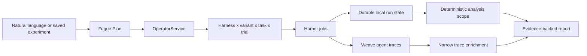

## Quick Start

```bash
uv venv --python 3.12
source .venv/bin/activate
uv pip install -e ".[dev]"
uv tool install --python 3.12 harbor==0.18.0 --with-editable .
cp .env.example .env
```

Install `.[context]` as well when running local RAG or persistent-memory
providers.

At minimum, configure W&B for tracing and the selected model provider:

```bash
WANDB_API_KEY=
WANDB_ENTITY=wandb
WANDB_PROJECT=fugue-experiments

OPENAI_API_KEY=
ANTHROPIC_API_KEY=

FUGUE_MODEL=wandb/zai-org/GLM-5.2
LITELLM_MASTER_KEY=sk-fugue-local
```

`WANDB_API_KEY` is always required for Weave tracing. It also pays for model
calls when the selected route starts with `wandb/`. OpenAI and Anthropic keys
are needed only when their provider route is selected.

For W&B Inference routes, Fugue sends `WANDB_ENTITY/WANDB_PROJECT` as the
`OpenAI-Project` request header. Model usage and Weave traces therefore land in
the same project by default; `WEAVE_PROJECT=entity/project` overrides both.
Agent spans use Weave's dedicated Agents OTLP endpoint and route with the same
project. Its Basic authentication header is created only in the trial process
environment and is never written to generated Harbor or plugin configuration.

Run bare `fugue` in a terminal to open the Rich command center:

```bash
fugue
```

It shows the active model and Weave project, operational readiness, recent
runs, and a harness sequencer. The full-screen workspace remains available as:

```bash
fugue tui
fugue tui --screen results
```

## Command Model

Fugue has six explicit commands plus the bare command center:

```text
fugue
fugue plan
fugue run
fugue runs
fugue analyze
fugue setup
fugue tui
```

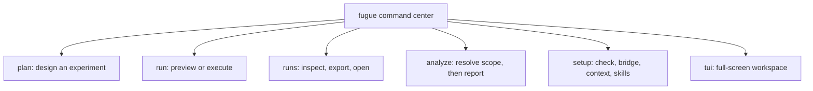

Commands accept `--json` where structured automation is useful. JSON mode does
not emit Rich decoration or interactive prompts.

## Setup

Show setup for an experiment:

```bash
fugue setup --experiment pilot
```

Run observational checks, start the explicit local bridge, or prepare selected
context systems:

```bash
fugue setup --experiment pilot --check

fugue setup \
  --experiment pilot \
  --model wandb/zai-org/GLM-5.2 \
  --start-bridge

fugue setup \
  --experiment repo-memory-impact \
  --preset smoke \
  --workloads coding \
  --systems none,rag-bm25 \
  --prepare-context
```

Preflight never starts containers or writes bridge files. `--start-bridge` and
`--prepare-context` are explicit mutations.

Remote skills have a separate review boundary:

```bash
fugue setup --experiment my-study --skills
fugue setup --approve-skill hallmark=sha256:REVIEWED_DIGEST \
  --acknowledge-risk network-access
```

The first command fetches Git objects, inspects only the declared skill
subdirectory, and writes a review record. It does not check out or run the
repository's installer, hooks, package scripts, or plugin code. The second
command locks one exact bundle digest after explicit review. Moving refs are
rejected rather than injected into a trial. Once approved, the selected bundle is
available inside the Harbor sandbox, where the agent may follow its
instructions or run acknowledged scripts.

Model precedence is:

```text
CLI override > experiment/harness configuration > environment > Fugue default
```

Target, builder, judge, composer, and analyst routes are resolved separately.

## Plan Experiments

Saved experiments live under `configs/fugue/experiments/`. Prompts and local
skills live under `configs/fugue/prompts/` and `configs/fugue/skills/`.
Reviewed remote skill declarations live under `configs/fugue/skill-sources/`;
service/MCP adapters live under `configs/fugue/integrations/`.

The canonical variant fields are `skills` and `integrations`:

```yaml
variants:
  - id: hallmark-with-search
    label: Hallmark + search service
    skills: [hallmark]
    integrations:
      - id: repository-search
        config: {top_k: 10}
```

The older `skill_ids` spelling is accepted for migration but new saves emit
`skills`.

Plan from natural language:

```bash
fugue plan \
  "Compare BM25 with no context across every harness for one coding task" \
  --from repo-memory-impact
```

Fugue grounds the request in checked-in manifests, prompts, skills, context
systems, presets, and model routes. It then validates the generated experiment
and renders a side-effect-free matrix preview.

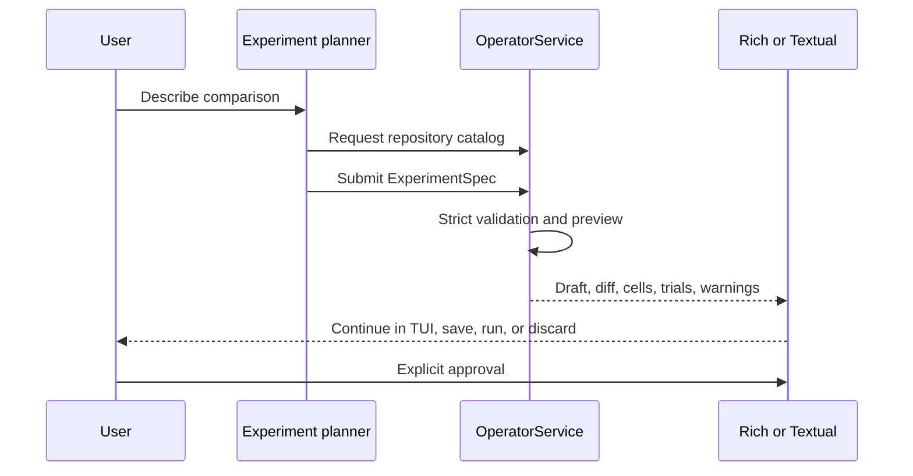

Scripted save and launch remain explicit:

```bash
fugue plan "Create a smaller PDF skill comparison" \
  --from skillsbench-pdf-ab \
  --save pdf-skill-smoke

fugue plan "Run the checked-in configuration unchanged" \
  --from pilot \
  --run \
  --yes
```

Generated prompt, skill, and evaluation assets must be saved before the draft
can run. When an experiment has no suitable dataset or scorer, planning can
generate a reviewable eight-case suite under
`configs/fugue/evaluations/<suite-id>/`:

```yaml
judge_model: openai/gpt-5-mini
evaluation_generation:
  size: 8
  sources:
    - {kind: seed, text: "Evaluate the repository-search skill."}
    - {kind: file, path: README.md}
    - kind: mcp
      server: docs
      tools: [search]
      resources: ["docs://schema"]
workloads:
  - id: capabilities
    runner: harbor
    scorers:
      - builtin:harbor-outcome
      - configs/fugue/evaluations/repository-search/rubric.yaml
```

Generation may list bounded MCP tool schemas and read only the resource URIs
named in the experiment; it never invokes an MCP tool. The preview shows case
coverage, source hashes, rubric dimensions, and the diffs for `cases.jsonl`,
`rubric.yaml`, and `manifest.yaml` without writing files or preparing runtime
state. A saved generated suite is materialized atomically into the
content-addressed `.fugue/cache/datasets/generated/` cache when execution is
prepared.

### Textual planning workflow

The TUI keeps experiment design focused on the comparison rather than the
underlying schema:

```bash
fugue tui
```

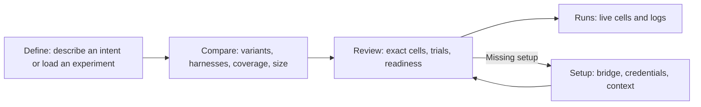

- **Define** accepts a natural-language request or a saved experiment. AI
  proposals remain local until `Use proposal` is selected.
- **Compare** shows only the controlled variables: variants, harnesses,
  evaluation coverage, and run size. Variant edits remain in memory until an
  explicit save or run. `Generate evaluation` creates a proposal that must be
  reviewed and accepted before it is attached to the plan.
- **Review** automatically renders the exact matrix and explains unavailable
  cells or setup blockers before enabling `Run experiment`.
- **Advanced** contains model-role overrides, concurrency, tags, run name, and
  trace policy. Checked-in experiment defaults remain authoritative otherwise.

Use `n` and `p` to move between planning steps. `1` through `4` continue to
switch between Plan, Runs, Results, and Setup. Pressing `r` from Define or
Compare opens Review; it never launches an experiment without review.

For the eight-cell memory smoke in the TUI:

1. Load `Repository context-system impact` in Define.
2. In Compare, keep the `smoke` size, select only `Coding`, and enable `No
   added context` plus `Fugue BM25`.
3. Keep all four harnesses selected and open Review.
4. Use `Open Setup` if BM25 needs preparation, then return and run the eight
   displayed cells.

## Run Experiments

Preview is side-effect free: it does not write runtime state, generated
JobConfigs, downloads, indexes, or experiment files.

```bash
fugue run pilot --preview
```

Start a durable run and wait while Rich renders the live cell matrix:

```bash
fugue run pilot
```

Return immediately while the same managed run continues in its process group:

```bash
fugue run pilot --detach
```

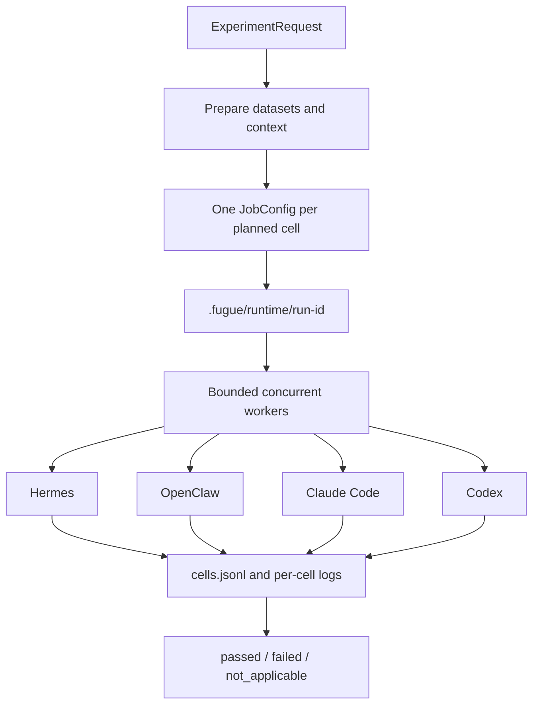

Every run receives an immutable generated run ID. The requested run name is a
human grouping label only. One failed cell does not stop sibling cells.

## Inspect Runs

```bash
fugue runs
fugue runs RUN_ID
fugue runs RUN_ID --logs --follow
fugue runs RUN_ID --logs --cell CELL_ID
fugue runs RUN_ID --cancel
```

Every managed Harbor run now opens its Weave evaluation predictions before the
agent cells start. Export writes normalized JSONL, verifies those live links,
and backfills rows only when live publication was unavailable:

```bash
fugue runs RUN_ID \
  --export \
  --out reports/run.jsonl \
  --fetch-weave \
  --to-weave
```

Compatible candidates share one Weave Evaluation definition and dataset. Each
harness/variant is a distinct model run against that definition:

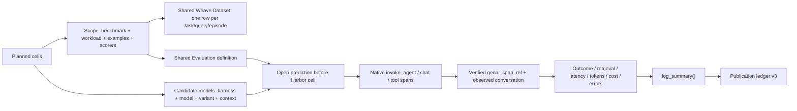

Candidate dimensions and trial ordinals never enter dataset inputs. Repeated
trials for the same task appear as repeated predictions under one example.
Evaluation attributes describe only the shared scope; candidate configuration
lives on the model object and run metadata. Administrative cell and
preparation records remain local. Missing usage is `N/A`; zero is reserved for
a measured zero.

The live prediction stays open for the Harbor cell, so Weave's prediction
latency covers execution rather than export overhead. Fugue accepts a trace
link only when the native root matches the run key, task, stable agent name,
and exact `predict_and_score` call id. A network or ingestion failure does not
change the Harbor outcome; it marks the run's observability status as failed
and leaves an idempotent backfill for export.

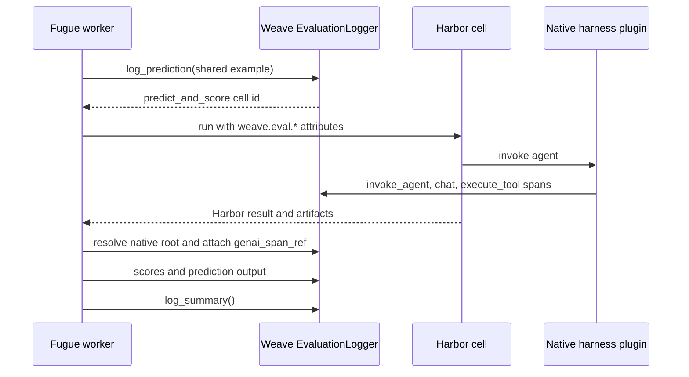

Open the stable W&B destinations:

```bash
fugue runs RUN_ID --open agents
fugue runs RUN_ID --open trace --cell CELL_ID
fugue runs RUN_ID --open project
```

Fugue opens an exact trace only when a verified URL exists. Otherwise it opens
Weave Agents and prints the conversation ID rather than inventing a URL.

## Analyze Results

Ask a comparative question:

```bash
fugue analyze \
  "Which context system improved coding outcomes without excessive latency?" \
  --filter experiment_id=repo-memory-impact
```

Analysis has an explicit confirmation boundary:

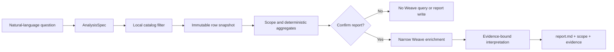

For automation, `--yes` confirms report generation:

```bash
fugue analyze "Compare PDF skill lift by harness" \
  --filter experiment_id=skillsbench-pdf-ab \
  --save pdf-skill-lift \
  --yes

fugue analyze --list
fugue analyze --saved pdf-skill-lift --yes
```

Official arithmetic is deterministic Python over the immutable snapshot. The
model interprets aggregates and must cite registered evidence IDs. Hybrid mode
starts from local outcomes and requests only matching Weave run keys and
conversation IDs.

## Context Systems

Context providers implement preparation, binding, retrieval, and optional
ingestion without changing the experiment runner. Cached indexes live under
`.fugue/cache/context/v2`; per-run state lives under `.fugue/runtime/`.

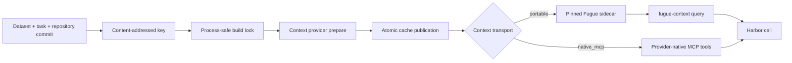

Default studies use only systems with runnable prerequisites. CodeGraph,
GitNexus, Project-RAG, Semble, and lat.md remain explicit research adapters
until their pinned Harbor runtimes pass integration tests. Unsupported cells
are recorded as `not_applicable`, never as failed trials.

`ContextSelection.transport` makes the treatment interface explicit:

- `portable` is the default for Fugue BM25, dense, and hybrid RAG. A pinned
  sidecar owns the index and every harness receives the same bounded command:
  `fugue-context query --text "..." --top-k 10`.
- `native_mcp` is for studies of a provider's native tool interface. It is a
  distinct treatment, not a fallback for portable retrieval.

Portable RAG does not expose the cache as a static repository mount. Every
cell runs a deterministic registration probe before the agent starts. Fugue
reports context as assigned, registered, and invoked separately; zero agent
queries remain a valid intent-to-treat result when the probe passed.

Codex exposes native MCP tools as Responses namespaces. Native OpenAI routes
are eligible only after that compatibility probe passes. W&B and Anthropic
bridge routes currently accept function tools only, so `native_mcp` Codex
cells on those routes are `not_applicable`. Portable context remains available
to W&B-routed Codex because it is a shell command, not a Responses namespace.

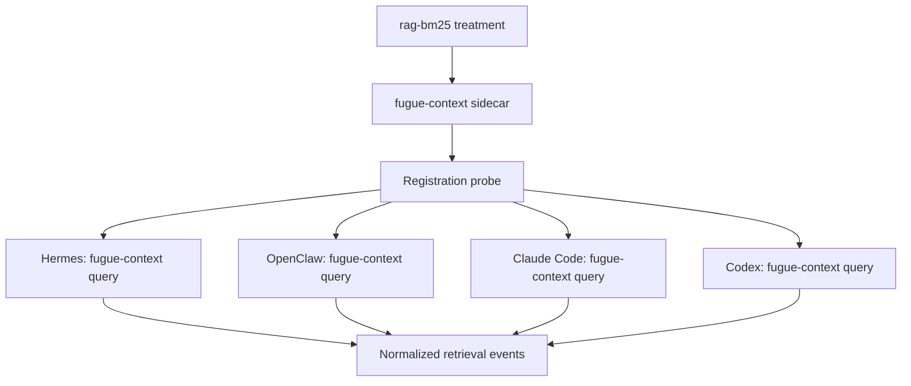

### Error ownership and comparability

Fugue merges native Harbor trajectories with Weave spans and de-duplicates
the same logical failure. Errors are attributed to one of six actionable
owners: agent behavior, benchmark runtime, harness adapter, context system,
model provider, or Fugue. Recoverable tool errors do not become terminal agent
failures merely because they appeared in a trace.

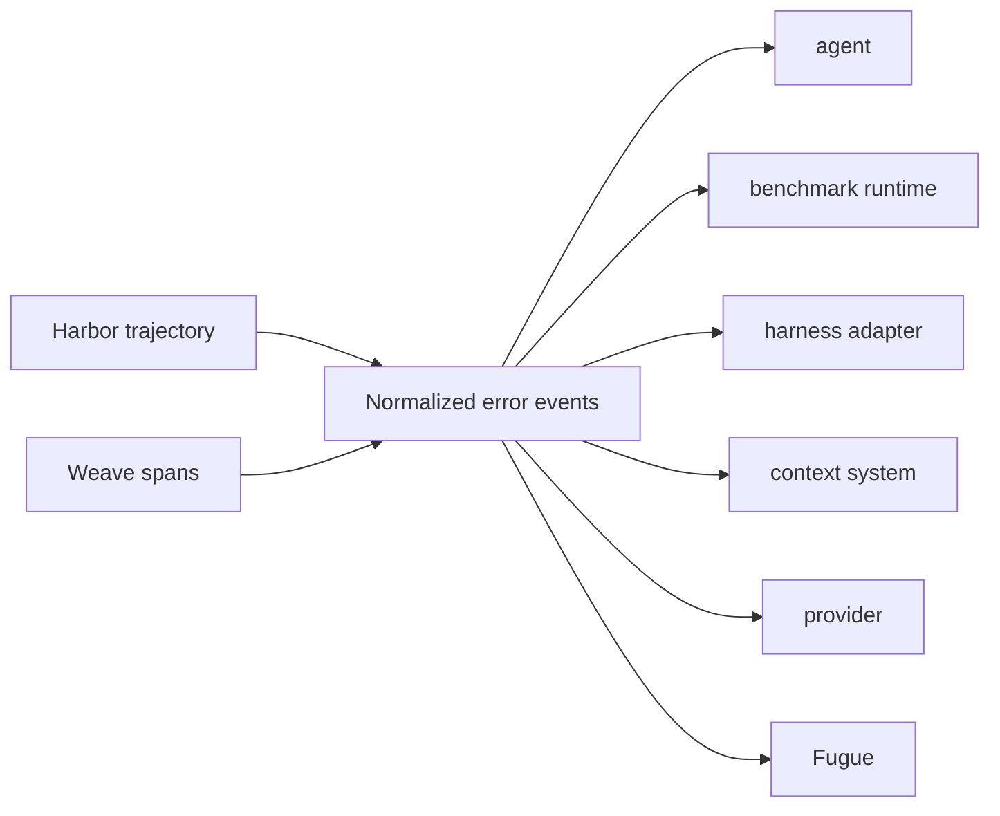

Each harness records a pre-install fingerprint and a pre-execution
fingerprint. Cohort comparability uses the pre-install benchmark environment;
if package, Python, or platform digests differ, rows are marked
`runtime_equivalence_status=mismatch` and should not be used for causal lift
claims. File evidence is derived from normalized read/search trajectories,
the final git diff, and benchmark expected paths. Agents are not asked to
author a special evidence JSON file.

OpenClaw's headless benchmark config denies provider-backed or interactive
tools that are unavailable in the container, including browser, web search,
image, canvas, node, channel, and gateway administration tools. This keeps a
missing external service from being counted as an agent reasoning error.

Context systems and integrations declare one of `supported`, `experimental`,
`not_applicable`, or `disabled`. Experimental adapters remain selectable but
are identifiable in run provenance; disabled and not-applicable adapters never
become failed benchmark trials.

## Extension Model

Use the narrowest extension point that represents the treatment:

- `skills`: inert instruction bundles copied into Harbor's native agent skill
  input. Local and reviewed remote bundles use full-directory hashes.
- `context`: repository/task-derived state with a prepare/bind/retrieve/ingest
  lifecycle and content-addressed caches.
- `integrations`: explicitly selected MCP or HTTP services. Local Compose
  services require digest-pinned images and hardened defaults; external
  services require HTTPS and an explicit Harbor host allowlist. Compose
  services share the trial network namespace, use loopback endpoints, and
  must declare non-conflicting ports.
- `repository`: a benchmark task's immutable Git input, expressed as a URL and
  full commit SHA.
- `workload`/Harbor dataset: task provisioning, environment, submission, and
  verification semantics.

Do not turn an arbitrary third-party repository into executable setup code.
Select a reviewed `SKILL.md` directory as a skill, or package service behavior
in a reviewed digest-pinned image and declare an integration. See
[`docs/extension-guide.md`](docs/extension-guide.md) for schemas, safety rules,
the current support matrix, and conformance guidance.

## Weave Agent Model

Harness identities are stable across experiments:

```text
hermes-agent
openclaw
claude-code
codex
```

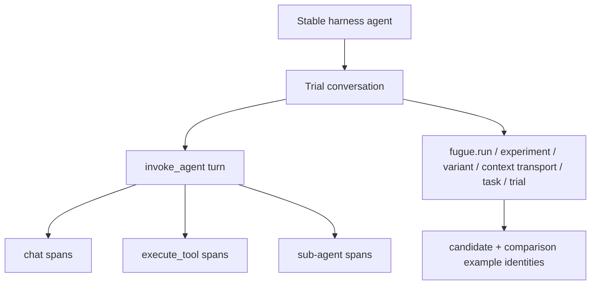

Native harness integrations own model and tool spans. Fugue supplies stable
conversation identity and flat filterable attributes without duplicating
instrumentation. Full trace content is the default and may include prompts,
responses, reasoning, tool arguments, and tool results. Use metadata mode only
for integrations that can guarantee suppression. Usage is summed from `chat`
spans when available, with root aggregates used only as a fallback so nested
totals are never counted twice.

Fugue stores planned and observed conversation identities separately. The
observed native conversation is used for evaluation links; the deterministic
planned id remains correlation metadata. Context experiments separately report
whether context was assigned, available, invoked, and successfully returned
results. Registration, runtime equivalence, and error provenance are published
as separate scores. A configured retrieval system with zero calls is an unused
treatment, not evidence that retrieval helped.

## Included Demos

### PDF Skill A/B

```bash
fugue setup --experiment skillsbench-pdf-ab --check
fugue setup --experiment skillsbench-pdf-ab --start-bridge
fugue run skillsbench-pdf-ab --preview
fugue run skillsbench-pdf-ab --detach
```

This compares a Fugue-authored PDF workflow skill with a no-skill baseline
across four harnesses and three SkillsBench tasks. It is not an official
SkillsBench leaderboard reproduction.

### Context A/B Smoke

```bash
fugue setup \
  --experiment repo-memory-impact \
  --preset smoke \
  --workloads coding \
  --systems none,rag-bm25 \
  --prepare-context

fugue run repo-memory-impact \
  --preset smoke \
  --workloads coding \
  --systems none,rag-bm25 \
  --harnesses hermes,openclaw,claude-code,codex \
  -k 1 -n 2 -l 1 \
  --preview
```

Remove `--preview` to launch the eight-cell comparison.

## Development

```bash
python -m compileall fugue
python -m ruff check .
python -m pytest
```

Generated state belongs under `.fugue/`, `jobs/`, or `reports/`. Saved
experiments, prompts, skills, analyses, and context-system definitions belong
under `configs/fugue/`.
