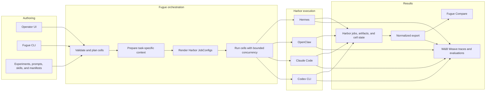
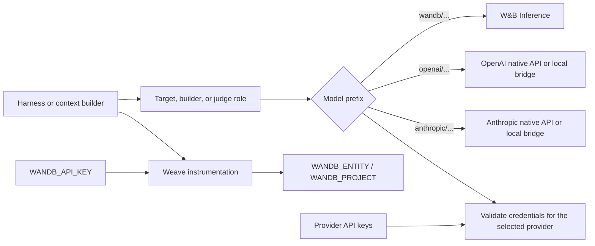
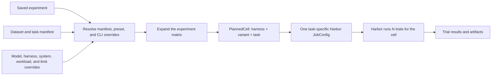
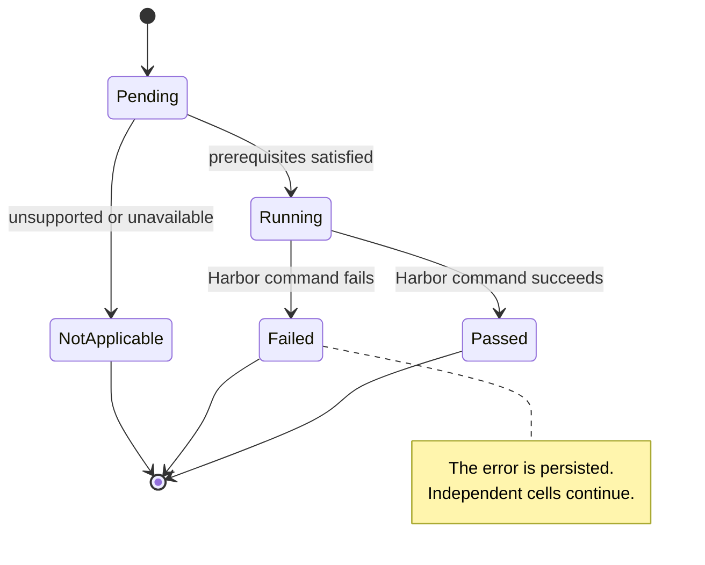
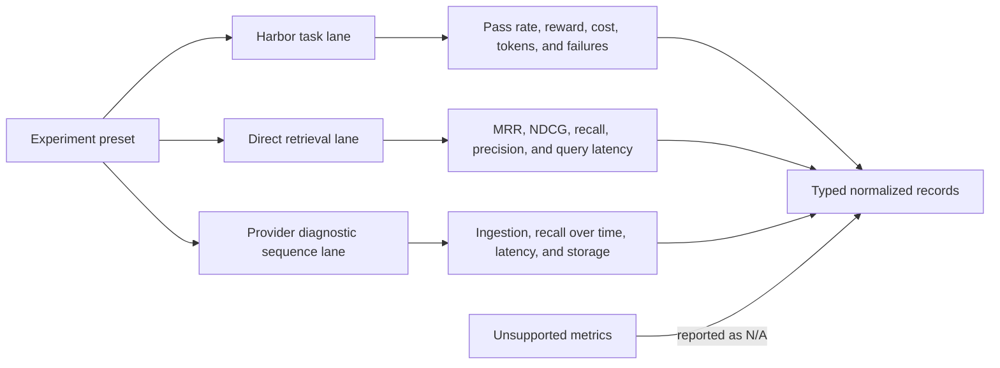
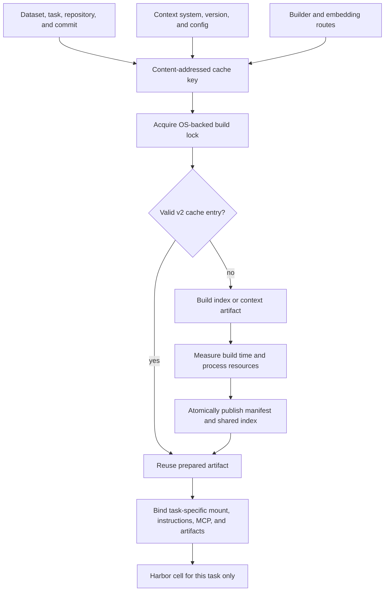
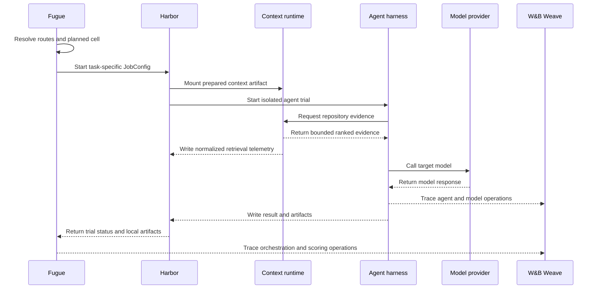
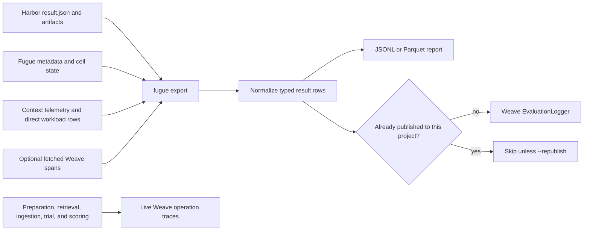
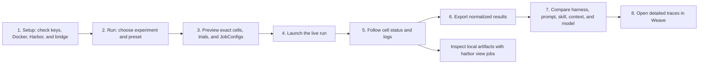

# fugue

**Run multiple agent harnesses on the same tasks, trace every run in W&B
Weave, and compare the results note for note.**

Fugue is a thin, opinionated layer on top of
[Harbor](https://github.com/laude-institute/harbor) for sandboxed trial
execution and [W&B Weave](https://wandb.ai/site/weave) for traces and
evaluation. W&B is always the trace plane. The model plane is provider
neutral: runs can bill through W&B Inference, OpenAI, or Anthropic by changing
one model string.

```text
wandb/zai-org/GLM-5.2
openai/gpt-5
anthropic/claude-sonnet-4-5
```

## System At A Glance

Fugue turns a saved experiment into isolated Harbor jobs, keeps context
artifacts specific to each task, and joins local outcomes with Weave traces for
comparison.



## Harnesses

| harness | adapter | model routing | Weave plugin |
|---|---|---|---|
| Hermes | `fugue.agents:FugueHermes` | OpenAI-compatible chat, direct or bridged | local `hermes-otel` checkout |
| OpenClaw | `fugue.agents:FugueOpenClaw` | OpenAI-compatible chat, direct or bridged | `weave-openclaw` |
| Claude Code | `fugue.agents:FugueClaudeCode` | native Anthropic Messages for `anthropic/...`, bridge otherwise | `weave-claude-code` |
| Codex CLI | `fugue.agents:FugueCodex` | native OpenAI Responses for `openai/...`, bridge otherwise | `weave-codex` |
| Letta Code | `fugue.agents:FugueLetta` | native OpenAI/Anthropic, W&B through the bridge | exported trial metadata + MemFS artifact |

The local LiteLLM bridge is generated under `.fugue/bridge/` by
`fugue bridge up`. It binds to `127.0.0.1:4000`; Harbor task containers reach
it at `http://host.docker.internal:4000`. It exposes separate target, builder,
and judge aliases and runs a pinned LiteLLM image.

### Model And Trace Routing

The model prefix selects the billing provider. Target, builder, and judge are
resolved as separate roles, while all operational traces still go to the same
configured W&B project.



## Quick Start

```bash
cp .env.example .env
uv venv && uv pip install -e ".[dev,web,context]"

fugue preflight --model wandb/zai-org/GLM-5.2
fugue bridge up --model openai/gpt-5

scripts/smoke.sh --model wandb/zai-org/GLM-5.2
scripts/smoke.sh --model openai/gpt-5 codex hermes
scripts/smoke.sh --model anthropic/claude-sonnet-4-5 claude-code
```

Requirements: Docker Desktop, Harbor (`uv tool install harbor`), `jq`, and for
Hermes a local `hermes-otel` checkout (`HERMES_OTEL_CHECKOUT`, default
`~/Documents/GitHub/hermes-otel`).

## Experiment Runner

An experiment describes the comparison, while Fugue expands it into the
smallest independently executable cells. Harbor repeats each cell for the
requested number of trials.



```bash
fugue prompts list
fugue skills list
fugue experiments list

fugue run --experiment pilot --manifest datasets/pilot.yaml \
  --model openai/gpt-5 \
  --harnesses hermes,openclaw \
  --variants baseline,prompt-skill \
  --run-name gpt5-prompt-skill-sweep \
  --tags pilot,gpt5 \
  -k 1 -l 3
fugue export --jobs jobs/pilot --out reports/pilot.jsonl --to-weave
```

## Skill A/B Demo

The checked-in `skillsbench-pdf-ab` experiment measures one controlled change:
the `baseline` variant receives no skill, while `with-pdf-skill` receives
Fugue's original `pdf-artifact-workflow` skill. Both variants otherwise use the
same model, tasks, harness settings, prompt, context system, and trial count.

The demo uses three PDF-heavy tasks from
[SkillsBench v1.1](https://www.skillsbench.ai/blogs/skillsbench-1-1): form
filling, PDF-to-spreadsheet comparison, and document anonymization. Across four
harnesses and two attempts, the complete run contains 48 trials:

```text
4 harnesses x 2 variants x 3 tasks x 2 trials = 48 trials
```

Check model and trace credentials, then start the local bridge:

```bash
fugue preflight --model wandb/zai-org/GLM-5.2 --no-bridge-up
fugue bridge up --model wandb/zai-org/GLM-5.2
```

In another terminal, render and inspect the 24 task-specific Harbor JobConfigs before
launching the matrix:

```bash
fugue run --experiment skillsbench-pdf-ab --dry-run
fugue run --experiment skillsbench-pdf-ab \
  --run-name skillsbench-pdf-ab-v1
```

Export the joined results to JSONL and Weave, or inspect each trial and its
collected output artifacts in Harbor's local viewer:

```bash
fugue export --jobs jobs/skillsbench-pdf-ab \
  --out reports/skillsbench-pdf-ab.jsonl \
  --fetch-weave \
  --to-weave
harbor view jobs/skillsbench-pdf-ab
```

Compare pass rate, reward, cost, tokens, wall time, and failures by harness and
variant. For individual wins and regressions, open the Weave traces and check
whether the harness found and followed the skill before producing its artifact.

This is a Fugue-authored skill experiment running on public SkillsBench tasks.
It does not copy SkillsBench's bundled skills and is not an official
SkillsBench leaderboard reproduction.

Model precedence is:

1. CLI `--model`
2. Harness `model`
3. Experiment `model`
4. Manifest `model`
5. `FUGUE_MODEL`
6. `wandb/zai-org/GLM-5.2`

Builder and judge routes resolve independently from CLI flags, experiment
fields, and `FUGUE_BUILDER_MODEL` / `FUGUE_JUDGE_MODEL`. Shell variables take
precedence over `.env`; blank dotenv entries do not erase exported credentials.

Saved experiments live under `configs/fugue/experiments/`, prompts under
`configs/fugue/prompts/`, and Harbor skills under `configs/fugue/skills/`.
Each experiment defines feature variants: named bundles of prompt, skills,
context system, and advanced Harbor agent settings. Fugue renders one Harbor
JobConfig per harness, variant, and task; Harbor owns the configured number of
trials inside that cell. This prevents an index prepared for one task from
being mounted into another task. `fugue export` joins Harbor `result.json`,
`agent/fugue-meta.json`, context telemetry, and optional Weave span summaries.

Every live execution receives an immutable generated `run_id`; `--run-name` is
only a label. Cell transitions are appended to
`.fugue/runtime/<run_id>/cells.jsonl` as `pending`, `running`, `passed`,
`failed`, or `not_applicable`. Cells run with bounded concurrency, and one
failed Harbor command does not stop the remaining experiment.

### Cell Lifecycle

Every planned cell remains visible, including unsupported combinations. This
makes missing coverage distinguishable from an actual failed evaluation.



## Context-System Evaluation

`repo-memory-impact` compares context systems without forcing them through one
fake interface. Harbor workloads measure whether a system helps Hermes,
OpenClaw, Claude Code, and Codex complete repository tasks. Direct retrieval
workloads score systems that expose ranked hits. Provider diagnostic sequence
workloads measure ingestion, recall, latency, and storage growth separately
from harness trials. Episodes remain ordered within a cohort while independent
cohorts run concurrently. Metrics that a system
cannot produce remain `N/A`; they are not converted into failures or zeroes.

### Evaluation Lanes

Context systems keep their native capabilities. Fugue compares equivalent
measurements without pretending that every system offers ranked retrieval or
agent-managed continuity.



Context definitions live in `configs/fugue/context-systems/`. Prepared indexes
are content-addressed under `.fugue/cache/context/v2/`; cache keys include the
dataset, task, repository, commit, provider/version/config, builder model, and
embedding model. OS-backed locks coordinate builders, and completed manifests
and the shared index are published through atomic replacement.
The built-in controlled baselines use the same chunker with BM25, dense
`BAAI/bge-small-en-v1.5` retrieval, or reciprocal-rank hybrid retrieval.
Fugue-owned MCP retrieval runs in the pinned image defined by
`Dockerfile.context`, attached to each Harbor cell as a Compose sidecar with
only that task's prepared index mounted. It is never installed into the agent
container. Third-party MCP systems without a declared, pinned runtime are
reported as `not_applicable` instead of failing after a trial starts.

### Context Preparation And Isolation

The cache is reusable, but its identity includes the task repository and exact
model routes. Each Harbor cell receives only the context artifact prepared for
its own task.



### One Context-Aware Trial



Start with the smoke preset:

```bash
fugue context list
fugue preflight --experiment repo-memory-impact --preset smoke --no-live
fugue bridge up --model wandb/zai-org/GLM-5.2

# Build only the context artifacts needed by the selected preset.
fugue context prepare --experiment repo-memory-impact --preset smoke \
  --systems none,agentsmd,rag-bm25

# Preview first; this never builds indexes or downloads benchmark data.
fugue run --experiment repo-memory-impact --preset smoke --dry-run \
  --systems none,agentsmd,rag-bm25
fugue run --experiment repo-memory-impact --preset smoke \
  --systems none,agentsmd,rag-bm25 \
  --run-name repo-memory-smoke-v1

fugue export --jobs jobs/repo-memory-impact .fugue/runtime \
  --out reports/repo-memory-smoke-v1.jsonl \
  --judge-model openai/gpt-5-mini --fetch-weave --to-weave
```

With every optional dependency ready, the complete smoke definition expands to
89 cells and 95 evaluations: three
ranked retrieval cases for each controlled RAG system, one repository-QA and
one coding task across eligible context systems and all four harnesses, and
one short continuity sequence per longitudinal system. The UI and preview API
show this breakdown before launch. Missing prerequisites and unsupported cells
remain visible as `not applicable` and are excluded from estimated trial count.

The QA lane uses a deterministic 24-repository selection from the
MIT-licensed SWE-QA-Pro benchmark because it includes exact repository commits.
Fugue downloads the pinned, checksum-verified source and atomically materializes
local Harbor tasks under `.fugue/cache/datasets/`; questions and reference
answers are not copied into this repository. Harbor verifies output format.
`fugue export --judge-model ...` separately scores correctness, completeness,
and groundedness so format completion is never presented as answer accuracy.

Fugue-owned sidecars record one normalized event for each logical retrieval.
Eligible third-party stdio MCP servers are wrapped by `fugue.mcp_proxy`, a
transparent JSON-RPC relay that distinguishes proxy and upstream events. It
records tool name, bounded/redacted arguments, response size, errors, and
latency while leaving upstream schemas and responses unchanged. Full responses
stay in local Harbor artifacts. Weave receives normalized scores, metadata,
and bounded evidence paths rather than raw repository content.

The `none` and `markdown-log` baselines expose explicit retrieval behavior, so
they receive real recall measurements rather than disappearing from retrieval
comparisons. File-level MRR, NDCG, recall, and precision deduplicate chunks by
canonical path and stay within `[0, 1]`; raw chunk counts remain available.
Preparation reports build latency, process-tree CPU and peak memory, index
size, and cache hits. Builder token/cost fields remain `N/A` unless measured
directly.

Letta Code is available as the pinned, opt-in Harbor adapter
`fugue.agents:FugueLetta`. It is deliberately not modeled as a context system:
Letta owns the agent loop, conversation, and MemFS. Its local backend is
isolated under each Harbor trial's agent logs and exported alongside the study
as a separate stateful-harness result. The default context matrix remains
Hermes, OpenClaw, Claude Code, and Codex so portable context-system results are
not conflated with a different agent architecture.

Third-party systems remain opt-in local dependencies. `fugue context
preflight` names missing commands, Python extras, environment variables, and
license gates. GitNexus is excluded from presets until
`FUGUE_LICENSE_APPROVED_GITNEXUS=true` is set because its PolyForm
Noncommercial license requires explicit approval. The `full` preset also
requires a separate `FUGUE_JUDGE_MODEL` and materializes remote benchmark data
only during explicit preparation or a live run, never during preview. A live
`fugue run` prepares missing task-specific indexes automatically; `fugue
context prepare` remains useful for warming caches and measuring build cost
separately. The lat.md adapter is experimental and should only be used after
its opt-in runtime integration check passes.

Live preparation, retrieval, ingestion, trial, and scoring operations trace to
Weave during execution. Direct workload runners write normalized rows locally;
`fugue export --to-weave` is the sole evaluation publisher. A ledger under
`.fugue/runtime/publications/` prevents duplicate publication. Use
`--republish` only when duplicate publication is intentional.

### Results And Publication

Live operations are traced as they happen. Normalized evaluation rows have one
publisher: `fugue export`. The local ledger prevents an accidental second
publication of the same row to the same project.



W&B traces default to `wandb/hermes_agent`; override `WANDB_ENTITY`,
`WANDB_PROJECT`, or `WEAVE_PROJECT` only when you intentionally want a
different trace project. Use `--run-name` and `--tags` to separate experiments
inside the same project.

## Operator UI

### Recommended Workflow

The browser and CLI drive the same backend. Preview is deliberately
side-effect free; a live run prepares missing context, executes eligible cells,
and leaves both local and Weave records for inspection.



Install the web extra and start the local operator console:

```bash
uv pip install -e ".[web]"
fugue web --host 127.0.0.1 --port 8765
```

The UI is a W&B-style operator console with three tabs:

- Run: choose a benchmark/task manifest, model, harnesses, feature variants,
  prompts, skills, context systems, preset/workloads, trial count, and concurrency.
- Compare: inspect pass rate, reward, tokens, cost, failures, run keys, and
  retrieval/evidence metrics, Weave links, and Pareto tradeoffs by workload,
  context system, harness, prompt, skill, and variant.
- Setup: check key presence, selected provider/model, bridge health, manifest
  health, context-system prerequisites/license status, cache state, and links
  into W&B/Weave.

The UI never returns raw API keys; status only reports whether each key is
present.

## Environment

```bash
WANDB_API_KEY=          # Weave tracing; also model billing for wandb/...
WANDB_ENTITY=wandb      # default trace entity
WANDB_PROJECT=hermes_agent
FUGUE_RUN_NAME=         # optional; defaults to fugue-<UTC timestamp>
FUGUE_TAGS=             # optional comma-separated tags

OPENAI_API_KEY=        # model billing for openai/...
ANTHROPIC_API_KEY=     # model billing for anthropic/...

FUGUE_MODEL=wandb/zai-org/GLM-5.2
LITELLM_MASTER_KEY=sk-fugue-local

# Context-system evaluation.
FUGUE_BUILDER_MODEL=     # optional; defaults to the target model
FUGUE_JUDGE_MODEL=       # required by the full preset
LAT_LLM_KEY=             # only for lat.md semantic search
# FUGUE_ENABLE_EXPERIMENTAL_LATMD=true
FUGUE_GRAPHITI_URI=      # local Neo4j-compatible Graphiti endpoint
# FUGUE_LICENSE_APPROVED_GITNEXUS=true
```

Optional base URL overrides:

```bash
WANDB_INFERENCE_BASE_URL=https://api.inference.wandb.ai/v1
OPENAI_BASE_URL=https://api.openai.com/v1
ANTHROPIC_BASE_URL=https://api.anthropic.com
```

## Layout

```text
fugue/
├── fugue/
│   ├── agents/          # Harbor adapters and Weave plugin wiring
│   ├── bench/           # context providers, workload runners, render/export CLI
│   ├── bridge.py        # generated LiteLLM bridge config
│   ├── context_server.py # normalized context-search MCP server
│   ├── mcp_proxy.py     # transparent MCP telemetry relay
│   ├── model_plane.py   # provider routing
│   └── web.py           # local operator UI
├── Dockerfile.context   # pinned Fugue context MCP sidecar
├── datasets/pilot.yaml
├── configs/fugue/       # saved prompts, skills, and experiments
├── scripts/
├── tasks/
├── jobs/                # gitignored Harbor and web jobs
├── reports/             # gitignored exports
└── .fugue/              # gitignored context cache, runtime, bridge, and JobConfigs
```

Inspect completed Harbor jobs and artifacts locally with:

```bash
harbor view jobs
```
