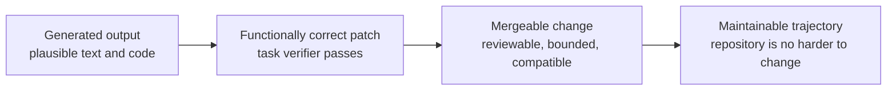
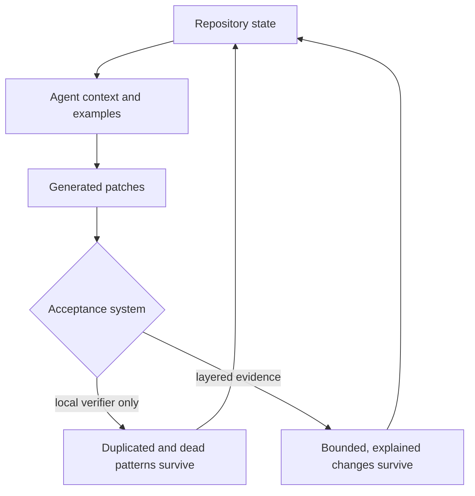

# Fugue 0A — Passing Tests Is Not the Same as Shipping Software

> **Fugue: Evals for the Agentic Software Factory · Part 0A**  
> A standalone field note for staff engineers, maintainers, and engineering
> leaders. **Status:** concept. **Reading time:** about 9 minutes.

You need one assumption to read this: a coding agent can produce a patch and
run its tests. Fugue, the evaluation system we build throughout this series,
appears only as the worked example.

Here is the scene that started the series. An agent produced a working
change: green tests, plausible structure, a diff that read well. It also left
a second helper for behavior the repository already owned, a compatibility
path with no demonstrated reader, and no test at the boundary that would
actually break next time. (The example is a composite of failure classes we
hit while building Fugue, not one auditable pull request.) The patch solved
the local task. It made the next task harder.

We used to treat “the task verifier passes” as “ready to merge.” The claim
this essay works from is different:

> Coding agents made generation cheap. Mergeability and long-term
> maintainability are now the scarce outputs.

That claim is testable, and you should hold us to it. If task-level
correctness reliably predicted maintainer acceptance and repository health,
the machinery in this series would be waste. If added review layers never
caught anything consequential beyond the verifier, same conclusion. We are
prepared to learn either result. What we refuse to do is define “works” so
narrowly that the system cannot see the work it creates for its future
maintainers.

## Scope and terms

Four terms carry the argument. A **task verifier** checks the bounded
acceptance conditions attached to one task. A **mergeable change** also
satisfies repository-wide integration, review, security, and ownership
constraints. A **maintainable change** leaves the repository easier—not
merely possible—to evolve. **Repository trajectory** is the future cost a
patch adds or removes.

The habit of separating adjacent concepts by the consequences of confusing
them comes from Oskar Dudycz, who also argues that real software progress is
often subtraction rather than output volume. [@dudycz-end-coding]
[@dudycz-subtraction] Hamel Husain contributes a smell test we will reuse: if
reviewers cannot say what a good result looks like, the ambiguity usually
belongs to the product, not to the grader. [@hamel-eval-smell]

This essay is about the gap between passing and shipping. It is not an
argument for replacing tests with subjective review, and it is not a demand
that every ordinary code change become a research study.

## The patch and the trajectory

Software teams have always distinguished “the code runs” from “we should
ship it.” Agents make the distinction economically urgent. A person
implementing one approach over a morning notices the cost of three
abstractions along the way. An agent can produce three abstractions before
lunch, each locally plausible and individually tested. The limiting factor
moves from typing to acceptance.

Four rungs, in increasing order of claim strength:



A generated output can fail to compile. A functionally correct patch can pass
its tests and still break an unrepresented caller. A mergeable change can add
a pattern that compounds badly when copied. And the top rung is not a promise
that the code stays perfect; it says someone examined the change as an
intervention in a living system.

The gap between rungs is measurable. In a 2026 study of SWE-bench-passing
agent pull requests, METR reported an average gap of 24.2 percentage points
between automated-grader success and maintainer willingness to merge; the
human review caught code-quality problems, unrelated breakage, and changes
that missed the core issue
([METR maintainer study](https://metr.org/notes/2026-03-10-many-swe-bench-passing-prs-would-not-be-merged-into-main/)). [@metr-maintainer]
An earlier METR analysis of 15 agent pull requests found none mergeable
as-is; missing tests, documentation, linting, and code quality recurred
([METR research update](https://metr.org/blog/2025-08-12-research-update-towards-reconciling-slowdown-with-time-horizons/)). [@metr-research-update]
Neither sample establishes a universal rejection rate. Both establish that
passing the benchmark and satisfying the maintainer are different events.

## “AI slop” is a complaint, not an evaluation

“AI slop” is useful vocabulary because everyone recognizes the feeling: the
patch is technically busy, locally persuasive, and somehow expensive to
trust. As an output metric it is useless. A scorer cannot reproduce a vibe,
and a contributor cannot repair one.

So translate the complaint into failure classes you can point at:

| Failure class       | Inspectable signal                                                                     | Why the verifier may miss it                   |
| ------------------- | -------------------------------------------------------------------------------------- | ---------------------------------------------- |
| Unnecessary code    | New helper duplicates an existing service or standard-library operation                | Both implementations return the expected value |
| Architectural drift | A second execution or storage path bypasses the canonical boundary                     | The new path passes its own tests              |
| Missing tests       | New failure, migration, or integration boundary has no assertion                       | Happy-path task checks remain green            |
| Poor boundaries     | Credentials, private labels, or mutable state cross trust zones                        | Functional output contains the right answer    |
| Dead surfaces       | Uncalled helper, unused dependency, obsolete workflow, speculative compatibility alias | Dead code is not executed                      |
| Unsupported claims  | Result prose says “complete,” “caused,” or “safe” beyond the inspected evidence        | A text judge may reward confidence             |
| Maintenance burden  | More concepts, files, branching, and hidden coupling for the same behavior             | Local correctness has no complexity budget     |

None of these rows is perfectly objective. “Architectural drift” still
requires a model of the intended architecture, and “unnecessary” depends on a
real caller inventory. The improvement is that each row points at
evidence—dependency graphs, dynamic-registration tests, schema readers,
integration contracts, transcripts, review—instead of at a feeling.

## Necessary tests, insufficient evidence

Keep the tests. For many properties they are the fastest, strongest evidence
available. When a pure function should return the same value for the same
input, you want a deterministic test, not a language model’s opinion. When a
migration must read a persisted V1 record, you want a fixture. When an
approval must bind to an immutable digest, you want a test that mutates the
preview and watches the approval get refused.

The mistake is asking tests to prove properties nobody encoded. A suite does
not know that a new service duplicated an existing authority, that a callback
is registered dynamically by Textual or FastAPI, that a public schema field
has an external reader, that a retry changed the experiment’s treatment, that
a source was returned by search but never opened, or that the patch followed
the task while violating the repository’s release discipline. Tests answer
the questions somebody represented. Shipping requires asking whether the
important questions were represented at all.

Read a green build accordingly. Green means “the encoded deterministic
contracts passed on this tree in this environment.” It does not mean the
architecture is good, the change is complete, or a maintainer should accept
it. The sentence got longer because the evidence is narrower. That is a
feature.

## Entropy compounds at agent speed

Repository quality is self-reinforcing. Agents infer how work should be done
from nearby code, docs, names, and tests, so every accepted pattern becomes
future context. Clean boundaries get copied. So do deprecated aliases, two
nearly identical exporters, and comments that describe a state the code no
longer has.



This loop is why cleanup cannot wait for some future “human-written” phase.
OpenAI describes recurring cleanup in its agent-first codebase as garbage
collection: background agents hunt stale documentation, duplicated utilities,
and convention violations
([Harness engineering](https://openai.com/index/harness-engineering/)). [@openai-harness]
Treat that as operating experience, not as proof that any cleanup agent is
correct. The structural point survives: when the generation rate rises,
collection must become part of the system.

We made dead-code removal a first-class integration stage, with static
analysis as one input rather than a deletion oracle. A Vulture finding can be
a genuinely unused function—or a FastAPI route, Textual callback, MCP
registration, schema field, or persisted reader whose caller is dynamic.
Every finding gets one of three outcomes:

1. remove it;
2. connect it to a real caller and test that path;
3. document a narrow dynamic-use exception, with evidence.

The worst outcome is the broad allowlist. It keeps the build green by
discarding the question.

## Fugue’s first wrong abstraction

Our original result shape wanted one answer: did the run pass?

One answer made tables easy. It also mixed questions with different owners
and different failure meanings. A sandbox that failed to start looked
identical to an agent that inspected the evidence and reached the wrong
conclusion. A task that returned the expected string looked identical to a
maintainer-quality answer. A trace that existed looked like proof that the
cited evidence had been used.

We replaced the single answer with independent ledgers:

| Layer                 | Typical question                                                 | Suitable evidence                                                   | Never infer           |
| --------------------- | ---------------------------------------------------------------- | ------------------------------------------------------------------- | --------------------- |
| Infrastructure        | Did the declared runtime start, initialize, publish, and delete? | lifecycle attestation, exit status, tool manifest, deletion receipt | task failure          |
| Deterministic outcome | Did exact checks pass?                                           | tests, schemas, expected values, repository state                   | maintainability       |
| Maintainer judgment   | Is the answer grounded, useful, prioritized, and calibrated?     | blinded human review or calibrated judge                            | causal mechanism      |
| Mechanism             | Which sources and tools were returned, opened, and used?         | tool spans, transcript links, projections, errors                   | task success          |
| Evidence integrity    | Do attempts, traces, Evaluations, usage, and rows reconcile?     | identities, counts, digests, joins                                  | missing value as zero |

The UI got less compact and the conclusions got more honest. Triage became
actionable: infrastructure owners investigate startup and cleanup without
touching task scores, task authors repair a deterministic check without
laundering a judge result, and maintainers can reject a passing patch while
saying exactly why.

## A review burden is an output

We initially treated human review as a cost that lived outside the
experiment. That hid one of the properties we cared most about.

Suppose two candidates both solve eight tasks. Candidate A produces small
patches that reuse repository services and explains the one tradeoff a
maintainer needs to inspect. Candidate B changes more files, introduces a
parallel abstraction, and requires the reviewer to reconstruct its execution
model. The solved-task count declares a tie. Nobody on the team experiences a
tie.

Measuring review burden without turning review into theater is genuinely
hard. Lines changed rewards compressed obscurity. Review duration is
confounded by interruptions and reviewer familiarity. Comment counts reward
nitpicks. So we record several modest signals instead: files and production
lines added, removed, and moved; new public concepts and execution paths;
contract gaps reviewers find; reviewer disposition and the stated blocking
reason; time to a supported decision; and whether a second unfamiliar
engineer can reproduce the reasoning. No single number becomes
“maintainability.” The bundle makes the cost visible.

## Acceptance is a queueing problem

Abundant generation changes the shape of the engineering queue. If agents can
open ten plausible patches in the time a maintainer can responsibly review
one, “more completed implementations” can reduce throughput: work-in-progress
grows, branches age, dependencies move, and reviewers start sampling instead
of understanding.

The scarce server in this queue is not CI. It is informed acceptance. Three
ways to grow its capacity:

1. stop changes that fail deterministic and architectural gates from reaching
   human review at all;
2. make evidence navigable, so a reviewer moves from claim to changed
   boundary without reconstructing the run;
3. make patches smaller and more independent, so one rejection or rollback
   does not invalidate unrelated work.

This is why we prefer stacked, bounded changes over a single “agent
implemented the feature” pull request. Each layer states its contract, tests,
dependencies, and rollback point, and the reviewer never has to accept a
remote runtime, a control plane, a judge design, and UI projections as one
indivisible belief.

The queue also reframes agent success. A patch that passes and then waits
three weeks for review is not necessarily a model failure; it may be a
task-decomposition or evidence-packaging failure. A patch that earns a fast
rejection for one precise reason can be worth more than a sprawling patch
that stays “under review.” Time to a supported decision is a more honest
secondary signal than raw PR creation rate.

None of this licenses rubber-stamping smaller diffs. Spend cheap machine
effort on preparation—focused checks, caller maps, dead-code inventory,
evidence links—and reserve human attention for judgment and authority.

## The artifact: an evaluation-layer worksheet

Before accepting an agent-authored change, write this beside its preview. It
is deliberately boring and copyable:

```yaml
change:
  source_tree: "<git-tree-sha>"
  bounded_question: "Should this exact patch enter main?"

deterministic:
  required:
    - "targeted unit tests"
    - "integration boundary test"
    - "full repository checks"
  result: pending

maintainer:
  rubric:
    - "uses the canonical service"
    - "adds no unexplained public surface"
    - "covers failure and migration boundaries"
    - "leaves the repository easier to understand"
  reviewer: pending
  disposition: pending

mechanism:
  required:
    - "changed-file inventory"
    - "new-callers inventory"
    - "dynamic registration evidence"
    - "dead-code analysis with adjudications"

infrastructure:
  environment: "<locked CI/runtime identity>"
  result: pending

evidence_integrity:
  expected_rows: 1
  reconciled_rows: 0
  missing_is_failure: true
```

For a tiny change this is too much ceremony; scale it to the risk. The
categories still earn their keep. Even a one-line fix should not turn a
missing CI job into a passing task.

## Garbage collection belongs in “done”

Fugue’s own cleanup stage forced uncomfortable questions. Was a legacy
dataset fingerprint still read from persisted evidence? Did the research HTTP
aliases have external users? Was the evidence-key fallback compatibility or
accidental authority? Static tools nominated candidates; only caller
inspection, schemas, migration fixtures, and explicit product decisions could
settle them.

That work produced a better definition of dead code: not “a tool reported no
Python caller,” but “the supported system has no demonstrated runtime,
registration, persistence, migration, or external contract that needs this
surface.”

It also produced a deletion rule we now apply above the source level: remove
obsolete branches and worktrees only after active stacks demonstrably contain
the required behavior. A branch is not dead because it is old. It is dead
because its required behavior has a verified successor or has been explicitly
abandoned.

## Try this in 15 minutes

Pick one recently merged patch. Fill three columns: behavior added,
repository surface added, surface removed. For each new surface, name its
owner and the evidence that would let you delete it. If the owner or the
removal test is unclear, write that down as maintenance work—not as “done.”

Then set your escalation rule. Ordinary CI is enough when the behavior is
deterministic, the change stays inside a well-tested boundary, and no new
ownership or compatibility surface appears. Escalate to maintainer review or
a study when acceptance depends on architecture, changing agent behavior,
private evidence, or a claim broader than one patch.

## When a study is unnecessary or insufficient

Use the cheapest decisive control. A compiler, type checker, linter, focused
test, dependency audit, or deletion proof should settle deterministic defects
before any agent study begins. And no evaluation matrix replaces a maintainer
who owns the architecture, a security reviewer with the relevant threat
model, or an explicit product decision about acceptable complexity.

## What this does not show

This essay does not prove that Fugue improves maintainability. It names the
failure classes and the controls we built to see them; a future study still
has to compare accepted repository trajectories, calibration, and review
burden on exact tasks and candidates.

The METR results are strong evidence that automated task success and
maintainer acceptance can diverge. They are not an estimate for every team,
repository, or current model. OpenAI’s cleanup practice is an operating
example, not an independent evaluation of Fugue.

Static analysis does not establish dynamic liveness. Human review does not
eliminate taste, bias, or inconsistency. A judge trained to imitate
maintainers does not become a maintainer. And deleting code can be as
damaging as adding it when you cannot identify its consumers.

Most importantly, a layered evaluation can still be poorly designed. Five
ledgers wrapped around a drifting taskset, an unblinded judge, or a changed
runtime produce precise nonsense.

## Next: scoring is the smaller problem

Passing tests is not shipping software because “shipping” contains several
claims at once. Our first response was to add more checks. The second
temptation arrived immediately: combine the checks into one sophisticated
score and declare the problem solved.

It is not solved. In **Fugue 0B** we move from software quality to
experimental design—how a treatment can appear to win because tasks drifted,
a harness retried, a runtime changed, or missing traces silently became
zeros. The question stops being which checks to run and becomes what
comparison those checks can support.

## References

Complete source metadata and numbered citations are generated from this
article package’s `sources.json`.
