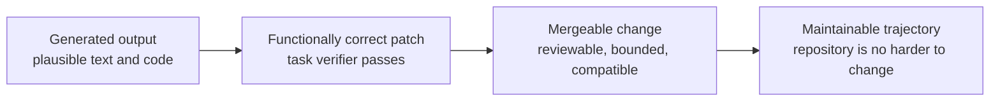
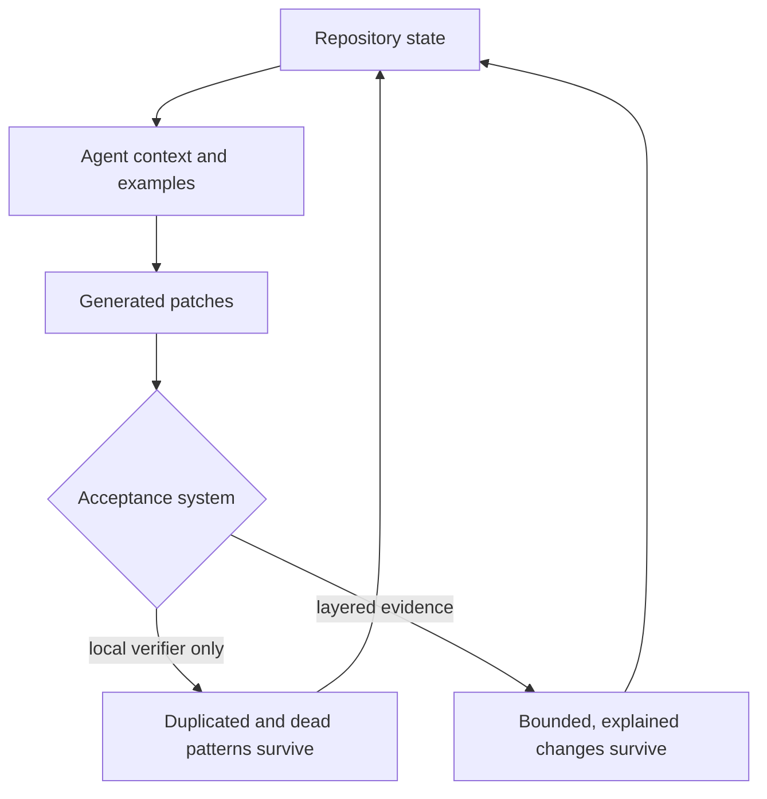

# Fugue 0A — Passing Tests Is Not the Same as Shipping Software

> **Fugue: Evals for the Agentic Software Factory · Part 0A**  
> A standalone field note for staff engineers, maintainers, and engineering
> leaders. **Status:** concept. **Reading time:** about 12 minutes.

This article assumes only that a coding agent can produce a patch and run its
tests. Fugue is the worked example, not required background. Every distinction
needed for the argument is defined below.

The first misconception we had to lose was simple: if an agent’s patch passes
the task verifier, the patch is ready to merge.

Our concrete failure is an **illustrative composite**, reconstructed from the
failure classes we saw while building Fugue rather than presented as one
auditable pull request. An agent produced a working change and
green tests while leaving a second helper for behavior the repository already
owned, an old compatibility path with no demonstrated reader, and no test at
the boundary that would actually break next time. The patch solved the local
task. It also made the next task harder.

Our falsifiable thesis is:

> Coding agents have made generation cheap; mergeability and long-term
> maintainability are now the scarce outputs.

That claim is false if task-level correctness reliably predicts maintainer
acceptance and repository health. It is also false if adding review layers
finds no consequential failures beyond the verifier. We should be willing to
learn either result. What we should not do is define “works” narrowly enough
that our system cannot see the work it creates for its future maintainers.

## Scope and terms

A **task verifier** checks the bounded acceptance conditions attached to one
task. A **mergeable change** also satisfies repository-wide integration,
review, security, and ownership constraints. A **maintainable change** leaves
the repository easier—not merely possible—to evolve. **Repository trajectory**
names the future cost created or removed by accepting the patch.

This essay follows Dudycz’s useful discipline of separating adjacent
operational concepts by the consequences of confusing them, and his argument
that software progress can be subtraction rather than output volume.
[@dudycz-end-coding] [@dudycz-subtraction] Hamel’s “eval smell” test adds a
product consequence: if reviewers cannot name what a good result looks like,
the ambiguity often belongs to the product, not to the grader.
[@hamel-eval-smell]

This essay is about the gap between those states. It is not an argument for
replacing tests with subjective review, or for evaluating every ordinary code
change as a research study.

## The patch and the trajectory

Software teams have always distinguished “the code runs” from “we should
ship it.” Agents make the distinction economically important. A person may
spend a morning implementing one approach and therefore notice the cost of
three abstractions. An agent can produce three abstractions before lunch,
each locally plausible and individually tested. The limiting factor moves
from typing to acceptance.

We find it useful to name four rungs:



A generated output can fail to compile. A functionally correct patch can pass
the supplied tests yet break an unrepresented caller. A mergeable change can
still add a pattern that compounds badly when copied. The final rung is not a
claim that code will remain perfect. It is a claim that we examined the
change as an intervention in a living system.

This is more than philosophical caution. In a 2026 study of SWE-bench-passing
agent pull requests, METR reported an average gap of 24.2 percentage points
between automated-grader success and maintainer willingness to merge. The
maintainer review caught code-quality problems, unrelated breakage, and
changes that did not address the core issue
([METR maintainer study](https://metr.org/notes/2026-03-10-many-swe-bench-passing-prs-would-not-be-merged-into-main/)). [@metr-maintainer]
An earlier METR analysis of 15 agent pull requests found none mergeable as-is;
missing tests, documentation, linting, and code quality were recurring
reasons
([METR research update](https://metr.org/blog/2025-08-12-research-update-towards-reconciling-slowdown-with-time-horizons/)). [@metr-research-update]
Those samples do not establish a universal rejection rate. They do establish
that passing the benchmark and satisfying the maintainer are observably
different events.

## “AI slop” is a complaint, not an evaluation

“AI slop” is useful opening vocabulary because teams recognize the feeling:
the patch is technically busy, locally persuasive, and somehow expensive to
trust. It is useless as an output metric. A scorer cannot reproduce a vibe,
and a contributor cannot repair one.

We translate the complaint into failure classes:

| Failure class       | Inspectable signal                                                                     | Why the verifier may miss it                   |
| ------------------- | -------------------------------------------------------------------------------------- | ---------------------------------------------- |
| Unnecessary code    | New helper duplicates an existing service or standard-library operation                | Both implementations return the expected value |
| Architectural drift | A second execution or storage path bypasses the canonical boundary                     | The new path passes its own tests              |
| Missing tests       | New failure, migration, or integration boundary has no assertion                       | Happy-path task checks remain green            |
| Poor boundaries     | Credentials, private labels, or mutable state cross trust zones                        | Functional output contains the right answer    |
| Dead surfaces       | Uncalled helper, unused dependency, obsolete workflow, speculative compatibility alias | Dead code is not executed                      |
| Unsupported claims  | Result prose says “complete,” “caused,” or “safe” beyond the inspected evidence        | A text judge may reward confidence             |
| Maintenance burden  | More concepts, files, branching, and hidden coupling for the same behavior             | Local correctness has no complexity budget     |

These are not perfectly objective. “Architectural drift” still requires a
model of the intended architecture. “Unnecessary” depends on a real caller
inventory. The improvement is that each term points toward evidence:
dependency graphs, dynamic registration tests, schema readers, integration
contracts, trace inspection, or review.

## Necessary tests, insufficient evidence

Unit and integration tests remain the fastest, strongest evidence we have for
many properties. When a pure function should return the same value for the
same input, we want a deterministic test, not a language model’s opinion.
When a migration must read a persisted V1 record, we want a fixture. When an
approval must bind to an immutable digest, we want a test that mutates the
preview and observes rejection.

The mistake is asking those tests to prove properties they do not encode.

A suite may not know that:

- a new service duplicated an existing authority;
- a callback is dynamically registered by Textual or FastAPI;
- a public schema field has an external reader;
- a retry changed the experiment’s treatment;
- a source was returned by search but never opened;
- the patch followed the task while violating the repository’s release
  discipline;
- the new code leaves two ways to perform the same governed action.

Tests answer questions somebody represented. Shipping requires asking whether
the important questions were represented.

That changes how we read a green build. Green means “the encoded
deterministic contracts passed on this tree in this environment.” It does not
mean “the architecture is good,” “the change is complete,” or “a maintainer
should accept it.” The sentence is longer because the evidence is narrower.
That is a feature.

## Entropy compounds at agent speed

Repository quality is partially self-reinforcing. Agents inspect nearby code,
docs, names, and tests to infer how work should be done. Every accepted pattern
therefore becomes future context. Clean boundaries are copied. So are
deprecated aliases, two nearly identical exporters, and comments that explain
a state the code no longer has.



This feedback loop is why cleanup cannot be postponed until some future
“human-written” phase. OpenAI’s account of building an agent-first codebase
describes recurring cleanup as garbage collection: background agents search
for stale documentation, duplicated utilities, convention violations, and
other entropy
([Harness engineering](https://openai.com/index/harness-engineering/)). [@openai-harness]
That is useful operating experience, not proof that any cleanup agent is
correct. The important point is structural: when generation rate rises,
collection must become part of the system.

We learned to make dead-code removal a first-class integration stage. Static
analysis is one input, not a deletion oracle. A Vulture finding can indicate a
real unused function, or it can point to a FastAPI route, Textual callback,
MCP registration, schema field, or persisted reader whose caller is dynamic.
Every finding therefore needs one of three outcomes:

1. remove it;
2. connect it to a real caller and test that path;
3. document a narrow dynamic-use exception with evidence.

The worst outcome is the broad allowlist. It keeps the build green by
discarding the question.

## Fugue’s first wrong abstraction

Our original result shape wanted one answer: did the run pass?

That answer was attractive because it made tables easy. It also mixed
questions that have different owners and failure meanings. A Sandbox that
failed to start became indistinguishable from an agent that inspected
evidence and reached the wrong conclusion. A task that returned the expected
string looked indistinguishable from a maintainer-quality answer. A trace that
existed looked like proof that the cited evidence had been used.

We replaced the single answer with independent ledgers:

| Layer                 | Typical question                                                 | Suitable evidence                                                   | Never infer           |
| --------------------- | ---------------------------------------------------------------- | ------------------------------------------------------------------- | --------------------- |
| Infrastructure        | Did the declared runtime start, initialize, publish, and delete? | lifecycle attestation, exit status, tool manifest, deletion receipt | task failure          |
| Deterministic outcome | Did exact checks pass?                                           | tests, schemas, expected values, repository state                   | maintainability       |
| Maintainer judgment   | Is the answer grounded, useful, prioritized, and calibrated?     | blinded human review or calibrated judge                            | causal mechanism      |
| Mechanism             | Which sources and tools were returned, opened, and used?         | tool spans, transcript links, projections, errors                   | task success          |
| Evidence integrity    | Do attempts, traces, Evaluations, usage, and rows reconcile?     | identities, counts, digests, joins                                  | missing value as zero |

This made the UI less compact and the conclusions more honest. It also made
failure triage actionable. Infrastructure owners can investigate startup and
cleanup without altering task scores. Task authors can repair a deterministic
check without laundering a judge result. Maintainers can reject a patch that
passes while explaining the architectural reason.

## A review burden is an output

We initially treated human review as a cost outside the experiment. That hid
one of the properties we most cared about.

Suppose two candidates both solve eight tasks. Candidate A produces small
patches that reuse repository services and explains the one tradeoff a
maintainer needs to inspect. Candidate B produces more changed files,
introduces a parallel abstraction, and requires the reviewer to reconstruct
its execution model. A solved-task count declares a tie. The team does not
experience a tie.

Review burden is difficult to measure without turning review into theater.
Lines changed alone reward compressed obscurity. Review duration is confounded
by interruptions and reviewer familiarity. Comment count can reward nitpicks.
We use multiple modest signals instead:

- files and production lines added, removed, and moved;
- number of new public concepts or execution paths;
- deterministic contract gaps reviewers identify;
- reviewer disposition and stated blocking reason;
- time to reach a supported decision, recorded as secondary evidence;
- whether a second unfamiliar engineer can reproduce the reasoning.

No one signal becomes “maintainability.” The bundle makes the cost visible.

## Acceptance is a queueing problem

Abundant generation changes the shape of the engineering queue. If agents can
open ten plausible patches in the time a maintainer can responsibly review
one, “more completed implementations” can reduce throughput. Work-in-progress
grows, branches age, dependencies move, and reviewers start sampling instead
of understanding.

The scarce server in this queue is not CI. It is informed acceptance. We can
increase its capacity in three ways:

1. reduce the number of changes that reach human review without satisfying
   deterministic and architectural gates;
2. make evidence navigable so a reviewer can move from claim to changed
   boundary without reconstructing the run;
3. make patches smaller and more independent, so a rejection or rollback does
   not invalidate unrelated work.

This is one reason we prefer stacked, bounded changes over a single “agent
implemented the feature” pull request. Each layer can state its contract,
tests, dependencies, and rollback point. The review does not have to accept a
remote runtime, a control plane, a judge design, and UI projections as one
indivisible belief.

The queue also changes how we think about agent success. A patch that passes
but waits three weeks for a reviewer is not necessarily a model failure. It
may be a task-decomposition or evidence-packaging failure. A patch that earns
a quick rejection for one precise reason can be more useful than a sprawling
patch that remains “under review.” Time-to-supported-disposition is therefore
a more honest secondary signal than raw PR creation rate.

None of this means humans should rubber-stamp smaller diffs. It means the
system should spend cheap machine effort on preparation—focused checks,
caller maps, dead-code inventory, and evidence links—while reserving human
attention for judgment and authority.

## The artifact: an evaluation-layer worksheet

Before accepting an agent-authored change, we can now write the following
artifact beside its preview. It is deliberately boring and copyable:

```yaml
change:
  source_tree: "<git-tree-sha>"
  bounded_question: "Should this exact patch enter main?"

deterministic:
  required:
    - "targeted unit tests"
    - "integration boundary test"
    - "full repository checks"
  result: pending

maintainer:
  rubric:
    - "uses the canonical service"
    - "adds no unexplained public surface"
    - "covers failure and migration boundaries"
    - "leaves the repository easier to understand"
  reviewer: pending
  disposition: pending

mechanism:
  required:
    - "changed-file inventory"
    - "new-callers inventory"
    - "dynamic registration evidence"
    - "dead-code analysis with adjudications"

infrastructure:
  environment: "<locked CI/runtime identity>"
  result: pending

evidence_integrity:
  expected_rows: 1
  reconciled_rows: 0
  missing_is_failure: true
```

For a tiny change this is too much ceremony. The scale should match the risk.
The categories still help: even a one-line fix should not turn a missing CI
job into a passing task.

## Garbage collection belongs in “done”

The cleanup stage in Fugue’s integration plan forced uncomfortable questions.
Was a legacy dataset fingerprint still read from persisted evidence? Did
Research HTTP aliases have external users? Was the evidence-key fallback
compatibility or accidental authority? Static tools could identify candidates;
only caller inspection, schemas, migration fixtures, and explicit product
decisions could settle them.

That process gave us a better definition of dead code: not “a tool reported no
Python caller,” but “the supported system has no demonstrated runtime,
registration, persistence, migration, or external contract that needs this
surface.”

It also gave us a deletion rule. We remove obsolete remote branches and
worktrees only after active stacks demonstrably contain the required behavior.
The same evidence discipline applies above and below the source-code level.
A branch is not dead because it is old; it is dead because its required
behavior has a verified successor or has been explicitly abandoned.

## Try this in 15 minutes

Choose one recently merged patch and fill three columns: behavior added,
repository surface added, and surface removed. Then ask who owns each new
surface and what evidence would permit deleting it. If the owner or removal
test is unclear, record that uncertainty as maintenance work rather than
calling the patch fully done.

Ordinary CI is enough when the behavior is deterministic, the change stays
inside a well-tested boundary, and no new ownership or compatibility surface
appears. Escalate to maintainer review or a study when acceptance depends on
architecture, changing agent behavior, private evidence, or a claim broader
than one patch.

## When a study is unnecessary or insufficient

Use the cheapest decisive control. A compiler, type checker, linter, focused
test, dependency audit, or deletion proof should settle deterministic defects
before any Agent study begins. Conversely, no evaluation matrix can replace a
maintainer who owns the architecture, a security reviewer with the relevant
threat model, or an explicit product decision about acceptable complexity.

## What this does not show

This essay does not prove that Fugue improves maintainability. We have
described the failure classes and the controls we built to see them. A future
study must still compare accepted repository trajectories, calibration, and
review burden on exact tasks and candidates.

The METR studies are strong evidence that automated task success and
maintainer acceptance can diverge. They are not an estimate for every team,
repository, or current model. OpenAI’s cleanup practice is an operating
example, not an independent evaluation of Fugue.

Static analysis does not establish dynamic liveness. Human review does not
eliminate taste, bias, or inconsistency. A judge trained to imitate maintainers
does not become a maintainer. Deleting code can be as damaging as adding it if
we cannot identify its consumers.

Most importantly, a layered evaluation can still be poorly designed. We can
write five ledgers around a drifting taskset, an unblinded judge, or a changed
runtime and produce precise nonsense.

## The bridge: the eval problem is not a score

Passing tests is not shipping software because “shipping” contains multiple
claims. Our first response was to add more checks. That created a second
temptation: combine them into a more sophisticated score and declare the
problem solved.

It is not solved.

In the next installment, **Fugue 0B**, we move from software
quality to experimental design. We will show how a treatment can appear to
win because the tasks drifted, the harness retried, the runtime changed, or
missing traces silently became zeros. The important question is no longer
only which checks to run. It is what comparison those checks are entitled to
support.

## References

Complete source metadata and numbered citations are generated from this
article package’s `sources.json`.
