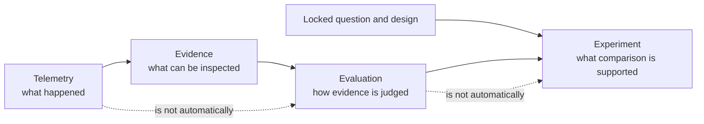
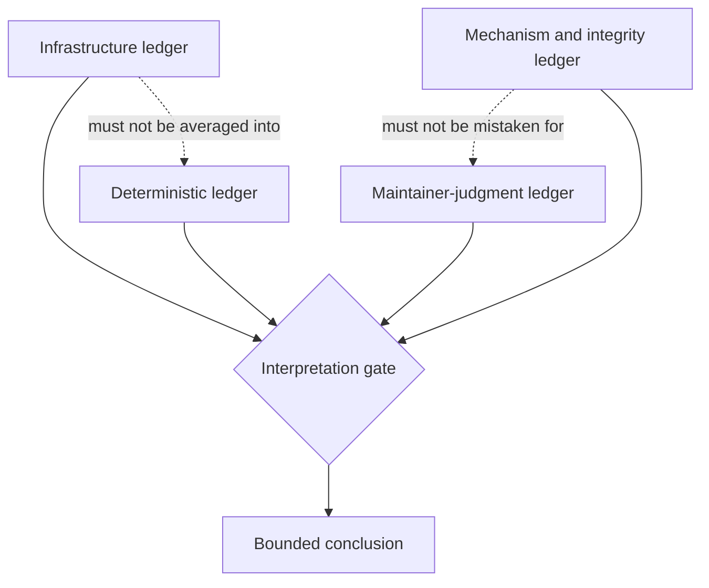
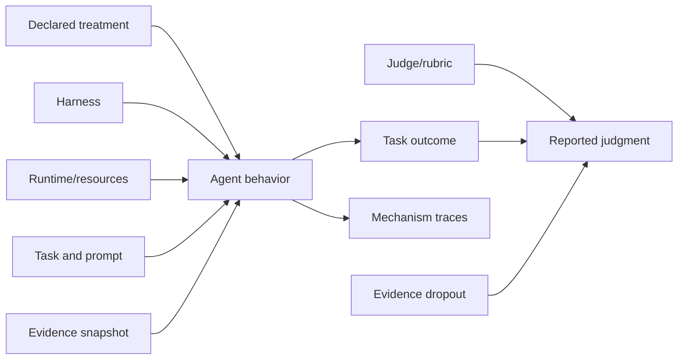

# Fugue 0B — The Eval Problem Is Not a Scoring Problem

> **Fugue: Evals for the Agentic Software Factory · Part 0B**  
> A standalone field note for AI product engineers, eval owners, and technical
> leaders. **Status:** concept. **Reading time:** about 12 minutes.

No earlier article is required. We begin with the overloaded word “eval,”
separate the jobs it is asked to perform, and build one result representation
that keeps missing evidence and incompatible judgments visible.

The misconception behind many early agent evaluations is that enough good
scorers will produce a good experiment.

Our concrete failure was a comparison that could have announced a winner even
though the evidence underneath the score was incomplete. Some attempts had
task outputs, some had traces, and some had evaluation rows. Infrastructure
failures could disappear into an average. The table looked scientific because
it had decimals. The comparison was not entitled to its conclusion.

Our falsifiable thesis is:

> Agent evaluation is an experimental-design and evidence-integrity problem
> before it is a scoring problem.

If changing task selection, runtime resources, retry policy, evidence
availability, or judge calibration cannot reverse an otherwise fixed
conclusion, then we are overstating those concerns. If a composite score
reliably preserves every decision-relevant distinction, separate ledgers are
unnecessary. Our design assumes the opposite and makes that assumption
testable.

## Scope and terms

A **score** is one measurement. An **evaluation** is the procedure that
produces and interprets measurements. An **experiment** declares what changes,
what remains fixed, and which conclusion the resulting evidence may support.
An **evidence lock** fixes the source objects and private facts used to judge
the attempts. A **cell** is one exact candidate–task–attempt coordinate.

The argument is not that scores are useless. It is that no arithmetic can
repair an unidentified candidate, a drifting taskset, a missing denominator,
or evidence the evaluator was never entitled to see.

## Five adjacent things

The word “eval” is carrying too much.

A **benchmark** is a reusable task collection and measurement convention. A
**product eval** measures behavior that matters in a product context. A
**regression test** protects a known contract, often deterministically.
**Telemetry** records what happened in a system. An **experiment** compares
declared conditions to answer a bounded question.

These objects can share tasks, traces, and scorers. They are still not
interchangeable. Weng’s measurement taxonomies are useful here because they
force scope and denominator before comparison; Hamel’s workflow starts even
earlier, with raw traces and user-visible failure classes rather than a
premature dashboard. [@weng-hallucination] [@hamel-field-guide]



A trace becomes evidence only when its identity and relation to an attempt are
known. Evidence becomes evaluation only when a criterion interprets it. A set
of evaluations becomes an experiment only when candidate assignment,
controls, exclusions, and analysis were defined tightly enough to support the
claim.

This is why “we have Weave traces” is not the same as “we evaluated the
agent.” It is also why “the judge preferred B” is not the same as “the changed
MCP revision caused B to be better.” The first statement is observational.
The second depends on design.

## How a treatment wins without improving

Imagine two candidates, A and B, on eight repository tasks. Their final score
is deterministic pass rate plus a language-model quality judgment. B wins.
Here are six ways that can happen without the declared treatment causing the
improvement:

1. **Task drift.** Candidate B ran after a task fixture or dependency changed.
2. **Retry asymmetry.** Failed B attempts were retried while failed A attempts
   remained terminal.
3. **Runtime asymmetry.** B received more memory, a warmer cache, a different
   tool installation, or working network access.
4. **Evidence dropout.** Missing B traces were excluded while poor A traces
   remained in the denominator.
5. **Judge leakage.** The judge saw candidate names, version labels, or private
   expected facts.
6. **Pooling reversal.** B won in aggregate because of task mixture even
   though A won within one harness and B within another.

Anthropic has demonstrated that infrastructure configuration alone can move a
coding-agent evaluation by roughly six percentage points in its investigated
setting
([Infrastructure noise in agent evals](https://www.anthropic.com/engineering/infrastructure-noise)). [@anthropic-noise]
That is not an adjustment factor we can copy into Fugue. It is evidence that
runtime configuration belongs in candidate and attempt identity, not in a
footnote.

The common failure is not fraud. It is a pipeline that makes the easiest
result to compute look like the result that was planned.

Here is a deliberately numerical pooling reversal. Candidate B wins inside
both task strata, yet loses after unequal completion changes the mixture:

| Task stratum | Baseline | Candidate B | Within-stratum result |
| --- | ---: | ---: | --- |
| Easier tasks | 90/100 = 90% | 19/20 = 95% | B wins |
| Harder tasks | 1/10 = 10% | 8/40 = 20% | B wins |
| Naive pooled total | 91/110 = 82.7% | 27/60 = 45% | Baseline appears to win |

The aggregate does not reveal a paradoxical model property. It reveals
different denominators. In an aligned Study, the 50 candidate coordinates
missing from the easy stratum stay visible as missing; they are not silently
removed from the plan. The decision then comes from independent gates:
infrastructure must be complete enough to interpret, deterministic regressions
must remain within the declared bound, judge evidence must pass validation,
and mechanism evidence must reconcile. Passing all gates authorizes the
bounded decision; their values are never averaged into a fifth score.

## Four ledgers, no synthetic winner

Fugue therefore keeps four outcome layers independent.

### Infrastructure and protocol conformance

Did the declared environment start? Did the MCP server initialize with the
locked tool manifest? Were credentials injected through the allowed boundary?
Did the attempt publish its artifacts and delete its Sandbox? Does the
lifecycle attestation match the runtime lock?

These are prerequisites for interpreting agent behavior. A failure here is
not a bad answer. It is missing behavioral evidence.

### Deterministic task outcome

Did the patch compile? Did required tests pass? Did the answer include the
exact values supported by the locked evidence? Did a schema or repository
state match a predeclared condition?

These checks should be strict and cheap wherever the property is
deterministic. They also remain narrow. An expected string does not establish
good prioritization.

### Authored or calibrated-judge evaluation

Was the answer grounded in evidence? Was it useful to the maintainer? Did it
prioritize the important issue and express uncertainty when evidence was
incomplete?

Anthropic’s eval guidance distinguishes code-based, model-based, and human
graders and recommends calibrating model graders against human judgment
([Demystifying evals for AI agents](https://www.anthropic.com/engineering/demystifying-evals-for-ai-agents)).
We use that taxonomy because each grader fails differently. A model judge can
scale nuanced review, but it can prefer style, leak labels, or confidently
misread evidence. Human reviewers can adjudicate those errors, but they are
slow and disagree.

### Mechanism and evidence integrity

Which tools were available and selected? Which sources were returned, opened,
and used? Were reads projected or broad? Were responses truncated? Did W&B
Run, Weave Call, prediction, Evaluation, usage, and cleanup records reconcile
one-to-one?

Mechanism data is not a success score. It helps explain _how_ a result arose
and whether evidence exists for the intended treatment.



The result can say: “B solved one more task, the blind judge found no critical
honesty regressions, tool traces suggest fewer broad reads, and three cells
lack complete infrastructure evidence.” It cannot turn that into 82.4
“quality points.”

## Missing is not zero

The most damaging default in eval infrastructure is often numerical
convenience. A missing output becomes an empty string. The empty string gets a
zero. The zero enters the mean. The chart renders.

That transformation invents evidence.

Suppose a Sandbox cannot pull its runtime image. The agent never receives the
task. Recording a deterministic failure says the agent attempted and failed a
problem it never saw. Excluding the row silently says the planned experiment
was complete without it. Both are wrong.

Fugue preserves the coordinate:

```text
task × candidate × harness × attempt
```

and separately records lifecycle states:

```text
planned → admitted → started → terminal → exported → reconciled
```

A cell can be terminal with a task result, terminal with an infrastructure
failure, or missing. The Study is complete only when every planned coordinate
has a defensible terminal classification. Analysis decides which populations
are interpretable; it never edits absence into performance.

This design also prevents “retry until pretty.” A retry is a new attempt
coordinate with its own policy and evidence. Replacing a failed row with a
later success changes the experiment.

## Capability and regression are different jobs

Capability suites ask where a system can succeed at the edge of what it can
do. Regression suites protect behavior we already depend on. Mixing them
creates bad incentives.

A saturated regression suite should remain saturated. Its failure is a
release alarm, not an opportunity to rank models. A useful capability suite
should contain uncertainty and headroom. If every candidate gets 100%, it no
longer guides improvement. Anthropic makes this distinction explicit in its
agent-eval guidance: capability evals and regression evals need different
difficulty profiles and maintenance
([Demystifying evals](https://www.anthropic.com/engineering/demystifying-evals-for-ai-agents)).

For Fugue, that means discovery and holdout cannot be the same operation.
Discovery finds tasks that exercise the behavior and reveals broken
infrastructure. It can inform a treatment choice. The holdout tests the frozen
choice. Tuning prompts, labels, or task selection after viewing holdout
outcomes creates a new Study identity.

A null result is not a broken eval. It can mean the treatment does not matter
on these tasks, both candidates are saturated, the tasks are too noisy, or the
mechanism changed without affecting outcomes. Each interpretation demands
different follow-up evidence.

## Private facts and blinded judgment

Agent tasks often need expected facts. A repository task may have a known
failing test, target file, or correct state transition. An evidence-analysis
task may have a known anomaly or deliberately incomplete Evaluation.

Putting those facts in the public task makes the test trivial. Putting them in
the judge prompt without blinding can make candidate labels or treatment
identity part of the score. Putting them in traces leaks future task answers.

We split:

- **public task briefs**, which contain only what the agent is allowed to
  receive;
- **private labels**, which contain expected facts and critical-failure
  conditions;
- **blinded judge inputs**, which contain the response and allowed evidence,
  not candidate labels or secret facts irrelevant to the rubric;
- **adjudication records**, which link disagreements without editing the
  original labels.

The separation is enforced by file and process boundaries, but its actual
success must be tested. We scan Agent inputs, snapshots, traces, logs, bundles,
Study events, and exported results for private-label and credential values.
A clean source tree is insufficient if the runtime serializes a secret later.

## Judge calibration is a release gate

A rubric can sound excellent and still fail operationally. For the W&B MCP
release study, the maintainer judge evaluates evidence grounding, usefulness,
prioritization, and uncertainty calibration. A confident completeness claim
without inspected support is a critical failure.

Before the judge can score the paid cohort, the preregistration requires 48
balanced examples: 24 accepted and 24 rejected. Two distinct humans review
each example. Every disagreement is adjudicated. The blinded judge must
achieve at least 0.85 true-positive and true-negative rates and zero false
passes on critical unsupported-completeness cases.

Those thresholds are design choices, not natural laws. The important
properties are:

- the gate is declared before results;
- human labels are reviewed rather than inferred from authored references;
- sensitivity and specificity remain separate;
- critical false passes cannot be averaged away;
- changing the rubric or cases produces a new digest.

At the time of writing, the 48 examples and authored references exist. The
required two-reviewer calibration does not. Therefore the study is blocked.
“Cases written” is not “judge calibrated.”

The validator problem is recursive: a high agreement score does not establish
validity when both graders share the same blind spot. “Who Validates the
Validators?” formalizes this concern for LLM evaluators, while practical
guides recommend criterion-specific human review, disagreement analysis, and
held-out validation rather than one global agreement number.
[@validators-paper] [@hamel-judge] [@auto-evals] Anthropic’s grader taxonomy
likewise treats deterministic, model-based, and human graders as
complementary evidence rather than interchangeable scores.
[@anthropic-demystifying]

## Negative controls and adjudication

A grader stack needs cases where the desired behavior is not “produce a
better answer.”

For evidence-grounded maintenance work, useful negative controls include:

- a project with no Evaluation matching the requested version;
- a Run whose cost field is absent rather than zero;
- a timeout after only part of a paginated result;
- a confident answer containing the expected value but citing an uninspected
  source;
- a cautious answer that refuses a conclusion the evidence cannot support;
- an infrastructure failure that never reaches the Agent.

These cases reveal different shortcuts. A deterministic expected-value check
may pass the confident unsupported answer. A verbosity-sensitive judge may
prefer it to the refusal. An analysis query may turn the missing cost into
zero. A pipeline may count the non-started attempt as failure. The stack is
useful when the layers disagree visibly and the critical rule resolves the
decision.

Adjudication is not majority voting with a nicer name. When two reviewers
disagree, the record should preserve both initial judgments, the rubric
dimension at issue, the allowed evidence they inspected, and the reason for
the final label. That record becomes part of calibration evidence. Editing
both original answers to match the resolution destroys information about
rubric ambiguity.

We also distinguish **calibration cases** from **Study tasks**. Calibration
teaches us whether the judge implements the rubric on authored examples. It
must not expose the holdout’s private facts or become a rehearsal of its exact
answers. A judge can meet sensitivity and specificity on calibration and
still drift on the cohort; spot human review of blinded Study pairs remains
necessary.

Finally, a negative control can invalidate a release even when aggregate
quality rises. If the candidate makes one critical unsupported completeness
claim in a predeclared safety case, more useful prose elsewhere does not
compensate. Keeping critical failures outside the mean is a design choice
about the product, not a statistical accident.

## A confounder map before a scorecard

Before we write an analysis query, we draw the causal neighborhood:



Some variables are controlled. Some are declared parts of the candidate. Some
are measured. Some invalidate causal language when they drift. The diagram
does not identify causality by itself. It makes the assumptions reviewable.

For example, if two harnesses cannot implement the same tool protocol
natively, “harness” may not be an isolated treatment. We should report locked
model–harness candidates rather than pretend the adapter difference vanished.
If W&B Serverless and local Harbor produce behaviorally identical job
identities, execution policy can differ while behavioral identity remains
fixed. If embedded assets differ, the candidate changed.

## The artifact: a four-ledger result

The public result should make misleading aggregation inconvenient:

```json
{
  "study_id": "example-v1",
  "identities": {
    "source_tree": "<tree>",
    "taskset_digest": "<sha256>",
    "evidence_lock_digest": "<sha256>",
    "candidate_fingerprints": ["<baseline>", "<candidate>"],
    "runtime_lock_digest": "<sha256>"
  },
  "cells": {
    "planned": 32,
    "started": 32,
    "completed": 31,
    "infrastructure_failed": 1,
    "missing": 0
  },
  "deterministic": { "baseline_pass": 11, "candidate_pass": 12 },
  "judgment": {
    "calibration_digest": "<sha256>",
    "critical_false_passes": 0,
    "dimensions": {}
  },
  "mechanism": {
    "projected_reads": {},
    "broad_reads": {},
    "structured_errors": {},
    "trace_evaluation_reconciled": false
  },
  "claim": null
}
```

This example cannot support a release claim because reconciliation is false.
The result need not hide the 31 completed outcomes. It must refuse to present
them as a completed Study.

## Try this in 15 minutes

Take one existing eval dashboard and write the planned, started, completed,
excluded, and missing denominators beside its headline number. Split the rows
by harness or another likely confounder. If the conclusion changes when the
missing coordinates are restored or the strata are viewed separately, stop
scoring and repair the design.

Then inspect five raw traces from the apparent winner and five from the loser.
Write one criterion the automated judge missed or interpreted inconsistently.
That criterion—not a larger model—is the next calibration task.

## When four ledgers are unnecessary or insufficient

A deterministic unit or protocol regression does not need an experimental
apparatus: fail it directly. The four-ledger representation becomes useful
when evidence types can disagree or disappear. Even then it is insufficient
when the taskset does not represent the release question, the judge has not
been calibrated, or the evidence lock permits the Agent to see private facts.

## What this does not show

Separate ledgers do not guarantee a valid experiment. We can still choose
unrepresentative tasks, write weak deterministic checks, calibrate against
biased reviewers, or omit an important confounder.

A causal diagram does not prove causation. Blinding does not remove every
stylistic cue. A 0.85 calibration threshold does not make a judge correct on
new examples. Forty-eight examples do not establish performance on all
maintenance decisions. A complete evidence graph can faithfully document a
bad task.

Nor have we shown a Fugue treatment win. The flagship MCP cohort has not run.
The examples in this essay describe the contract that must hold before it
does.

The contract itself remains testable: if users cannot reconstruct a decision
from its four ledgers without private oral context, the result is not ready to
publish.

## The bridge: from distinctions to primitives

Once we stopped treating the eval as a score, our vocabulary expanded:
question, task, candidate, treatment, harness, cell, attempt, scorer, evidence
lock, preview, approval. A research system can become unusable when every noun
requires a methodology seminar.

In the next installment, **Fugue 1**, we show the smaller operational
language we settled on and walk through the same public flow from shell,
Python, REST, MCP, and Aria. Rigor should create a shared object agents and
humans can inspect. It should not create five control planes.

## References

Complete source metadata and numbered citations are generated from this
article package’s `sources.json`.
