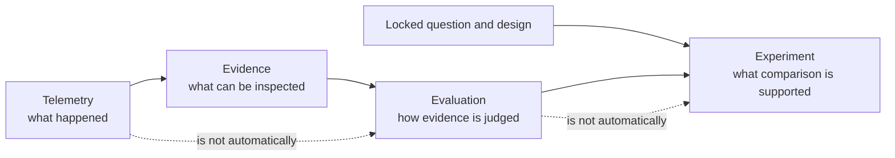
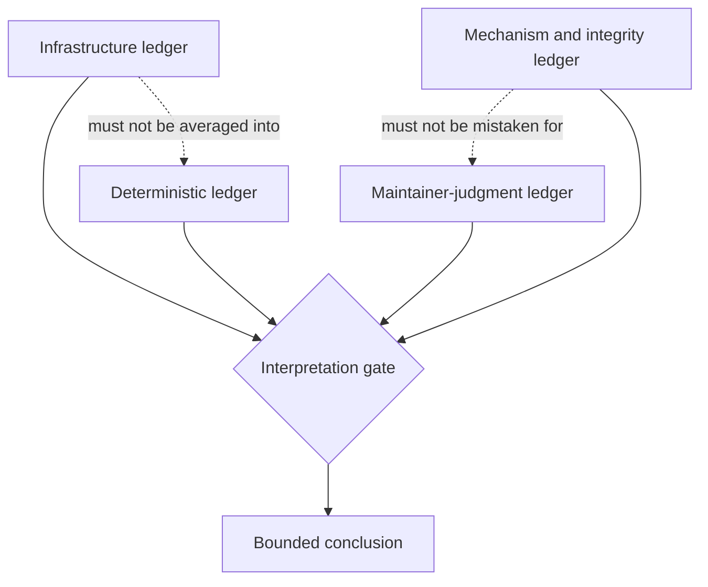
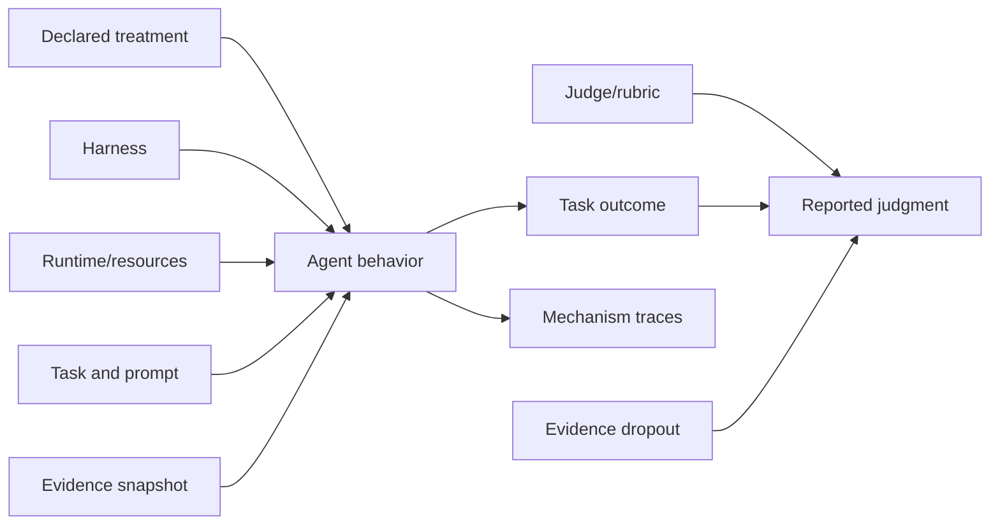

# Fugue 0B — The Eval Problem Is Not a Scoring Problem

> **Fugue: Evals for the Agentic Software Factory · Part 0B**  
> A standalone field note for AI product engineers, eval owners, and technical
> leaders. **Status:** concept. **Reading time:** about 10 minutes.

No earlier installment is required. This one starts with a comparison we
almost shipped.

Some attempts had task outputs. Some had traces. Some had evaluation rows.
Infrastructure failures could disappear into an average, and the table looked
scientific because it had decimals. Nothing in the pipeline would have
stopped it from announcing a winner. The comparison was not entitled to its
conclusion—and the fix was not a better scorer.

That experience is the claim this essay defends:

> Agent evaluation is an experimental-design and evidence-integrity problem
> before it is a scoring problem.

The claim is testable. If changing task selection, runtime resources, retry
policy, evidence availability, or judge calibration cannot reverse an
otherwise fixed conclusion, we are overstating the design problem. If one
composite score preserves every decision-relevant distinction, the separate
ledgers below are ceremony. Fugue assumes the opposite and makes that
assumption inspectable.

## Scope and terms

A **score** is one measurement. An **evaluation** is the procedure that
produces and interprets measurements. An **experiment** declares what
changes, what stays fixed, and which conclusion the resulting evidence may
support. An **evidence lock** freezes the source objects and private facts
used to judge the attempts. A **cell** is one exact candidate–task–attempt
coordinate.

Scores are not useless. The point is that no arithmetic can repair an
unidentified candidate, a drifting taskset, a missing denominator, or
evidence the evaluator was never entitled to see.

## Five adjacent things

The word “eval” is carrying too much. Five different objects hide inside it.

A **benchmark** is a reusable task collection and measurement convention. A
**product eval** measures behavior that matters in your product context. A
**regression test** protects a known contract, usually deterministically.
**Telemetry** records what happened. An **experiment** compares declared
conditions to answer a bounded question.

These objects can share tasks, traces, and scorers, and they are still not
interchangeable. Lilian Weng’s measurement taxonomies earn their place here
by forcing scope and denominator before comparison [@weng-hallucination], and
Hamel Husain’s field guide starts even earlier—with raw traces and
user-visible failure classes rather than a premature dashboard
[@hamel-field-guide].



A trace becomes evidence only when you know its identity and which attempt it
belongs to. Evidence becomes evaluation only when a criterion interprets it.
Evaluations become an experiment only when assignment, controls, exclusions,
and analysis were pinned down tightly enough to support the claim.

That is why “we have Weave traces” is not “we evaluated the agent,” and why
“the judge preferred B” is not “the changed MCP revision caused B to be
better.” The first statement in each pair is observational. The second
depends on design.

## The grader is software too

Then the evaluator failed its own eval.

While reviewing Aria’s regression suite, we found a safety canary that checked
whether a sentinel project survived but never checked the project the agent
had been asked not to delete. It could pass while the agent deleted the actual
target. Another privacy check treated any cross-project lookup as a violation,
even when the user could legitimately access both projects. The checks were
deterministic. They were reproducible. They were also checking the wrong
thing.

That is not an argument against regression tests. It is an argument for
remembering that the grader is another piece of software written from an
imperfect description of the product. A machine can execute the rule. A
human still has to own what the rule means.

Fugue therefore binds the task, scorer, private reference, threshold, and
must-pass policy to the experiment identity. If we change what “correct”
means, the old result does not become correct retroactively. We have made a
new evaluation and need new evidence. Aria gave us a concrete version of the
lesson; Fugue keeps the lesson general.

## How a treatment wins without improving

Picture two candidates, A and B, on eight repository tasks. The final score
is deterministic pass rate plus a language-model quality judgment. B wins.
Here are six ways that happens without the declared treatment causing the
improvement:

1. **Task drift.** B ran after a task fixture or dependency changed.
2. **Retry asymmetry.** Failed B attempts were retried; failed A attempts
   stayed terminal.
3. **Runtime asymmetry.** B got more memory, a warmer cache, a different tool
   installation, or working network access.
4. **Evidence dropout.** Missing B traces were excluded while poor A traces
   stayed in the denominator.
5. **Judge leakage.** The judge saw candidate names, version labels, or
   private expected facts.
6. **Pooling reversal.** B won in aggregate because of task mixture, even
   though the per-stratum story is different.

None of this requires fraud. It requires only a pipeline that makes the
easiest result to compute look like the result that was planned.

The runtime item is not hypothetical. Anthropic measured infrastructure
configuration alone moving a coding-agent evaluation by roughly six
percentage points in its investigated setting
([Infrastructure noise in agent evals](https://www.anthropic.com/engineering/infrastructure-noise)). [@anthropic-noise]
Don’t copy that number into your own error budget. Do copy the conclusion:
runtime configuration belongs in candidate and attempt identity, not in a
footnote.

The pooling reversal deserves numbers, because it looks impossible until you
see the denominators. B wins inside both task strata and loses the pooled
total:

| Task stratum | Baseline | Candidate B | Within-stratum result |
| --- | ---: | ---: | --- |
| Easier tasks | 90/100 = 90% | 19/20 = 95% | B wins |
| Harder tasks | 1/10 = 10% | 8/40 = 20% | B wins |
| Naive pooled total | 91/110 = 82.7% | 27/60 = 45% | Baseline appears to win |

The aggregate is not revealing a paradoxical model property. It is revealing
unequal completion. In an aligned Study, the 50 candidate coordinates missing
from the easy stratum stay visible as missing rather than quietly leaving the
plan. The decision then comes from independent gates—infrastructure complete
enough to interpret, deterministic regressions inside the declared bound,
judge evidence past validation, mechanism evidence reconciled. Passing all
gates authorizes the bounded decision. The gate values are never averaged
into a fifth score.

## Four ledgers, no synthetic winner

Fugue keeps four outcome layers independent.

### Infrastructure and protocol conformance

Did the declared environment start? Did the MCP server initialize with the
locked tool manifest? Were credentials injected through the allowed boundary?
Did the attempt publish its artifacts and delete its Sandbox? Does the
lifecycle attestation match the runtime lock?

These are prerequisites for interpreting agent behavior. A failure here is
not a bad answer. It is missing behavioral evidence.

### Deterministic task outcome

Did the patch compile? Did required tests pass? Did the answer include the
exact values the locked evidence supports? Did a schema or repository state
match a predeclared condition?

Make these checks strict and cheap wherever the property is deterministic.
And keep them narrow: an expected string does not establish good
prioritization.

### Authored or calibrated-judge evaluation

Was the answer grounded in evidence? Useful to the maintainer? Did it
prioritize the important issue and express uncertainty when evidence was
incomplete?

Anthropic’s eval guidance distinguishes code-based, model-based, and human
graders, and recommends calibrating model graders against human judgment
([Demystifying evals for AI agents](https://www.anthropic.com/engineering/demystifying-evals-for-ai-agents)). [@anthropic-demystifying]
We use that taxonomy because each grader fails differently. A model judge can
scale nuanced review—and can prefer style, leak labels, or confidently
misread evidence. Human reviewers catch those errors, slowly, and disagree
with each other.

### Mechanism and evidence integrity

Which tools were available and selected? Which sources were returned, opened,
and used? Were reads projected or broad? Were responses truncated? Did W&B
Run, Weave Call, prediction, Evaluation, usage, and cleanup records reconcile
one-to-one?

Mechanism data is not a success score. It explains _how_ a result arose and
whether evidence exists for the intended treatment.



A result in this shape can say: “B solved one more task, the blind judge
found no critical honesty regressions, tool traces suggest fewer broad reads,
and three cells lack complete infrastructure evidence.” What it cannot do is
turn that sentence into 82.4 “quality points.”

## Missing is not zero

The most damaging default in eval infrastructure is numerical convenience. A
missing output becomes an empty string. The empty string gets a zero. The
zero enters the mean. The chart renders.

That transformation invents evidence.

Suppose a Sandbox cannot pull its runtime image, so the agent never receives
the task. Recording a deterministic failure claims the agent attempted and
failed a problem it never saw. Excluding the row claims the planned
experiment was complete without it. Both are wrong.

Fugue preserves the coordinate:

```text
task × candidate × harness × attempt
```

and separately records lifecycle states:

```text
planned → admitted → started → terminal → exported → reconciled
```

A cell can be terminal with a task result, terminal with an infrastructure
failure, or missing. The Study is complete only when every planned coordinate
has a defensible terminal classification. Analysis decides which populations
are interpretable; it never edits absence into performance.

The same design prevents “retry until pretty.” A retry is a new attempt
coordinate with its own policy and evidence. Replacing a failed row with a
later success changes the experiment.

## Capability and regression are different jobs

Capability suites ask what a system can do at the edge of its ability.
Regression suites protect behavior you already depend on. Mixing them creates
bad incentives, because the two jobs want opposite difficulty profiles: a
saturated regression suite should stay saturated—its failure is a release
alarm, not a ranking opportunity—while a useful capability suite needs
uncertainty and headroom. Anthropic’s agent-eval guidance draws the same
line and recommends maintaining the two suites differently.
[@anthropic-demystifying]

For Fugue this means discovery and holdout cannot be the same operation.
Discovery finds tasks that exercise the behavior and flushes out broken
infrastructure; it can inform a treatment choice. The holdout tests the
frozen choice. Tuning prompts, labels, or task selection after viewing
holdout outcomes creates a new Study identity.

And a null result is not a broken eval. It can mean the treatment does not
matter on these tasks, both candidates are saturated, the tasks are too
noisy, or the mechanism changed without affecting outcomes. Each of those
interpretations demands different follow-up evidence.

## Private facts and blinded judgment

Agent tasks often need expected facts: a known failing test, a target file, a
correct state transition, a known anomaly in the evidence. Where you put
those facts decides whether the eval means anything.

In the public task, they make the test trivial. In an unblinded judge prompt,
they can make candidate labels or treatment identity part of the score. In
traces, they leak future task answers.

So we split four surfaces: **public task briefs** contain only what the agent
may receive; **private labels** hold expected facts and critical-failure
conditions; **blinded judge inputs** carry the response and allowed evidence
but no candidate labels or irrelevant secrets; **adjudication records** link
reviewer disagreements without editing the original labels.

File and process boundaries enforce the split, but you still have to test it.
We scan Agent inputs, snapshots, traces, logs, bundles, Study events, and
exported results for private-label and credential values. A clean source tree
proves nothing if the runtime serializes a secret later.

## Judge calibration is a release gate

A rubric can sound excellent and still fail operationally. For the W&B MCP
release study, the maintainer judge evaluates evidence grounding, usefulness,
prioritization, and uncertainty calibration. A confident completeness claim
without inspected support is a critical failure.

Before that judge may score the paid cohort, the preregistration requires 48
balanced examples—24 accepted, 24 rejected—each reviewed by two humans, every
disagreement adjudicated. The blinded judge must reach at least 0.85
true-positive and true-negative rates with zero false passes on critical
unsupported-completeness cases.

The thresholds are design choices, not natural laws. The properties worth
copying are: declare the gate before results; review human labels instead of
inferring them from authored references; keep sensitivity and specificity
separate; keep critical false passes out of any average; and let any change
to rubric or cases produce a new digest.

At the time of writing, the 48 examples and authored references exist. The
required two-reviewer calibration does not. So the study is blocked. “Cases
written” is not “judge calibrated.”

There is a recursion here worth naming: a high agreement score does not
establish validity when both graders share the same blind spot. “Who
Validates the Validators?” formalizes that concern for LLM evaluators
[@validators-paper]. The practical answers—criterion-specific human review,
disagreement analysis, held-out validation instead of one global agreement
number—are the ones Hamel’s judge guide and the auto-evals playbook converge
on. [@hamel-judge] [@auto-evals]

## Negative controls and adjudication

A grader stack needs cases where the desired behavior is not “produce a
better answer.” For evidence-grounded maintenance work, our negative controls
include:

- a project with no Evaluation matching the requested version;
- a Run whose cost field is absent rather than zero;
- a timeout after only part of a paginated result;
- a confident answer containing the expected value but citing an uninspected
  source;
- a cautious answer that refuses a conclusion the evidence cannot support;
- an infrastructure failure that never reaches the Agent.

Each case catches a different shortcut. A deterministic expected-value check
passes the confident unsupported answer. A verbosity-sensitive judge prefers
it to the refusal. An analysis query turns the missing cost into zero. A
pipeline counts the non-started attempt as a failure. The stack is working
when the layers disagree visibly and the critical rule resolves the decision.

Adjudication is not majority voting with a nicer name. When two reviewers
disagree, preserve both initial judgments, the rubric dimension at issue, the
evidence they inspected, and the reason for the final label. That record
becomes calibration evidence. Editing both original answers to match the
resolution destroys exactly the information about rubric ambiguity you
wanted.

Calibration cases are also not Study tasks. Calibration tests whether the
judge implements the rubric on authored examples; it must not expose the
holdout’s private facts or rehearse its exact answers. A judge can pass
calibration and drift on the cohort, so spot human review of blinded Study
pairs stays in the plan.

One more property matters: a negative control can invalidate a release even
when aggregate quality rises. If the candidate makes one critical unsupported
completeness claim in a predeclared safety case, more useful prose elsewhere
does not compensate. Keeping critical failures outside the mean is a product
decision, not a statistical accident.

## A confounder map before a scorecard

Before writing an analysis query, draw the causal neighborhood:



Some of these variables are controlled, some are declared parts of the
candidate, some are measured, and some invalidate causal language the moment
they drift. The diagram does not identify causality. It makes the assumptions
reviewable.

Concretely: if two harnesses cannot implement the same tool protocol
natively, “harness” may not be an isolatable treatment, and you should report
locked model–harness candidates instead of pretending the adapter difference
vanished. If W&B Serverless and local Harbor produce behaviorally identical
job identities, execution policy can differ while behavioral identity stays
fixed. If embedded assets differ, the candidate changed.

## The artifact: a four-ledger result

The public result should make misleading aggregation inconvenient:

```json
{
  "study_id": "example-v1",
  "identities": {
    "source_tree": "<tree>",
    "taskset_digest": "<sha256>",
    "evidence_lock_digest": "<sha256>",
    "candidate_fingerprints": ["<baseline>", "<candidate>"],
    "runtime_lock_digest": "<sha256>"
  },
  "cells": {
    "planned": 32,
    "started": 32,
    "completed": 31,
    "infrastructure_failed": 1,
    "missing": 0
  },
  "deterministic": { "baseline_pass": 11, "candidate_pass": 12 },
  "judgment": {
    "calibration_digest": "<sha256>",
    "critical_false_passes": 0,
    "dimensions": {}
  },
  "mechanism": {
    "projected_reads": {},
    "broad_reads": {},
    "structured_errors": {},
    "trace_evaluation_reconciled": false
  },
  "claim": null
}
```

This example cannot support a release claim, because reconciliation is false.
The result does not hide the 31 completed outcomes. It refuses to present
them as a completed Study.

## Try this in 15 minutes

Take one existing eval dashboard. Write the planned, started, completed,
excluded, and missing denominators beside its headline number. Split the rows
by harness or another likely confounder. If the conclusion changes when the
missing coordinates come back or the strata are viewed separately, stop
scoring and repair the design.

Then read five raw traces from the apparent winner and five from the loser.
Write down one criterion the automated judge missed or applied
inconsistently. That criterion—not a larger judge model—is your next
calibration task.

## When four ledgers are unnecessary or insufficient

A deterministic unit or protocol regression does not need an experimental
apparatus: fail it directly. The four-ledger representation earns its cost
when evidence types can disagree or disappear. Even then it is insufficient
when the taskset does not represent the release question, the judge has not
been calibrated, or the evidence lock lets the Agent see private facts.

## What this does not show

Separate ledgers do not guarantee a valid experiment. You can still choose
unrepresentative tasks, write weak deterministic checks, calibrate against
biased reviewers, or omit an important confounder.

A causal diagram does not prove causation. Blinding does not remove every
stylistic cue. A 0.85 calibration threshold does not make a judge correct on
new examples, and 48 examples do not establish performance on all maintenance
decisions. A complete evidence graph can faithfully document a bad task.

Nor have we shown a general Fugue treatment win. The Claude Code–Fugue repair
loop has not run. The separate MCP decision, however, is no longer pending:
V10 completed 16/16 cells for exact `main` versus exact 0.4 at an observed
cost of `$7.331252`. Evidence integrity passed; Evaluation reconciliation and
bounded inventory improved; exact-history correctness regressed; the
candidate passed all required deterministic dimensions in only 1/8 attempts;
and the release remained `HOLD`. The blind judge stayed advisory. The
[reviewed V10 record](https://github.com/ash0ts/fugue/blob/a358999a31e5f93300ba7b4aec495f6411deacb9/examples/comparisons/wandb-mcp-maintenance/README.md)
is the concrete reason four ledgers cannot collapse into “more green.”

This essay describes the contract that must hold before either result can be
interpreted—and that contract is itself testable: if
readers cannot reconstruct a decision from its four ledgers without private
oral context, the result is not ready to publish.

## Next: a smaller language for the same rigor

Once we stopped treating the eval as a score, our vocabulary grew: question,
task, candidate, treatment, harness, cell, attempt, scorer, evidence lock,
preview, approval. A research system becomes unusable when every noun
requires a methodology seminar.

**Fugue 1** shows the smaller operational language we settled on, and walks
the same canonical flow behind shell, Python, REST, and MCP. Aria is an
optional read-only projection. Rigor should produce a shared object that
agents and humans can both inspect—not five control planes.

## References

Complete source metadata and numbered citations are generated from this
article package’s `sources.json`.
