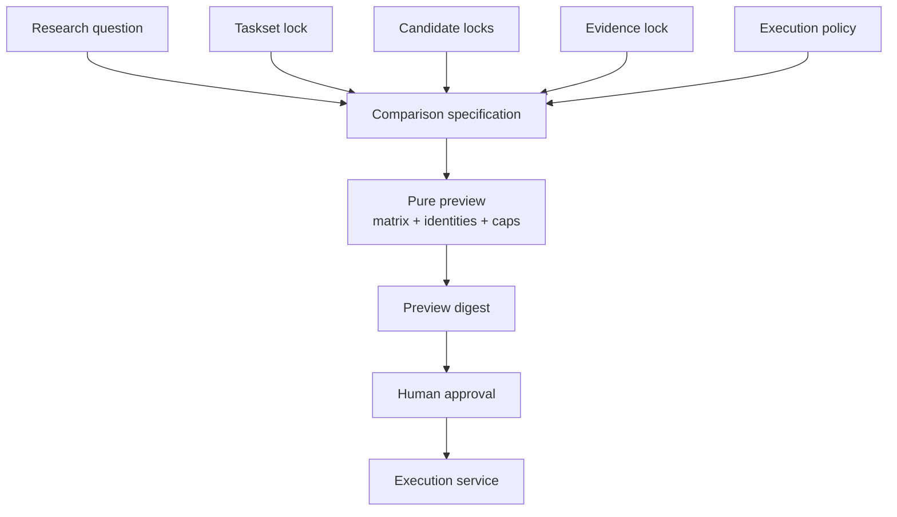
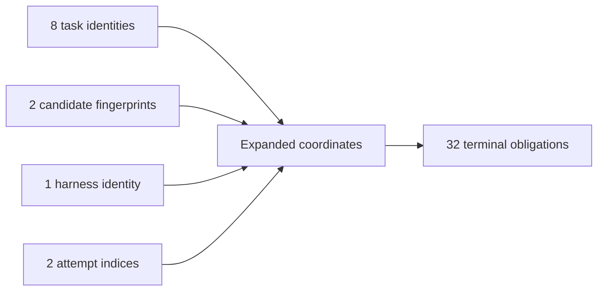
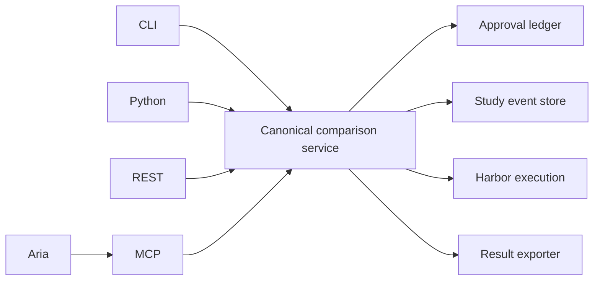

# Fugue 1 — From Vibes to Studies: Agent-and-Human-Friendly Eval Primitives

> **Fugue: Evals for the Agentic Software Factory · Part 1**  
> A standalone implementation guide for agent builders and eval owners.
> **Status:** concept. **Reading time:** about 12 minutes.

This article introduces Fugue from first principles through one no-key
comparison. Readers do not need the earlier essays or an existing Fugue
checkout to understand the objects and approval boundary.

The misconception is that rigorous evaluation requires a
researcher-only language and a separate expert workflow.

Our concrete failure was the opposite kind of sophistication. We had several
ways to launch work: shell scripts, Python calls, a service endpoint, and an
agent-facing tool. They accepted almost the same concepts but did not produce
the same preview. A human could approve one representation while an agent
executed another. Every interface looked convenient. Together they were not
governable.

Our falsifiable thesis is:

> A small set of strict primitives makes rigorous experiments understandable
> to both agents and humans.

The claim is false if ordinary users cannot predict the expanded work, if two
interfaces produce different identities, or if the primitives cannot express
real harness, memory, MCP, and runtime comparisons without escape hatches.

## Scope and terms

A **Study** is a durable, bounded research question. A **candidate** is the
behavior-producing Agent configuration. A **task** is the work and its public
brief. A **cell** combines candidate, task, and attempt. A **preview** expands
the exact work without running it. An **approval** authorizes one immutable
preview digest. A **result** reconciles every planned coordinate with its
evidence.

These primitives describe an experiment; they do not decide whether its
question is important or whether its graders are valid. Humans remain
responsible for both judgments.

This vocabulary owes more to failure analysis than to product taxonomy.
Anthropic’s grader guidance separates complementary evidence types, Hamel’s
eval workflow begins with concrete traces and tasks, and Dudycz’s OODA framing
keeps observation distinct from the decision it may eventually support.
[@anthropic-demystifying] [@hamel-evals-skills] [@hamel-field-guide]
[@dudycz-ooda]

## Start with the question

The smallest Fugue Study starts with a bounded research question:

> Under these locked tasks and conditions, does this exact candidate behave
> differently from this exact baseline in the declared outcomes?

The wording refuses three common shortcuts. “These locked tasks” prevents a
result from silently expanding to a product population. “Exact candidate”
prevents a model or package family name from hiding the implementation under
test. “Declared outcomes” prevents whatever metric happens to look good from
becoming the question after the run.

We use a dozen nouns, but only because each blocks a real ambiguity:

| Primitive         | Meaning                                                           | It is not                           |
| ----------------- | ----------------------------------------------------------------- | ----------------------------------- |
| Research question | The bounded comparison the Study may answer                       | A marketing claim                   |
| Task              | One public unit of work                                           | Its private expected facts          |
| Taskset           | A versioned collection of tasks                                   | A mutable query                     |
| Candidate         | A locked behavioral system                                        | A friendly model label              |
| Treatment         | The declared difference between baseline and candidate            | Every incidental runtime difference |
| Harness           | The agent program that mediates model, tools, state, and stopping | The model                           |
| Cell              | One planned task × candidate × harness × attempt coordinate       | Whatever rows happened to complete  |
| Attempt           | One immutable execution of one cell                               | A retry that overwrites failure     |
| Scorer            | One deterministic, human, or calibrated-judge interpretation      | The result as a whole               |
| Evidence lock     | Immutable references and digests for what the agent may inspect   | A convenient project name           |
| Preview           | The pure, fully expanded plan and cost envelope                   | Permission to execute               |
| Approval          | A time-bounded grant for one preview digest                       | A general license to spend          |

These primitives are agent-friendly because they are machine-readable and
stable. They are human-friendly because the preview expands them into the
questions a reviewer actually asks: what changes, what stays fixed, how much
work, what evidence, what failure policy, and what cost?

## Candidate identity is behavioral

A display label such as “W&B MCP 0.4” is not an identity. The candidate also
contains the exact MCP source revision and prepared runtime, model route,
harness build, prompt and tool configuration, task runtime, integration
bindings, and any memory or Skill treatment.

Fugue separates:

- a **behavior fingerprint**, containing inputs that can change agent
  behavior;
- an **execution fingerprint**, containing the policy that schedules an
  otherwise identical attempt.

That separation lets local Harbor and W&B Serverless act as parity
environments when—and only when—the embedded Agent, MCP, Skill, task, and
Fugue assets are identical. CPU, memory, timeout, network, image digest, and
secret policy remain visible in execution identity. Moving to Serverless
cannot quietly rebuild a different candidate.



The preview digest is over accepted meaning, not presentation. Reformatting
the screen should not change it. Adding one task, changing one timeout, or
pointing at another runtime must.

## A compact comparison

A real comparison needs more detail than a toy snippet, but its center remains
readable:

```yaml
schema_version: 1
id: bounded-agent-change-v1
question: Does the candidate improve the locked tasks without an evidence-honesty regression?

taskset:
  tasks: tasks.jsonl
  private_labels: private-labels.jsonl

baseline:
  label: baseline
  integrations: [integration-baseline]

candidate:
  label: candidate
  integrations: [integration-candidate]

changed: [integrations]

evaluators:
  - id: task-facts
    type: deterministic
    required: true
    checks: [answer_present, expected_values]
  - id: maintainer-quality
    type: llm_judge
    required: true
    profile: anthropic/claude-sonnet-5
    calibration: judge-calibration.json

execution:
  model: anthropic/claude-sonnet-5
  harnesses: [claude-code]
  attempts: 2
  concurrency: 1
  max_cost_usd: 40
  approval_required: true
```

The `changed` field is not documentation. Readiness checks compare the
resolved candidates and refuse undeclared differences. A candidate label
cannot hide another model route or task prompt.

The private-label path is part of the Study identity, but its contents never
enter the Agent input. The judge calibration is required evidence, not an
optional report. The dollar limit reserves a ceiling; it does not assert
actual cost. The execution service still records observed usage separately.

## Expansion makes the experiment concrete

Suppose the taskset has eight tasks, the comparison has two candidates, the
harness list has one harness, and the attempt policy is two. The matrix is:

```text
8 tasks × 2 candidates × 1 harness × 2 attempts = 32 cells
```



“Terminal obligations” is intentional. Approval authorizes a planned matrix,
not a best-effort sample. Every coordinate must become completed,
infrastructure-failed, denied, cancelled, or otherwise explicitly terminal.
Missing coordinates do not vanish from the denominator.

Expansion is also where accidental expense becomes visible. A user who writes
“eight tasks, two candidates, two attempts” may be thinking about eight pieces
of work. The preview shows 32 isolated Agent executions plus judge reserves,
runtime policy, concurrency, and the upper cost bound before anybody spends.

## The public flow

Fugue’s current public surface is deliberately verb-like:

```bash
uv run fugue init comparison

uv run fugue check comparison/comparison.yaml

uv run fugue compare comparison/comparison.yaml --preview

uv run fugue approve PREVIEW_DIGEST \
  --max-cells 32 \
  --max-usd 40 \
  --approved-by "$USER"

uv run fugue compare comparison/comparison.yaml \
  --run \
  --approval APPROVAL_ID

uv run fugue result bounded-agent-change-v1 --json
```

`init` scaffolds rather than executes. `check` validates without writing or
spending. `compare --preview` resolves the full plan without launching work.
`approve` binds cell and dollar caps to one digest and expiration.
`compare --run` re-resolves and rejects any mismatch. `result` reads exported
evidence; it cannot repair a missing row.

The precise return fields matter less than the monotonic authority:

```text
describe < validate < preview < approve < execute < interpret
```

An interface may have less authority than the underlying service. It may not
silently have more.

## Pure preview is a security property

We originally thought “preview” meant “do everything except the expensive
part.” That left too much room for mutation: cloning a repository, preparing
package code, refreshing a Dataset, or writing a lock can all change what will
later execute.

A Fugue preview is now pure with respect to the accepted Study. Imported MCP
and Skill code must already be inspected and locked. Task and evidence inputs
must already have content identities. Runtime images must already have
immutable references. Preview resolves those artifacts; it does not create
them.

This protects the human approval. A reviewer can inspect:

- exact baseline and candidate fingerprints;
- declared differences;
- task count and expanded cells;
- model and harness identities;
- evaluator and calibration digests;
- execution environment and runtime lock;
- trace and private-label policy;
- maximum spend and concurrency;
- conditions that will make the Study ineligible.

If preparation remained inside execution, the approved digest could describe
a recipe whose dependencies change after approval. Approval would be a
gesture, not a boundary.

## Approval grants execution, not authorship

The proposer may prepare a comparison, select from registered specs, and
request approval. It may not approve its own digest. Once approved, it may not
edit the preview, alter spend, change the retry policy, substitute a runtime,
or launch a follow-up under the same Study identity.

That sounds bureaucratic until an agent is the proposer. An agent that sees a
weak result can plausibly “help” by trying one more attempt, narrowing the
tasks, or rewriting a judge prompt. Each action may be locally reasonable.
Together they turn evaluation into optimization against the evaluator.

We encode an approval record roughly as:

```json
{
  "preview_digest": "<sha256>",
  "max_cells": 32,
  "max_usd": 40,
  "approved_by": "human-operator",
  "expires_at": "<timestamp>",
  "consumed_by": null
}
```

Execution is idempotent with respect to the accepted operation. A duplicated
start request must not create duplicate cells. A follow-up is a new preview,
approval, and Study.

## One service, several doors

Humans and agents need different interfaces. A maintainer may prefer the CLI.
An application may use Python. A UI may call REST. An MCP client needs bounded
tools. Aria needs Study events and safe result references.

They do not need different semantics.



The bounded MCP operations mirror the service: readiness, preview, approval
request, start of an already-approved digest, watch, and safe result. Aria may
select a registered comparison and explain it. It may not access private
labels, approve, mutate an accepted preview, retry an attempt, change policy,
or launch a follow-up.

Study Console receives projections of canonical Study events. It does not
invent a second Fugue-specific lifecycle. If a card says “approved,” the
approval ledger must contain the same digest. If a result card links a Weave
trace, the exported attempt and Evaluation row must reconcile to it.

The contract can be tested across interfaces: given the same repository tree
and inputs, every door must produce the same preview digest.

## Evidence locks are more than checksums

An evidence lock names immutable W&B Runs, Weave Calls, Dataset versions, and
Evaluation versions. It also records counts, content digests, source commit,
creation receipts, and the bounded purpose of the snapshot.

A friendly project name is mutable. “Latest Dataset” is mutable. Even a stable
object ID may point to content whose meaning depends on another unrecorded
object. The lock closes enough of that graph to make drift detectable.

For the MCP qualification, the checked-in seed lock points to a dedicated
non-sensitive W&B project. It records six Runs, 24 standardized Agent
conversations, 48 tool spans, an eight-row Dataset, two Evaluations with eight
aligned rows each, and 16 prediction rows. These are genuine SDK and Weave
objects. They are prior evidence for tasks, not the comparison result.

The preparation tool is idempotent. An existing lock must validate exactly or
fail. It never “fixes” changed evidence by editing private labels. Drift means
new evidence and therefore a new identity.

## The no-key replay

A first-time user needs a proof that the package installs and that the public
result shape is tangible before configuring remote runtimes. Fugue includes a
deterministic replay:

```bash
uv sync --python 3.13 --frozen
uv run fugue demo source-use --out .fugue/demo --json
```

On the reviewed tree, that command returns 16 aligned rows: baseline
deterministic pass `2/8`, candidate pass `6/8`, five improved pairs, one
regressed pair, two unchanged pairs, and no judge result. Mechanism fields
that the immutable replay cannot observe remain `unavailable`; they are not
invented from the deterministic outcome. The exact replay implementation is
reviewable in the public Fugue stack. [@fugue-replay]

The replay reconstructs a small source-use comparison from bundled evidence.
It writes `.fugue/demo/result.json` and `.fugue/demo/result.md`. It checks
packaging, parsing, result projection, and the basic operator experience
without a provider key. Unlike a live comparison execution, a custom replay
output does not update the ordinary `result latest` pointer.

Its limitations are part of the artifact:

- it does not launch a live agent;
- it does not qualify W&B Serverless;
- it does not demonstrate a causal treatment effect;
- it does not prove a judge is calibrated;
- it does not substitute for the 80-cell MCP Study.

Calling this the flagship would optimize the demo for reliability by removing
the behavior we intend to prove.

## Inspecting a result

A good result lets a human move from summary to evidence without changing
semantic layers. The top level answers:

- Were all planned cells reconciled?
- Did deterministic outcomes differ?
- Did calibrated judgment find critical regressions?
- Were there harness-specific reversals?
- What mechanism observations are supported?
- Which infrastructure failures limit interpretation?

From there, aligned rows should open the baseline and candidate attempt,
root Agent conversation, tool spans, prediction, Evaluation record, usage, and
lifecycle attestation. A maintainer can inspect a discordant pair rather than
trust the aggregate.

The system should also permit the most important result:

```json
{
  "recommendation": "no-decision",
  "reason": "required evidence is incomplete",
  "missing": ["candidate/task-7/claude-code/attempt-2:evaluation"]
}
```

That result is operationally less satisfying than a winner and
scientifically better than an invented score.

## The unfamiliar-maintainer test

The primitives are not successful because their names are internally
consistent. They are successful when somebody outside the implementation
thread can use them without oral history.

Our usability rehearsal gives an unfamiliar engineer a clean clone and asks
them to:

1. install the wheel or source distribution;
2. run the no-key replay and explain what it does _not_ prove;
3. scaffold a comparison;
4. identify public tasks and private expected facts;
5. run readiness and explain every blocker;
6. expand the matrix and calculate the cell count independently;
7. locate the candidate and runtime identities;
8. explain what approval permits;
9. inspect a completed aligned pair and find its canonical evidence;
10. state the narrowest conclusion the result supports.

We record where they ask for help, which fields they misinterpret, and whether
two people reach the same answer. This is not a benchmark of the engineer. It
is a test of the control plane’s legibility.

Three failure modes are especially revealing. If the engineer thinks a label
is an identity, the preview is hiding resolved state. If they think approval
permits any follow-up under the cost cap, the authority model is hidden. If
they treat the no-key replay as live agent evidence, the artifact has not
communicated its tier.

The rehearsal can force API changes, but it is not itself an efficacy Study.
Its evidence is task completion, interpretation accuracy, and observed
friction on the exact public surface. A maintainer who has learned Fugue from
its authors is not an unfamiliar user.

## Try this in 15 minutes

Run the no-key command, open `result.json`, and independently calculate its
planned rows and paired statuses. Then change no files and run it again: the
result digest and row identities should be identical. Finally, write one
sentence each for what the replay proves and what it cannot prove.

Next, sketch a two-candidate, two-task, one-attempt matrix on paper. If your
preview does not expand to four coordinates before approval, the control plane
is hiding work from its reviewer.

## When these primitives are unnecessary or insufficient

Do not turn a single known regression into a Study when a failing test states
the contract more clearly. The primitives also cannot rescue a vague research
question, an unrepresentative taskset, or an evaluator whose labels have not
been reviewed. They make those weaknesses inspectable; they do not solve them.

## What this does not show

Friendly primitives do not make experimental design automatic. A user can
lock an unrepresentative taskset, choose a weak rubric, or ask a question
whose treatment cannot be isolated.

A digest proves byte identity under its canonicalization rules, not semantic
wisdom. A human approval proves authorization, not correctness. An evidence
lock can faithfully preserve synthetic or irrelevant evidence. Interface
parity can make the same mistake everywhere.

The no-key replay proves installation and deterministic projection only. The
real W&B MCP result remains preregistered and blocked at the time of writing.

## The bridge: the model is not the candidate

Once the matrix became explicit, another ambiguity stopped being tolerable.
We had been naming experiment arms by model even though tools, harness,
context, permissions, stopping rules, and environment shaped the observed
behavior.

In the next installment, **Fugue 2A**, we preregister a harness study
that treats the model–harness–environment combination as the candidate. Then
in **Fugue 2B**, we use the same primitives to
separate stored memory from evidence actually used.

## References

Complete source metadata and numbered citations are generated from this
article package’s `sources.json`.
