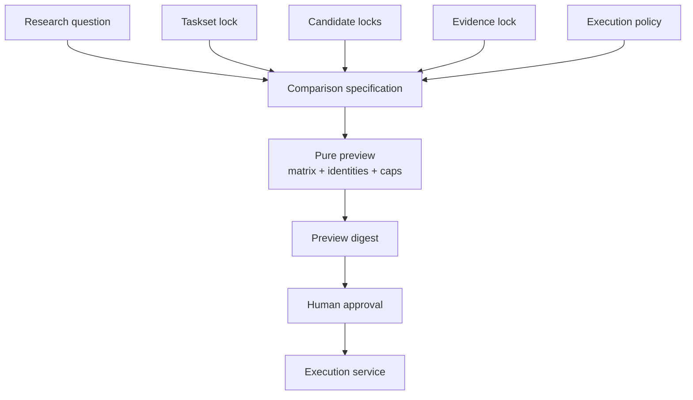
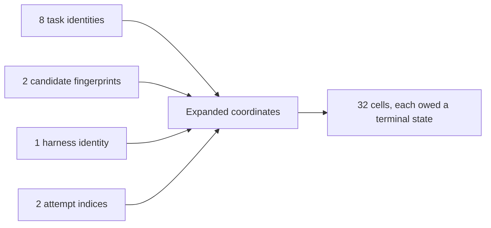
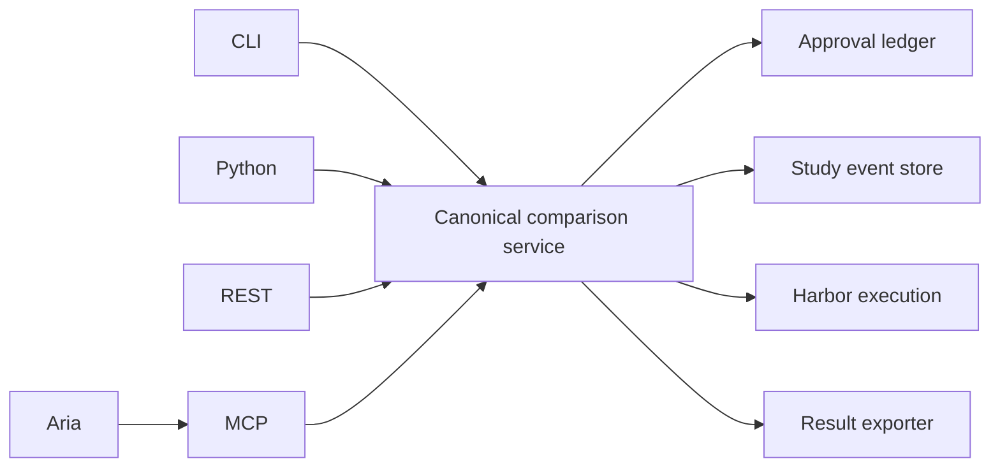

# Fugue 1 — From Vibes to Studies: Agent-and-Human-Friendly Eval Primitives

> **Fugue: Evals for the Agentic Software Factory · Part 1**  
> A standalone implementation guide for agent builders and eval owners.
> **Status:** concept. **Reading time:** about 10 minutes.

This article introduces Fugue from first principles through one comparison
you can run without any API keys. It is standalone: you do not need the
earlier essays or an existing Fugue checkout.

We got here through a failure of convenience. We had several ways to launch
work: shell scripts, Python calls, a service endpoint, and an agent-facing
tool. They accepted almost the same concepts but did not produce the same
preview, so a human could approve one representation while an agent executed
another. Every interface was convenient on its own. Together they were
ungovernable.

The claim this essay defends:

> A small set of strict primitives makes rigorous experiments understandable
> to both agents and humans.

You can falsify it. If ordinary users cannot predict the work a spec expands
into, if two interfaces produce different identities for the same spec, or if
the primitives cannot express real harness, memory, MCP, and runtime
comparisons without escape hatches, the design has failed.

## Scope and terms

Seven nouns do most of the work. A **Study** is a durable, bounded research
question. A **candidate** is the behavior-producing Agent configuration:
model, harness, tools, prompts, and settings together. A **task** is one unit
of work with a public brief. A **cell** is one planned combination of
candidate, task, and attempt. A **preview** expands the exact work without
running it. An **approval** authorizes one immutable preview digest. A
**result** reconciles every planned coordinate with its evidence.

If you know Anthropic’s eval vocabulary, the mapping is direct: our task is
their task, our attempt is their trial, and our scorers are their graders.
[@anthropic-demystifying]

These primitives describe an experiment. They do not decide whether the
question is important or whether the graders are valid. Humans stay
responsible for both.

## Start with the question

The smallest Fugue Study starts with a bounded research question:

> Under these locked tasks and conditions, does this exact candidate behave
> differently from this exact baseline in the declared outcomes?

The wording refuses three common shortcuts. “These locked tasks” stops a
result from quietly expanding to a product population. “Exact candidate”
stops a model or package family name from hiding the implementation under
test. “Declared outcomes” stops whatever metric happens to look good from
becoming the question after the run.

Beyond the seven nouns above, a few more each block a real ambiguity:

| Primitive     | Meaning                                                            | It is not                           |
| ------------- | ------------------------------------------------------------------ | ----------------------------------- |
| Taskset       | A versioned collection of tasks                                    | A mutable query                     |
| Treatment     | The declared difference between baseline and candidate             | Every incidental runtime difference |
| Harness       | The agent program that mediates model, tools, state, and stopping  | The model                           |
| Attempt       | One immutable execution of one cell                                | A retry that overwrites failure     |
| Scorer        | One deterministic, human, or calibrated-judge interpretation       | The result as a whole               |
| Evidence lock | Immutable references and digests for what the agent may inspect    | A convenient project name           |

The primitives are agent-friendly because they are machine-readable and
stable. They are human-friendly because the preview expands them into the
questions a reviewer actually asks: what changes, what stays fixed, how much
work, what evidence, what failure policy, and what cost?

## Candidate identity is behavioral

A display label such as “W&B MCP 0.4” is not an identity. The candidate also
contains the exact MCP source revision and prepared runtime, model route,
harness build, prompt and tool configuration, task runtime, integration
bindings, and any memory or Skill treatment.

Fugue separates two fingerprints. The **behavior fingerprint** covers every
input that can change what the agent does. The **execution fingerprint**
covers the policy that schedules an otherwise identical attempt: CPU, memory,
timeout, network, image digest, secret policy.

That split keeps behavior identity separate from execution identity. The
active flagship qualifies behavior through local Harbor. A future remote
runtime would require its own locked execution receipts and could not inherit
local evidence as proof of parity.



The preview digest covers accepted meaning, not presentation. Reformatting
the screen should not change it. Adding one task, changing one timeout, or
pointing at another runtime must.

## A compact comparison

A real comparison needs more detail than a toy snippet, but its center stays
readable:

```yaml
schema_version: 1
id: bounded-agent-change-v1
question: Does the candidate improve the locked tasks without an evidence-honesty regression?

taskset:
  tasks: tasks.jsonl
  private_labels: private-labels.jsonl

baseline:
  label: baseline
  integrations: [integration-baseline]

candidate:
  label: candidate
  integrations: [integration-candidate]

changed: [integrations]

evaluators:
  - id: task-facts
    type: deterministic
    required: true
    checks: [answer_present, expected_values]
  - id: maintainer-quality
    type: llm_judge
    required: true
    profile: anthropic/claude-sonnet-5
    calibration: judge-calibration.json

execution:
  model: anthropic/claude-sonnet-5
  harnesses: [claude-code]
  attempts: 2
  concurrency: 1
  max_cost_usd: 40
  approval_required: true
```

The `changed` field is not documentation. Readiness checks compare the
resolved candidates and refuse undeclared differences, so a candidate label
cannot hide another model route or task prompt.

Three details are easy to miss. The private-label path is part of the Study
identity, but its contents never enter the Agent input. The judge calibration
file is required evidence, not an optional report. And the dollar limit
reserves a ceiling—the execution service still records observed usage
separately.

## Expansion makes the experiment concrete

Suppose the taskset has eight tasks, the comparison has two candidates, the
harness list has one harness, and the attempt policy is two:

```text
8 tasks × 2 candidates × 1 harness × 2 attempts = 32 cells
```



Approval authorizes the planned matrix, not a best-effort sample. Every one
of the 32 cells must end in an explicit terminal state: completed,
infrastructure-failed, denied, or cancelled. Missing coordinates do not
leave the denominator.

Expansion is also where accidental expense becomes visible. Someone who
writes “eight tasks, two candidates, two attempts” is probably thinking about
eight pieces of work. The preview shows 32 isolated Agent executions plus
judge reserves, runtime policy, concurrency, and the upper cost bound—before
anybody spends.

## The public flow

The public surface is a handful of verbs:

```bash
uv run fugue init comparison

uv run fugue check comparison/comparison.yaml

uv run fugue compare comparison/comparison.yaml --preview

uv run fugue approve PREVIEW_DIGEST \
  --max-cells 32 \
  --max-usd 40 \
  --approved-by "$USER"

uv run fugue compare comparison/comparison.yaml \
  --run \
  --approval APPROVAL_ID

uv run fugue result bounded-agent-change-v1 --json
```

`init` scaffolds without executing. `check` validates without writing or
spending. `compare --preview` resolves the full plan without launching work.
`approve` binds cell and dollar caps to one digest and expiration.
`compare --run` re-resolves and rejects any mismatch. `result` reads exported
evidence; it cannot repair a missing row.

The exact return fields matter less than the ordering of authority:

```text
describe < validate < preview < approve < execute < interpret
```

An interface may have less authority than the underlying service. It may
never quietly have more.

## Pure preview is a security property

We originally thought “preview” meant “do everything except the expensive
part.” That leaves too much room for mutation: cloning a repository,
preparing package code, refreshing a Dataset, or writing a lock can each
change what will later execute.

A Fugue preview is now pure with respect to the accepted Study. Imported MCP
and Skill code must already be inspected and locked. Task and evidence inputs
must already have content identities. Runtime images must already have
immutable references. Preview resolves those artifacts; it does not create
them.

This is what protects the human approval. A reviewer can inspect the exact
baseline and candidate fingerprints, the declared differences, the task count
and expanded cells, model and harness identities, evaluator and calibration
digests, the execution environment and runtime lock, trace and private-label
policy, maximum spend and concurrency, and the conditions that would make the
Study ineligible.

If preparation stayed inside execution, the approved digest could describe a
recipe whose dependencies change after approval. Approval would be a gesture,
not a boundary.

## Approval grants execution, not authorship

The proposer may prepare a comparison, select from registered specs, and
request approval. It may not approve its own digest. Once approved, it may
not edit the preview, alter spend, change the retry policy, substitute a
runtime, or launch a follow-up under the same Study identity.

That sounds bureaucratic until the proposer is an agent. An agent that sees a
weak result can plausibly “help”: one more attempt, a slightly narrower
taskset, a reworded judge prompt. Each step is locally reasonable. Together
they turn evaluation into optimization against the evaluator. Dudycz’s OODA
framing puts it cleanly: observing and orienting can run continuously, but
deciding and acting carry authority, and a loop that blurs them stops being
trustworthy. [@dudycz-ooda]

The approval record is small:

```json
{
  "preview_digest": "<sha256>",
  "max_cells": 32,
  "max_usd": 40,
  "approved_by": "human-operator",
  "expires_at": "<timestamp>",
  "consumed_by": null
}
```

Execution is idempotent with respect to the accepted operation: a duplicated
start request must not create duplicate cells. A follow-up is a new preview,
a new approval, and a new Study.

## One service, several doors

Humans and agents want different interfaces. A maintainer may prefer the CLI.
An application may use Python. A UI may call REST. An MCP client needs
bounded tools. An optional Aria shell needs read-only Study events and safe
result references.

They do not need different semantics.



The write-capable operator surfaces mirror the service: readiness, preview,
approval request, start of an already-approved digest, watch, and safe result.
The optional Aria shell is narrower: it may read safe comparison, Study, and
result projections and explain them. It may not request or issue approval,
start work, read private labels, mutate an accepted preview, select a
treatment, retry an attempt, change policy, or launch a follow-up.

Study Console receives projections of canonical Study events rather than
inventing a second lifecycle. If a card says “approved,” the approval ledger
must contain the same digest. If a result card links a Weave trace, the
exported attempt and Evaluation row must reconcile to it.

The whole contract is testable across interfaces: given the same repository
tree and inputs, every door must produce the same preview digest.

## Evidence locks are more than checksums

An evidence lock names immutable W&B Runs, Weave Calls, Dataset versions, and
Evaluation versions. It also records counts, content digests, source commit,
creation receipts, and the bounded purpose of the snapshot.

Why so much? Because a friendly project name is mutable. “Latest Dataset” is
mutable. Even a stable object ID can point to content whose meaning depends
on another, unrecorded object. The lock closes enough of that graph to make
drift detectable.

For the pending MCP qualification, immutable task evidence and experiment
results use separate projects. The source lock names the dedicated
non-sensitive source cohort; Agent traces, Evaluations, and result
projections go to the qualification result project. Genuine SDK and Weave
objects are prior task evidence, not the comparison result, and result rows
must never become new source evidence.

The preparation tool is idempotent. An existing lock must validate exactly or
fail. It never “fixes” changed evidence by editing private labels: drift
means new evidence, and new evidence means a new identity.

## The no-key replay

Before configuring any remote runtime, a first-time user deserves proof that
the package installs and that the public result shape is real. Fugue ships a
deterministic replay:

```bash
uv sync --python 3.13 --frozen
uv run fugue demo source-use --out .fugue/demo --json
```

On the reviewed tree, that command returns 16 aligned rows: baseline
deterministic pass `2/8`, candidate pass `6/8`, five improved pairs, one
regressed pair, two unchanged pairs, and no judge result. Mechanism fields
the immutable replay cannot observe stay `unavailable`; they are never
invented from the deterministic outcome. The exact replay implementation is
public and reviewable. [@fugue-replay]

The replay reconstructs a small source-use comparison from bundled evidence,
writes `.fugue/demo/result.json` and `.fugue/demo/result.md`, and exercises
packaging, parsing, result projection, and the operator experience—without a
provider key. This is the same move Hamel makes with his copyable eval
skills: hand people a runnable starting point grounded in concrete behavior,
then let them extend it with their own stack and data. [@hamel-evals-skills]

Its limits are part of the artifact. It does not launch a live Agent, start a
live MCP server, execute through local Harbor, demonstrate a causal treatment
effect, or substitute for either the Claude Code loop or the separate
source-isolated MCP staging comparison. Promoting this replay to flagship
status would optimize the demo for reliability by deleting the behavior we
intend to prove.

## Inspecting a result

A good result lets you move from summary to evidence without switching
semantic layers. The top level answers: Were all planned cells reconciled?
Did deterministic outcomes differ? Did calibrated judgment find critical
regressions? Were there harness-specific reversals? What mechanism
observations are supported? Which infrastructure failures limit
interpretation?

From there, each aligned row should open the baseline and candidate attempt,
the root Agent conversation, tool spans, prediction, Evaluation record,
usage, and lifecycle attestation. This is the trace-first discipline from
Hamel’s field guide applied to results: keep one click between every claim
and the raw transcript, so a maintainer can inspect a discordant pair instead
of trusting the aggregate. [@hamel-field-guide]

The system must also permit the most important result:

```json
{
  "recommendation": "no-decision",
  "reason": "required evidence is incomplete",
  "missing": ["candidate/task-7/claude-code/attempt-2:evaluation"]
}
```

Less satisfying than a winner. Scientifically better than an invented score.

## The unfamiliar-maintainer test

The primitives do not succeed by being internally consistent. They succeed
when somebody outside the implementation thread can use them without oral
history.

Our usability rehearsal hands an unfamiliar engineer a clean clone and asks
them to:

1. install the wheel or source distribution;
2. run the no-key replay and explain what it does _not_ prove;
3. scaffold a comparison;
4. identify public tasks and private expected facts;
5. run readiness and explain every blocker;
6. expand the matrix and calculate the cell count independently;
7. locate the candidate and runtime identities;
8. explain what approval permits;
9. inspect a completed aligned pair and find its canonical evidence;
10. state the narrowest conclusion the result supports.

We record where they ask for help, which fields they misread, and whether two
people reach the same answer. This is not a benchmark of the engineer. It is
a test of the control plane’s legibility.

Three failure modes are especially revealing. If the engineer thinks a label
is an identity, the preview is hiding resolved state. If they think approval
permits any follow-up under the cost cap, the authority model is hidden. If
they treat the no-key replay as live agent evidence, the artifact has not
communicated its tier.

The rehearsal can force API changes, but it is not an efficacy Study. Its
evidence is task completion, interpretation accuracy, and observed friction
on the exact public surface. A maintainer who learned Fugue from its authors
is not an unfamiliar user.

## Try this in 15 minutes

Run the no-key command. Open `result.json` and independently calculate its
planned rows and paired statuses. Change no files, run it again, and confirm
the result digest and row identities are identical. Then write one sentence
for what the replay proves and one for what it cannot prove.

Finally, sketch a two-candidate, two-task, one-attempt matrix on paper. If
your preview does not expand to four coordinates before approval, the control
plane is hiding work from its reviewer.

## When these primitives are unnecessary or insufficient

Do not turn a single known regression into a Study when a failing test states
the contract more clearly. And the primitives cannot rescue a vague research
question, an unrepresentative taskset, or an evaluator whose labels were
never reviewed. They make those weaknesses inspectable. They do not solve
them.

## What this does not show

Friendly primitives do not make experimental design automatic. You can lock
an unrepresentative taskset, choose a weak rubric, or ask a question whose
treatment cannot be isolated.

A digest proves byte identity under its canonicalization rules, not semantic
wisdom. A human approval proves authorization, not correctness. An evidence
lock can faithfully preserve synthetic or irrelevant evidence. Interface
parity can make the same mistake everywhere.

The no-key replay proves installation and deterministic projection only. It
is not live MCP evidence. The W&B MCP decision remains pending a
source-isolated `main` versus final-staging comparison at the time of writing.

## Next: the model is not the candidate

Once the matrix became explicit, another ambiguity stopped being tolerable.
We had been naming experiment arms by model even though tools, harness,
context, permissions, stopping rules, and environment all shaped the observed
behavior.

In **Fugue 2A**, we preregister a harness study that treats the
model–harness–environment combination as the candidate. In **Fugue 2B**, we
use the same primitives to separate stored memory from evidence actually
used.

## References

Complete source metadata and numbered citations are generated from this
article package’s `sources.json`.
