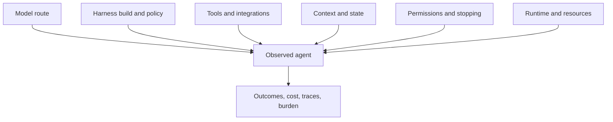
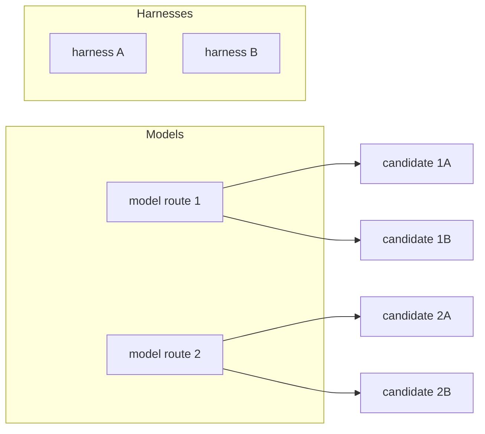
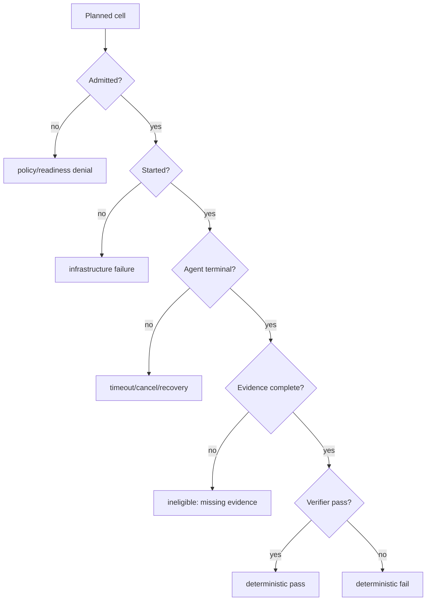

# Fugue 2A — The Model Is Not the Agent: Preregistering a Harness Study

> **Fugue: Evals for the Agentic Software Factory · Part 2A**  
> A standalone preregistration for agent researchers and platform engineers.
> **Status:** draft preregistration; no accepted preview and no result.
> **Reading time:** about 12 minutes.

This article defines the candidate and study design locally—you do not need
the earlier essays. Every diagram and command below is part of a
preregistration, not evidence that one harness wins. The design stays mutable
until an accepted Fugue preview digest, article digest, acceptance time, and
exact source-tree identity exist.

Here is the failure that produced it. We once had a chart labeled by model,
where each row had actually been produced through a different agent program,
tool adapter, state policy, stopping rule, and runtime image. We were about
to explain differences as model behavior that the design could not isolate.
The chart was not lying about its numbers. It was lying about its nouns.

The claim this preregistration freezes:

> Real capability belongs to a locked model–harness–environment candidate,
> not to a model name alone.

You can tell us this claim has no teeth. If the same model, task, and runtime
yield equivalent outcome, cost, and failure distributions across native
harnesses, the distinction barely matters in that setting. If differences
appear but vanish once protocol and resources are controlled, the earlier
“harness effect” was infrastructure. This article fixes how we will tell
those cases apart before we look at the final cohort.

## Scope and terms

A **model** supplies inference. A **harness** is the agent program around it:
tools, context assembly, state, stopping, recovery, and artifact handling. An
**environment** supplies the runtime, repository, resources, and policy. A
**candidate** is the locked combination whose behavior you actually observe.

The study asks whether native harnesses differ under declared controls. It
does not rank model families, crown a universal “best Agent,” or count an
infrastructure failure as evidence about task capability.

## What a harness does

A coding harness is not a chat template around a model. It decides, or helps
decide: how system and task instructions are assembled; which repository
context enters the first turn; how tool schemas are represented; when files
are read in full or projected; how shell, patch, search, and MCP operations
are exposed; how tool errors return to the model; what state persists between
turns; how context is compacted; whether work can be retried or resumed; what
counts as done; and which artifacts and traces survive.

Two harnesses can route to the same model checkpoint and create different
agents. And two model routes can only be compared through one harness if that
harness preserves each route’s relevant protocol instead of forcing both into
an artificial common denominator.



The observed agent is the composition. Calling it by the model’s name erases
the rest of the treatment.

This is now an empirical question, not an architectural taste. Harness-Bench
proposes measuring harness behavior across controlled environments and tasks
([Harness-Bench](https://arxiv.org/abs/2605.27922)) [@harness-bench], and the
Scaffold Effect paper shows scaffold choices altering apparent language-model
performance ([The Scaffold Effect](https://arxiv.org/abs/2607.22585))
[@scaffold-effect]. We use both to motivate the design, not to predict
Fugue’s result. Lilian Weng’s harness survey places the harness inside a
propose–evaluate–accept lineage [@weng-harness], and Dudycz’s OODA loop is
the standing warning: do not turn an observation into a causal story before
you have oriented and controlled. [@dudycz-ooda]

## The candidate lattice

There are at least three legitimate comparisons:

1. **Fixed model, varied harness.** The cleanest harness treatment, when both
   harnesses support the route and tools natively.
2. **Fixed harness, varied model.** A model question under one harness
   contract.
3. **Varied model–harness pairs.** A comparison of deployable systems, for
   when compatibility prevents clean isolation.



A complete lattice is often impossible. One harness may lack a native
provider route or expose a materially different tool protocol. Rather than
simulate compatibility and call the cells equivalent, we mark unavailable
coordinates and narrow the question. The reporting unit becomes the complete
model–harness pair.

This is why Fugue preserves native harness behavior. A
lowest-common-denominator adapter makes APIs look symmetric by removing the
very behaviors you wanted to evaluate: planning, compaction, tool semantics,
error recovery, finish detection.

## The bounded question

The planned canary asks:

> On two locked SWE-bench Verified tasks, under an identical provider route,
> task image, context treatment, local Docker policy, and one-attempt policy,
> how do Hermes, OpenClaw, Claude Code, and Codex differ in deterministic
> repair, efficiency, failure fingerprint, and evidence integrity?

With two tasks and one attempt, this lane does not estimate a stable
population effect. It reports raw aligned task outcomes for the four complete
model–harness–environment candidates while holding the model and runtime
envelope fixed. Secondary comparisons cover observed cost, latency, tool
trajectory, structured failures, and evidence integrity. The unit of
analysis is the aligned logical task and attempt; neither the cell nor any
aggregate licenses a model-only or universal-harness claim.

The dedicated lane is campaign `real-harness-study-v1`, experiment
`real-harness-study`, preset `canary`, and W&B/Weave project
`wandb/fugue-harness-comparison-v1`. It freezes the W&B Inference route
`wandb/zai-org/GLM-5.2`, context system `none`, one attempt, local Docker
execution through Harbor, and four native harness identities: `hermes`,
`openclaw`, `claude-code`, and `codex`. Its exact matrix is two tasks × four
harnesses × one attempt = eight planned cells.

Changing the route, adding a harness, or adding tasks is outside this
campaign’s allowlist. It requires a new preview, approval, and Study rather
than a wider interpretation of this canary.

At publication time, the appendix must print—not abbreviate—the source commit
and tree, task manifest and task-image digests, provider route and model
revision where available, harness package/source/runtime digests, prompt and
tool-manifest digests, Harbor and container runtime versions, resource and
concurrency limits, attempt count, scheduling seed, budget, planned
coordinate count, and preview digest. Until those fields come from the
generated preview, this article remains a draft.

## Fixed, varied, and measured

The most useful table in this study is not the leaderboard. It is the control
table:

| Dimension                | Role                   | Qualification rule                                     |
| ------------------------ | ---------------------- | ------------------------------------------------------ |
| Repository tasks         | Fixed                  | Exact manifest and per-task image digests              |
| Task instructions        | Fixed                  | Same public prompt bytes                               |
| Private grading          | Fixed and hidden       | Same host-only evaluation lock                         |
| Model route              | Fixed within one Study | Exact provider/model identity                          |
| Harness                  | Varied treatment       | Native locked build; no compatibility shim             |
| Tools                    | Fixed in intent        | Equivalent required capabilities; manifest drift fails |
| Context treatment        | Fixed                  | No added repository-memory system                      |
| Resources                | Fixed                  | Enforced CPU, memory, storage, timeout, network        |
| Attempts                 | Fixed                  | Same declared count; no replacement retries            |
| Scheduling               | Fixed                  | Locked seed, serial execution, and expanded order      |
| Deterministic repair     | Primary outcome        | Official offline verifier                              |
| Usage, latency, behavior | Secondary outcomes     | Observed, never imputed                                |
| Oversight burden         | Secondary judgment     | Blinded review protocol                                |
| Infrastructure           | Eligibility            | Reported separately from task outcome                  |

“Tools fixed in intent” needs one caveat. A native harness may represent
shell or patch operations differently, so we require the same task-relevant
capabilities rather than identical internal call names, and we keep
tool-manifest differences as mechanism evidence. If one harness cannot
perform a required action at all, that is either a real product limitation or
an incompatible protocol—and the preregistration must say which before
analysis.

## Assignment, ordering, and attempts

Agent evaluations are sensitive to work ordering even when tasks look
isolated. Provider load changes. Container caches warm. An image pulled for
the first harness makes the second start faster. A long first task delays
only one arm.

The planned canary therefore locks the scheduling seed and expanded order,
runs one cell at a time, and preserves wall-clock start and terminal
timestamps. Runtime assets are prepared before the cohort or isolated per
cell—a baseline attempt never prepares the candidate’s behavioral assets.
This makes the order reproducible; it does not make two tasks a
counterbalanced estimate of infrastructure noise. Anthropic’s
infrastructure-noise study is the standing counterexample to treating any of
this as housekeeping: changing the execution substrate alone moved a measured
coding-agent outcome while the nominal Agent stayed fixed. [@anthropic-noise]

Attempts are independent coordinates, not buttons labeled “try again.” The
accepted preview specifies the assignment seed, order, and one-attempt
policy. A failed Agent cell is not replaced by retries selected until one
passes. If the environment fails, we keep that classification. Any future
replicated design is a new Study with a new attempt policy, not an edit to
this eight-cell canary.

We also do not adapt temperature or token budgets per harness after preview.
Native harnesses may stop differently on the inside; their
external resource envelope stays fixed. If one harness needs a different
envelope to operate at all, that is a different candidate study, not a quiet
fairness correction.

The unit of pairing is:

```text
dataset + workload + logical task + provider route + attempt index
```

Within that coordinate we compare compatible harnesses. We never pair by task
label, row position, Evaluation display name, or completion order. A missing
member leaves an incomplete pair.

## Preparation can contaminate the treatment

Harness studies tend to focus on the command that invokes the Agent and
ignore how its image was assembled. That is where treatments quietly leak. A
build can install a newer CLI, inherit a global home directory, fetch a tool
at startup, or include repository instructions the other arm never saw.

Fugue’s preparation boundary resolves and records the harness package or
source identity with its full dependency lock, patched runtime files and
digests, native provider-route configuration, tool and MCP registration, task
image and offline verifier, base prompt and repository instruction inputs,
architecture and container base image, and network and secret policy.

Each cell then gets a new isolated harness home. It does not inherit the
operator’s global Skills, MCP configuration, conversation history, or
credentials. The task checkout stays read-only until the trial’s controlled
working copy exists. Active attempts cannot install packages, pull images,
download models, start managed services, or touch the container engine.

This is not just hardening. An inherited global Skill can improve one harness
and make the difference look intrinsic. A dependency downloaded at start can
change between attempts. A host MCP config can hand one Agent an undeclared
tool. Isolation protects the question.

Qualification includes a registration receipt and a runtime probe for every
required capability—and assignment stays separate from use, because a tool
can be correctly registered and never invoked.

## Tasks and the official outcome

The primary outcome is official task resolution: the pinned task’s offline
verifier, not an LLM’s impression of the diff. Each task image must prove two
facts before admission:

1. the base checkout fails the expected verifier;
2. the pinned gold patch passes it.

The verifier cannot download dependencies or grading metadata during the
trial; a network-dependent grader changes the environment and fails for
reasons unrelated to the patch. Qualification pins those assets in advance.

The two locked tasks are `sympy__sympy-13031` and
`astropy__astropy-13033`. Each pinned task must pass its task-image
qualification before admission. Their repository and verifier diversity make
them useful real canary cases; they do not make two tasks a population
estimate for all coding work.

We report raw outcomes by aligned task and harness—`solved / eligible
attempts`—alongside infrastructure eligibility. This one-attempt canary stays
raw numerators and denominators. A future replication can add intervals only
under a separately accepted analysis plan.

## Secondary outcomes

Task success is primary. The harness question is also about how success or
failure happens, so we predeclare: observed input and output tokens; observed
provider cost, with unobserved cost left missing; wall-clock and agent-active
latency; tool selection and call counts; no-action turns; structured tool,
model, and environment errors; truncation, timeout, and cancellation; changed
files and patch size; reviewer-identified blocking issues; and the time and
actions an unfamiliar maintainer needs to reach a decision.

Read the efficiency numbers beside their numerators. A harness with lower
tokens because it solves nothing is not efficient. Cost per solved task is
undefined when cost or solved counts are missing. We show the raw components.

Oversight burden is a blinded authored judgment, kept outside the
deterministic score. Reviewers get the patch and allowed evidence without the
harness label. The rubric asks whether the patch is bounded, uses repository
conventions, covers the relevant boundary, and can be understood well enough
to merge or reject. Disagreements stay visible and get adjudicated.

## Analysis without a harness leaderboard

The analysis begins with the aligned task table, not an ordering:

| Task            | Harness         | Eligible attempts |    Solved |    Observed cost | Blocking review issue | Failure origin   |
| --------------- | --------------- | ----------------: | --------: | ---------------: | --------------------- | ---------------- |
| locked identity | locked identity |         raw count | raw count | value or missing | blinded label         | structured class |

We then show aligned task contrasts for outcomes declared before the run.
The canary reports raw differences only. We do not treat four harness calls
on one task as four independent tasks, and we do not claim a population
interval from eight cells.

Efficiency stays conditional:

```text
observed tokens / solved eligible attempts
observed cost / solved eligible attempts
```

plus total observed usage and missingness. A ratio with a zero denominator is
unavailable. A harness that used unreported tokens cannot be called cheaper.

Maintainer burden stays dimensional: blocking architecture, test-boundary,
unrelated-change, and comprehensibility findings, not one style score. If
reviewers can infer harness identity from characteristic artifacts, we
disclose the blinding limitation.

The decision table has no “best overall” column. It can recommend a harness
for the locked route and task stratum, recommend no change, or request a new
study around an observed interaction. Product deployment may still choose on
reliability or cost—citing which measured dimension it prioritized.

## Threats we will check before interpretation

Before accepting a harness contrast, we ask:

- Did all harnesses receive byte-identical public task instructions?
- Did task images and verifiers match?
- Did any harness inherit undeclared configuration?
- Did provider errors cluster by wall-clock or harness order?
- Were required tools registered, and did their manifests drift?
- Did trace instrumentation add a wrapper behavior to only one arm?
- Did one harness reach a token, time, or cost cap more often?
- Were infrastructure failures or missing usage asymmetric?
- Did reviewers remain blinded enough for the intended judgment?
- Does the result depend on one task or one attempt?

A “yes” does not always invalidate the study. It determines language. If one
harness hits the common timeout because its native loop is longer, that is a
product-relevant difference under the locked envelope. If it hits the timeout
because its image spent ten minutes downloading an undeclared dependency, the
candidate was not prepared as designed.

## Failure fingerprints

An aggregate loss can conceal very different products. Harness A fails early
because its tool initialization is strict. Harness B starts every task and
loops until timeout. Harness C produces patches that pass while omitting
evidence a reviewer needs. Harness D finishes cheaply on straightforward
tasks and burns no-action turns on ambiguous ones.

So we classify failures by origin:



Only the final two nodes belong in task-performance denominators. All nodes
belong in the operational result. That rule prevents a perverse comparison in
which the harness with more startup failures looks better because its
difficult tasks disappeared.

## Reversals and the no-pooling rule

The active lane fixes one route, so it cannot estimate a harness-by-route
interaction. If a later, separately approved Study finds one harness ahead on
route X and behind on route Y, the correct result is an interaction on those
observed tasks, not a pooled universal ranking. The same caution applies to
task reversals in this canary: show both aligned task rows before any
aggregate.

The preregistration rejects these analyses outright:

- choosing a “best harness” after pooling incompatible model routes;
- excluding timeouts without reporting them;
- replacing infrastructure failures with zero task scores;
- selecting tasks after seeing harness differences;
- interpreting this canary as a replicated or untouched holdout;
- claiming the model caused a difference in a harness-varied study.

An observed reversal does not invalidate the study. Hiding it does.

## Command and approval sequence

The checked-in experiment supports a side-effect-free local preview:

```bash
uv sync --python 3.13 --frozen --extra dev

uv run fugue run real-harness-study \
  --preset canary \
  --preview \
  --json
```

The preview must expand exactly eight cells and show project
`wandb/fugue-harness-comparison-v1`, route
`wandb/zai-org/GLM-5.2`, the two locked tasks, the four allowed harnesses,
one attempt, and local Docker/Harbor execution. Preview is inspection, not
execution authority. The Research Agent can request approval, but only a
trusted human operator may approve the exact preview digest and spend cap.
Preparation then locks task images, harness runtimes, dependencies, route,
and runtime assets before campaign admission. The accepted digest executes
without mutation, and every planned coordinate must reconcile with native
Agent and Evaluation evidence.

## The preregistration artifact

Before paid execution, we export a human-readable Markdown preview and a
canonical machine record describing the same digest: the expanded coordinate
table, fixed/varied/measured dimensions, identity locks, budgets, eligibility
policy, and analysis plan.

Reviewers sign off on the questions the YAML cannot answer. Is “harness”
plausibly isolated for every included coordinate? Are native differences part
of the intended product comparison? Are the tasks hard enough to be
informative and still qualified? Can the evidence pipeline distinguish
startup, Agent, verifier, judge, and reconciliation failure? Can a reviewer
understand patches without treatment labels? Is the maximum spend justified
by the decision?

The accepted artifact is content-addressed and copied into the durable Study
record; the article keeps only its digest and a safe rendering, never private
labels or mutable links.

After acceptance, any of the following requires a new preview and a new
Study: adding, removing, or editing a task; changing a provider route,
harness build, prompt, tool, or runtime asset; changing limits, attempts,
ordering, or recovery policy; changing the verifier, rubric, judge, or
evidence view; changing analysis exclusions or a critical decision rule.
Fixing a typo in narrative that enters no artifact does not. The
canonicalization rules decide this mechanically—authors do not decide after
seeing the result.

This artifact is the point of preregistration. A timestamped blog post states
intent; the digest binds intent to the executable plan. If the rendering and
the execution disagree, the machine record wins and the publishing pipeline
has a defect. The reviewer receipt is evidence too.

## Valid results, including nulls

The study can support bounded statements such as:

- “For each of the two locked tasks, here are the raw eligible outcomes for
  Hermes, OpenClaw, Claude Code, and Codex under the fixed GLM-5.2 route.”
- “Deterministic outcomes were tied on this canary, while observed usage and
  structured failure behavior differed; the lane does not establish a stable
  population ordering.”
- “The harness pattern reversed across the two tasks, so no aggregate or
  universal ordering is supported.”
- “Required cells lack reconciled Evaluation evidence; no behavioral
  conclusion is issued.”

A null is valuable. Equivalent task performance redirects effort toward cost,
reliability, or usability—or reveals a saturated taskset that needs a harder
preregistered successor. We do not add tasks or retries to the current canary
to force separation.

## Try this in 15 minutes

Take one model leaderboard row and expand its candidate identity: harness
version, tool manifest, prompt, context policy, stopping rule, task image,
resources, network policy. Circle every field that is currently unknown. Then
write the narrowest estimand the known fields can support.

If two rows differ in model and harness, rewrite the conclusion as a
model–harness pair comparison. That one edit prevents a large class of
invalid model-only claims.

## When a harness study is unnecessary or insufficient

If the release changes one deterministic adapter contract, test that contract
directly. A cross-harness study is warranted when the product claim concerns
Agent behavior or portability. It stays insufficient when native protocols
cannot be held compatible, runtime resources drift, or the tasks are too
saturated to expose behavioral differences.

## What this does not show

This preregistration does not show that harnesses matter. It specifies a
study that can find a bounded effect, a null, or a reversal.

Holding a provider route constant does not guarantee identical sampling
behavior if harnesses use APIs differently. Native behavior improves product
validity while complicating causal isolation. Tool-capability equivalence
does not make tool representations identical. Two tasks with one attempt
cannot support a stable or universal ranking. The official verifier
establishes task resolution, not mergeability.

The cited harness papers motivate attention to scaffolds; their results do
not predict these candidates, tasks, or runtime. Historical Fugue smoke runs
show that harness cells can reach terminal evidence; they are not results for
this dedicated canary.

## Results appendix — intentionally empty

No results are recorded here. A future section named `Update YYYY-MM-DD:
Results` must include:

```text
source commit/tree:
preview digest:
campaign/experiment/preset:
W&B/Weave project:
taskset/task-image lock:
model route:
harness/runtime locks:
planned/started/completed/excluded/missing:
deterministic outcomes:
maintainer judgment:
mechanism evidence:
infrastructure:
reversals/nulls:
supported claim:
limitations:
canonical Weave/Study links:
```

Changing this design after its digest is approved creates a new Study and a
new appendix identity.

## Next: memory is not context

Harnesses decide how context is constructed, but “more context” is itself an
imprecise treatment. A memory system can build a beautiful index the agent
never queries. A search can return the right file the agent never opens. An
opened source can be ignored in the final patch.

In **Fugue 2B**, we preregister a 2×2 study that separates a memory system
from an evidence-use policy and follows the mechanism from assignment to
outcome.

## References

Complete source metadata and numbered citations are generated from this
article package’s `sources.json`.
