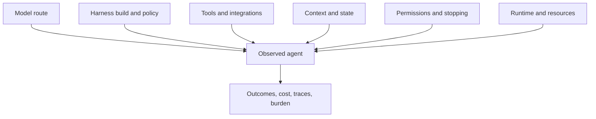
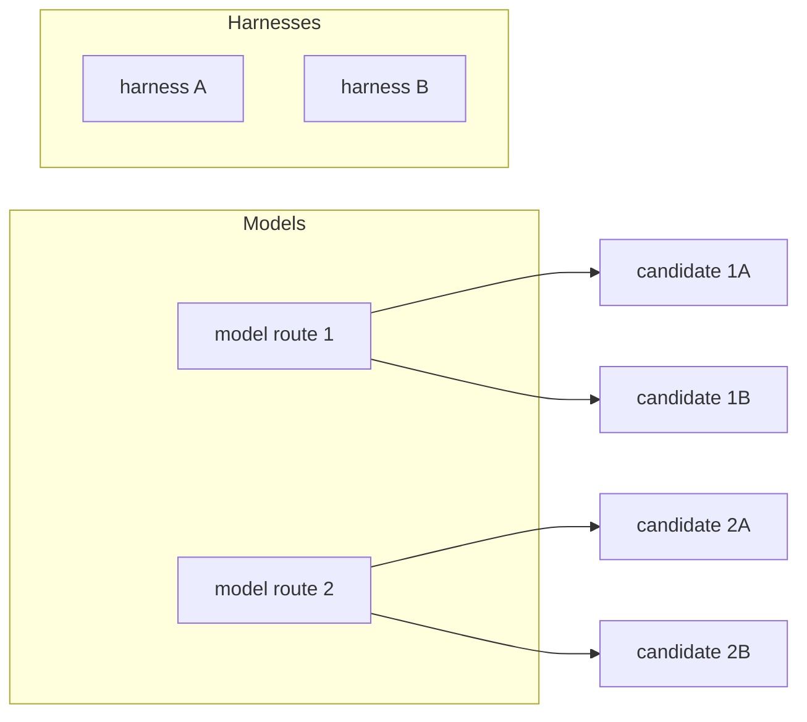
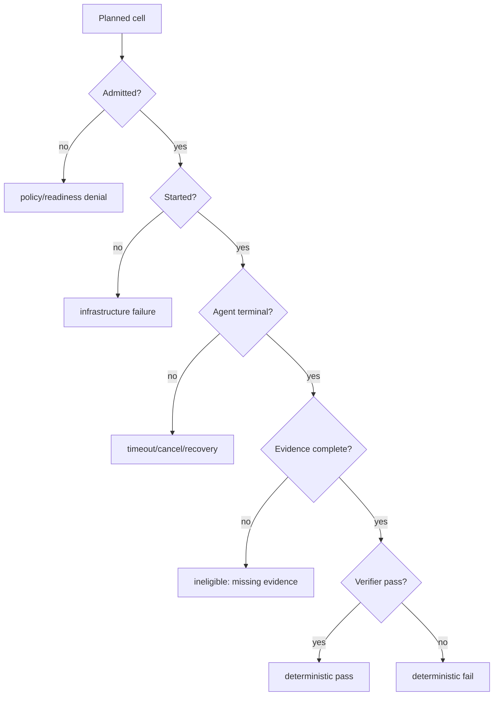

# Fugue 2A — The Model Is Not the Agent: Preregistering a Harness Study

> **Fugue: Evals for the Agentic Software Factory · Part 2A**  
> A standalone preregistration for agent researchers and platform engineers.
> **Status:** draft preregistration; no accepted preview and no result. **Reading time:** about 16
> minutes.

This article defines the candidate and study design locally. It does not rely
on the Fugue primitives essay, and every diagram or command below is part of
this preregistration rather than evidence that one harness wins.

The misconception is that a model name identifies the capability being
evaluated.

Our concrete failure was a chart labeled by model even though each row had
been produced through a different agent program, tool adapter, state policy,
stopping rule, and runtime image. We were about to explain differences as
model behavior that the design could not isolate.

Our falsifiable thesis is:

> Real capability belongs to a locked model–harness–environment candidate,
> not to a model name alone.

If the same model, task, and runtime yield equivalent outcome, cost, and
failure distributions across native harnesses, our thesis has little
practical consequence for that setting. If differences appear but vanish when
protocol and resources are controlled, the earlier “harness effect” was
infrastructure. This article freezes how we will tell those cases apart before
we inspect the final cohort.

**Status:** draft preregistration. The design below remains mutable and is not
a result. It becomes an immutable preregistration only after an accepted Fugue
preview digest, article digest, acceptance time, and exact-final-head identity
exist.

## Scope and terms

A **model** supplies inference. A **harness** supplies the Agent program around
it: tools, context assembly, state, stopping, recovery, and artifact handling.
An **environment** supplies the runtime, repository, resources, and policy. A
**candidate** is the locked combination whose behavior is actually observed.

The study asks whether native harnesses differ under declared controls. It
does not rank model families, claim a universal “best Agent,” or treat an
infrastructure failure as evidence about task capability.

## What a harness does

A coding harness is not just a chat template around a model. It decides, or
helps decide:

- how the system and task instructions are assembled;
- which repository context enters the first turn;
- how tool schemas are represented;
- when files are read in full or projected;
- how shell, patch, search, and MCP operations are exposed;
- how tool errors return to the model;
- what state persists between turns;
- how context is compacted;
- whether work can be retried or resumed;
- what constitutes completion;
- which artifacts and traces survive.

Two harnesses can route to the same model checkpoint and create different
agents. Conversely, two model routes can be compared through one harness only
if that harness preserves each route’s relevant protocol rather than forcing
one into an artificial common denominator.



The observed agent is the composition. Calling it by the model’s name erases
the rest of the treatment.

Recent harness research makes this an empirical question rather than an
architectural preference. Harness-Bench proposes measuring harness behavior
across controlled environments and tasks
([Harness-Bench](https://arxiv.org/abs/2605.27922)). The Scaffold Effect
studies how scaffold choices can alter apparent language-model performance
([The Scaffold Effect](https://arxiv.org/abs/2607.22585)). We use those papers
to motivate the design, not to predict Fugue’s result.
[@harness-bench] [@scaffold-effect] Weng locates the harness inside a broader
propose–evaluate–accept lineage; Dudycz’s OODA framing is a useful warning not
to turn an observation into a causal story before orientation and control.
[@weng-harness] [@dudycz-ooda]

## The candidate lattice

There are at least three legitimate comparisons:

1. **Fixed model, varied harness.** This is the closest design for a harness
   treatment when both harnesses support the route and tools natively.
2. **Fixed harness, varied model.** This asks a model question under one
   harness contract.
3. **Varied model–harness pairs.** This compares deployable systems when
   compatibility prevents a clean isolation.



A complete lattice is often impossible. One harness may lack a native
provider route or expose a materially different tool protocol. Rather than
simulate compatibility and call the cells equivalent, we mark unavailable
coordinates and narrow the question. The reporting unit becomes the complete
model–harness pair.

This is why Fugue preserves native harness behavior. A lowest-common-
denominator adapter can make APIs look symmetric by removing the very
behaviors we need to evaluate: planning, compaction, tool semantics, error
recovery, and finish detection.

## The bounded question

The preregistered question is:

> On the locked hard repository tasks, under an identical provider route,
> task image, prompt, tool policy, resources, budget, and attempt policy, do
> native harnesses differ in deterministic repair, efficiency, failure
> fingerprint, or oversight burden?

The primary estimand is the paired difference in deterministic task success
between two compatible native harness candidates over the exact accepted
holdout coordinates, conditional on one locked model route and runtime
envelope. Secondary estimands are paired differences in observed cost,
latency, no-action turns, tool behavior, and reviewer intervention. The
reporting unit is the complete model–harness–environment candidate; the
analysis unit is the aligned logical task and attempt coordinate. Neither unit
licenses a model-only effect.

The current Fugue repository contains `swe-frontier-harness`, a no-added-
context experiment over four stable harness identities: `hermes-agent`,
`openclaw`, `claude-code`, and `codex`. Its locked discovery partition contains
eight hard SWE-style tasks. The checked-in default model is a W&B Inference
route, and the experiment permits an explicitly supplied single route for an
immutable run.

The final preregistration will not pool all model routes. Each accepted preview
holds one route constant. Where a route is not natively supported by all four
harnesses, the preview contains only compatible harnesses, and the claim names
that subset.

At publication time, the appendix must print, not abbreviate:

- source commit and tree;
- task manifest and task-image digests;
- provider route and model revision where available;
- harness package/source/runtime digests;
- prompt and tool-manifest digests;
- Harbor and container runtime versions;
- CPU, memory, storage, timeout, network, and concurrency;
- attempt count, scheduling seed, and budget;
- planned coordinate count and preview digest.

Until those fields come from the generated preview, the article remains a
preregistration draft.

## Fixed, varied, and measured

The most useful table in this Study is not the leaderboard. It is the control
table:

| Dimension                | Role                   | Qualification rule                                     |
| ------------------------ | ---------------------- | ------------------------------------------------------ |
| Repository tasks         | Fixed                  | Exact manifest and per-task image digests              |
| Task instructions        | Fixed                  | Same public prompt bytes                               |
| Private grading          | Fixed and hidden       | Same host-only evaluation lock                         |
| Model route              | Fixed within one Study | Exact provider/model identity                          |
| Harness                  | Varied treatment       | Native locked build; no compatibility shim             |
| Tools                    | Fixed in intent        | Equivalent required capabilities; manifest drift fails |
| Context treatment        | Fixed                  | No added repository-memory system                      |
| Resources                | Fixed                  | Enforced CPU, memory, storage, timeout, network        |
| Attempts                 | Fixed                  | Same declared count; no replacement retries            |
| Scheduling               | Fixed/randomized       | Locked seed and balanced ordering                      |
| Deterministic repair     | Primary outcome        | Official offline verifier                              |
| Usage, latency, behavior | Secondary outcomes     | Observed, never imputed                                |
| Oversight burden         | Secondary judgment     | Blinded review protocol                                |
| Infrastructure           | Eligibility            | Reported separately from task outcome                  |

“Tools fixed in intent” needs care. A native harness may represent shell or
patch operations differently. We require the same task-relevant capabilities,
not identical internal call names. Tool-manifest differences remain mechanism
evidence. If one harness cannot perform a required action, that is either a
real product limitation or an incompatible protocol; the preregistration must
say which before analysis.

## Assignment, ordering, and attempts

Agent evaluations are sensitive to work ordering even when tasks are
nominally isolated. Provider load changes. Container caches warm. A repository
image pulled for the first harness may make the second start faster. A
concurrency spike may affect one route. A long first task can delay only one
arm.

The discovery grid therefore uses a locked scheduling seed and balances
harness ordering across tasks. Runtime caches are either prepared before the
cohort or isolated per cell; we do not let a baseline attempt prepare the
candidate’s behavioral assets. Wall-clock start and terminal timestamps remain
evidence so later analysis can see temporal clustering.

The accepted preview must specify the assignment seed, balanced order, and
attempt count. Repeated attempts estimate within-coordinate behavioral
variation; they are not retries selected after failure. One attempt is
adequate for deterministic plumbing qualification and inadequate for a
distributional harness claim. Exclusions are limited to predeclared
infrastructure states, preserve the original row, and cannot be chosen from
task quality.

Anthropic’s infrastructure study is the direct counterexample to treating
these details as housekeeping: changing the execution substrate can move the
measured outcome while the nominal Agent is unchanged. [@anthropic-noise]

Attempts are independent coordinates, not buttons labeled “try again.” The
holdout attempt policy is fixed before execution. If an Agent returns a
deterministic failure, we preserve it. If the environment fails, we preserve
that classification. A replacement can occur only under a predeclared
infrastructure-recovery rule and receives a new attempt identity; the original
row remains visible.

We avoid adapting temperature or token budgets to individual harnesses after
discovery. Native harnesses may have different internal stopping behavior, but
their external resource envelope stays fixed. If one harness requires a
different envelope to operate at all, that is a different candidate Study,
not a quiet fairness correction.

The unit of pairing is:

```text
dataset + workload + logical task + provider route + attempt index
```

Within that coordinate, we compare compatible harnesses. We do not pair by
task label, row position, Evaluation display name, or completion order. A
missing member leaves an incomplete pair.

## Preparation can contaminate the treatment

Harness studies often focus on the command that invokes the Agent and ignore
how its image was assembled. That is dangerous. A build can install a newer
CLI, inherit a global home directory, fetch a tool at startup, or include
repository instructions unavailable to another arm.

Fugue’s preparation boundary resolves and records:

- harness package or source identity and complete dependency lock;
- patched runtime files and their digests;
- native provider-route configuration;
- tool and MCP registration;
- task image and offline verifier;
- base prompt and repository instruction inputs;
- architecture and container base image;
- network and secret policy.

Each cell receives a new isolated harness home. It does not inherit the
operator’s global Skills, MCP configuration, conversation history, or
credentials. The task checkout is read-only until the trial’s controlled
working copy is created. Active attempts cannot install packages, pull images,
download models, start managed services, or access the container engine.

This is not merely hardening. An inherited global Skill can improve one
harness and make the observed difference look intrinsic. A downloaded
dependency can change between attempts. A host MCP config can give one Agent
an undeclared tool. Isolation protects the experimental question.

Qualification includes a registration receipt and a runtime probe for every
required capability. Assignment and use remain separate: a tool can be
correctly registered and never invoked.

## Tasks and the official outcome

The primary outcome is official task resolution. For repository repairs, that
means the pinned task’s offline verifier, not an LLM’s impression of the diff.
Each task image must prove two facts before admission:

1. the base checkout fails the expected verifier;
2. the pinned gold patch passes it.

The verifier cannot download dependencies or grading metadata during the
trial. A network-dependent grader changes the environment and can fail for
reasons unrelated to the patch. Qualification prepares and pins those assets
in advance.

The hard discovery tasks require production and test changes, repository
diversity, multiple touched files, and a nontrivial localization boundary.
These eligibility rules reduce trivial wins. They do not make eight tasks a
population estimate for all coding work.

We will report raw paired outcomes by task and harness:

```text
solved / eligible attempts
```

For replicated holdout cohorts, we can add paired intervals under the
predeclared analysis. A one-attempt discovery grid remains raw numerators and
denominators. No confidence interval will rescue an under-replicated design.

## Secondary outcomes

Task success is primary. The harness question also concerns how success or
failure happens.

We predeclare:

- observed input and output tokens;
- observed provider cost, with unobserved cost left missing;
- wall-clock and agent-active latency;
- tool selection and call counts;
- no-action turns;
- structured tool, model, and environment errors;
- truncation, timeout, and cancellation;
- changed files and patch size;
- reviewer-identified blocking issues;
- time and actions needed for an unfamiliar maintainer to reach a decision.

Tokens per solved task is useful only beside the numerator. A harness with
lower tokens because it solves nothing is not efficient. Cost per solved task
is undefined when cost or solved counts are missing. We will show the raw
components.

Oversight burden is a blinded authored judgment, not part of the deterministic
score. Reviewers receive the patch and allowed evidence without the harness
label. The rubric asks whether the patch is bounded, uses repository
conventions, covers the relevant boundary, and can be understood well enough
to merge or reject. Disagreements remain visible and are adjudicated.

## Analysis without a harness leaderboard

The analysis begins with the aligned task table, not an ordering:

| Task            | Harness         | Eligible attempts |    Solved |    Observed cost | Blocking review issue | Failure origin   |
| --------------- | --------------- | ----------------: | --------: | ---------------: | --------------------- | ---------------- |
| locked identity | locked identity |         raw count | raw count | value or missing | blinded label         | structured class |

We then compute paired contrasts for outcomes declared before the run.
Discovery reports raw differences. A sufficiently replicated holdout can use
a paired bootstrap over tasks under its predeclared seed and interval
convention. We do not treat Agent attempts on one task as independent tasks,
and we do not claim a population interval from harness calls alone.

Efficiency is conditional:

```text
observed tokens / solved eligible attempts
observed cost / solved eligible attempts
```

We also show total observed usage and missingness. A ratio with a zero
denominator is unavailable. A harness that uses unreported tokens cannot be
called cheaper.

Maintainer burden stays dimensional. We report blocking architecture,
test-boundary, unrelated-change, and comprehensibility findings instead of a
single style score. If reviewers can infer harness identity from characteristic
artifacts, the blinding limitation is disclosed.

The decision table has no “best overall” column. It can recommend a harness
for the locked route and task stratum, recommend no change, or request a new
Study around an observed interaction. Product deployment may still choose
based on reliability or cost; that decision must cite which measured
dimension it prioritizes.

## Threats we will check before interpretation

Before accepting a harness contrast, we ask:

- Did all harnesses receive byte-identical public task instructions?
- Did task images and verifiers match?
- Did any harness inherit undeclared configuration?
- Did provider errors cluster by wall-clock or harness order?
- Were required tools registered, and did their manifests drift?
- Did trace instrumentation add a wrapper behavior to only one arm?
- Did one harness reach a token, time, or cost cap more often?
- Were infrastructure failures or missing usage asymmetric?
- Did reviewers remain blinded enough for the intended judgment?
- Does the result depend on one task or one attempt?

A “yes” does not always invalidate the Study. It determines language. If one
harness hits the common timeout because its native loop is longer, that is a
product-relevant difference under the locked envelope. If it hits the timeout
because its image spent ten minutes downloading an undeclared dependency, the
candidate was not prepared as designed.

## Failure fingerprints

An aggregate loss can conceal very different products.

Harness A may fail early because its tool initialization is strict. Harness B
may start every task but loop until timeout. Harness C may produce patches
that pass while omitting evidence needed for review. Harness D may finish
cheaply on straightforward tasks and incur high no-action turns on ambiguous
ones.

We therefore classify failures by origin:



Only the final two nodes belong in task-performance denominators. All nodes
belong in the operational result.

This avoids a perverse comparison in which the harness with more startup
failures looks better because its difficult tasks disappear.

## Reversals and the no-pooling rule

If one harness wins on route X and loses on route Y, the correct result is a
harness-by-route interaction in the observed tasks. A pooled universal harness
ranking is not supported.

The same rule applies across task strata. A harness may be stronger on
diagnosis and weaker on broad implementation, or more reliable on small
repositories than large ones. We will show aligned task rows and strata
before any aggregate.

The preregistration rejects these analyses:

- choosing a “best harness” after pooling incompatible model routes;
- excluding timeouts without reporting them;
- replacing infrastructure failures with zero task scores;
- selecting tasks after seeing harness differences;
- interpreting discovery as untouched holdout;
- claiming the model caused a difference in a harness-varied Study.

An observed reversal does not invalidate the Study. Hiding it does.

## Command and approval sequence

The checked-in experiment supports a side-effect-free preview:

```bash
uv sync --python 3.13 --frozen --extra dev

uv run fugue run swe-frontier-harness \
  --preset canary \
  --model wandb/MODEL_ROUTE \
  --preview

uv run fugue run swe-frontier-harness \
  --preset discovery \
  --model wandb/MODEL_ROUTE \
  --preview
```

These commands illustrate the artifact; `MODEL_ROUTE` must be replaced by the
exact reviewed route before publication. Preparation of task images, harness
runtimes, and dependencies happens before preview through the repository’s
setup boundary. Preview may not download them.

The canary qualifies one task across compatible harnesses. It is
infrastructure and contract evidence, not an efficacy denominator. The
discovery preview expands eight tasks × compatible harnesses × one attempt.
The operator then:

1. records the exact preview digest and identities;
2. approves a hard cell and cost cap in a trusted shell;
3. executes the digest without modifying it;
4. reconciles every planned coordinate and Weave Agent link;
5. freezes discovery results before designing a replicated holdout.

The holdout is a new Study, not a continuation that can inherit arbitrary
retries.

## The preregistration artifact

Before paid execution, we export a human-readable Markdown preview and a
canonical machine record. The two must describe the same digest. The artifact
contains the expanded coordinate table, fixed/varied/measured dimensions,
identity locks, budgets, eligibility policy, and analysis plan.

Reviewers sign off on questions the YAML alone cannot answer:

- Is “harness” plausibly isolated for every included coordinate?
- Are native differences part of the intended product comparison?
- Are tasks hard enough to be informative and still qualified?
- Can the evidence pipeline distinguish startup, Agent, verifier, judge, and
  reconciliation failure?
- Can a reviewer understand patches without treatment labels?
- Is the maximum spend justified by the decision?

The accepted artifact is content-addressed and copied into the durable Study
record. The article records only its digest and a safe rendering. It does not
embed private labels or mutable links.

After acceptance, the following changes require a new preview and Study:

- adding, removing, or editing a task;
- changing a provider route, harness build, prompt, tool, or runtime asset;
- changing limits, attempts, ordering, or recovery policy;
- changing the verifier, rubric, judge, or evidence view;
- changing analysis exclusions or a critical decision rule.

Correcting a spelling mistake in narrative that does not enter any artifact
need not change the Study. The canonicalization rules decide this
mechanically; authors do not decide after seeing the result.

This artifact is the point of preregistration. A timestamped blog post can
state intent, but the digest binds intent to the executable plan. If the
rendering and execution disagree, the machine record wins and the publishing
pipeline has a defect.

The reviewer receipt is evidence too.

## Valid results, including nulls

The Study can support statements such as:

- “On these eight tasks with route R and runtime L, harness A solved 5/8 and
  harness B solved 3/8; the one-attempt design does not estimate a stable
  population difference.”
- “Deterministic outcomes were tied, while harness A used fewer observed
  tokens on solved pairs and produced more structured tool errors.”
- “A and B reversed between routes R1 and R2; no universal harness ordering is
  supported.”
- “The cohort is incomplete because three cells lack reconciled Evaluation
  evidence; no behavioral conclusion is issued.”

A null is valuable. Equivalent task performance can redirect effort toward
cost, reliability, or usability. It can also reveal a saturated taskset that
needs a harder preregistered successor. We do not rewrite the current holdout
to force separation.

## Try this in 15 minutes

Take one model leaderboard row and expand its candidate identity: harness
version, tool manifest, prompt, context policy, stopping rule, task image,
resources, and network policy. Circle every field that is currently unknown.
Then write the narrowest estimand the known fields can support.

If two rows differ in model and harness, rewrite the conclusion as a
model–harness pair comparison. That one edit prevents a large class of invalid
model-only claims.

## When a harness study is unnecessary or insufficient

If the release changes one deterministic adapter contract, test that contract
directly. A cross-harness Study is warranted when the product claim concerns
Agent behavior or portability. It remains insufficient when native protocols
cannot be held compatible, runtime resources drift, or the tasks are too
saturated to expose meaningful behavioral differences.

## What this does not show

This preregistration does not show that harnesses matter. It specifies a Study
that can find a bounded effect, null, or reversal.

Holding a provider route constant does not guarantee identical sampling
behavior if harnesses use APIs differently. Native behavior improves product
validity while complicating causal isolation. Tool-capability equivalence
does not make tool representations identical. Eight discovery tasks cannot
support a universal ranking. The official verifier establishes task
resolution, not mergeability.

The cited harness papers motivate attention to scaffolds. Their results do not
predict these candidates, tasks, or runtime. Historical Fugue smoke runs show
that harness cells can reach terminal evidence; they are not results for this
final-head preregistration.

## Results appendix — intentionally empty

No results are recorded here. A future section named `Update YYYY-MM-DD:
Results` must include:

```text
source commit/tree:
preview digest:
taskset/task-image lock:
model route:
harness/runtime locks:
planned/started/completed/excluded/missing:
deterministic outcomes:
maintainer judgment:
mechanism evidence:
infrastructure:
reversals/nulls:
supported claim:
limitations:
canonical Weave/Study links:
```

Changing this design after its digest is approved creates a new Study and a
new appendix identity.

## The bridge: memory is not context

Harnesses decide how context is constructed, but “more context” is itself an
imprecise treatment. A memory system can build a beautiful index that the
agent never queries. A search can return the right file that the agent never
opens. An opened source can be ignored in the final patch.

In the next installment, **Fugue 2B**, we preregister a 2×2 study that
separates a memory system from an evidence-use policy and follows the
mechanism from assignment to outcome.

## References

Complete source metadata and numbered citations are generated from this
article package’s `sources.json`.
