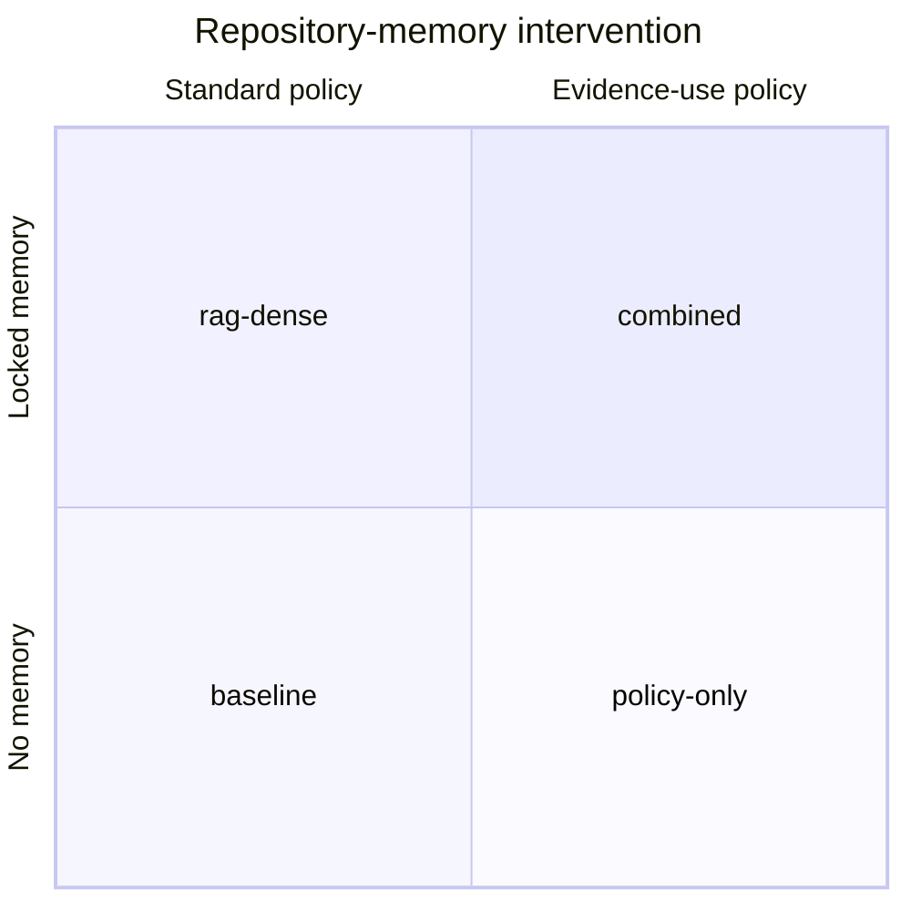
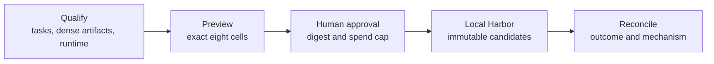

# Fugue 2B — Memory Is Not Context: Preregistering the Repository-Memory Study

> **Fugue: Evals for the Agentic Software Factory · Part 2B**  
> A standalone preregistration for context, RAG, MCP, and developer-tool
> engineers. **Status:** draft preregistration; no accepted preview and
> no result. **Reading time:** about 12 minutes.

The causal vocabulary, the 2×2 intervention, the measurement denominators,
and the privacy boundary all appear here—no previous installment required.
The design stays mutable until an exact eight-cell preview, accepted article
digest, human approval, and immutable source and runtime locks exist.
Historical Fugue memory runs are operational evidence only.

The failure that produced this study: a treatment that looked healthy in its
retrieval table and inert in its Agent traces. The system had indexed the
repository. The query returned a gold-relevant file. The file name appeared
in telemetry. And the agent never opened the relevant content before editing.
We had measured a search system and described an agent improvement.

The claim this preregistration freezes:

> Giving an agent memory does not prove that useful evidence was retrieved,
> opened, used, or responsible for success.

If retrieval assignment reliably implied use, or if mechanism stages added no
explanatory value beyond official task resolution, this claim would not be
worth a study. The 2×2 design below lets the memory system and the
instruction to inspect evidence vary independently, so we can watch where the
chain actually breaks.

## Scope and terms

Six words carry precise meanings here. **Stored** means evidence exists in
the memory corpus. **Assigned** means the candidate was configured to receive
the treatment. **Returned** means a query produced a source. **Opened** means
the Agent inspected its content. **Used** means an auditable decision or
output depends on that content under the declared rubric. **Outcome** is the
official task result.

Related events, not synonyms. The study measures their funnel; it does not
infer causality from a path appearing in a prompt.

The distinctions have good lineage. Lilian Weng’s agent taxonomy separates
short-term context, long-term memory, and retrieval-mediated access, which
stops us from labeling every piece of supplied text “memory”
[@weng-agent]—and her harness survey makes the delivery mechanism part of the
observed Agent rather than an invisible preprocessing step [@weng-harness].
Hamel’s eval skills supply the operational test we apply throughout: open the
actual retrieval and file-read sequence before automating any proxy for
“used.” [@hamel-evals-skills]

## Seven events hidden inside “the agent had memory”

“Memory” can mean stored documents, an index, a retrieval service, a prompt
injection, a tool, or durable state from earlier work. We separate seven
events:

1. **Stored:** the source exists in the locked memory corpus.
2. **Retrieved:** a query returns a source reference.
3. **Exposed:** the harness makes that reference or content available to the
   Agent.
4. **Invoked:** the Agent chooses the memory tool or follows the injected
   context.
5. **Opened:** the Agent reads enough source content to inspect the relevant
   evidence.
6. **Used:** the answer or patch depends on supported facts from that source.
7. **Outcome:** the official task verifier or authored evaluation passes.


Each arrow can fail. A repository can be indexed but queried poorly. A source
can rank first and be dropped during context construction. A path can enter a
prompt carrying no useful content. The Agent can call the tool and ignore the
response, cite a file while making a change supported only by nearby code, or
use the right evidence and still fail the implementation.

The funnel is mechanism evidence, not a replacement outcome. The primary
question stays whether the repository task was resolved.

## Names and paths are weak evidence

Path overlap is tempting because it is easy to score: if private grading says
the fix touches `package/cache.py` and search returns that path, you can
compute recall@10.

Keep that metric for retrieval qualification. As evidence of agent use it is
weak three ways: the path may be obvious from the issue text; a broad query
may return dozens of files, the relevant one included by chance; and the
final patch may touch the file without relying on the retrieved content.

So we keep path-based localization as a secondary retrieval measure and
require source-use evidence from allowed traces. “Opened” requires a content
read tied to the same source identity after it was returned. “Used” requires
a predeclared evidence relation—the answer states a source-supported fact, or
the patch changes the discovered contract consistently with its tests and
caller evidence.

We do not expose private gold paths to the Agent to make this join easier.
They live in a host-only evaluation lock. Publication contains derived
localization metrics and the lock digest, never the raw labels.

## The 2×2 intervention

The core design crosses two binary treatments:

- **M:** a locked repository-memory system is available;
- **P:** an evidence-use policy tells the Agent to search, open, and verify
  relevant repository evidence before editing.

| Variant ID   | Memory system | Evidence-use policy | Question                                                                      |
| ------------ | ------------- | ------------------- | ----------------------------------------------------------------------------- |
| `baseline`   | No            | Standard            | What does the native Agent do?                                                |
| `rag-dense`  | Yes           | Standard            | Does availability alone change behavior or outcome?                           |
| `policy-only` | No           | Yes                 | Does an inspection policy help with ordinary repository tools?                |
| `combined`   | Yes           | Yes                 | Does policy create uptake of the memory system, and does that affect outcome? |



The design blocks a common attribution mistake. If `combined` beats
`baseline`, the memory system did not necessarily cause the difference:
`policy-only` may perform just as well, showing explicit source
inspection—not the index—was the active ingredient. `rag-dense` may improve
localization without changing completion, showing availability is not
uptake. `combined` may just cost more.

The interaction matters too. The policy could help only when memory is
available, or memory could distract a policy-guided Agent with irrelevant
retrievals.

## The factorial question

The 2×2 is not four unrelated demos. It estimates three bounded contrasts:
memory availability (`rag-dense` − `baseline` under standard policy,
`combined` − `policy-only` under the evidence-use policy), the evidence-use
policy (`policy-only` − `baseline` without memory, `combined` − `rag-dense`
with it), and their interaction (does the policy contrast change when memory
is available?).

For deterministic binary task resolution, we report paired task differences
within harness rather than fitting a grand model to a tiny cohort. For
mechanism counts, we show raw distributions and aligned deltas. If a later
cohort is large enough for a model-based interaction estimate, that analysis
must be declared in the accepted preview—it does not get added because one
plot looks interesting.

An illustrative reading—not a Fugue result—is that equal `baseline` and
`rag-dense` outcomes paired with equal, higher `policy-only` and `combined`
outcomes would support a policy observation on those tasks, not a memory
effect. A gain only in `combined` would suggest an interaction worth
replicating. With only two tasks, either pattern stays fragile and must be
shown as aligned rows.

There is deliberately no universal “memory score.” Official resolution,
mechanism uptake, latency, and cost can disagree, and a treatment that
improves source use without improving completion may be valuable for
auditability yet unjustified as a default. That is a product decision made
after the study, not a weight hidden in the analysis.

## What is locked

The final study freezes: the public task briefs and ordering; the host-only
private evaluation lock; the base repositories and task images; the model
route; each native harness build; prompt bytes for both policies; the
memory-system source, dependencies, index, model, and vector dimensions;
delivery mode and exact tool manifest; CPU, memory, storage, networking,
timeout, and concurrency; attempt count and scheduling seed; deterministic
verifier and scorer versions; and the evidence event schema and analysis
code.

Behavior-fingerprint changes include the memory system, policy, prompt, tool
manifest, model, harness, task, and prepared runtime assets. Execution-policy
changes cover only the environment that schedules an otherwise identical
candidate. A vector candidate cannot fall back to lexical search and keep the
same identity.

The dedicated lane is campaign `real-memory-study-v1`, experiment
`real-memory-study`, preset `canary`, and W&B/Weave project
`wandb/fugue-memory-experiments-v1`. It freezes Claude Code,
`anthropic/claude-sonnet-5`, two tasks, one attempt, and local Docker
execution through Harbor. The four exact candidate IDs are `baseline`,
`rag-dense`, `policy-only`, and `combined`; the last two use the registered
inspect-and-verify policy where applicable.

Fugue preparation must build and lock the `rag-dense` artifacts for both
memory-bearing candidates before admission. Dense embedding and index
preparation plus an offline semantic probe must succeed. If the artifact is
missing, corrupt, or unqueryable, the Study blocks. There is no BM25
substitution that keeps the `rag-dense` identity.

The principle generalizes: graceful product fallback may be good user
experience, but hidden fallback is invalid experiment identity.

## Qualifying the measurement itself

Before testing memory efficacy, we qualify whether the evidence pipeline can
even observe the mechanism.

Before the eight task cells can be admitted, qualification must demonstrate
that the exact dense runtime and locked index initialize offline, the
semantic probe distinguishes a meaningful dense match, both memory-bearing
candidates resolve the same prepared artifact, the official verifier can run
offline, and Agent conversations can reconcile with their Evaluation
predictions. This qualifies the treatment and evidence path; it is not an
efficacy result.

The planned task cells then preserve retrieval calls, returned source
identities, subsequent content reads, tool and context events, deterministic
outcomes, and missing usage without imputation. Assignment to `rag-dense` is
not invocation, and a returned path is not opened or used evidence.

The measurement is ready only when deterministic event joins survive negative
cases:

- a returned source that is never opened;
- an ordinary repository read with no memory invocation;
- a vector request that fails rather than falls back;
- a tool error with no result payload;
- multiple opens of the same source;
- an answer that mentions a path from the public task rather than retrieval;
- missing usage that remains missing.

Without these controls, a beautiful assigned-to-outcome funnel can be a
logging artifact.

## The dedicated planned canary

This article now maps to one source-isolated eight-cell canary, not the
broader historical `repo-memory-impact` program and not a
discovery–selection–holdout sequence. The two immutable SWE-bench Verified
tasks are:

- `sympy__sympy-18199`
- `sphinx-doc__sphinx-9461`

Each task runs once through all four candidate IDs with Claude Code and
Sonnet 5 fixed: two tasks × four arms × one attempt = eight planned local
Harbor cells. No result exists. A replication, harder cohort, cross-harness
comparison, or treatment-selection stage would be a new, separately approved
Study.



The canary does not choose a winner for a later holdout. It determines
whether the four exact arms can produce interpretable, aligned task and
mechanism evidence under the declared locks. Any follow-up decision must cite
the two task rows, their limitations, and a new preregistration.

## Primary and secondary outcomes

The primary outcome is official task resolution under the pinned offline
verifier, aligned within task across the four arms while model, Claude Code,
and the one-attempt policy stay fixed.

Secondary outcomes: localization recall@10 and mean reciprocal rank;
assigned, returned, opened, and used source counts; required and spontaneous
tool invocation; broad versus projected reads; no-action turns; recoverable
errors by source; latency, observed tokens, and observed cost; patch size and
files changed; and evidence-honesty and maintainer-usefulness judgments.

Every arm gets its funnel shown with explicit denominators:

```text
assigned → returned → opened → used → official outcome
```

If 12 sources are returned across four attempts, three are opened, one is
used, and zero tasks pass, we do not report “75% uptake” by picking the
convenient middle denominator.

The offline semantic probe lives in a separate qualification table. It can
establish that the locked dense artifact is queryable, but it is not an Agent
conversation and never becomes a task outcome.

## Context budget and displacement

Memory can hurt without returning a single wrong source. It can consume the
context budget that would otherwise hold task instructions, code, tool
output, or the Agent’s own plan. It can also raise early confidence and
reduce exploration.

So we record bytes or tokens injected before the first turn, retrieved
content exposed per turn, truncation and compaction events, repository reads
displaced or added, time between retrieval and first edit, and whether
required task or error content survived compaction.

These measures can be harness-sensitive, which is why the planned lane fixes
Claude Code and the delivery interface. A cross-harness memory question
belongs in a separate Study rather than an unplanned facet of this canary.

A bounded result could say “on one locked task, the memory-bearing arms
improved localization but increased truncation without improving official
resolution.” A good retrieval component does not make the integrated
treatment good.

## What “used” can honestly mean

Causal source use is hard to infer from traces, so we predeclare three
evidence tiers:

1. **Mechanically linked:** the exact returned source was subsequently opened
   in the same attempt.
2. **Semantically supported:** an allowed scorer finds that a material answer
   or patch decision matches inspected source evidence.
3. **Causally attributed:** the 2×2 contrast supports a difference associated
   with the locked treatment bundle.

Tier one is deterministic but shallow. Tier two is interpretive and requires
calibration. Tier three is a study-level claim that belongs to the whole
locked bundle, never to a single file or tool call. We avoid “this source
caused the patch” unless an intervention actually manipulated source
availability with everything else controlled. Trace order is not causality.

One worked aligned row makes the denominators concrete:

| Coordinate | Assigned | Returned | Opened | Used | Official outcome |
| --- | ---: | ---: | ---: | ---: | ---: |
| `task-07 / harness-H / attempt-2 / arm-D` | 1/1 | 1/1 | 1/1 | 0/1 | pass |

This row supports “the locked memory returned evidence and the Agent opened
it.” It does not support “memory caused the pass”—the declared use rubric
found no material dependence. Funnel denominators are the eligible aligned
coordinates at each stage, not the convenient events in a trace. Long-context
research adds the standing caution: putting relevant information into a
context does not guarantee effective use, especially as position and
competing content change. [@lost-in-middle]

## Failure and fallback semantics

Memory systems add infrastructure—builders, indexes, databases, MCP servers,
embedding models, context injectors, caches—and their failures must not
become Agent failures.

Each attempt records whether the treatment was applicable, whether required
registration succeeded, whether the tool manifest matched, whether vector or
lexical execution actually occurred, whether any fallback was declared and
identity-preserving, whether sources were available to the Agent, and whether
task, trace, usage, and Evaluation evidence reconciled.

The classifications matter. An unavailable optional product may be
`not_applicable`. A required dense runtime that silently uses BM25 is an
identity violation. A timeout is not a zero localization score. Missing usage
is not free execution. A memory service that starts after the Agent turn
cannot claim availability.

Structured errors are themselves mechanism evidence. An agent that receives a
bounded “index unavailable” result can respond honestly; one that receives an
empty success may hallucinate completeness.

## The execution artifact

The dedicated experiment exposes a side-effect-free local preview:

```bash
uv sync --python 3.13 --frozen --extra dev

uv run fugue run real-memory-study \
  --preset canary \
  --preview \
  --json
```

The preview must expand exactly eight cells and show project
`wandb/fugue-memory-experiments-v1`, model
`anthropic/claude-sonnet-5`, Claude Code, the two locked tasks, all four exact
candidate IDs, one attempt, and local Docker/Harbor execution. It is
inspection, not execution authority.

After approval and before campaign admission, preparation pins task
repositories, verifier assets, and images; builds the `rag-dense` runtime and
index; verifies dense artifacts offline; passes the semantic probe; and
materializes the host-only evaluation lock. No trial may download or install
any of it. The Research Agent may request approval, but only a trusted human
operator approves the exact preview digest and spend cap. The accepted plan
then passes campaign admission unchanged.

## Predeclared decision policy

The study does not automatically make a memory system the product default. It
produces evidence for a decision policy declared now.

Eligibility first: all eight planned coordinates must reconcile; both
memory-bearing arms must prove the exact locked dense mode; and there can be
no critical privacy or evidence-honesty regression. Then we consider, in
order:

1. official resolution contrasts by aligned task and arm;
2. the assigned-to-used funnel;
3. observed latency, usage, and cost;
4. structured failure and fallback behavior;
5. maintainer usefulness and uncertainty.

This two-task canary cannot make a memory system the product default. Its
decision is narrower: advance a named arm or interaction to a separately
approved replication, stop and remediate a concrete failure, or issue no
interpretable result. A mechanism-only improvement can justify more study; it
cannot be described as a coding-outcome win.

We mark the Study ineligible if any arm leaks private facts, hides dense
fallback, or creates unsupported completeness claims. We issue no behavioral
decision if required rows, usage, or source-use evidence are missing.

Notice what this policy admits: statistics cannot supply the values. How much
latency is acceptable for better auditability is a product judgment, and the
authority boundary must be recorded rather than hidden in a composite score.

If no arm is distinguishable, we keep the null. A successor Study may target
tasks with stronger repository-discovery demands, but it receives new private
labels, locks, preview, and approval—never this canary’s identity.

The decision record names the owning workstream for each follow-up: memory
runtime maintainers for retrieval defects, harness maintainers for delivery
interactions, task authors for saturated cases, evaluation owners for
ambiguous rubrics. Each owner receives the exact aligned rows and lock
identities, so remediation starts from inspectable evidence instead of a
vague request to “improve the agent.”

## Analysis and useful nulls

The primary aligned analysis fixes Claude Code and Sonnet 5, then reports
each task separately before any two-task summary. This lane cannot estimate a
cross-harness or cross-model interaction.

All of the following are useful publishable outcomes:

- **Better localization, no completion change.** Retrieval works; the
  downstream mechanism or task bottleneck remains.
- **More opening, no source use.** The policy changes behavior without
  improving decisions.
- **Policy benefit, no memory benefit.** Ordinary repository tools plus a
  stronger inspection contract explain the gain.
- **Memory benefit only with policy.** Availability needs an uptake
  intervention; the interaction is the result.
- **Higher cost, equal outcome.** The treatment is not justified for this
  taskset despite richer traces.
- **Task reversal.** The arm pattern differs across the two cases; no
  aggregate memory claim is supported.
- **No interpretable result.** Missing locks, fallback, or evidence
  reconciliation prevent analysis.

We will not respond to a null by editing the canary. A new, harder taskset
gets a new Study identity and preregistration.

## Privacy and leakage

Repository-memory evaluation is unusually exposed to label leakage because
the objects under test are sources.

Raw gold paths, expected patches, hidden test facts, and selection labels
must not enter Agent prompts or environment, context bundles or indexes, MCP
responses, task images the Agent can read, Weave trace inputs or outputs, W&B
Run configuration, Study events, or public snapshots.

The lock digest may appear. Derived localization counts may appear. A safe
deep link may appear only when its object contains no private label. We run
value-based leakage scans against generated jobs, snapshots, traces, logs,
and exports—not just filename searches.

Credential values follow the same rule: names can define a secret contract;
values belong only in the trusted operator and runtime secret boundary.

## Try this in 15 minutes

Open one Agent trace that used retrieval. Mark the exact event for assigned,
returned, exposed, invoked, opened, and used. Write `unobserved` instead of
guessing when a stage has no evidence. Record the official task outcome on a
separate line.

Repeat for five attempts. If your “used” label rests only on a path appearing
somewhere in the trace, rename it “path observed”—then design the
content-read or semantic-support evidence you actually need.

## When a memory study is unnecessary or insufficient

If the repository simply lacks navigable documentation, fix the documentation
before testing a retrieval treatment. A memory study is worth running when
the uncertainty concerns retrieval or evidence use. It is insufficient when
the gold corpus leaks into Agent inputs, lexical fallback is mislabeled as
vector retrieval, or the task can be solved without consulting repository
evidence at all.

## What this does not show

This preregistration does not prove repository memory helps. It does not
prove this locked dense treatment represents RAG, code graphs, generated
maps, or longitudinal memory in general. It does not make trace-based “use”
causal.

Two tasks with one attempt produce canary evidence, not a stable or universal
effect estimate. The official SWE verifier measures task
resolution, not long-term maintainability. The evidence-use policy is a real
treatment bundle; any benefit belongs to its exact wording and harness
integration.

Historical Fugue runs established that memory candidates, Agent links, and
direct retrieval measurements can execute. Some historical exports contain
known publication issues or missing usage. They are preserved as smoke
evidence and excluded from this study.

## Readiness appendix — still unrun

The new eight-cell memory Study has completed deterministic preparation and
no-spend preflight only. No model cells, behavioral result, or memory-lift
claim exists. The cancelled GLM pilot and six historical 0.1.1 memory-related
runs remain visible as historical or partial inventory entries; none is
silently reused as this canary's result.

The dated results appendix, if the Study is later approved and run, must
record:

```text
source commit/tree and preview digest:
campaign/experiment/preset and W&B/Weave project:
task/evaluation/runtime/model/harness locks:
all four arm fingerprints:
planned/started/completed/excluded/missing by arm:
official aligned outcomes by task and arm:
assigned/returned/opened/used funnel:
localization, error, latency, usage, and cost:
fallback and dense-conformance evidence:
privacy scan receipt:
reversals, nulls, and limitations:
canonical Weave/Study links:
supported claim:
```

If exact dense execution or private-label isolation cannot be proven, the
study is ineligible.

## Next: an MCP release is an agent change

Memory made one lesson unavoidable: changing the information and actions
available to an Agent changes the candidate even when the model is untouched.
An MCP server is the general version of the same intervention—descriptions,
projections, pagination, and errors all change what the Agent notices and
does.

In **Fugue 3**, we apply the same study primitives to a source-isolated W&B
MCP `main` versus exact 0.4 comparison using genuine hosted evidence and
local Harbor execution. V10 completed with a behavioral regression and a
`HOLD`; that MCP result does not imply anything about the unrun memory lane.

## References

Complete source metadata and numbered citations are generated from this
article package’s `sources.json`.
