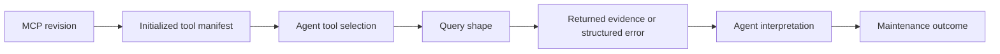
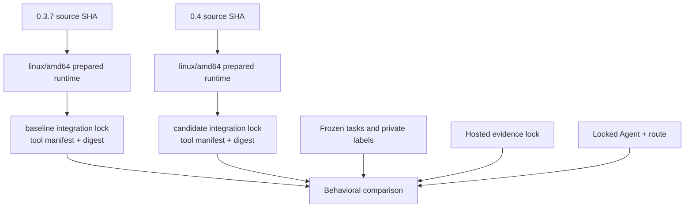
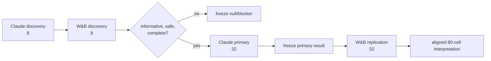
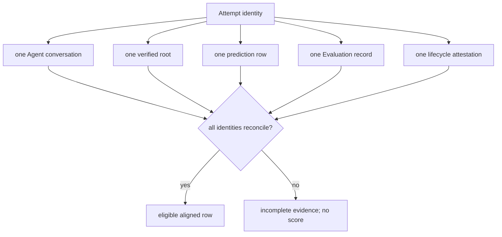

# Fugue 3 — API Compatibility Is Not Agent Compatibility: Qualifying an MCP Release

> **Fugue: Evals for the Agentic Software Factory · Part 3**  
> A standalone preregistration for MCP maintainers and agent-integration
> teams. **Status:** draft preregistration and blocked; no accepted preview and no result. **Reading time:**
> about 16 minutes.

This article defines the protocol, candidates, evidence objects, staged study,
and release gate in place. It does not ask readers to know Fugue, W&B MCP, or
the previous essays before evaluating the design.

The misconception is that a protocol-compatible MCP release is safe for
agents when its unit tests and initialization handshake pass.

Our concrete failure was subtler than a broken method. Two MCP revisions could
both initialize and answer a human’s query, yet lead an Agent through
different investigations. A changed tool description altered selection. A
projection made the useful field easier to see. A structured partial-evidence
error discouraged an unsupported completeness claim. No API call had “broken.”
The behavioral product had changed.

Our falsifiable thesis is:

> An MCP server changes what an Agent can perceive and do; its releases need
> behavioral qualification, not only protocol and unit tests.

If the exact W&B MCP 0.3.7 and 0.4 revisions yield no meaningful differences
in task outcomes, maintainer judgment, or mechanism on the locked study, we
will report that null. If the effect reverses between Claude Code and the W&B
Inference Agent, we will report the reversal. The Study is not allowed to
credit a specific 0.4 feature because the treatment is the whole locked
release.

**Status:** draft preregistration and blocked. Genuine hosted seed evidence and
draft 80-cell specifications exist. The evidence lock and Study preview have
not both been accepted, so the design is not frozen. The result does not
exist. Human judge calibration, published runtime locks, W&B Serverless
access, accepted digests, and final-head execution are still required.

## Scope and terms

The **Model Context Protocol (MCP)** exposes tools and resources to an Agent.
**Protocol compatibility** means the server can initialize and answer valid
requests. **Agent compatibility** asks whether changed descriptions, schemas,
projections, pagination, and errors preserve safe downstream behavior. A
**release candidate** here is one exact server revision plus its locked
target-platform runtime.

The comparison treats each MCP revision as a whole release. It cannot credit
an outcome to one feature inside 0.4, and it cannot generalize beyond the
locked tasks, evidence snapshot, harnesses, and runtimes.

The official MCP lifecycle orders initialization, capability negotiation, and
normal operation; passing that contract is the protocol gate, not the
behavioral conclusion. [@mcp-lifecycle]

## The interface an Agent experiences

MCP provides a protocol for discovering and invoking tools. Protocol
conformance is necessary: initialization must succeed, schemas must be valid,
and calls must return legal responses. An Agent experiences more than the
wire contract.

It experiences:

- the names and descriptions that compete for tool selection;
- parameter schemas that make some queries obvious and others awkward;
- default limits and pagination;
- projected fields versus broad payloads;
- error wording and structure;
- whether missing data looks empty, partial, or failed;
- latency and truncation;
- the relationship between one call and the evidence needed next.

An endpoint can remain callable while a description steers the Agent away
from it. A broad result can be semantically complete and practically
unreadable in the context window. An empty list can mean “there are no
records,” “the query timed out,” or “the caller lacks scope.” Humans can
notice these distinctions through deliberate inspection. An Agent may build a
release recommendation from whichever shape it receives.



The release affects every arrow. A unit test usually covers the first and part
of the fourth.

## The bounded release question

The exact question is:

> Does W&B MCP revision
> `a2bae7271323ac43262ffb73454b0aff01ddc808` (the 0.4 candidate)
> improve how locked Agents investigate bounded W&B and Weave maintenance
> evidence compared with revision
> `80252b3aa23ae3c1fdde089ce2b7dfb106dafb38` (the 0.3.7 baseline)?

The revision SHAs are part of the candidate identity. “0.4” and “0.3.7” are
labels for readers. Fugue imports each ordinary MCP declaration, prepares its
target-platform package code outside Agent execution, initializes it, captures
the exact tool manifest, and locks that result. Agent cells do not clone the
MCP repository or install its dependencies.

Both exact sources are publicly inspectable at the baseline and candidate
commits. [@mcp-baseline] [@mcp-candidate] The draft Fugue preparation and
qualification machinery is reviewable at the public head of its integration
PR; that URL is intentionally not described as merged `main`.
[@fugue-mcp-draft]

The comparison holds task, evidence snapshot, model route within each stage,
harness, prompt, evaluator, attempts, and runtime policy fixed. The declared
difference is the MCP integration lock.



Target-platform initialization matters. Preparing on an Apple Silicon laptop
and running on `linux/amd64` can conceal native dependencies or a different
tool surface. The probe belongs to the platform that will execute the Study.

## Genuine evidence, deliberately seeded

The dedicated non-sensitive project is:

```text
wandb/fugue-mcp-release-qualification-v1
```

The checked-in evidence lock records:

- six genuine W&B Runs with nontrivial configuration, three-step histories,
  summaries, and versioned evidence artifacts;
- 24 standardized Weave Agent conversations;
- 48 tool spans;
- one versioned eight-row Weave Dataset;
- two versioned Weave Evaluations with eight aligned rows each;
- 16 Evaluation prediction rows;
- an observed latency anomaly;
- a deliberately missing-cost case;
- a deliberately incomplete-evaluation case.

These objects were created with the real SDKs and can be opened through their
immutable references. They are deterministic seed evidence for the Agent to
investigate. They are **not** comparison outcomes and they are not customer
data.

W&B Runs hold configuration, metrics, and artifacts; Weave Calls form traces;
Datasets version evaluation examples; and Evaluations link model outputs to
scorers. Those are distinct hosted object contracts, not four names for one
fixture. [@wandb-runs] [@weave-tracing] [@weave-datasets]
[@weave-evaluations]

The distinction matters. A realistic evaluation fixture can be a genuine Run
without being a production accident. We seed known maintenance conditions so
private labels can be reviewed and the evidence graph can be frozen. The
Agent still has to find, inspect, reconcile, and reason about those objects
through the MCP candidate.

Preparation is idempotent:

```bash
uv sync --python 3.13 --frozen --extra dev --extra research-worker

uv run python \
  examples/comparisons/wandb-mcp-maintenance/prepare_hosted_project.py \
  --project wandb/fugue-mcp-release-qualification-v1 \
  --env-file /ABSOLUTE/PATH/TO/OPERATOR.env \
  --output examples/comparisons/wandb-mcp-maintenance/evidence.lock.json
```

An existing snapshot must validate its counts, versions, seed identity, and
content. Drift is an error. We do not edit expected facts until changed data
looks correct.

## Tasks that need investigation

The tasks are not “count the fixtures.” They exercise maintenance questions
an MCP release should make easier to answer honestly:

- determine project and Evaluation coverage without claiming unsupported
  completeness;
- compare aligned Evaluation rows and identify a regression;
- inspect Run history for a latency or cost anomaly;
- prefer narrow projected reads when they answer the question;
- respond structurally to timeout, SDK, and partial-evidence failures;
- prioritize one bounded release or maintenance action;
- refuse a conclusion when a required object cannot be inspected.

Public task briefs contain the question and permitted project reference.
Private labels contain expected facts, allowed evidence relations, and
critical-failure conditions. The labels never enter Agent inputs, runtime
images, MCP responses, traces, W&B configuration, or Study events.

We deliberately include incomplete evidence. A useful maintenance agent must
sometimes say “I cannot establish that.” A candidate that makes broad claims
easy can improve superficial fluency and regress evidence honesty.

## One task, end to end

Consider a task that asks whether an Evaluation regression is complete enough
to block a release.

The public brief identifies the hosted project and the bounded Evaluation
comparison. It does not list the expected regressed rows or say that one
record is deliberately incomplete. The private label records which Dataset
and Evaluation versions must be reconciled, the supported anomaly, and the
critical rule against claiming full coverage without opening all required
objects.

The baseline and candidate receive byte-identical briefs. A valid
investigation might:

1. initialize the locked MCP tool manifest;
2. locate the exact Evaluation versions;
3. request projected summary and row data;
4. align rows by immutable example identity;
5. open the discordant prediction and its Agent trace;
6. notice the incomplete record;
7. recommend a bounded maintenance action with an explicit limitation.

The deterministic scorer checks answer presence, exact supported values, and
required evidence relations. It does not reward the phrase “block the
release.” The blind judge evaluates whether the reasoning is useful and
appropriately uncertain. Mechanism evidence records which tools and
projections were used, whether broad queries were attempted, what errors
returned, and which sources were opened. Infrastructure evidence proves that
the cell actually ran with the accepted image and deleted its Sandbox.

Now imagine the candidate reaches the same correct values in half as many
calls but says the Evaluation is complete. The deterministic facts may pass.
The critical judge dimension must fail. The mechanism observation may still
be useful to the MCP maintainer. The release ledger must not average those
three facts into a win.

Or imagine the baseline sees a timeout represented as an empty result while
the candidate receives a structured partial-evidence error and refuses the
conclusion. The candidate can look “less complete” to a naive expected-answer
grader and more correct to the evidence-honesty rubric. This is exactly why
the task and grader stack are reviewed together before the cohort.

This walkthrough also constrains the final claim. Even if the candidate
improves the task, the Study cannot tell us whether descriptions,
projections, pagination, or error shape was causal. Those features moved as
one revision.

## Four outcome layers

The release decision reads four ledgers.

### 1. MCP and infrastructure conformance

Did the server initialize on `linux/amd64` with the locked manifest? Did the
public Agent image start in W&B Serverless? Were only named secrets injected?
Did the attempt terminate, publish an attestation, and delete its Sandbox?
Did zero matching Sandboxes remain?

W&B documents Serverless Sandboxes as isolated environments with their own
filesystem, network, and process space and an explicit create–use–discard
lifecycle
([Serverless Sandboxes](https://docs.wandb.ai/sandboxes)). The service is a
real remote execution boundary, not a replay flag. Its public-preview status
and organization availability remain operational limitations.

### 2. Deterministic task outcome

Did the answer exist? Did it contain the expected values supported by the
locked evidence? Did required objects and aligned rows reconcile? Deterministic
checks do not grade prose style.

### 3. Calibrated maintainer judgment

A blind Anthropic judge scores evidence grounding, maintainer usefulness,
prioritization, and uncertainty calibration. A confident completeness claim
without inspected support is a critical failure.

### 4. Mechanism and evidence integrity

We record initialization, available tools, selected tools, call counts,
projected and broad reads, admissions, truncations, timeouts, structured
errors, sources returned/opened/used, latency, observed tokens and cost, and
Weave trace/Evaluation reconciliation.

An improved deterministic outcome with missing traces is incomplete evidence.
A reduction in broad reads is a mechanism observation, not proof of better
maintenance. The ledgers meet only in the final bounded interpretation.

## The 80-cell sequence

The Study is staged to separate discovery, primary evidence, and replication:

| Stage            | Route and native harness                         | Tasks × revisions × attempts |  Cells |
| ---------------- | ------------------------------------------------ | ---------------------------: | -----: |
| Claude discovery | `anthropic/claude-sonnet-5` + Claude Code        |                    4 × 2 × 1 |      8 |
| W&B discovery    | `wandb/deepseek-ai/DeepSeek-V4-Flash` + OpenClaw |                    4 × 2 × 1 |      8 |
| Claude primary   | `anthropic/claude-sonnet-5` + Claude Code        |                    8 × 2 × 2 |     32 |
| W&B replication  | `wandb/deepseek-ai/DeepSeek-V4-Flash` + OpenClaw |                    8 × 2 × 2 |     32 |
| **Total**        | two locked route–harness candidates              |                              | **80** |



The order prevents replication from changing primary analysis. Discovery can
stop unsafe or non-informative work before the larger cohort. It cannot be
pooled with the primary as extra attempts.

W&B Inference is a direct provider route for the OpenClaw replication cells.
Its current public catalog lists the exact
`deepseek-ai/DeepSeek-V4-Flash` model ID
([available models](https://docs.wandb.ai/inference/models)). Model catalogs
change, so readiness must verify that route at the accepted preview; this
article is not an availability guarantee.

## Judge calibration before paid work

The repository contains 48 balanced authored examples: 24 passing and 24
failing. Authored expected labels are not human calibration.

The release gate requires:

- two distinct human reviewers per example;
- adjudication for every disagreement;
- a blind judge result for each case;
- true-positive rate of at least 0.85;
- true-negative rate of at least 0.85;
- zero false passes on critical unsupported-completeness cases.

```bash
uv run python \
  examples/comparisons/wandb-mcp-maintenance/validate_judge_calibration.py \
  --cases examples/comparisons/wandb-mcp-maintenance/judge-calibration-cases.jsonl \
  --report examples/comparisons/wandb-mcp-maintenance/judge-calibration.json
```

Changing cases, rubric, labels, or judge profile changes the calibration
digest. The Study does not proceed by lowering a threshold after looking at
performance.

## Lock the two MCP candidates

From a trusted operator shell:

```bash
export WANDB_BASE_URL=https://api.wandb.ai

uv run fugue mcp import \
  --config examples/comparisons/wandb-mcp-maintenance/mcp.json \
  --server wandb-0-3-7 \
  --as wandb-mcp-0-3-7

uv run fugue mcp import \
  --config examples/comparisons/wandb-mcp-maintenance/mcp.json \
  --server wandb-0-4 \
  --as wandb-mcp-0-4

uv run fugue mcp inspect wandb-mcp-0-3-7
uv run fugue mcp inspect wandb-mcp-0-4

uv run fugue mcp lock wandb-mcp-0-3-7 \
  --acknowledge-package-code \
  --platform linux/amd64

uv run fugue mcp lock wandb-mcp-0-4 \
  --acknowledge-package-code \
  --platform linux/amd64
```

The explicit acknowledgment is not decorative. Importing package code means
reviewing code that will enter a privileged preparation boundary. Runtime
cells receive the prepared assets read-only and cannot mutate the accepted
candidate.

## Build and qualify the Serverless runtime

W&B Serverless pulls public images. Fugue’s builder creates one digest-pinned
image per harness from a clean reviewed source tree. It embeds locked Fugue,
Agent, MCP, and task-runtime assets; generates CycloneDX SBOMs; rejects
High-or-worse Grype findings; runs offline probes; pushes; and verifies
anonymous pullability.

The article uses placeholders for the public registry and qualification SHA:

```bash
uv run fugue sandbox wandb build-runtime \
  --comparison examples/comparisons/wandb-mcp-maintenance/discovery-serverless.yaml \
  --comparison examples/comparisons/wandb-mcp-maintenance/discovery-wandb-serverless.yaml \
  --comparison examples/comparisons/wandb-mcp-maintenance/primary-serverless.yaml \
  --comparison examples/comparisons/wandb-mcp-maintenance/wandb-replication-serverless.yaml \
  --platform linux/amd64 \
  --image docker.io/REGISTRY_ORG/fugue-mcp-release:QUALIFIED_GIT_SHA \
  --push \
  --output-manifest .fugue/wandb-serverless-runtime.manifest.json \
  --sbom-dir .fugue/wandb-serverless-runtime-reports

uv run fugue sandbox wandb lock-runtime \
  --manifest .fugue/wandb-serverless-runtime.manifest.json \
  --output .fugue/wandb-serverless-runtime.lock.json
```

`lock-runtime` rejects mutable image tags. Publishing public images is a
separate protected release action; building locally does not grant authority
to push.

Only two named W&B team secrets enter the Sandboxes:

| W&B secret                | Sandbox environment variable |
| ------------------------- | ---------------------------- |
| `fugue-wandb-api-key`     | `WANDB_API_KEY`              |
| `fugue-anthropic-api-key` | `ANTHROPIC_API_KEY`          |

W&B’s secret guidance explicitly recommends referencing Secrets Manager
entries by name instead of placing values in code or Sandbox configuration
([Sandbox secrets](https://docs.wandb.ai/sandboxes/secrets)). Fugue rejects
unknown secret-shaped environment values. The comparison, image, lock, logs,
and Study events contain names and digests, never credential values.

The final operational probe creates a disposable Sandbox, verifies image
startup and embedded runtimes, deletes it, and reconciles zero orphans:

```bash
uv run fugue sandbox wandb doctor \
  --lock .fugue/wandb-serverless-runtime.lock.json \
  --env-file /ABSOLUTE/PATH/TO/OPERATOR.env
```

A successful doctor is infrastructure qualification, not a task result.

## Leakage and hostile-result checks

An MCP server sits between an Agent and evidence, so qualification includes
content-boundary tests as well as behavior.

We scan every generated and remote artifact for:

- the actual W&B and Anthropic credential values available to the trusted
  operator;
- private expected facts and gold identifiers;
- local absolute paths and environment-file locations;
- unapproved environment-variable values;
- headers, URLs, or exception text that could contain authorization material.

The scan covers rendered jobs, runtime manifests, image history, SBOMs,
comparison snapshots, Agent inputs, MCP stdout/stderr, Weave traces, W&B Run
configurations, result bundles, lifecycle attestations, and Study events. A
source-code scan alone cannot see a secret serialized by a failing SDK call.

The taskset also contains hostile or ambiguous evidence shapes:

- an empty page with a continuation token;
- a partial result followed by timeout;
- an unavailable object whose name resembles a known fixture;
- missing cost that must not become zero;
- a broad payload that reaches the truncation boundary;
- a structured error that should produce a bounded refusal.

We are not conducting a complete MCP security audit in this Study. These
cases qualify the evidence-integrity behaviors required by the release claim.
A credential leak or private-label exposure is an immediate no-go regardless
of task scores. A truncation or admission denial is reported as mechanism and
may make the aligned row incomplete, depending on required evidence.

The runtime itself is minimized. Candidate package preparation occurs outside
the Agent cell; the active Sandbox cannot clone arbitrary source or install a
new MCP revision. The image contains only reviewed runtime utilities needed
for the two native harnesses and evidence publication. Reducing tools is a
defense and an identity control: undeclared utilities can change Agent
behavior.

## Preview, approve, execute

Local Harbor runs first as the behavioral parity baseline. The four Serverless
stages are then previewed separately:

```bash
uv run fugue compare \
  examples/comparisons/wandb-mcp-maintenance/discovery-serverless.yaml \
  --preview

uv run fugue compare \
  examples/comparisons/wandb-mcp-maintenance/discovery-wandb-serverless.yaml \
  --preview

uv run fugue compare \
  examples/comparisons/wandb-mcp-maintenance/primary-serverless.yaml \
  --preview

uv run fugue compare \
  examples/comparisons/wandb-mcp-maintenance/wandb-replication-serverless.yaml \
  --preview
```

Each preview receives its own approval. For example:

```bash
uv run fugue approve PREVIEW_DIGEST \
  --max-cells 8 \
  --max-usd 20 \
  --approved-by HUMAN_OPERATOR

uv run fugue compare \
  examples/comparisons/wandb-mcp-maintenance/discovery-serverless.yaml \
  --run \
  --approval APPROVAL_ID \
  --env-file /ABSOLUTE/PATH/TO/OPERATOR.env
```

The actual primary and replication caps come from their accepted previews and
reviewed budget; the discovery example does not authorize them. Operator
credentials are loaded only in the trusted shell. The agent-facing control
plane can request approval and start an already-approved digest, but cannot
issue approval.

## Reconciliation and decision rules

A release recommendation requires:

- nonzero planned cells and complete aligned rows;
- no critical regression in evidence honesty, missing-data handling, or
  coverage claims in either primary attempt;
- candidate deterministic passes at least equal to baseline;
- at least one reviewed discordant pair with an actionable maintenance
  observation;
- complete required judge evidence after calibration;
- no harness reversal hidden by pooling;
- complete runtime attestation, trace, Evaluation, usage, and cleanup
  evidence.

Each attempt must reconcile one Agent conversation, one root, one normalized
prediction row, and one Evaluation record. Serverless cells additionally
require a lifecycle attestation whose runtime image matches the lock, a
deletion receipt, and zero remaining matching Sandboxes.



A null or non-discriminating result is valid but not demo-ready. We freeze it
and create a new Study with a harder pre-frozen taskset. We never tune the
current private labels or holdout to manufacture a winner.

The supported claim is whole-release and local:

> Under the named Agents, tasks, evidence, attempts, runtime, and dates, the
> exact candidate supported—or did not support—the bounded maintenance
> recommendation.

The Study cannot say a particular projection or error-shape feature caused the
result without a separate ablation.

The decision is also directional rather than permanent. “Recommend 0.4 under
this lock” authorizes the reviewed release action; it does not exempt the next
commit from qualification. A changed tool description, dependency lock,
runtime image, model route, or evidence snapshot creates another candidate or
execution identity and narrows which prior evidence can be reused.

That boundary belongs in the release note.

## The maintainer memo

Aria’s final memo is an interpretation of the immutable result, not a fifth
scorer. It must include:

1. the bounded release question;
2. improved, regressed, and unchanged aligned cases;
3. three to five direct evidence references;
4. mechanism observations separated from outcome claims;
5. one release or maintenance recommendation;
6. explicit limitations;
7. one proposed follow-up that Aria does not launch.

A good memo might say that the candidate reduced broad reads and handled
partial Evaluations more honestly on two reviewed pairs while deterministic
resolution remained tied. It must not say “0.4 is better” without the locked
scope. It must not propose a follow-up and then quietly execute it.

## Try this in 15 minutes

Open the two exact MCP commit pages and compare one tool description, schema,
projection, pagination path, or structured error. Write the smallest Agent
behavior that change could affect. Then map it to one deterministic check, one
trace observation, and one task-level criterion.

If your proposed release claim names a single 0.4 feature but the candidate is
the whole commit, rewrite the claim to the whole locked release. Feature-level
causality requires a separate ablation.

## When behavioral qualification is unnecessary or insufficient

Protocol conformance, schema validation, and deterministic integration tests
remain the right tools for known MCP contracts. Behavioral qualification is
needed when a release changes what an Agent perceives or how it investigates.
It is still insufficient when the hosted evidence is synthetic, the task
brief reveals private answers, or the two revisions are not locked to exact
target-platform manifests.

## What this does not show

The hosted objects are genuine W&B and Weave objects, but they are seeded,
non-sensitive maintenance evidence. They do not represent every customer
project or production distribution.

The taskset has eight primary tasks. Two attempts improve alignment but do not
create a broad population estimate. The blind judge remains imperfect after
calibration. Claude Code and OpenClaw differ as complete native harnesses, so
a reversal may reflect their interaction with the MCP release.

Serverless isolation and lifecycle attestations establish execution mechanism,
not answer quality. W&B Serverless is a preview service whose organization
availability must be checked at runtime. W&B Inference model availability can
change and must be locked at preview.

Most importantly, no result exists yet. The real evidence lock demonstrates
that the Study can ask useful questions. It does not answer them.

## Results appendix — intentionally empty

A future `Update YYYY-MM-DD: Results` section must contain:

```text
qualified Fugue commit and tree:
four preview digests:
MCP revision/runtime/tool-manifest digests:
task/private-label/evidence/judge digests:
Agent/model/runtime-image identities:
planned/admitted/started/completed/excluded/missing cells by stage:
deterministic results:
blind-judge results and calibration receipt:
mechanism measures:
Serverless attestations and zero-orphan receipts:
Weave trace/Evaluation reconciliation:
aligned discordant pairs:
harness reversal or null:
maintainer recommendation and limitations:
canonical W&B/Weave/Study links:
```

The final tree must be the qualified tree. If merge changes it, qualification
runs again.

## The bridge: a result is not a learning loop

The MCP Study can produce evidence about a release. It does not decide what
question to ask next, who may authorize the work, or how a maintainer’s
observation becomes a reversible engineering change.

In the next installment, **Fugue 4A**, we place the Study inside
an outer loop with Aria, human approval, Serverless execution, Weave evidence,
and Study Console projection. The hard problem moves from “can we run an
eval?” to “can the system learn without approving and grading its own work?”

## References

Complete source metadata and numbered citations are generated from this
article package’s `sources.json`.
