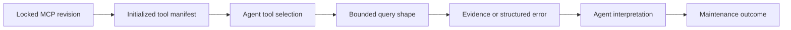
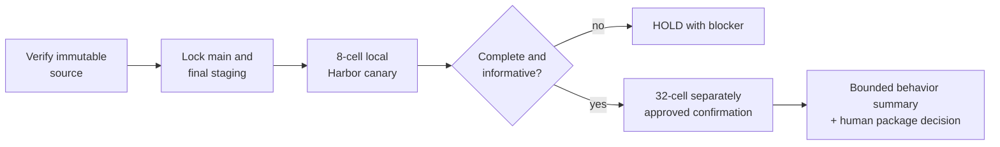

# Fugue 3 — API Compatibility Is Not Agent Compatibility: Qualifying an MCP Release

> **Fugue: Evals for the Agentic Software Factory · Part 3**  
> A standalone preregistration for MCP maintainers and Agent-integration
> teams. **Status:** draft preregistration and blocked; the release decision
> is pending a source-isolated comparison against the final reviewed staging
> head. No accepted preview and no result exist. **Reading time:** about
> 11 minutes.

This article defines the current evidence boundary, candidates, staged local
Study, and release gate in one place. You do not need to know Fugue, W&B MCP,
or the earlier essays to evaluate the design.

The failure that motivated it was subtler than a broken method. Two MCP
revisions could both initialize and answer a human query, yet lead an Agent
through different investigations. A changed description altered tool
selection. A projection made a useful field easier to see. A structured
partial-evidence error discouraged an unsupported completeness claim. No API
call had “broken.” The behavioral product had changed.

The claim this preregistration freezes:

> An MCP server changes what an Agent can perceive and do; its releases need
> behavioral qualification, not only protocol and unit tests.

The current decision is deliberately `pending`. Historical 0.3.7 and early
0.4 candidate commits remain useful source evidence, but they are not the
active comparison and cannot authorize a current release. [@mcp-baseline]
[@mcp-candidate] The active design compares the exact reviewed `main` head
with the exact final staging head after review is complete. If review or merge
changes either head, Fugue must lock new candidates and produce a new preview.

No result is carried forward from a deterministic replay, a direct MCP probe,
an earlier mixed-project canary, or a future remote-runtime plan. The decision
waits for the source-isolated local Harbor canary and confirmation described
below, followed by a separate human-signed package receipt.

## Scope and terms

The **Model Context Protocol (MCP)** exposes tools and resources to an Agent.
**Protocol compatibility** means the server initializes and answers valid
requests. **Agent compatibility** asks whether changed descriptions, schemas,
projections, pagination, and errors preserve safe downstream behavior. A
**release candidate** here is one exact server revision plus its initialized,
target-platform runtime lock.

The behavioral Study uses a basic Claude Code harness. It has one W&B MCP
integration per arm and no reviewed Skill, memory component, Aria, WBAF, loop
controller, or second harness. Model route, tasks, evidence source, prompt,
attempt policy, and local Harbor policy remain fixed. Only the locked MCP
revision changes.

The official MCP lifecycle orders initialization, capability negotiation, and
normal operation; passing that contract is the protocol gate, not the
behavioral conclusion. [@mcp-lifecycle]

## The interface an Agent experiences

Protocol conformance is necessary: initialization must succeed, schemas must
be valid, and calls must return legal responses. But an Agent also experiences
the names and descriptions competing for tool selection; parameter schemas;
default limits and pagination; projected versus broad payloads; error wording;
whether missing data looks empty, partial, or failed; latency and truncation;
and the relationship between one call and the evidence needed next.

An endpoint can stay callable while a description steers the Agent away from
it. A broad result can be semantically complete and practically unreadable in
the context window. An empty list can mean “there are no records,” “the query
timed out,” or “the caller lacks scope.” A human notices these distinctions
through deliberate inspection. An Agent may build a release recommendation
from whichever shape it receives.



The release affects every arrow. A unit test usually covers the first and
part of the fourth.

## The bounded release question

The active question is:

> Does the exact final reviewed W&B MCP staging head preserve or improve a
> maintainer’s bounded investigation of an immutable W&B and Weave source
> cohort relative to the exact reviewed `main` head?

Friendly labels are not identities. Each preview must show both source
commits, prepared runtime and tool-manifest digests, the Claude Code and model
route identity, task and private-label digests, source and result projects,
attempts, and local Harbor execution fingerprint.

Fugue imports ordinary MCP declarations, prepares target-platform package code
outside Agent execution, initializes each server, captures its exact manifest,
and locks the result. Agent cells never clone an MCP repository or install
dependencies.

The review-visible Fugue provider, V3 evidence, and source-isolated MCP
qualification pull requests remain preparation source, not evidence for the
pending decision. [@fugue-provider-draft] [@fugue-mcp-draft]
[@fugue-mcp-qualification-draft]

## Genuine evidence, deliberately seeded

The current plan separates immutable task evidence from experiment output:

```text
source:  wandb/fugue-mcp-release-source-v1
results: wandb/fugue-mcp-release-qualification-v1
```

The source project contains the non-sensitive Runs, trace trees, Dataset, and
Evaluations the tasks ask the Agent to investigate. W&B Runs carry
configuration, metrics, and artifacts [@wandb-runs]; Weave Calls form trace
trees [@weave-tracing]; Datasets version evaluation examples
[@weave-datasets]; and Evaluations link predictions to scorers
[@weave-evaluations].

The result project receives Agent traces, Evaluation rows, and Fugue result
projections. A release candidate must not write its own output into the source
project and then rediscover that output as task evidence. The source lock and
source-conformance receipt make that contamination detectable.

These objects are seeded prior evidence, not customer data and not comparison
outcomes. A genuine hosted object can still be a controlled fixture. The
claim is that the Agent investigated the locked source graph—not that the
graph represents every production project.

## Tasks that need investigation

The natural-maintainer tasks ask for bounded source inventory, Evaluation
child reconciliation, an observed history hotspot, a release-risk summary,
collection coverage, projected Run tables, incomplete evidence, and a
source-use gap.

Public briefs identify the immutable source project and required output
schema. Expected values and critical failure conditions remain host-private.
They never enter Agent prompts, MCP responses, runtime images, traces, W&B
configuration, or Study events.

Incomplete evidence is intentional. A useful maintainer Agent must sometimes
say “I cannot establish that.” A candidate that makes broad claims easy can
improve superficial fluency while regressing evidence honesty.

## One task, end to end

Consider a task that asks whether two locked Evaluation roots reconcile.

The Agent reads the source locator lock, initializes its assigned MCP
revision, lists the exact roots, requests their direct children with an
explicit bound, counts `Evaluation.predict_and_score` children separately
from summaries, and returns one schema-constrained answer. The host-private
scorer checks the expected counts, exclusions, boundedness, and source
project. Mechanism evidence records the initialized manifest and exact MCP
calls. Infrastructure evidence binds the cell to the accepted local Harbor
runtime and cleanup receipt.

Now imagine a candidate reaches the expected number by reading the result
project or counting unrelated children. The numeric answer may look right,
but the source and evidence-relation gates fail. That is why source isolation
is part of the estimand rather than a cleanup detail.

The walkthrough constrains the final claim. Even if the candidate improves a
task, the Study cannot say whether descriptions, projections, pagination, or
error shape was causal. Those features moved as one locked revision.

## Four outcome layers

The release decision reads four independent ledgers.

### 1. MCP and infrastructure conformance

Did each exact server initialize with its locked manifest? Did the zero-model
source receipt establish the immutable source shape? Did every approved local
Harbor cell start from the prepared image, preserve the private-label
boundary, terminate, publish its policy receipt, and leave zero run-scoped
containers?

### 2. Deterministic task outcome

Did the answer satisfy the declared schema and expected source facts? Did it
remain inside the immutable source project and preserve boundedness and honest
missingness? Deterministic checks do not grade prose style.

### 3. Calibrated maintainer judgment

Human maintainer review may assess usefulness, prioritization, and uncertainty
after deterministic and evidence-integrity gates reconcile. An automated
judge is optional and cannot become release truth without a separately
accepted calibration receipt.

### 4. Mechanism and evidence integrity

We record initialization, tool inventory, selected tools, call counts,
projected and broad reads, truncations, timeouts, structured errors, sources
returned and opened, latency, observed usage and cost, and Weave
trace/Evaluation reconciliation.

An improved task outcome with missing native evidence is incomplete. A
reduction in broad reads is a mechanism observation, not proof of better
maintenance. The ledgers meet only in the bounded interpretation.

## The staged local sequence

The former 80-cell Claude/OpenClaw/Serverless sequence is retired as the
active decision plan. It mixed a larger replication story with gates that
were not ready and obscured the smallest source-isolated comparison that
could answer the current question.

The active sequence is:

| Stage | Fixed harness and route | Tasks × revisions × attempts | Cells |
| --- | --- | ---: | ---: |
| Canary | Claude Code + locked Anthropic route | 4 × 2 × 1 | 8 |
| Confirmation | Claude Code + the same locked route | 8 × 2 × 2 | 32 |

The canary and confirmation have separate previews, approvals, run
identities, budgets, and results. The confirmation is not admitted unless the
canary has complete source, Agent, Evaluation, Harbor, privacy, and cleanup
evidence. A canary result is not silently pooled into the confirmation.



## Judge calibration before paid work

The corrected package decision is deterministic plus human release sign-off.
An automated maintainer judge is not required for the local canary or
confirmation.

If a later plan adds one, authored examples are not calibration. The judge
must have two independent human reviews per case, adjudication of
disagreements, declared true-positive and true-negative thresholds, and zero
false passes on critical unsupported-completeness cases. Changing cases,
rubric, labels, or judge profile changes the calibration identity and requires
a new preview.

## Lock the two MCP candidates

The active candidates are the reviewed `main` head and the final reviewed
staging head. The current repair work is visible in draft MCP pull request
#126 at reported head `3dd4447ef0054d4707aafc515e3f2ddfb11b17bd`; its CI and
security checks pass, but the pull request remains draft and unmerged.
[@mcp-repair-draft] Those facts establish review readiness, not final staging
identity or behavioral evidence. The accepted preview must resolve the final
reviewed head after review; this draft does not invent that SHA.

The trusted operator sequence is:

```bash
uv run fugue mcp import \
  --config examples/comparisons/wandb-mcp-maintenance/mcp.json \
  --server wandb-main \
  --as wandb-mcp-main

uv run fugue mcp import \
  --config examples/comparisons/wandb-mcp-maintenance/mcp.json \
  --server wandb-0-4-staging \
  --as wandb-mcp-0-4-staging

uv run fugue mcp inspect wandb-mcp-main
uv run fugue mcp inspect wandb-mcp-0-4-staging

uv run fugue mcp lock wandb-mcp-main \
  --acknowledge-package-code \
  --platform linux/amd64

uv run fugue mcp lock wandb-mcp-0-4-staging \
  --acknowledge-package-code \
  --platform linux/amd64
```

The explicit acknowledgment is not decorative. Importing package code means
reviewing code that will enter a privileged preparation boundary. Runtime
cells receive prepared assets read-only and cannot mutate the accepted
candidate.

## Keep remote qualification separate

Serverless is not the active execution requirement and no Serverless
execution is claimed. The current behavioral decision uses prepared local
Docker through Harbor because that is the supported, inspectable boundary for
the canary and confirmation.

A future remote package qualification may retain separate, fail-closed
Serverless definitions. It must not inherit a local behavior result as proof
of remote isolation, lifecycle, privacy, or deletion. Conversely, the absence
of remote receipts does not turn a completed local Study into a replay; it
narrows the supported claim to local Harbor behavior.

## Leakage and hostile-result checks

Qualification scans Agent inputs, rendered jobs, runtime receipts, MCP
stdout/stderr, Weave projections, and result bundles for credential values,
private expected facts, local paths, and unapproved environment values.

The taskset includes ambiguous evidence shapes: bounded pages, summary
children mixed with prediction children, unavailable cost, a latency hotspot,
and returned sources that were not opened. These cases qualify the
evidence-integrity behaviors the release claim depends on. They are not a
complete MCP security audit.

The active cell cannot install another MCP revision, change project scope, or
read host-private labels. A credential leak, private-label exposure, result
write into the source project, or unresolved Harbor cleanup receipt is an
immediate no-go regardless of task scores.

## Preview, approve, execute

Source preparation and direct MCP mechanism checks happen before the final
preview. They do not run a model and cannot supply a behavioral result.

The active local canary then follows Fugue’s normal immutable path:

```bash
SPEC=examples/comparisons/wandb-mcp-maintenance/natural-maintainer-canary-local-v3.yaml

uv run fugue compare "$SPEC" --prepare --json
uv run fugue check "$SPEC" --json
uv run fugue compare "$SPEC" --preview --json

uv run fugue approve PREVIEW_DIGEST \
  --max-cells 8 \
  --max-usd APPROVED_CAP \
  --approved-by HUMAN_OPERATOR

uv run fugue compare "$SPEC" \
  --run \
  --approval APPROVAL_ID
```

The spec name is a planned contract until the V3 comparison lands on a clean
reviewed tree. Do not execute a similarly named draft or substitute an older
preview. The 32-cell confirmation requires its own accepted spec, preview,
approval, and budget.

## Reconciliation and decision rules

A behavioral summary requires:

- nonzero planned cells and complete aligned rows;
- exact source and result project separation;
- final reviewed candidate identities and initialized manifests;
- no critical regression in boundedness, missing-data handling, or source
  honesty;
- complete deterministic task evidence;
- one native Agent conversation, root, prediction row, and Evaluation row per
  cell;
- complete local Harbor policy, privacy, cleanup, and zero-orphan receipts;
- no hidden retry or cross-Study pooling.

The Study may report `improved`, `regressed`, `mixed`, `unchanged`,
`incomplete`, or `invalid` behavior. `Incomplete` and `invalid` suppress a
behavioral recommendation.

The Python-package decision remains `HOLD` until a separate human-signed
package receipt proves the final staging identity and the package, CI,
security, compatibility, and release requirements. Local behavioral evidence
cannot issue package `GO` by itself.

The supported behavioral claim is whole-release and local:

> Under the named Claude Code candidate, tasks, immutable source cohort,
> attempts, local Harbor policy, and dates, the exact staging candidate did—or
> did not—preserve the bounded maintenance behavior declared by the Study.

Feature-level causality requires a separate ablation.

## The maintainer memo

The final memo is a human-authored interpretation of immutable results, not a
fifth scorer. It must include:

1. the bounded release question;
2. source and result project identities;
3. exact main and final-staging candidate locks;
4. improved, regressed, unchanged, missing, and invalid aligned cases;
5. mechanism observations separated from outcomes;
6. local Harbor and evidence limitations;
7. the separate package `HOLD`, `GO`, or `NO-GO` receipt.

An optional Aria shell may read safe result projections and help navigate
references after the Study. It is not part of either candidate, cannot issue
approval or start execution, and cannot turn a behavioral summary into package
authority.

Prepared source evidence, a no-key replay, a direct MCP receipt, or a planned
matrix does not unlock a release recommendation.

## Try this in 15 minutes

Write four evidence labels on a page:

1. deterministic no-key replay;
2. zero-model source-conformance receipt;
3. live locked-MCP mechanism receipt;
4. live Claude Code behavioral Study.

For each, write one claim it supports and one it cannot support. If any label
can be swapped for another without changing your release memo, the evidence
boundary is still too vague.

Then sketch the source and result projects as two boxes. Reject any plan in
which an experiment output can appear inside the immutable source cohort.

## When behavioral qualification is unnecessary or insufficient

Protocol conformance, schema validation, and deterministic integration tests
remain the right tools for known MCP contracts. Behavioral qualification is
needed when a release changes what an Agent perceives or how it investigates.

It remains insufficient when source and results are mixed, the task brief
reveals expected answers, either revision lacks an exact initialized lock, the
local runtime receipt is missing, or the package decision lacks independent
release evidence.

## What this does not show

The seeded source cohort does not represent every customer project. A
four-task canary and eight-task confirmation are bounded maintenance Studies,
not broad population estimates.

Local Harbor receipts establish the declared local execution policy, not
Serverless isolation or complete security. A basic Claude Code comparison
does not establish behavior for OpenClaw, Codex, Hermes, Aria, or another
model. No Skill or memory effect is in scope.

Most importantly, no result exists yet. The release decision remains pending
the final source-isolated staging comparison and separate package sign-off.

## Results appendix — intentionally empty

A future dated appendix must contain:

```text
qualified Fugue commit and tree:
immutable source project and source-conformance receipt:
result project:
main and final-staging revisions, runtime locks, and tool manifests:
canary preview, approval, run, and result:
confirmation preview, approval, run, and result:
planned/admitted/started/completed/excluded/missing cells:
deterministic results:
mechanism observations:
local Harbor policy, privacy, cleanup, and zero-orphan receipts:
Weave Agent, prediction, Dataset, and Evaluation reconciliation:
behavioral summary:
independent package receipt and human decision:
limitations:
```

The final tree and candidate heads must be the qualified identities. If review
or merge changes them, qualification runs again.

## Next: a result is not a learning loop

The MCP Study can produce bounded evidence about a release. It does not decide
which engineering change should be authored next.

In **Fugue 4A**, we place controlled Studies inside an outer loop whose active
flagship is Claude Code plus Fugue through local Harbor. Aria remains an
optional read-only presentation shell, not a runtime dependency or release
authority.

## References

Complete source metadata and numbered citations are generated from this
article package’s `sources.json`.
