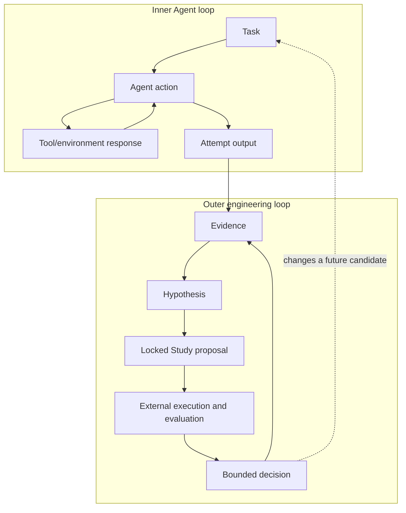
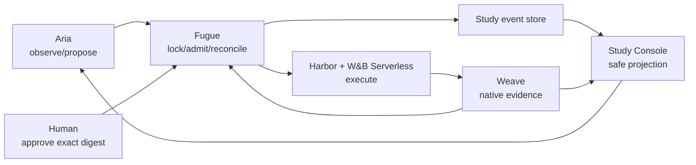
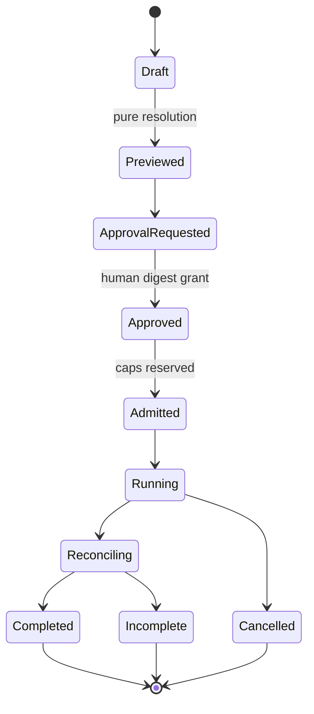

# Fugue 4A — Telemetry Is Not Evaluation: Designing a Loop That Can Learn

> **Fugue: Evals for the Agentic Software Factory · Part 4A**  
> A standalone architecture field note for loop-engineering and autoresearch
> teams. **Status:** concept. **Reading time:** about 12 minutes.

This article defines both loops, every authority, and the immutable state
transitions locally. Familiarity with Aria, Fugue, Weave, or Study Console is
not required.

The misconception is that an engineering loop becomes intelligent when it can
collect traces, summarize them, and propose another change.

Our concrete failure was a loop diagram with no authority boundary. The same
researcher could observe a weak result, rewrite the comparison, approve more
spend, retry the failed cells, and interpret the new outcome. Every individual
action was useful. The loop as a whole could grade its own homework.

Our falsifiable thesis is:

> A loop becomes engineering only when observations can produce controlled,
> externally evaluated, reversible changes.

This claim is false if an unconstrained self-improvement loop reliably
preserves evidence, budget, diversity, and honest nulls under pressure. Our
design assumes proposal, approval, execution, and evaluation should remain
separate authorities even when agents help with all four.

## Scope and terms

The **inner loop** is one Agent attempting one task. The **outer loop** turns
observations across attempts into a bounded hypothesis and a reversible
engineering decision. **Telemetry** records what happened. **Evaluation**
applies a declared procedure to decide what that evidence supports.
**Authority** determines who may propose, approve, execute, retry, or accept.

The architecture does not make autonomous improvement safe by itself. It
makes authority, evidence gaps, failed proposals, and rollback points
inspectable.

## Two loops, different responsibilities

The inner loop is the Agent doing one task:

```text
observe task → reason → use tool → inspect result → edit or answer → stop
```

The outer loop changes the system that runs the inner loop:

```text
observe evidence → hypothesize → preregister → compare → evaluate → decide
```

Conflating them creates recursion. An Agent that can change its tools or
evaluation during a task can optimize the measurement rather than the
software. An outer-loop researcher that edits a holdout after seeing the
result can turn discovery into evidence without admitting the change.



The loops communicate through artifacts, not shared mutable intention. An
attempt output becomes evidence only after identity and reconciliation. A
decision changes a future candidate through a new reviewed artifact.

Lilian Weng’s survey of harness engineering describes propose–evaluate–accept
patterns and the risks of self-improving loops, including evaluator weakness
and homogenization
([Harness Engineering for Self-Improvement](https://lilianweng.github.io/posts/2026-07-04-harness/)).
The survey motivates the pattern. Fugue’s authority boundaries are our
engineering response. [@weng-harness] Dudycz’s OODA analysis supplies another
operational test: telemetry is observation; it has not yet oriented the
decision maker or authorized action. [@dudycz-ooda]

## The governed cycle

Our outer loop is:

```text
observe → hypothesize → preregister → preview → approve
→ execute → evaluate → interpret
```

Each transition creates or consumes a durable object.

| Stage       | Object                                       | Authority                |
| ----------- | -------------------------------------------- | ------------------------ |
| Observe     | Evidence references and Research note        | Researcher/Aria          |
| Hypothesize | Bounded question and expected mechanism      | Researcher/Aria          |
| Preregister | Registered comparison spec and Study brief   | Repository review        |
| Preview     | Pure expanded plan and digest                | Fugue comparison service |
| Approve     | Digest-bound cell/cost grant                 | Human operator           |
| Execute     | Immutable attempts and lifecycle events      | Harbor + W&B Serverless  |
| Evaluate    | Deterministic checks and calibrated judgment | External scorers         |
| Interpret   | Sourced Result and proposed follow-up        | Researcher/Aria          |

The cycle is intentionally not closed by an automatic “accept” arrow. A
release or code change still crosses the repository’s review and deployment
process. A proposed follow-up stops at preview until a human approves it.

Hamel’s error-analysis workflow reinforces the same order: inspect concrete
failures, define criteria with domain experts, and automate only after the
failure mode is legible. Automated graders remain aids to triage and
measurement, not an authority that can approve their own optimization target.
[@hamel-field-guide] [@auto-evals]

## The division of labor

The flagship uses five components with distinct jobs.

### Aria observes and proposes

Aria reads safe Research context, registered comparison metadata, Study state,
and evidence-linked Results. It can identify a bounded pattern, explain a
comparison, request approval, start a digest that is already approved, watch
events, and summarize the result.

It cannot access private labels, issue approval, change accepted candidates or
tasks, alter execution policy, retry attempts, or launch a follow-up.

### Fugue locks and reconciles

Fugue owns candidate resolution, task and evidence identities, pure preview,
approval checking, admission, canonical execution, result export, and evidence
reconciliation. It does not decide which product question matters or declare
a winner.

### A human grants authority

The human sees the exact candidates, fixed controls, cell matrix, judge,
mechanism measures, runtime policy, cost cap, and preview digest. Approval
authorizes that object until a deadline. It does not authorize “whatever Aria
needs next.”

### Harbor and W&B Serverless execute

Harbor renders the native Agent job. W&B Serverless provides the remote,
isolated lifecycle. The runtime cannot install candidate code during the
attempt. Named W&B secrets enter through the secret boundary. Every cell must
publish evidence and prove deletion.

### Weave and Study Console make state inspectable

Weave stores native Agent conversations, nested tool spans, predictions, and
Evaluations. Study Console projects the canonical Study events needed for a
human to understand design, approval, progress, results, and safe evidence
links.

Study Console is not another database of truth. If it shows a different
approval digest or lifecycle state, the projection is wrong.



## Why telemetry alone cannot drive the loop

Telemetry is broad and opportunistic. It can reveal that latency rose, a tool
was rarely selected, or a class of errors appeared. It is excellent for
finding questions.

It usually lacks the controls to answer them.

A latency spike in traces may come from a changed model, provider load,
larger tasks, more tool use, or a runtime regression. A decline in one tool’s
usage may mean its description got worse, another tool got better, or the task
mix changed. A high judge score may reflect better answers or a new rubric.

The loop therefore treats telemetry as discovery evidence. Aria can say:

> In the locked project, reviewed traces show broad reads and unsupported
> completeness claims around partial Evaluation data. I propose comparing the
> registered 0.3.7 and 0.4 MCP revisions on the frozen maintenance taskset.

It may not say:

> 0.4 fixed the issue.

The latter requires the Study.

## Immutable Study state

A controlled Study progresses monotonically:



No transition returns to Draft. A changed plan creates another Study. A
cancelled or interrupted run is finalized into terminal evidence before a
successor is proposed.

Events are append-only. A correction does not rewrite an earlier finding; it
adds a Result with a `supersedes` reference. Research notes preserve failed
ideas and nulls so the loop does not repeatedly rediscover them.

This also makes recovery tractable. The execution queue leases work. If the
control process restarts after admission, it recovers the existing operation
and run identity. It does not launch a duplicate set of Agent cells.

## One service behind every interface

Aria reaches Fugue through bounded MCP operations. An operator may use the
CLI. Study Console uses typed HTTP and an event stream. Python clients support
orchestration.

All call the same comparison and Research services. This prevents the
agent-facing path from acquiring an accidental capability that the human
preview does not show.

The registered-comparison allowlist binds a stable ID to a
repository-relative path and exact spec digest. An MCP caller cannot submit an
arbitrary filesystem path. The public preview omits private-label content and
digests that would reveal it, while retaining the accepted comparison
identity.

Approval issuance is absent from REST and MCP. A trusted operator command is
the authority:

```bash
uv run fugue research approve PREVIEW_DIGEST \
  --max-usd 20 \
  --max-cells 8
```

The admission transaction checks the exact reservation against those caps. A
stale preview, expired grant, or increased cost fails before work is recorded.

## Learning without Goodharting

A loop that optimizes repeatedly against one evaluator will find its blind
spots. The failure may look like reward hacking, but softer versions are
common:

- proposals become stylistically aligned to the judge;
- tasks narrow toward behaviors that already score well;
- all agents converge on one harness and lose diversity;
- negative cases are reclassified as infrastructure;
- retries hide instability;
- the holdout becomes familiar through repeated trace review.

We use several brakes:

1. **External evaluator authority.** The candidate cannot change its grader.
2. **Private facts.** The Agent never receives expected answers.
3. **Judge calibration.** Critical false passes block the cohort.
4. **Discovery/holdout separation.** Tuning creates a new identity.
5. **Negative controls.** Easy and known-failure cases reveal scorer drift.
6. **Independent ledgers.** Mechanism gains cannot conceal task regressions.
7. **Human approval.** Adaptive spend and scope remain visible.
8. **Append-only memory.** Nulls and rejected proposals are durable.

These controls do not solve Goodhart’s law. They make pressure and change
observable enough to govern.

## Reversibility is part of the hypothesis

An engineering loop should state not only what success looks like, but what
can be undone.

For a code candidate, the rollback point is the parent tree and any migration
boundary. For an MCP release, it is the exact baseline integration lock. For a
runtime, it is the previous immutable image digest. For a Study, rollback does
not delete evidence; it stops future admission and records the terminal
reason. For a published Result, correction means a new record with
`supersedes`, never an edit that makes the earlier decision disappear.

We include rollback in the proposal:

```yaml
rollback:
  trigger:
    - critical_evidence_honesty_regression
    - duplicate_execution
    - credential_or_private_label_exposure
    - unreconciled_serverless_lifecycle
  code_boundary: "<parent tree>"
  candidate_boundary: "<baseline fingerprint>"
  runtime_boundary: "<prior image digest>"
  evidence_action: "preserve and mark ineligible"
```

This makes a hypothesis operational. “Try the new release” becomes “admit
these cells; stop on these conditions; preserve these facts; return to this
known boundary.” A rollback can still be difficult when data schemas or
external systems change. Naming the boundary early reveals that risk before
approval.

## Failure drills before autonomy

Happy-path tests are insufficient for a durable loop. We rehearse failures
that target authority and recovery:

- submit the same start request twice and verify exactly one execution;
- restart the worker after admission and recover the same run identity;
- expire approval between preview and start;
- change one task byte after approval and verify digest rejection;
- make the runtime image unavailable;
- interrupt an Agent after its Weave prediction opens;
- withhold a required Evaluation record;
- fail Sandbox deletion and verify the result remains ineligible;
- propose a follow-up from an incomplete parent and verify it stops before
  approval.

The drill is successful when state remains explainable, not when the system
somehow produces a score. Recovery must preserve the original coordinates and
evidence. A compensating retry with a new attempt identity may be operationally
allowed in another Study; it cannot overwrite the interrupted attempt.

These drills also clarify which component owns remediation. Fugue can refuse
interpretation and reconcile known state. The Sandbox operator may need to
clean up an orphan. The human may need to issue a new approval. Aria can
describe the blocker. None should quietly impersonate another authority to
make the loop appear self-healing.

## Diversity is an engineering asset

Self-improvement loops often converge because the evaluator prefers familiar
outputs. The proposal that looks like previous winners is easier to approve,
and the harness that emits the most legible traces receives more investment.
That can eliminate useful alternatives before the task distribution changes.

We preserve diversity by reporting harnesses separately, retaining rejected
and null proposals, and requiring a stated reason when a candidate family is
removed. Diversity itself is not a score; expensive weak candidates should
not run forever. It is an option value visible in the Research record.

Where two native harnesses reverse, the loop should ask what interaction
caused the difference rather than collapse to the pooled winner. Where two
task-authoring approaches disagree, the holdout can preserve both strata.
Where all candidates saturate a regression suite, we keep it as a gate and
create a separate capability suite.

## The artifact: one outer-loop handoff

A practical handoff is a small, structured record:

```yaml
observation:
  evidence:
    - "weave:///PROJECT/call/CALL_ID"
    - "wandb:///ENTITY/PROJECT/run/RUN_ID"
  pattern: "Partial Evaluation evidence preceded unsupported completeness."
  limitations: "Two reviewed traces; discovery only."

hypothesis:
  question: "Does exact MCP 0.4 improve bounded evidence investigation?"
  expected_mechanism:
    - "fewer broad reads"
    - "more structured partial-evidence handling"

proposal:
  registered_comparison: "wandb-mcp-maintenance-primary-serverless-v1"
  expected_spec_digest: "<sha256>"
  requested_cells: 32
  requested_max_usd: 80

authority:
  preview_digest: "<generated by Fugue>"
  approval: null

stop_condition:
  - "critical evidence-honesty regression"
  - "runtime or evidence identity mismatch"
  - "incomplete required reconciliation"
```

Aria may create the observation and proposal. Fugue supplies the preview
digest. Only the operator fills approval. No free-form agent instruction can
override the stop conditions.

## Accept, reject, or learn?

An outer loop needs more than “winner.”

- **Accept for release** means all go gates pass and the bounded result
  supports the specific maintenance decision.
- **Reject** means a predeclared critical regression or policy violation makes
  the candidate unsuitable in scope.
- **No decision** means evidence is incomplete, the result reverses in a way
  the claim cannot absorb, or uncertainty remains too high.
- **Learn and follow up** means a null or mechanism observation motivates a
  new preregistered question.

The fourth outcome is why nulls must remain durable. A treatment that improves
retrieval without task outcomes can generate a focused source-use study. A
harness reversal can generate a protocol compatibility investigation. Neither
justifies rewriting the current result.

The implemented Research boundary behind this design is reviewable in the
public Fugue stack: proposal and inspection are separated from approval,
execution, and result acceptance. [@fugue-research]

## Try this in 15 minutes

Draw your current improvement loop and put a name beside proposer, approver,
executor, evaluator, retry authority, and rollback owner. If one identity owns
all six, choose one irreversible transition and move its authority outside the
loop.

Now trace one failed proposal. If the null, rejection, or retry is not durable,
the loop has no memory of evidence that resists its preferred story.

## When an outer loop is unnecessary or insufficient

A known defect with a clear owner should enter the normal engineering queue,
not wait for an autoresearch loop. The governed outer loop is useful when
evidence must produce a new bounded hypothesis. It is insufficient when the
proposer can approve its own work, the evaluator changes after seeing the
holdout, or rollback exists only as a diagram.

## What this does not show

Authority separation does not make the human correct. A human can approve a
bad design or ignore a limitation. Append-only events can faithfully preserve
poor evidence. External judges can share the candidate’s biases.

W&B Serverless isolation does not prove that a runtime image contains the
intended assets; the runtime lock and probes do that. Weave traces do not prove
source use; the evidence relation and evaluation do that. Study Console does
not create evidence by rendering a card.

This architecture also does not establish that an autonomous outer loop
improves software. It describes a bounded loop in which proposals can be
evaluated without silently changing authority. The real flagship run remains
preregistered.

Nor does governance need to make every action slow. Read-only observation,
pure preview, and deterministic reconciliation can remain automatic. The
human boundary is reserved for changed scope, spend, release authority, and
claims—the acts whose consequences the system should not infer from
convenience.

## The bridge: make the loop visible end to end

An architecture diagram can hide every inconvenient detail: placeholder
evidence, replayed attempts, a button that does not bind to the digest, or a
“remote” cell that never leaves the laptop.

In the next installment, **Fugue 4B**, we turn the governed cycle
into a demo runbook. It begins with genuine W&B and Weave objects, crosses a
visible human approval, runs actual W&B Serverless cells, opens discordant
traces, and ends with a limited maintainer memo. If any link is missing, the
demo says so.

## References

Complete source metadata and numbered citations are generated from this
article package’s `sources.json`.
