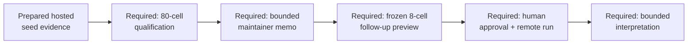
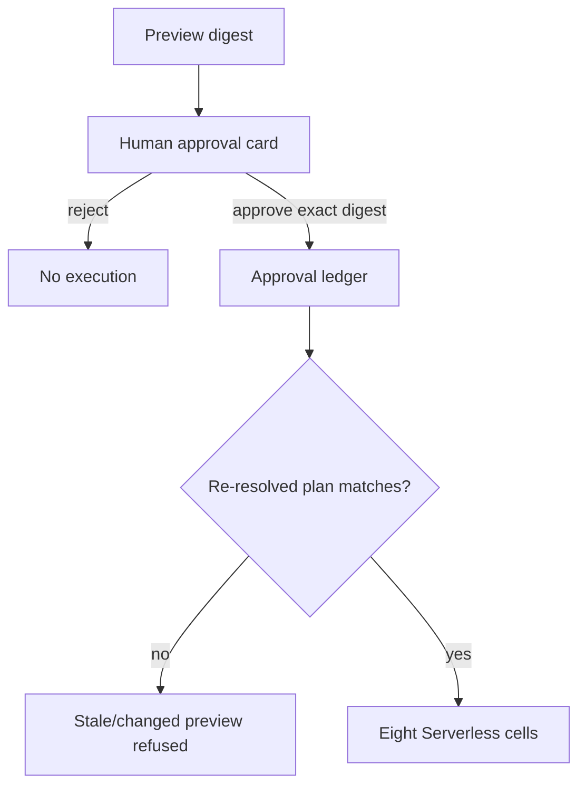
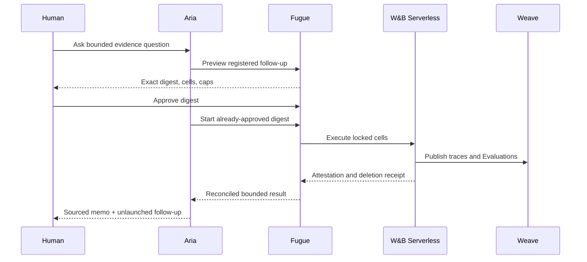

# Fugue 4B — From a Trace to a Release Decision: The Real Aria–Fugue Loop

> **Fugue: Evals for the Agentic Software Factory · Part 4B**  
> A standalone qualification runbook for maintainers evaluating a real agent
> workflow. **Status:** draft preregistration; no result and remote
> qualification not yet observed. **Reading time:** about 12 minutes.

All products, evidence objects, approval boundaries, and presentation gates
are introduced here—the runbook is useful without the architectural essay
that precedes it.

The failure that shaped it was a demo that never risked discovering
anything. The tasks were fixtures, the outcome was known, execution was
local, and the approval gesture could not change what ran. It was reliable on
stage because we had removed the boundaries the product claimed to govern.

The claim this runbook holds itself to:

> The flagship is credible only if it begins with genuine evidence, requires
> human approval, performs real remote work, and ends in an evidence-linked
> bounded decision.

The demo fails that claim if its evidence references do not open, if the
approved digest differs from execution, if Serverless cells are replayed, if
attempts do not reconcile to Weave Evaluations, or if the final memo claims
more than the locked Study supports.

To be explicit about status: this is a qualification contract, not a record
of a completed demo. No accepted preview, completed 80-cell Study, Serverless
receipt set, or final memo is claimed here. The flagship is not presented
until an actionable final-head result and two clean-clone rehearsals exist. A
null or incomplete Study is publishable—it is never silently replaced with a
victorious demo.

## Scope and terms

**Aria** is the researcher that inspects evidence and proposes a bounded
question. **Fugue** freezes the comparison, approval digest, execution, and
result contract. **W&B Serverless Sandboxes** run isolated cells. **Weave**
stores native calls and Evaluations. **Study Console** projects safe Study
state. A **qualification** is evidence that these boundaries operated on one
exact final tree; a replay is only an installation smoke test.

The runbook demonstrates governance and evidence flow. It cannot manufacture
an actionable MCP result, and it must be postponed when the completed Study
is null, incomplete, or unreconciled.

Object contracts matter here because the qualification must open native
evidence rather than screenshots: W&B Runs carry training or application
state [@wandb-runs], Weave Calls form trace trees [@weave-tracing], Datasets
version examples [@weave-datasets], and Evaluations connect predictions to
scorers [@weave-evaluations]. W&B Serverless is the required remote execution
mechanism [@wandb-sandboxes], with named secrets as the only credential path
into a Sandbox [@wandb-secrets]. Availability and receipts remain unobserved
until the final run.

## What the audience should believe

After qualification—not at the time of this draft—an unfamiliar engineer
must be able to support five narrow statements:

1. The starting evidence consists of genuine, inspectable W&B Runs and Weave
   objects, not screenshots or local JSON pretending to be hosted data.
2. Aria identified a bounded maintenance problem and selected a registered
   comparison; it did not invent a hidden task or edit private labels.
3. A human approved an immutable preview with explicit candidates, cells,
   runtime, judge, and cost.
4. Harbor executed actual cells in W&B Serverless Sandboxes whose runtime,
   evidence publication, deletion, and zero-orphan state were attested.
5. The final release recommendation links aligned evidence, separates
   mechanism from outcome, and names its limitations.

The audience should **not** leave believing that 0.4 is universally better,
that one MCP feature caused an effect, that the judge is a maintainer, or
that eight live cells reproduce the full 80-cell estimate.

## The story begins before the stage

A useful live demo is the last step of a real Study, not the first. Before
any presentation, the qualification contract requires eight Claude Code
discovery cells, eight OpenClaw + W&B Inference discovery cells, 32 untouched
Claude Code primary cells, and 32 OpenClaw + W&B Inference replication cells.
The team inspects aligned discordant pairs, reconciles every required object,
and freezes the full result. Only then may Aria propose an eight-cell
follow-up selected from that completed evidence:

```text
2 reviewed tasks × 2 MCP revisions × 2 native harness routes × 1 attempt
= 8 live cells
```

The follow-up receives its own tasks, spec, preview digest, approval, Study
identity, and $20 maximum. It does not retroactively become another attempt
in the 80-cell Study.



If the full Study is null or non-discriminating, we publish the null and
postpone the flagship. We may write a new, harder preregistration. We do not
select two convenient rows and call them a product result.

## The evidence scene

The dedicated project is:

```text
wandb/fugue-mcp-release-qualification-v1
```

The presenter opens, live: one of the six W&B Runs with configuration,
history, summary, and evidence artifact; one Weave Agent conversation with
nested tool spans; the versioned eight-row Dataset; both aligned Evaluations
with selected prediction rows; and the locked latency anomaly and
incomplete-evidence case.

The evidence lock supplies immutable references and content digests—the
presenter does not browse “latest” and hope the same objects appear. The
seed receipt identifies which objects were deliberately prepared, and the
narration is precise:

> These are genuine hosted objects created to model a non-sensitive
> maintenance situation. They are the evidence the Agents inspect. They are
> not results produced by the comparison.

That sentence preserves realism without pretending the fixture is an organic
customer incident.

## The useful question for Aria

We do not ask, “Which MCP is better?” That invites a broad answer assembled
from names and priors. We ask:

> In the reviewed traces and Evaluations for this locked project, what
> bounded failure pattern is supported strongly enough to qualify a release
> against it? Cite what you opened, distinguish missing from negative
> evidence, and stop after proposing one registered comparison.

Aria should identify a pattern such as unsupported completeness around
partial Evaluation coverage, broad reads that obscure a latency/cost anomaly,
or weak reconciliation of aligned records—with direct evidence references and
limitations.

The operator then asks Aria to explain the comparison it selected: exact
revisions, fixed conditions, task and cell counts, deterministic gate, judge
calibration, mechanism measures, Serverless policy, and maximum spend—and to
hold off requesting approval if any readiness gate is missing. That prompt
makes the governance legible. It also gives the system a chance to refuse.

## The approval card

The approval card is not a “Run experiment” button. It is a review of one
digest.

It displays the registered comparison ID and spec digest; baseline revision
`80252b3aa23ae3c1fdde089ce2b7dfb106dafb38`; candidate revision
`a2bae7271323ac43262ffb73454b0aff01ddc808`; exact model routes and native
harnesses; task, private-label, evidence, judge, MCP, and runtime-lock
digests; the declared treatment and fixed dimensions; all eight cell
coordinates; deterministic and maintainer-judge gates; mechanism measures;
the W&B Serverless resource and deletion policy; hard $20 and eight-cell
caps; and the expiration and approval issuer.



Aria may request the card. It cannot press approval through its MCP
authority. If the UI fallback is not qualified, a trusted operator shell
issues the same digest-bound grant:

```bash
uv run fugue approve PREVIEW_DIGEST \
  --max-cells 8 \
  --max-usd 20 \
  --approved-by HUMAN_OPERATOR
```

The UI and CLI must produce the same approval record. A separate UI-only
approval concept would invalidate the demo.

## Clean-clone preparation

The runbook starts from clean, reviewed checkouts and explicit expected
revisions. Paths below are placeholders; no credential lives in a repository.

```bash
export FUGUE_REPO=/ABSOLUTE/PATH/TO/QUALIFIED/FUGUE
export FUGUE_EXPECTED_SHA=QUALIFIED_FUGUE_SHA
export STUDY_CONSOLE_REPO=/ABSOLUTE/PATH/TO/QUALIFIED/STUDY_CONSOLE
export STUDY_CONSOLE_EXPECTED_SHA=QUALIFIED_STUDY_CONSOLE_SHA
export INTEGRATION_REPO=/ABSOLUTE/PATH/TO/QUALIFIED/ARIA_INTEGRATION
export OPERATOR_ENV=/ABSOLUTE/PATH/TO/OPERATOR.env

test "$(git -C "$FUGUE_REPO" rev-parse HEAD)" = "$FUGUE_EXPECTED_SHA"
test -z "$(git -C "$FUGUE_REPO" status --porcelain)"
test "$(git -C "$STUDY_CONSOLE_REPO" rev-parse HEAD)" = \
  "$STUDY_CONSOLE_EXPECTED_SHA"
test -z "$(git -C "$STUDY_CONSOLE_REPO" status --porcelain)"
```

Install from the lock on Python 3.13:

```bash
cd "$FUGUE_REPO"
uv sync --python 3.13 --frozen \
  --extra research-worker \
  --extra dev
```

At presentation time, the integration launcher must emit a boot receipt with
the exact Core, Fugue, Study Console, evidence-lock, and Serverless
runtime-image identities. If the launcher’s public Serverless profile has not
landed and passed a clean-clone qualification, that UI path is unlanded and
must not be improvised on stage.

## One-time evidence and MCP preparation

Validate the hosted evidence:

```bash
uv run python \
  examples/comparisons/wandb-mcp-maintenance/prepare_hosted_project.py \
  --project wandb/fugue-mcp-release-qualification-v1 \
  --env-file "$OPERATOR_ENV" \
  --output examples/comparisons/wandb-mcp-maintenance/evidence.lock.json
```

Import and lock the two exact MCP candidates:

```bash
export WANDB_BASE_URL=https://api.wandb.ai

uv run fugue mcp import \
  --config examples/comparisons/wandb-mcp-maintenance/mcp.json \
  --server wandb-0-3-7 \
  --as wandb-mcp-0-3-7

uv run fugue mcp import \
  --config examples/comparisons/wandb-mcp-maintenance/mcp.json \
  --server wandb-0-4 \
  --as wandb-mcp-0-4

uv run fugue mcp lock wandb-mcp-0-3-7 \
  --acknowledge-package-code \
  --platform linux/amd64

uv run fugue mcp lock wandb-mcp-0-4 \
  --acknowledge-package-code \
  --platform linux/amd64
```

The lock captures initialized target-platform tool manifests. We show their
differences to explain what could plausibly change. We do not infer that a
manifest difference caused an outcome.

## Build the public runtime images

From the exact clean Fugue tree:

```bash
uv run fugue sandbox wandb build-runtime \
  --comparison examples/comparisons/wandb-mcp-maintenance/discovery-serverless.yaml \
  --comparison examples/comparisons/wandb-mcp-maintenance/discovery-wandb-serverless.yaml \
  --comparison examples/comparisons/wandb-mcp-maintenance/primary-serverless.yaml \
  --comparison examples/comparisons/wandb-mcp-maintenance/wandb-replication-serverless.yaml \
  --platform linux/amd64 \
  --image docker.io/REGISTRY_ORG/fugue-mcp-release:"$FUGUE_EXPECTED_SHA" \
  --push \
  --output-manifest .fugue/wandb-serverless-runtime.manifest.json \
  --sbom-dir .fugue/wandb-serverless-runtime-reports

uv run fugue sandbox wandb lock-runtime \
  --manifest .fugue/wandb-serverless-runtime.manifest.json \
  --output .fugue/wandb-serverless-runtime.lock.json
```

This protected preparation action requires explicit authority to publish
public images. It builds outside Agent execution, embeds locked assets,
generates SBOMs, fails High-or-worse scan findings, performs offline probes,
and verifies anonymous pulls. The lock contains immutable registry digests,
not the qualification tag.

The W&B team’s Secrets Manager contains only the named entries the runtime
requests:

| Secret name               | Injected variable   |
| ------------------------- | ------------------- |
| `fugue-wandb-api-key`     | `WANDB_API_KEY`     |
| `fugue-anthropic-api-key` | `ANTHROPIC_API_KEY` |

No command displays their values. W&B’s documented secret mechanism injects
requested secret names as environment variables without placing values in
the Sandbox configuration
([Sandbox secrets](https://docs.wandb.ai/sandboxes/secrets)).

Qualify creation, startup, embedded runtimes, deletion, and zero orphans:

```bash
uv run fugue sandbox wandb doctor \
  --lock .fugue/wandb-serverless-runtime.lock.json \
  --env-file "$OPERATOR_ENV"
```

## Complete the 80-cell Study before rehearsal — required, not yet observed

Run local Harbor parity first. Then preview, approve, and execute each remote
stage in protected order. The example below shows one stage; each stage gets
its own digest and caps:

```bash
SPEC=examples/comparisons/wandb-mcp-maintenance/discovery-serverless.yaml

uv run fugue check "$SPEC"
uv run fugue compare "$SPEC" --preview

uv run fugue approve PREVIEW_DIGEST \
  --max-cells 8 \
  --max-usd 20 \
  --approved-by HUMAN_OPERATOR

uv run fugue compare "$SPEC" \
  --run \
  --approval APPROVAL_ID \
  --env-file "$OPERATOR_ENV"

uv run fugue result wandb-mcp-maintenance-discovery-claude-serverless-v1 \
  --json
```

Repeat with the W&B discovery spec only after the first stage reconciles.
Proceed to the 32-cell Claude primary only if discovery is informative and
safe. Freeze the primary result before the 32-cell W&B Inference replication.

Every stage must show nonzero planned, admitted, started, and eligible rows;
the exact candidate and runtime identities; complete deterministic and
required judge evidence; no critical evidence-honesty regression; private
labels and credential values absent everywhere; one Agent conversation, root,
prediction, and Evaluation per attempt; a matching Serverless lifecycle
attestation; and deletion receipts with zero remaining matching Sandboxes.

Do not pool a Claude/OpenClaw reversal. Do not replace a failed cell with a
successful retry under the same coordinate.

## Build the evidence wall first — required, not yet observed

The full Study is not summarized by one green or red card. Before selecting
the live follow-up, the team assembles an evidence wall with four columns:

| Deterministic                          | Maintainer judgment                               | Mechanism                                           | Infrastructure/integrity                       |
| -------------------------------------- | ------------------------------------------------- | --------------------------------------------------- | ---------------------------------------------- |
| aligned expected facts and task passes | blinded dimensions, disagreements, critical cases | tool choice, reads, sources, errors, latency, usage | manifests, attestations, missing rows, cleanup |

Every displayed aggregate links to its aligned baseline/candidate rows. Every
row links to attempts. Every attempt links to its Agent conversation,
verified root, prediction, Evaluation, and Serverless attestation. A count
that cannot be traversed is not stage evidence.

The team reviews at least one candidate improvement, one regression if any
exists, one unchanged pair, every critical judge case, every infrastructure
or evidence exclusion, the largest latency and observed-cost deltas, and any
Claude/OpenClaw directional disagreement.

The live tasks are selected from this review under a written rule: they must
represent the supported maintenance observation or its most important
uncertainty, remain safe and bounded for the presentation, and include no
unresolved private or customer data. Audience appeal is not a hidden outcome
criterion. The selection receipt records candidate task IDs, reason,
reviewers by role, parent Study identity, and the digest of the frozen
result. If a result changes, the follow-up is stale.

## Rehearsal without consuming the moment

Two clean-clone rehearsals validate the system, but the final presentation
approval must remain real. So we separate reusable qualification from the
unconsumed operation. In rehearsal we:

1. run the complete flow with a rehearsal Study identity and separately
   approved cells;
2. exercise approval rejection, cancellation, and one controlled failure;
3. verify evidence and cleanup;
4. reset the integration environment;
5. create a new presentation follow-up preview with a new digest;
6. confirm that no approval or operation exists for that digest.

Rehearsal evidence is never deleted—it stays labeled by Study identity and
cannot appear in the presentation result. The rehearsal approval is never
reused, because approval binds to a digest and operation.

The second rehearsal starts from another clean clone, not the same prepared
working directory. Runtime images may be reused only by immutable digest and
only if the source tree and locks match. The boot receipt must detect a stale
Fugue tree, Study Console tree, evidence lock, or image.

Three unfamiliar engineers participate in the final readiness review: one
drives the runbook, one interprets the evidence wall, one attempts recovery
from a documented failure. Their questions become launch defects if the
public artifacts cannot answer them.

## Freeze the live follow-up

After the full result and maintainer review, Aria proposes two tasks that
make the observed difference or uncertainty legible. The tasks are reviewed,
not cherry-picked by aggregate score.

Good live tasks have a maintenance question that requires opening more than
one object; a known incomplete-evidence boundary; an answer that is useful
whether baseline or candidate wins; bounded runtime below the presentation
envelope; no customer data or private-label exposure; and a direct relation
to the completed Study’s supported insight.

The follow-up spec locks:

```text
two tasks
× two exact MCP integration locks
× Claude Code/Anthropic and OpenClaw/W&B Inference
× one attempt
= eight cells
```

Aria previews it. The team records the digest. Nobody approves or executes it
during rehearsal after the final reset. The unconsumed preview is the
presentation’s starting point.

## What the audience sees while cells run

Remote agent work has dead time. Hiding it behind a spinner makes the system
feel simulated; dumping raw logs makes it unintelligible. The live view
projects a small state for each coordinate:

```text
planned → admitted → sandbox creating → agent running
→ evidence publishing → deleting → reconciled
```

For the selected cell it shows the task, revision, harness, route, and
attempt identity; the immutable runtime-image digest; Sandbox identity and
bounded resource policy; the current lifecycle transition; a safe Agent
conversation link when available; prediction and Evaluation links after
publication; and deletion state with orphan reconciliation.

It does not stream private labels, full environment, credentials, hidden
reasoning, or unsafe raw logs. A structured failure stays visible with its
origin, so the presenter can explain why a task answer is unavailable without
turning an SDK exception into theater.

The eight cells run at the concurrency accepted in the preview, not at an
on-stage override. If the wall clock exceeds the slot, the real operation
continues and the presentation ends with an explicit incomplete state. We do
not swap in prerecorded outcomes. A later dated appendix can link the
terminal result.

## Presentation sequence

### 1. Establish reality

Open the hosted project, one Run history, one Agent trace, the Dataset, and
the aligned Evaluations. Show the evidence-lock identity beside them.

### 2. Ask the bounded question

Ask Aria which failure pattern the reviewed evidence supports. Require
citations and uncertainty.

### 3. Explain the preregistration

Have Aria show exact revisions, routes, harnesses, fixed controls, cell
count, judge calibration receipt, mechanism measures, Serverless runtime
digest, and budget.

### 4. Show the completed Study, only after receipts exist

Open the four ledgers separately. Start with planned/completed
reconciliation, then deterministic outcomes, blind judgment, mechanism, and
infrastructure.

### 5. Inspect discordant pairs

Open baseline and candidate traces for at least one improved and one
regressed or unchanged pair. Show what each Agent actually opened. Do not
narrate only the winner.

### 6. Show the follow-up preview

Display all eight coordinates and the reason these two tasks were selected.
Confirm the preview remains unapproved.

### 7. Cross the human boundary

Approve the exact digest in the card or trusted shell. Show that Aria cannot
issue the grant.

### 8. Watch real remote work

For each live cell, show lifecycle state, Sandbox identity, runtime-image
digest, Agent conversation link, result publication, deletion, and orphan
reconciliation. W&B describes Sandboxes as independently isolated
filesystems, networks, and process spaces with explicit lifecycle management
([Serverless Sandboxes](https://docs.wandb.ai/sandboxes)).

### 9. Reconcile before interpreting

The UI waits for eight terminal coordinates and the required linked objects.
An incomplete row blocks the updated recommendation. It is not hidden for
stage timing.

### 10. End with a bounded memo

Aria updates: what improved, regressed, or remained unchanged; three to five
evidence links; mechanism observations; the release or maintenance
recommendation; limitations; and one next question it does not launch.

Then stop the integration environment and verify no Serverless Sandboxes
remain.



## Failure is part of the runbook

A credible live system needs an explicit failure version.

If a Sandbox fails to start, the UI shows infrastructure failure and the
missing behavioral row. If deletion cannot be proven, the result is
ineligible and the operator performs incident cleanup outside the Study. If
the approval expires, the run refuses to start. If W&B Inference is
unavailable, the affected cells stay missing rather than borrowing another
model. If the eight-cell follow-up is null, Aria says so.

The presentation never responds to failure by switching to the no-key replay
without labeling the change. The replay can demonstrate package installation
after an incident; it cannot complete the flagship claim.

After the session, the operator exports a presentation receipt containing the
boot identity, approved digest, operation and Study IDs, eight terminal
coordinates, evidence-reconciliation status, and cleanup result. The receipt
carries safe references rather than copied trace content, so an audience
member can revisit the claim after the transient UI is gone. It also marks
the no-key replay as unrelated smoke evidence.

## Qualification checklist

Before inviting an audience:

- the exact Fugue tree passes formatting, compilation, full tests, package
  build, dead-code analysis, and dependency analysis;
- fresh wheel and source installs pass on Linux and macOS, Python 3.12 and
  3.13;
- public `init`, `check`, `compare`, `approve`, and `result` flows pass;
- the no-key replay is repeatable and labeled as smoke evidence;
- both exact MCP revisions initialize on `linux/amd64`;
- judge calibration has 48 double-reviewed, adjudicated examples and meets
  its thresholds;
- local Harbor parity passes before W&B Serverless;
- public images are digest-pinned, scanned, SBOM-attested, and anonymously
  pullable;
- named secret injection, credential isolation, cancellation, recovery,
  idempotency, deletion, and zero-orphan behavior pass;
- full 80-cell rows reconcile to Weave and Study evidence;
- the eight-cell follow-up is frozen and unconsumed;
- two consecutive clean-clone rehearsals pass;
- three unfamiliar engineers can run, interpret, and reproduce the workflow.

Qualify the exact final tree. After merge, prove the merged tree equals the
qualified tree:

```bash
test "$(git rev-parse QUALIFIED_SHA^{tree})" = \
  "$(git rev-parse main^{tree})"
```

Any difference requires another live qualification.

## Try this in 15 minutes

Download the separate
[draft qualification runbook](/fugue/articles/fugue-4b-trace-to-release-decision/runbook.md),
choose one required receipt, and trace it from preview identity to remote
attempt, Weave evidence, Evaluation row, deletion receipt, and final memo.
Mark every absent hop `not yet observed`; do not replace it with a
screenshot.

Then rehearse the digest-mismatch failure. The expected behavior is a blocked
launch, not a warning beside a running cell.

## When the flagship is unnecessary or insufficient

Use the no-key replay for installation and local interface checks; do not pay
for Serverless cells to prove that parsing works. The flagship is warranted
only for the end-to-end governance claim. It is insufficient when the full
Study has no actionable evidence, when a live attempt cannot reconcile to one
conversation and Evaluation row, or when deletion receipts are missing.

## What this does not show

The flagship demonstrates one bounded MCP release workflow. It does not prove
every Fugue integration, every MCP server, or every agentic software task.

The hosted evidence is genuine but seeded. The live eight-cell follow-up
demonstrates control and execution; it does not replace the full 80-cell
evidence. W&B Serverless lifecycle evidence establishes isolation mechanism,
not complete security. Named secret injection reduces exposure; scans and
runtime controls still matter.

Aria’s memo is a sourced interpretation, not autonomous release authority.
The human approval does not certify the methodology. The calibrated judge
does not replace maintainer review. A successful stage demo does not
guarantee a future service level.

At the time of writing, the runbook is not presentation-ready, because the
full result and final integration qualification do not exist. That limitation
is a result of the same contract the demo is meant to show.

## Results appendix — intentionally empty

The future dated appendix must link:

```text
qualified and merged tree equality receipt:
hosted evidence and preparation receipt:
80-cell Study previews, approvals, and Results:
eight-cell follow-up preview, approval, and Result:
all candidate/MCP/model/harness/runtime identities:
judge calibration and human adjudication:
Serverless lifecycle and zero-orphan receipts:
Weave Agent, prediction, and Evaluation reconciliation:
two clean-clone rehearsal receipts:
maintainer memo:
supported claims and limitations:
```

No screenshot substitutes for the underlying object link.

## Next: who built the evaluator?

The flagship makes agents subjects of evaluation. Fugue itself was also
co-developed with agents working across tasks, worktrees, tests, and stacked
pull requests. That recursion is useful and dangerous.

In the final installment, **Fugue Extra**, we audit what agent co-development
can legitimately show—implementation throughput, defects caught, invariants
encoded, obsolete code removed—and draw the boundary it cannot cross. An
evaluator does not become correct because an evaluated system helped build
it.

## References

Complete source metadata and numbered citations are generated from this
article package’s `sources.json`.
