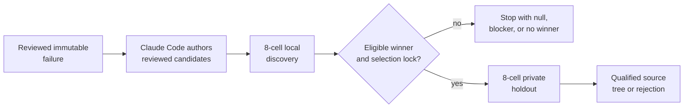
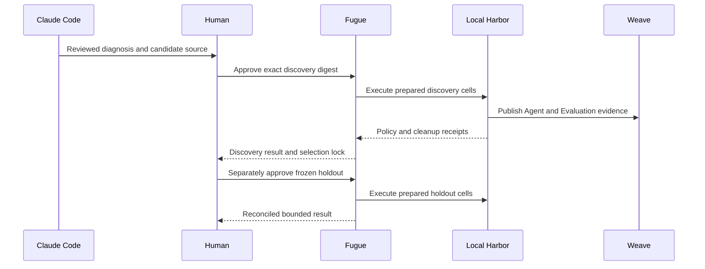

# Fugue 4B — From a Trace to a Release Decision: The Claude Code–Fugue Loop

> **Fugue: Evals for the Agentic Software Factory · Part 4B**  
> A standalone qualification runbook for maintainers evaluating a real Agent
> improvement loop. **Status:** draft preregistration; no result, accepted
> preview, or qualified flagship run exists. **Reading time:** about
> 11 minutes.

All products, evidence objects, approval boundaries, and presentation gates
are introduced here. The runbook is useful without the architecture essay
that precedes it.

The failure that shaped it was a demo that never risked discovering anything.
The tasks were fixtures, the outcome was known, and the approval gesture could
not change what ran. It was reliable on stage because we had removed the
boundaries the product claimed to govern.

The current claim is narrower and more useful:

> The flagship is Claude Code engineering a reviewed Agent change while Fugue
> freezes, approves, runs, and evaluates the comparison through local Harbor.

The flagship fails that claim if the starting failure is synthetic, if Claude
Code can approve or grade its own change, if the accepted digest differs from
execution, if the selected intervention changes before holdout, if local
Harbor receipts do not reconcile, or if the final memo claims more than the
locked Study supports.

This is a qualification contract, not a record of a completed demo. No Study
result, treatment winner, package decision, merged source tree, or Serverless
run is claimed here. A null, incomplete, or no-winner result is valid and
ends the loop without a staged victory.

## Scope and terms

**Claude Code** is both the loop engineer that diagnoses a reviewed failure
and the fixed Agent harness used in the comparison cells. **Fugue** owns the
immutable plan, human approval, candidate and runtime locks, local
Docker/Harbor execution, host-private truth, evaluation, evidence
reconciliation, and selection boundary. **Weave** stores native calls and
Evaluations. **Study Console** projects safe Study state.

**Aria is optional.** It may be connected as a read-only presentation shell
for safe evidence and Study projections. It is not a runtime dependency, a
candidate, the cell harness, an approver, an executor, or evidence that Aria
itself improved.

The flagship and adjacent Studies have dedicated planned W&B/Weave projects:

| Lane | Planned project | Claim boundary |
| --- | --- | --- |
| Claude Code loop engineering | `wandb/fugue-claude-loop-engineering-v1` | Skill/MCP intervention under fixed Claude Code and local Harbor |
| Harness behavior | `wandb/fugue-harness-experiments-v1` | Task-specific harness behavior under one fixed model route |
| Repository memory | `wandb/fugue-memory-experiments-v1` | Dense retrieval and evidence-use policy under fixed Claude Code |
| MCP release behavior | `wandb/fugue-mcp-release-qualification-v1` | Separate source-isolated `main` versus final-staging comparison |
| Aria presentation | `wandb/fugue-aria-loop-engineering-v1` | Optional read-only/no-spend Study navigation; no Aria-improvement claim |

These project names are destinations in planned contracts, not evidence that
the Studies ran. No lane writes result rows into another lane’s project.

The current Fugue implementation stack is reviewable at five exact draft pull
requests:

| Draft source identity | Review-visible layer |
| --- | --- |
| #48 [@fugue-provider-draft] | Generic Evaluation provider contract |
| #49 [@fugue-evidence-v3-draft] | Source-aware V3 evidence and analysis |
| #50 [@fugue-mcp-qualification-draft] | Source-isolated MCP maintainer qualification |
| #51 [@fugue-real-studies-draft] | Dedicated loop, harness, and memory Studies |
| #52 [@fugue-routing-cleanup-draft] | Removal of obsolete shared-demo routing |

These pull requests establish source availability for review, not an accepted
preview, prepared runtime, launched cell, selected intervention, live
qualification, or qualified tree.

## What the audience should believe

After qualification—not at the time of this draft—an unfamiliar engineer
must be able to support six narrow statements:

1. The loop begins with one immutable, human-reviewed failure and resolved
   native evidence.
2. Claude Code proposes source, Skill, or MCP changes, but cannot approve,
   lock, select, or merge them.
3. Fugue expands an exact four-arm discovery, and a human approves its digest
   and cap.
4. Local Harbor executes prepared Claude Code cells with private truth kept
   outside the Agent boundary.
5. A treatment-selection lock is written before anyone opens the independent
   holdout.
6. The final qualified tree links aligned outcomes, mechanism evidence,
   native Agent/Evaluation evidence, and local runtime cleanup.

The audience should not leave believing that one MCP feature caused an
effect, that local Harbor proves remote isolation, that a no-key replay is
live Agent evidence, that the winner generalizes beyond the locked tasks, or
that the optional Aria shell was improved.

## The story begins before the stage

The flagship is one governed sequence:

```text
immutable failed trace
→ Claude Code diagnosis
→ human-reviewed Skill/MCP candidates
→ exact locks
→ 8-cell discovery
→ treatment-selection lock
→ 8-cell private holdout
→ qualified source tree
```

Discovery compares four exact arms on two public tasks:

```text
2 tasks × 4 Skill/MCP arms × 1 Claude Code harness × 1 attempt = 8 cells
```

The arms are production Skill + current MCP, patched Skill + current MCP,
production Skill + repaired MCP, and patched Skill + repaired MCP. Only Skill
and MCP identities vary. Model, Claude Code harness, prompts outside the
reviewed Skill, tasks, budgets, local Harbor policy, and attempt count stay
fixed.

After discovery reconciles, a saved analysis may write an immutable selection
lock. Only then does a separately approved holdout compare production with
the locked winner:

```text
4 private holdout tasks × 2 candidates × 1 Claude Code harness × 1 attempt
= 8 cells
```



Discovery and holdout are separate Studies with separate previews, approvals,
caps, run identities, and results. The holdout is not an extra attempt in
discovery, and a late intervention cannot enter it.

## The evidence scene

The flagship project is planned as:

```text
wandb/fugue-claude-loop-engineering-v1
```

The opening artifact is not a result card. It is one reviewed failed baseline
attempt with a stable identity and resolved links to its Evaluation root,
prediction-and-score Call, prediction Call, native Agent root, and Dataset.
W&B Runs provide versioned execution records [@wandb-runs]; Weave Calls form
the native trace tree [@weave-tracing]; the Dataset binds examples
[@weave-datasets]; and the Evaluation links predictions and scorers
[@weave-evaluations].

The failure lock contains public evidence identity, candidate and runtime
identity, the exact MCP revision and lock, and the reviewed source relation.
It excludes answers, scores, expected values, and private labels.

The narration is precise:

> This failed attempt is the reviewed source of the engineering question. It
> is not proof that the proposed change fixes it.

That sentence keeps telemetry in its proper place.

## The useful question for Aria

Aria is not required to ask the question. A human or any read-only Research
client can inspect the same safe projection:

> Which reviewed failure and mechanism evidence justify this registered
> comparison, and which claims remain unavailable before discovery and
> holdout?

If an Aria presentation shell is connected, it may explain the failure lock,
candidate labels, fixed controls, preview coordinates, Study state, and safe
result references. It may not author hidden tasks, read private truth, request
or issue approval, start execution, select the winner, mutate the holdout, or
write the final release decision.

The shell is therefore a navigation convenience, not part of the flagship
estimand.

## The approval card

The approval card is a review of one digest, not a generic “Run experiment”
button.

For discovery it displays the registered experiment and preset, exact source
tree, model and Claude Code runtime, four candidate digests, two task and
private-evaluator digests, eight coordinates, local Harbor policy, required
evidence gates, maximum cells and spend, expiration, and approval issuer.


Claude Code and the optional Aria shell cannot issue the grant. A trusted
operator approves the exact digest and caps:

```bash
uv run fugue research approve PREVIEW_DIGEST \
  --max-cells 8 \
  --max-usd APPROVED_CAP
```

Holdout receives a second approval card after the selection lock exists.
Reusing discovery approval would invalidate the workflow.

## Clean-clone preparation

The runbook begins from a clean reviewed Fugue tree and the exact candidate
worktree under evaluation. Paths and digests below are placeholders; no
credential lives in a repository.

```bash
export FUGUE_REPO=/ABSOLUTE/PATH/TO/QUALIFIED/FUGUE
export FUGUE_EXPECTED_SHA=QUALIFIED_FUGUE_SHA
export CANDIDATE_REPO=/ABSOLUTE/PATH/TO/REVIEWED/CANDIDATE
export CANDIDATE_EXPECTED_SHA=REVIEWED_CANDIDATE_SHA
export OPERATOR_ENV=/ABSOLUTE/PATH/TO/OPERATOR.env

test "$(git -C "$FUGUE_REPO" rev-parse HEAD)" = "$FUGUE_EXPECTED_SHA"
test -z "$(git -C "$FUGUE_REPO" status --porcelain)"
test "$(git -C "$CANDIDATE_REPO" rev-parse HEAD)" = \
  "$CANDIDATE_EXPECTED_SHA"
test -z "$(git -C "$CANDIDATE_REPO" status --porcelain)"
```

Install from the Fugue lock and unset unrelated provider credentials before
preparation. The accepted preview must bind the exact model route rather than
inherit ambient client configuration.

## One-time evidence and MCP preparation

First lock the reviewed failure, then prepare public discovery tasks,
host-private holdouts, both reviewed Skills, and both exact MCP runtimes.

The active identities are intentionally resolved by the reviewed repository
configuration. The final MCP staging source selected for preparation is
`staging/0.4.0` at
`29cc1b5b5cf4061afa1faa712021fa1b68ad0bf7`. [@mcp-final-staging] This exact
repository identity is not an accepted preview, prepared runtime, launched
canary, behavioral result, or package decision. If the candidate source
changes, the Skill or MCP lock changes and every affected preview becomes
stale.

Preparation is the only boundary allowed to build task images, Claude Code
runtime assets, context, or MCP packages. Active cells receive those assets
read-only and may not clone, install, or rebuild them.

The source-use no-key replay does not satisfy this preparation. It exercises
installation and deterministic result projection without starting a live
Agent or MCP server.

## Prepare the exact local Harbor boundary

The active workflow uses local Docker through Harbor. It prepares the exact
Claude Code harness, reviewed Skills, locked MCP runtimes, task images, and
host-private evaluation assets before the final preview.

Every completed cell must publish a run-scoped Harbor conformance receipt
binding its image/runtime identity, policy attestation, private-label boundary
check, privacy scan, cleanup check, and zero remaining run-scoped containers.
That is real behavioral evidence under a local policy. It is not Serverless
isolation certification.

Remote runtime definitions remain out of scope until separately reviewed
image, security, privacy, admission, lifecycle, and deletion receipts exist.
The flagship neither needs nor claims them.

## Complete the 8+8 Studies before presentation — required, not yet observed

The planned discovery command shape is:

```bash
uv run fugue run claude-loop-skill-mcp \
  --preset discovery \
  --run-name claude-loop-discovery-v1 \
  --env-file "$OPERATOR_ENV" \
  --preview \
  --json
```

The final preview must show exactly eight cells. Run it through Research so
the human approval binds the same digest, cap, and registered plan. Direct
execution that bypasses the Research approval ledger is not flagship
evidence.

After discovery terminates, export with Weave enrichment and run the saved
selection analysis. An eligible analysis writes
`intervention-selection-lock.json`; a no-winner analysis ends the loop.

The planned holdout command shape is:

```bash
uv run fugue run claude-loop-skill-mcp \
  --preset holdout \
  --selection-lock REPORT_DIR/intervention-selection-lock.json \
  --run-name claude-loop-holdout-v1 \
  --env-file "$OPERATOR_ENV" \
  --preview \
  --json
```

The holdout preview must contain only production and the selected arm across
four independent private tasks: exactly eight cells. It receives a new
approval. Any source, task, Skill, MCP, model, harness, or runtime drift
invalidates the selection lock.

## Build the evidence wall first — required, not yet observed

The flagship is not summarized by one green card. The team assembles four
separate ledgers:

| Outcome | Mechanism | Native evidence | Infrastructure/integrity |
| --- | --- | --- | --- |
| paired deterministic checks and critical regressions | assigned and confirmed Skill/MCP use, source opens, tool calls | Agent root, prediction, Dataset, Evaluation | image/runtime identity, policy, privacy, cleanup, zero orphans |

Every aggregate links to aligned rows. Every row links to one exact attempt.
Every attempt reconciles to one native Agent conversation and root, one Fugue
prediction, one Weave Evaluation row, and one local Harbor receipt. A count
that cannot be traversed is not evidence.

The selection analysis may inspect discovery only. Holdout truth and results
remain closed until the selection lock is durable. After holdout, reviewers
inspect at least baseline reproduction, every candidate gain or regression,
missing evidence, mechanism support for the selected intervention, and every
infrastructure exclusion.

## Rehearsal without consuming the evidence

A clean-clone rehearsal validates commands and failure handling without
pretending to create the missing result. Rehearsal may use a separately named
Study and approval, but its result cannot be relabeled as the flagship.

Rehearse:

1. a rejected preview;
2. an expired or stale approval;
3. a task or candidate digest mismatch;
4. an interrupted cell with terminal evidence;
5. missing Evaluation reconciliation;
6. local Harbor cleanup failure.

The active qualification must still run from the reviewed final tree with its
own unconsumed approvals. Receipts are append-only; rehearsal evidence stays
labeled rather than being deleted.

## Freeze the selection before holdout

The selection lock is the pivotal boundary. It binds the discovery snapshot,
exact source tree, complete four-arm ranking, paired examples, candidate
digests, and chosen arm.

An arm is ineligible unless discovery reproduces the baseline failure,
improves at least one relevant paired deterministic outcome, proves the
assigned Skill or MCP intervention was used, preserves native evidence, and
has complete local Harbor receipts. Cost or latency alone cannot select a
winner.

Only production and the selected arm enter holdout. Claude Code may author a
new candidate after seeing discovery, but that candidate belongs to a new
Study and cannot enter the frozen holdout.

## What the audience sees while cells run

Local Agent work still has dead time. The view projects a small state for each
coordinate:

```text
planned → admitted → container starting → Agent running
→ evidence publishing → cleaning up → reconciled
```

For the selected cell it shows task, candidate, harness, route, and attempt
identity; local runtime and policy identity; current lifecycle transition; a
safe Agent conversation link when available; prediction and Evaluation links
after publication; and cleanup state.

It does not stream private labels, full environment, credentials, hidden
reasoning, or unsafe raw logs. A structured failure stays visible with its
origin. If the wall clock exceeds the presentation slot, the real operation
continues and the presentation ends with an explicit incomplete state. No
prerecorded outcome replaces it.

## Presentation sequence

### 1. Establish reality

Open the reviewed failed attempt and its native evidence links. Show the
failure-lock identity.

### 2. Explain the candidate

Have Claude Code explain the diagnosed failure and the reviewed Skill/MCP
changes. Show the human review and exact locks; do not claim a fix.

### 3. Explain the preregistration

Show the four discovery arms, fixed Claude Code and model route, two tasks,
eight coordinates, outcome and mechanism gates, local Harbor policy, and cap.

### 4. Cross the human boundary

Approve the discovery digest in the trusted operator surface. Show that
Claude Code and Aria cannot issue the grant.

### 5. Watch real local work

Show local Harbor lifecycle, native Agent and Evaluation publication, and
cleanup per cell.

### 6. Reconcile discovery

Open the four ledgers separately. An incomplete row blocks selection.

### 7. Freeze the winner—or stop

Write and inspect the treatment-selection lock. If no arm is eligible, end
with no winner.

### 8. Preview and separately approve holdout

Show exactly production versus the locked winner on four private tasks. Keep
private truth out of the Agent and presentation surfaces.

### 9. Reconcile before interpreting

Wait for eight terminal holdout coordinates and all required linked objects.
Do not replace a failed coordinate with an unlabeled retry.

### 10. End with a bounded memo

The human maintainer records baseline reproduction, paired gains and
regressions, mechanism evidence, local runtime limitations, the qualified or
rejected source tree, and one unlaunched follow-up.



## Failure is part of the runbook

A credible system needs an explicit failure version.

If the starting failure cannot be reconciled, the loop does not begin. If an
assigned intervention is not confirmed, that arm is ineligible. If discovery
has no winner, holdout is never opened. If the selection lock drifts, holdout
preview fails. If a container fails to start, the row remains missing. If
cleanup cannot be proven, the result is ineligible. If holdout is null or
regresses critically, the candidate is rejected.

The presentation never responds by switching to the no-key replay without
labeling the evidence change. The replay can demonstrate installation and
result shape; it cannot complete a live Agent, MCP, Harbor, or treatment
claim.

## Qualification checklist

Before calling the flagship decision-ready:

- the exact final Fugue and candidate trees are clean and reviewed;
- the starting failed attempt and all five native evidence relationships
  reconcile;
- the no-key replay is labeled installation smoke, not live MCP evidence;
- both Skills and both MCP candidates are reviewed, prepared, and locked;
- the discovery preview expands to exactly eight cells;
- a human approves that exact digest and cap;
- every discovery row reconciles outcome, mechanism, native evidence, local
  Harbor policy, privacy, cleanup, and zero-orphan state;
- the selection lock exists before holdout is opened;
- the holdout preview contains exactly production and the selected arm across
  eight cells;
- holdout receives a separate approval;
- baseline failure reproduction, at least one relevant gain, and no critical
  holdout regression are supported;
- the qualified tree equals the reviewed tree;
- no lane’s results are mixed into another project;
- Aria, if present, remains read-only and optional.

The MCP package-release decision is separate. Its current status is `HOLD`:
the source-isolated zero-model checks have run, but the paid `main` versus
final-staging Agent Study and independent package sign-off described in
Fugue 3 have not.

## Try this in 15 minutes

Draw two boxes labeled discovery and holdout. Put the four Skill/MCP arms in
the first and only production plus `selected-arm` in the second. Draw a one-way
selection-lock arrow between them.

Now label the no-key replay, direct MCP receipt, discovery result, and holdout
result. If your diagram lets any earlier artifact stand in for a later one,
the evidence boundary is not ready.

Finally add Aria outside the execution path with read-only arrows to safe
Study and result projections. If removing that box changes the candidate or
execution semantics, the shell is not actually optional.

## When the flagship is unnecessary or insufficient

Use the no-key replay for installation and projection checks. Use a failing
test for a known deterministic defect. Do not run 16 Agent cells merely to
prove parsing works.

The flagship earns its cost when a reviewed Agent change needs controlled
discovery, frozen selection, and independent holdout. It remains insufficient
when the source failure is weak, expected answers leak, the selected
intervention is not observed, native evidence is missing, or local runtime
receipts cannot be reconciled.

## What this does not show

The flagship demonstrates one bounded Claude Code–Fugue improvement loop. It
does not prove every Agent, Skill, MCP server, memory system, task class, or
runtime.

Local Harbor receipts establish the declared local execution policy, not W&B
Serverless isolation or complete security. The optional Aria shell is a
presentation and navigation aid, not autonomous release authority and not an
evaluated treatment.

The MCP release decision is not this flagship result. It remains `HOLD`
pending its own paid source-isolated staging comparison and package gates.
The harness and repository-memory lanes also remain separate planned Studies
in dedicated projects.

At the time of writing, no loop-engineering Agent result exists. That
limitation is the consequence of the same evidence contract the flagship is
meant to demonstrate.

## Results appendix — intentionally empty

A future dated appendix must link:

```text
qualified Fugue and candidate tree identities:
reviewed failure lock and native evidence:
Skill and MCP candidate locks:
discovery preview, approval, Result, and local Harbor receipts:
treatment-selection lock:
holdout preview, approval, Result, and local Harbor receipts:
planned/admitted/terminal/excluded/missing cells:
deterministic outcomes and critical regressions:
confirmed intervention-use evidence:
Weave Agent, prediction, Dataset, and Evaluation reconciliation:
privacy, cleanup, and zero-orphan receipts:
qualified or rejected source tree:
human maintainer memo:
supported claims and limitations:
```

No screenshot substitutes for an underlying object or receipt.

## Next: who built the evaluator?

The flagship makes an Agent both an engineer and a subject of evaluation.
Fugue itself was also co-developed with agents working across tasks,
worktrees, tests, and stacked changes. That recursion is useful and
dangerous.

In the final installment, **Fugue Extra**, we audit what Agent
co-development can legitimately show—implementation throughput, defects
caught, invariants encoded, and obsolete code removed—and draw the boundary
it cannot cross.

## References

Complete source metadata and numbered citations are generated from this
article package’s `sources.json`.
