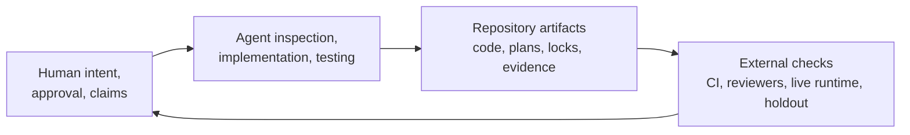
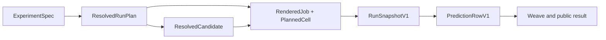
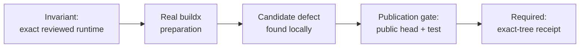
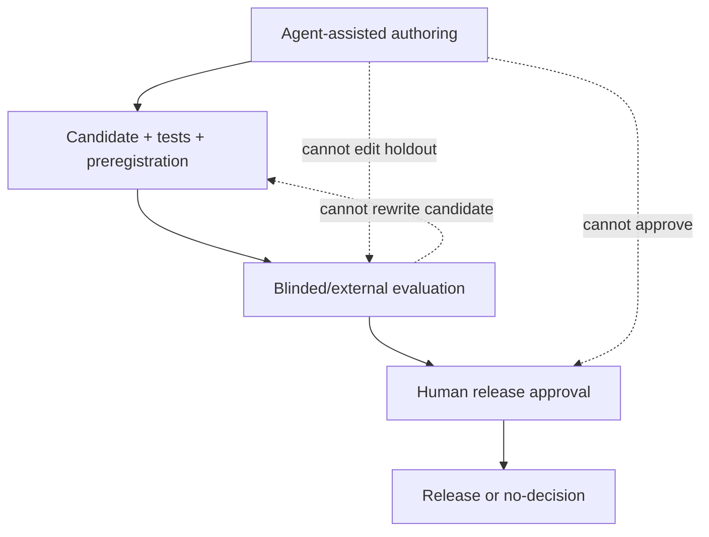

# Fugue Extra — Building the Evaluator with the Evaluated

> **Fugue: Evals for the Agentic Software Factory · Extra**  
> A standalone audit for agent-first engineering teams and maintainers.
> **Status:** concept, publication gated on final history. **Reading time:**
> about 10 minutes.

This essay defines co-development, evaluator validity, and the human/agent
authority split without depending on the rest of the series. Every
quantitative statement is recoverable from merged history or a named
qualification receipt.

The failure that motivated it was recursive confidence. An agent proposed an
invariant, implemented it, wrote the test, and summarized the green build.
Every artifact agreed—because they shared an authoring process. The
agreement showed that the repository was internally consistent. It did not
show that the invariant captured the real product risk.

The claim this essay defends:

> Agents can co-develop their own evaluation infrastructure, but that is
> evidence about the development process—not proof that the evaluator is
> correct.

You could weaken this claim by showing that independent human and held-out
review adds no new failures, or that agent-authored evaluators stay
calibrated under distribution shift without external checks. Fugue’s
development history suggests the opposite. This essay quantifies only the
artifacts we can actually audit.

## Scope and terms

**Co-development** means agents materially assisted inspection, planning,
implementation, testing, review, or evidence preparation. **Process
evidence** describes how the system was built. **Evaluator validity** asks
whether its measurements and decisions stay calibrated under independent
scrutiny. **Exact-tree qualification** means running the code and runtime
that will actually be released—the exact git tree, not an approximation. We
keep the term because “tested something similar” is where release claims go
to die.

Shared tools do not erase role separation. Product intent, accepted
invariants, private labels, release authority, and supported claims remain
human-accountable even when agents prepare their evidence.

Two of Dudycz’s arguments constrain this whole story: generated volume is
not progress [@dudycz-end-coding], and deletion can be the more valuable
design act [@dudycz-subtraction]. Weng’s self-improvement survey names the
recursive risk we are managing [@weng-harness], and Hamel’s automated-evals
analysis keeps human-guided error inspection outside the optimizer.
[@auto-evals]

## What “co-developed” means

Fugue was not generated from one prompt. Work moved through task briefs,
parallel worktrees, stacked pull requests, review comments, tests, live
qualification, and integration plans. Agents inspected repositories,
proposed designs, implemented code, ran checks, investigated failures, and
prepared evidence. Humans set product intent, resolved authority decisions,
approved external actions, and bounded claims.

The honest division:

| Responsibility                       | Humans                | Agents                  |
| ------------------------------------ | --------------------- | ----------------------- |
| Product intent and acceptable claims | Own                   | Clarify and challenge   |
| Architecture and invariants          | Approve               | Propose, encode, test   |
| Implementation                       | Review                | Implement and revise    |
| Test and static analysis             | Require               | Run, interpret, repair  |
| Experiment design                    | Approve               | Draft and resolve       |
| Spend and release authority          | Own                   | Request only            |
| Evidence inspection                  | Review critical cases | Reconcile and summarize |
| Final accountability                 | Own                   | Never substitutes       |

This is not a claim that every commit followed an ideal process. It is the
boundary we are trying to make enforceable.



The repository artifacts are the shared system of record. Conversation
memory is useful during work and insufficient for audit.

## Agent legibility

An agent needs more than source code. It needs to know which
representations are canonical, which actions are pure, which identities must
survive, and which apparently convenient shortcuts are invalid.

Fugue encodes that context in source-controlled plans and comparison
specifications, strict schemas and versioned records, repository-local
development guidance, dependency and evidence and runtime locks, focused
failure tests, durable run and Study events, and evidence links that can be
reopened.

The `fugue-dev` repository Skill is one such artifact. It tells an agent to
preserve a single path from experiment specification through resolved plan,
candidate, rendered job, snapshot, normalized prediction, and publication.
It separates behavioral identity from execution policy, requires pure
preview, keeps private labels host-only, forbids active trials from
installing assets, and demands exact-final-head live evidence.

A Skill is not enforcement. Its value is that it turns tacit architectural
knowledge into reviewable instructions and gives tests a vocabulary to
target. Its failure modes are just as clear: it can be stale, contradictory,
too long to apply consistently, or written by the same process it
constrains.

The stronger pattern is:

```text
instruction → strict representation → runtime check → failure test → live evidence
```

If an invariant exists only in the instruction, you have documentation. If
it exists only in a test, an agent may not understand why the nearby
workaround is wrong.

## Case study 1: identity became code

Early experiment code could reconstruct meaning in multiple places. The CLI,
renderer, exporter, and UI each knew enough fields to describe a run—so two
surfaces could pair rows differently, and a display label could stand in for
candidate identity.

The development guidance now makes the rules explicit: resolve one immutable
candidate and reuse it everywhere; include behavior-changing inputs in
candidate identity; keep runtime and scheduling in an execution fingerprint;
identify examples by dataset, workload, and logical task; keep trial index a
separate coordinate; never pair by label, path, list position, or Evaluation
display name; normalize each logical Agent outcome once; publish
idempotently by identity and revision.

Agents helped apply those rules across parser, resolver, operator, renderer,
exporter, and tests. The interesting evidence is not that the agent
understood the prose. It is that a changed identity field now causes a
readiness, snapshot, reconciliation, or test failure at the relevant
boundary.



The chain also limits agent creativity in the right place. An implementation
agent can add a new MCP import adapter. It cannot create a second execution
path, because the public comparison compiles into the canonical lifecycle.

What can you audit? Public PR #43 contains the strict comparison-control
types, tests, and documentation at exact head
`397b918713520ac484281a95591bed3aad5e66e4`. GitHub reports 14 changed files,
2,298 additions, and 12 deletions for the stacked PR diff. The line count is
not quality. It is scope evidence for review. [@fugue-pr43]

## Case study 2: exact-tree preparation found a real runtime defect

The W&B Serverless runtime work offers a sharper example, because the defect
appeared at a production preparation boundary.

Fugue needs public, digest-pinned images containing exact Agent, MCP, task,
and Fugue assets. The build must happen before Agent execution, for
`linux/amd64`, from a clean reviewed tree. A local smoke test is not enough:
the actual multi-platform builder resolves image references differently.

Public PR #45 establishes the Serverless backend boundary at exact head
`2f6453e28f585dc010905a153926af84ba2cdd58`; GitHub reports 32 changed files,
3,047 additions, and 117 deletions in its stacked diff. [@fugue-pr45] A
later local qualification exposed a BuildKit image-reference defect and
prompted runtime hardening—but those follow-up commits are not on a public
PR head, so this draft does **not** count or cite them as published
evidence. The case becomes auditable only after a public head contains the
fix, its failure test, and the exact-tree qualification receipt.



What the public evidence proves is narrower: the remote boundary exists for
review. The local defect report is a candidate case study, not yet
publication evidence. This is why public exact-head history and final-head
qualification remain release gates.

## Case study 3: garbage collection needed judgment

The integration plan called for removing obsolete surfaces before adding
more control-plane code. An agent ran Vulture at 80% and 60% confidence,
inspected callers, removed confirmed dead paths, and documented dynamic
surfaces static analysis could not see.

Public PR #42 at head `04152c2325b446d5a55f565c9f2ce40a9f9bd227` changes 20
files with 350 additions and 91 deletions in its stacked diff. [@fugue-pr42]
The net addition is instructive: many added lines are a reviewed Vulture
whitelist with reasons, plus cleanup policy and curator support. “Dead-code
cleanup” did not mean optimizing a negative line count. It meant making
every remaining static finding accountable.

Three suspect compatibility surfaces survived:

1. a legacy dataset fingerprint with a migration test;
2. Research HTTP aliases that preserve persisted artifact access and have
   cross-route equality tests;
3. a W&B evidence-key fallback that does not weaken provider-specific
   inference routing.

Keeping those paths was not a cleanup failure. Deleting them without a
migration or deprecation boundary would have been.

The documented rule:

```text
every finding → remove | connect to a real caller | narrowly justify
```

The whitelist is limited to dynamic mechanisms Vulture cannot see:
serialized fields, import-string registries, framework callbacks, and
supported public reconstruction helpers. Ordinary private helpers cannot
escape through it.

This case captures the human role. Static tools and agents build the
candidate inventory. Product ownership decides whether a persisted V1 reader
or public route remains supported. The decision becomes testable evidence
rather than an unrecorded hunch.

## The stack as research evidence

The public July integration stack can be reconstructed from GitHub PR
metadata:

| Public head | Auditable layer | Changed files | Insertions | Deletions |
| --- | --- | ---: | ---: | ---: |
| PR #42 / `04152c2…` | Obsolete-surface cleanup and liveness policy | 20 | 350 | 91 |
| PR #43 / `397b918…` | Governed registered comparisons | 14 | 2,298 | 12 |
| PR #44 / `68c8b9d…` | Genuine W&B MCP qualification assets and gates | 24 | 2,020 | 196 |
| PR #45 / `2f6453e…` | W&B Serverless backend and runtime preparation | 32 | 3,047 | 117 |

These numbers were read from GitHub PR metadata on 2026-07-28 and describe
each stacked PR against its declared base, not four independent diffs
against `main`. [@fugue-pr44] They are not productivity metrics. Insertions
can be duplication; deletions can be damage. The table exists so a reviewer
can open the exact public head and inspect the layer.

A newer five-layer stack is also review-visible, but remains draft:

| Draft source identity | Review-visible layer |
| --- | --- |
| #48 [@fugue-pr48] | Generic Evaluation provider contract |
| #49 [@fugue-pr49] | Source-aware V3 evidence and analysis |
| #50 [@fugue-pr50] | Source-isolated MCP maintainer qualification |
| #51 [@fugue-pr51] | Dedicated loop, harness, and memory Studies |
| #52 [@fugue-pr52] | Removal of obsolete shared-demo routing |

This table records exact review URLs, not completion. None of these draft pull
requests supplies an accepted preview, live qualification, Study result,
final staging SHA, package decision, merge, or release.

The more important sequence is dependency:

```text
canonical comparison
→ cleanup
→ governed Research control
→ real MCP evidence Study
→ local Harbor behavioral qualification
→ runtime hardening
→ final-head qualification
```

An older prerequisite PR cannot substitute for a child’s own committed,
pushed, exact-head pull request. Unit tests from the foundation cannot
qualify the final runtime tree. Stacked work demands stack-aware evidence.

## What we can quantify

Agent co-development invites inflated metrics: prompts issued, tokens spent,
“hours saved.” We avoid them unless the collection method is stable and
decision-relevant.

The auditable quantities are ordinary ones: exact commits and parent
relationships; files and production/test lines changed; tests added and the
failure each encodes; static-analysis findings and adjudications;
regressions caught by named checks; clean-clone rehearsals; final-head
runtime qualifications; planned and reconciled Study cells; deleted
production lines and retained compatibility boundaries.

Even these need context. A count of tests says nothing about assertion
quality. A clean clone can reproduce a broken workflow. A final-head run can
use an unrepresentative task. Quantification narrows the audit surface; it
does not finish the audit.

At the time of writing we can audit the commits and their tests. We cannot
honestly count successful full MCP cohorts, presentation rehearsals, or
unfamiliar-user reproductions, because those gates remain pending.

## Separation despite shared agents

The recursion risk is not removed by assigning three different agent
threads. They may share the same model, repository context, assumptions, and
failure modes.

We separate roles by authority and evidence instead. **Authoring** can
propose code, tasks, rubrics, and expected facts. **Evaluation** receives
blinded outputs and a locked rubric; it cannot edit the candidate. **Release
approval** sees the result and limitations; it cannot rewrite history.

Independent humans review critical labels and calibration. Holdouts stay
unexposed to discovery. Runtime systems supply lifecycle evidence the
implementation agent cannot fabricate through the result schema. Git and
Weave preserve artifacts another engineer can reopen.



Do not overstate the independence. A Claude judge and Claude-assisted
implementation may share priors. Two human reviewers may share team culture.
Externality is a gradient. The practical response is to disclose it and use
different evidence types, not to claim purity.

## Rejected work is durable input

Agent-heavy development can erase its false starts, because generating a new
approach is cheap. That makes the same mistake cheap to repeat.

Fugue’s Research records and Git history preserve rejected proposals and
their reasons, incomplete Studies, null and reversed outcomes, superseded
results, blocked runtime preparations, migration decisions, and dead-code
adjudications.

An outer-loop agent can read that history before proposing another Study. It
still cannot convert an old failure into a new truth. Durable negative
evidence helps when it is scoped: “this exact runtime failed because its
image reference was not portable” is useful; “buildx does not work” is not.

## A copyable co-development ledger

For each agent-assisted integration layer, record:

```yaml
change:
  branch: "<branch>"
  commit: "<sha>"
  parent: "<sha>"
  intended_contract: "<one bounded sentence>"

authorship:
  human_decisions:
    - "<product or authority decision>"
  agent_work:
    - "<inspection, implementation, test, or evidence task>"

verification:
  deterministic:
    - command: "<exact command>"
      result: "<receipt>"
  static_analysis:
    findings: "<count>"
    removed: "<count>"
    connected: "<count>"
    justified: "<count>"
  live:
    tree: "<tree sha>"
    runtime_lock: "<digest>"
    evidence: "<canonical reference>"

review:
  independent_reviewer: "<role, not invented person>"
  blocking_findings: []
  limitations: []

authority:
  pushed: false
  pr_open: false
  merged: false
  released: false
```

The false booleans are the useful part. A local commit is not a PR; a PR is
not a merge; a merge is not a release.

## Try this in 15 minutes

Pick one agent-authored change and record four different receipts: public
source identity, the failing evidence that motivated it, independent review,
and exact-tree qualification. If one is absent, state exactly which process
claim remains supportable. Do not substitute green self-authored tests for
external validity.

Then run the subtraction ledger against the same change: obsolete production
surface removed, compatibility retained with evidence, new concepts
introduced. This catches “cleanup” PRs that merely move complexity into a
whitelist.

## When co-development evidence is insufficient

Commit counts, generated tests, and green CI can describe throughput. They
cannot validate an evaluator. Independent review, hostile cases, held-out
labels, final-head execution, and human release authority remain necessary.
Where those boundaries are absent, agent participation increases the need
for skepticism rather than reducing it.

## What this does not show

The stack history does not prove Fugue is a correct evaluator. It shows how
specific contracts were implemented and how one runtime defect was caught.

Git statistics do not measure quality or agent contribution. We have no
human-only counterfactual for time, cost, or defects. The development Skill
may encode shared blind spots. Agent-written tests can confirm an
agent-written misunderstanding. Human reviewers are not automatically
independent or calibrated.

The cleanup commit’s net addition demonstrates that liveness documentation
has a maintenance cost. The exact-image fix does not qualify the final
image. The real hosted seed evidence does not supply the Claude loop or MCP
staging result. The co-development process remains subject to the same
evidence rules it built.

## The unresolved question

Can an eval system improve itself without grading its own homework?

Our answer is not “yes.” It is a design for continuing to ask: keep
candidate, evaluator, and approval authorities separate; keep holdouts and
private facts outside the proposer; preserve exact identities and negative
evidence; require external runtime and maintainer evidence; make every
adaptive change a new Study; publish nulls and limitations; and keep
deleting obsolete machinery.

Agents make this discipline more important, because they can modify every
layer quickly. They also make it more achievable, because they can
continuously inspect, reconcile, test, and clean those layers.

That tension is the point of the series. The agentic software factory is not
a machine that produces code without people. It is a system in which the
scarce human acts—intent, judgment, and authority—are connected to enough
exact evidence that abundant generation can be useful.

## References

Complete source metadata and numbered citations are generated from this
article package’s `sources.json`.
