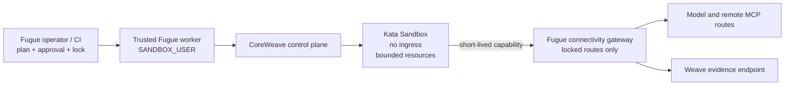

# CoreWeave Sandboxes

CoreWeave is an optional execution backend beneath Fugue's existing Harbor
cell lifecycle:

```text
Comparison → ResolvedRunPlan → PlannedCell → Harbor
           → CoreWeave Sandbox → PredictionRowV1
```

It does not add another executor, candidate identity, approval path, retry
policy, or result format. Baseline and candidate use the same execution policy.
Changing the backend, runner, profile, image, network, gateway, resource, or
lifetime lock changes the execution fingerprint and invalidates approval.

CoreWeave Sandboxes are currently in public preview. Local Harbor/Docker
remains Fugue's default.

## Trust boundary

The trusted worker owns `CWSANDBOX_API_KEY` with only `SANDBOX_USER`. A
CoreWeave administrator creates and binds the profile separately. The Agent
gets neither credential. In connected mode it receives only a short-lived
single-cell gateway capability.



The checked-in profile requires:

- `kata-qemu`;
- a per-user namespace;
- no ingress or service-account token;
- non-root execution, default seccomp, no privilege escalation, and no Linux
  capabilities;
- a digest-pinned image;
- bounded CPU, memory, workspace, temporary, and artifact storage;
- deny-all egress by default;
- either deny-all connectivity or one named CIDR allowlist that reaches only
  the connectivity gateway.

Namespaces organize quotas and policy; they are not a kernel security
boundary. Kata and network policy are required for untrusted Agent code.

## Prepare the administrator profile

Copy and edit
[`deploy/coreweave/fugue-untrusted-ci-v1.yaml`](../deploy/coreweave/fugue-untrusted-ci-v1.yaml).
Replace the documentation image digest and gateway CIDR. An administrator with
`SANDBOX_ADMIN` creates the profile and binds it to a runner. CI and Fugue do
not receive that administrator credential.

Connected runtime images must contain the exact gateway CA certificate at
`/etc/fugue/gateway-ca.pem`. Fugue hashes that file inside the running Sandbox
before Agent execution and compares it with the profile lock. Standard Python,
Requests, curl, and Node certificate environment variables are pinned to that
path.

The protected image build must also write
`/etc/fugue/runtime-manifest.json`. The strict manifest lists the Python
version and the digest and immutable image path of every Fugue source,
prepared Agent runtime, stdio MCP runtime, Agent Skill, context runtime, and
task runtime included in the image. The manifest is bound into the profile
lock. `fugue check` rejects a comparison whose selected components are absent
or have different digests, and both the adapter and `doctor` verify the
manifest and its read-only, symlink-free asset paths inside the Sandbox.

The checked-in
[`runtime-manifest.example.json`](../deploy/coreweave/runtime-manifest.example.json)
is documentation input, not a qualified manifest. Replace its placeholder
digests during the protected image build and embed the exact same JSON in the
digest-pinned image.

For a disconnected comparison:

```bash
uv run --extra coreweave fugue sandbox coreweave lock-profile \
  --runner RUNNER_ID \
  --profile fugue-untrusted-ci-v1 \
  --profile-id PROFILE_ID \
  --profile-document deploy/coreweave/fugue-untrusted-ci-v1.yaml \
  --runtime-manifest deploy/coreweave/runtime-manifest.json \
  --network none \
  --output .fugue/coreweave-profile.lock.json
```

For a connected comparison, deploy the gateway with an exact TLS certificate
and edit the example gateway policy. Then lock the same administrator profile:

```bash
uv run --extra coreweave fugue sandbox coreweave lock-profile \
  --runner RUNNER_ID \
  --profile fugue-untrusted-ci-v1 \
  --profile-id PROFILE_ID \
  --profile-document deploy/coreweave/fugue-untrusted-ci-v1.yaml \
  --runtime-manifest deploy/coreweave/runtime-manifest.json \
  --network gateway \
  --gateway-policy deploy/coreweave/gateway-policy.yaml \
  --gateway-base-url https://gateway.internal.example \
  --gateway-certificate deploy/coreweave/gateway.crt \
  --gateway-cidr 203.0.113.7/32 \
  --gateway-host gateway.internal.example \
  --output .fugue/coreweave-profile.lock.json
```

The lock command validates the profile's security fields. It does not create or
edit CoreWeave infrastructure.

## Comparison policy

```yaml
execution:
  backend: coreweave
  sandbox_profile: fugue-untrusted-ci-v1
  network: gateway
  max_lifetime_seconds: 1800
```

Only `none` and `gateway` are accepted. CoreWeave comparisons run serially in
the technical preview. Sidecars, Docker Compose tasks, host mounts, devices,
Docker sockets, arbitrary annotations, environment passthrough, and sandbox
secrets are rejected. Stdio MCP servers and Agent Skills must already be in
the locked runtime image. The adapter executes MCP servers from their
read-only image paths and copies locked Skills from the image into Harbor's
fresh per-attempt Skill directory; it never uploads an unreviewed Skill or
downloads a package. Remote MCP URLs are rewritten to a route derived from the
registered integration ID, such as `mcp-wandb`; an external URL that does not
have that exact policy route is rejected before launch.

CoreWeave may place the already-qualified digest-pinned image. That is remote
infrastructure placement, not permission for the Agent to pull, build,
download, or install software.

## Qualify the runtime

Set a short-lived `SANDBOX_USER` token only in the trusted worker environment:

```bash
export CWSANDBOX_API_KEY
uv run --python 3.13 --extra coreweave fugue sandbox coreweave doctor \
  --lock .fugue/coreweave-profile.lock.json
```

`doctor` creates one disposable Sandbox, validates the effective runner,
profile, egress, ingress, and resources, checks non-root execution, absence of
the Kubernetes token, read-only root, Harbor's bounded writable paths, the
runtime manifest and assets, and deletes the Sandbox. A successful schedule
against the exact locked profile also proves
that the configured `kata-qemu` RuntimeClass exists; the current public-preview
SDK does not separately return `runtimeClassName` or the effective image
digest. The attestation records this scope instead of claiming that the SDK
reported fields it does not expose.

For a connected profile, the live security qualification must additionally
probe the gateway allowlist, blocked destinations, metadata and Kubernetes
endpoints, TLS pin, route/path/method/body limits, token expiry and cross-cell
replay, and upstream credential isolation. That suite is a merge gate, not a
unit-test substitute.

## Connectivity gateway

`fugue-connectivity-gateway` is an application gateway, not a general proxy.
It:

- accepts only `/routes/ROUTE_ID/...`;
- supports only policy-declared GET and POST paths and content types;
- rejects `CONNECT`, query-bearing proxy URLs, path traversal, redirects,
  arbitrary upstreams, and private literal upstream addresses;
- resolves upstreams from an operator-owned policy;
- injects locked non-secret routing headers, such as the W&B Inference
  project, while rejecting credential, host, proxy, and forwarding headers;
- rejects private DNS answers and connects TLS to the exact validated address
  while preserving hostname and certificate verification, closing the
  resolver-to-connection rebinding gap;
- removes Agent authorization/cookie/proxy headers and injects the upstream
  credential on the trusted side;
- accepts the cell capability as either bearer auth or W&B's `api:<key>`
  Basic-auth form, then independently encodes the locked upstream credential;
- applies per-route and per-capability request/response limits;
- binds a capability's first use to the direct Sandbox source address and
  rejects later use from another Sandbox;
- bounds concurrent client connections and streams at most the locked response
  size rather than buffering an unbounded upstream body;
- accounts capability use in a SQLite WAL ledger;
- avoids logging tokens, bodies, prompts, or private content.

W&B API and Weave trace traffic use separate locked routes because the SDK
uses separate upstreams. The example policy sends W&B GraphQL initialization
through `wandb-api` and call data through `weave`; it never treats an opaque
internal reference as permission to reach an arbitrary W&B endpoint.

Run it behind the stable private address admitted by the CoreWeave profile:

```bash
export FUGUE_GATEWAY_SIGNING_KEY="$(openssl rand -base64 32)"
uv run fugue-connectivity-gateway \
  --policy deploy/coreweave/gateway-policy.yaml \
  --ledger .fugue/gateway/usage.sqlite3 \
  --issuer INSTANCE_ID \
  --host 0.0.0.0 \
  --port 8790 \
  --tls-cert deploy/coreweave/gateway.crt \
  --tls-key /run/secrets/fugue-gateway-key
```

Keep the signing key, provider credentials, Weave credential, and TLS key out
of the repository. The Sandbox receives only its expiring capability.
Connect Sandboxes directly to the gateway; a shared source-NAT or reverse proxy
would erase the source identity used for cross-Sandbox replay detection.
The gateway deployment should also apply an outbound firewall for the locked
provider address ranges. The application checks are defense in depth, not a
replacement for network policy on the trusted gateway itself.

## Recovery and cleanup

CoreWeave create is not treated as idempotent. Each Sandbox gets opaque
Fugue-instance, run, cell, and execution tags. Before creation the Harbor
adapter searches for the exact tag set. If it finds an interrupted Sandbox, it
deletes it and terminally fails the attempt rather than risking duplicate Agent
execution. The Sandbox ID and effective attestation are persisted before the
Agent is allowed to run.

Finalization deletes with missing-ok semantics. Operators can sweep only one
Fugue instance:

```bash
uv run --extra coreweave fugue sandbox coreweave sweep-orphans \
  --instance-id INSTANCE_ID \
  --older-than-seconds 3600
```

Tags are recovery selectors, never authorization.

## Evidence

The profile lock is stored in the execution definition, runtime lock,
RunSnapshot, reproduction bundle, and Weave metadata. The effective Sandbox
attestation is collected into the normalized prediction row. Missing,
malformed, or drifting attestation makes remote evidence ineligible; it does
not become an Agent task failure.

Provider and Weave credentials stay in the gateway or trusted worker. Connected
Agent traces may stream through the locked Weave gateway route; the Agent sees
only its cell capability, never the upstream credential. Attempt outputs and
attestations remain bounded artifacts that the worker validates after teardown.
Before host extraction, Fugue rejects malformed or oversized archives, path
traversal, symlinks, hard links, devices, FIFOs, sockets, and output sources
outside Harbor's locked writable roots.
Tokens and credential values are excluded from configs, snapshots, rows,
bundles, Study records, and Weave attributes.

## CI

The reusable workflow in `.github/workflows/coreweave-security.yml` runs mock
contract tests without credentials. Its live job uses a protected GitHub
environment, a short-lived `SANDBOX_USER` secret, the exact lock, `doctor`, and
the approved comparison. It uploads result and attestation bundles. Missing
Sandbox, gateway, attestation, or evidence is infrastructure-incomplete (exit
code 3), never success.

Do not merge a CoreWeave backend change using unit tests alone. The exact final
head, image digest, administrator profile, runner, gateway, and routes must pass
the live suite together.
