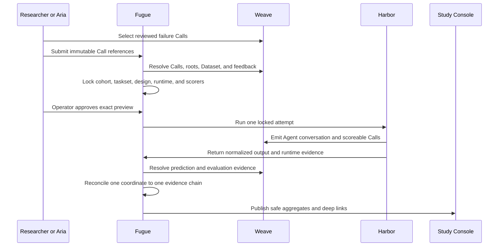

# Weave, Fugue, and Harbor integration review

Status: request for design review from the Weave team

## Why this review exists

Fugue turns a trace-backed suspicion into a controlled Agent experiment.
Weave is the authoritative record for conversations, tool calls, annotations,
datasets, predictions, and evaluations. Harbor runs the isolated attempts.
Fugue sits between them: it locks the design, admits paid work, launches one
cell at a time, and proves that each planned coordinate maps to the evidence we
later inspect.

The integration works today, but several edges rely on Fugue conventions where
a first-class product contract would make autoresearch safer and easier to
understand.

## Current flow



Study Console is a projection. It does not copy Weave trace bodies or become a
second evaluation store.

## What Weave already provides

Weave already gives Fugue the important evidence primitives:

- Call and trace identities;
- hierarchical Agent, LLM, tool, and evaluator spans;
- first-class feedback and annotations;
- Datasets and Evaluations;
- prediction-and-score calls;
- immutable object references and browser links;
- usage and latency fields when the client reports them;
- project-scoped APIs for querying Calls and feedback.

The request is not for a new trace store. It is for clearer contracts between
those existing primitives and an external governed experiment runner.

## Reviewed cohort versioning

### Current approach

Fugue stores `ReviewedCohortManifestV1` with:

- exact entity/project and Dataset identity;
- Dataset digest;
- selected Call and root IDs;
- source-row digests;
- required feedback type, revision, creator class, and expected safe value;
- manifest digest.

At task derivation time Fugue resolves the selected Calls and first-class
feedback, requires exact cohort equality, and rejects missing feedback,
partial cohorts, lookalike Calls, swapped roots, changed rows, stale revisions,
and cross-project evidence.

Only safe fields are projected. Annotation comments and trace bodies are not
copied.

### Product contract we need

We need a documented immutable feedback revision identity. A feedback record
should expose:

- stable feedback ID;
- feedback type and schema version;
- creator identity or trusted creator class;
- subject Call/object reference;
- revision identity and supersession relationship;
- immutable payload digest;
- creation and deletion state.

Today Fugue can lock these fields by convention. A first-class revision model
would let an experiment distinguish “review was updated” from “review
disappeared” without copying the annotation.

## External attempt correlation

### Current approach

Fugue generates a planned cell identity and carries its run key, candidate,
conversation, task, treatment, harness, and attempt into Weave attributes. It
expects one Agent conversation and one root per cell, then joins the resulting
prediction and score objects back to the plan.

### Product contract we need

An external evaluation producer needs an idempotent correlation key that is:

- accepted on Agent and Evaluation creation;
- queryable without scanning trace bodies;
- unique within a project;
- preserved across streaming, reconnect, and process restart;
- available on prediction-and-score calls and evaluator children;
- safe to use for “create or recover,” not only “create.”

This would make recovery explicit and reduce custom reconciliation logic.

## Recovery and terminality

Fugue does not transparently retry a launched Agent cell. After worker restart
it queries existing evidence and reconciles the original identity. This needs
reliable answers to:

- Did the root Call start?
- Is it still active, terminal, or abandoned?
- Were all expected child Calls flushed?
- Did evaluation start and finish?
- Can a partially written Evaluation be resumed idempotently?

A standard terminal-state and flush-completeness contract would be more useful
than inferring completion from a mix of summary status and child availability.

## Scoring states

Fugue keeps four concepts separate:

1. deterministic task outcome;
2. authored criteria outcome;
3. evaluator execution status;
4. evidence reconciliation status.

The display rules are:

- `not_applicable`: no additional evaluator was configured;
- `available`: expected score completed and is linked;
- `unavailable`: expected evaluation could not complete;
- Agent task failure remains independent.

Weave Evaluation and prediction-and-score objects can represent the scores, but
external consumers need a clear way to know which evaluators were expected,
which were optional, their revisions, and whether an absent score is pending,
failed, or not applicable.

Suggested contract:

```text
evaluator_id
revision_digest
required
status = pending | available | unavailable | not_applicable
score_call_ref
safe_reason_code
```

Judge reasoning and private references should remain in the authoritative
evaluation object, not the public Study projection.

## Cost joins

Fugue distinguishes:

- reserved admission cost;
- observed provider usage;
- price-source identity;
- computed observed cost.

The reserve is never reported as observed cost. Cost remains unavailable when
usage cannot be joined to a locked price source.

We need stable usage semantics across Responses, Chat Completions, compaction,
judge, interactor, and evaluator Calls. A useful contract would expose:

- call kind;
- input, cached-input, reasoning, and output token counts;
- provider request identity;
- model route identity;
- price table version or authoritative charged cost;
- whether usage is final.

This should support aggregation without guessing whether a compaction or retry
is already included in its parent.

## Least-privilege credentials

The current integration often begins with one project-capable W&B API key. For
a governed external runner, separate capabilities would be preferable:

- read selected Calls and their safe metadata;
- read a named feedback type;
- create Calls in an execution project;
- create or update a specific Evaluation;
- read usage needed for reconciliation;
- no artifact deletion, project administration, or unrelated project access.

Fugue’s own Agent API now uses scoped grants, but it cannot make the upstream
W&B credential narrower than the available W&B token model.

## W&B Run versus Weave Call identity

W&B Runs and Weave Calls answer different questions:

- a W&B Run is the natural execution record for training and optimization
  workloads such as Senpai;
- a Weave Agent conversation and its Calls are the natural execution evidence
  for an Agent attempt.

Study Console supports both. Fugue should not fabricate a W&B Run when no real
Run exists, and it should not label an opaque Fugue operation as a Run.

The shared research model needs typed evidence references:

```text
system = wandb | weave | fugue
kind = run | call | conversation | evaluation | dataset | artifact | commit
immutable_ref
uri
digest
selector
```

Clear official deep-link builders for each kind would prevent consumers from
hand-assembling URLs.

## Harbor output and W&B Artifact boundaries

Harbor produces files inside a controlled attempt workspace. Not every file is
a W&B Artifact:

- transient stdout and tool output belong in trace evidence;
- the task-declared output should be captured as a normalized prediction
  artifact;
- large inspectable outputs may be published to a versioned W&B Artifact;
- task inputs and private expected values must never be published as outputs;
- runtime receipts belong to Fugue’s reproducibility bundle unless there is a
  clear user-facing Artifact.

We need a standard way to associate an external file with:

- the producing Call;
- content digest and media type;
- declared public/private classification;
- Artifact version when published;
- retention and access policy.

Until that exists, Fugue publishes only vetted output references and keeps
runtime receipts under reproducibility details.

## Harbor and live trace timing

Harbor and Weave have independent lifecycle clocks. A container can exit before
the last trace flush is queryable, or a trace can be terminal before Fugue has
copied the declared output. Fugue therefore uses a bounded reconciliation
phase rather than treating process exit as experiment completion.

The integration would benefit from:

- an explicit client flush receipt;
- a final root Call version or ETag;
- idempotent upsert semantics for external correlation IDs;
- a query for “all required children are durable”;
- precise cancellation state.

## Questions for the Weave team

1. What is the intended immutable identity and revision model for feedback?
2. Is there or should there be a first-class external attempt/correlation ID?
3. How should a runner prove an Agent root and evaluator children are fully
   flushed?
4. Can Evaluation declare its expected evaluator set and unavailable states?
5. Which usage and cost fields are authoritative across retries and compaction?
6. Can project credentials be scoped separately for Call read, feedback read,
   Call write, Evaluation write, and usage read?
7. Are there supported URL builders for Call, Evaluation, Dataset, and Artifact
   evidence?
8. What is the recommended relationship between a file-producing Call and a
   versioned Artifact?

## Review criteria

The integration is working well when:

- a reviewed cohort can be locked without copying sensitive content;
- a restarted runner can recover one external attempt without duplication;
- missing versus unavailable versus not-applicable scoring is unambiguous;
- every public score links to the exact Weave evidence and evaluator revision;
- observed cost can be reproduced from final usage and a versioned price
  source;
- Study Console can navigate evidence without becoming a second trace store.
