# From Trace Suspicion to a Controlled Agent Decision

Status: team review · Audience: AI engineers, evaluation engineers, applied
researchers, and product teams operating Agents in production

## The problem

The most useful Agent failures usually begin as a weak signal: a handful of
conversations look wrong, a reviewer notices a recurring behavior, or a metric
moves after a prompt or tool change. The hard part is not proposing a fix. The
hard part is knowing whether that fix is responsible for a better outcome.

Today that reasoning is split across trace views, chat history, local notes,
evaluation scripts, container logs, and experiment dashboards. It is easy for
an Agent or researcher to change several things at once, lose the original
failure cohort, reuse a mutable prompt, or mistake an operational failure for a
task failure. The result can look scientific while being impossible to
reproduce or defend.

## Product thesis

Fugue is the governed laboratory between research reasoning and Agent
execution. It does not decide what to investigate, and it does not replace
Weave as the detailed evidence system. It turns a trace-grounded question into
an immutable experimental design, stops for approval, runs isolated attempts,
scores them, reconciles every result with its evidence, and records only the
conclusion that the evidence supports.

The north-star loop is:

```mermaid
flowchart LR
    A["Reviewed Weave traces"] --> B["Aria or another researcher proposes a hypothesis"]
    B --> C["Fugue previews an exact controlled Study"]
    C --> D["A human approves the exact digest and spend bound"]
    D --> E["Harbor runs isolated attempts"]
    E --> F["Weave records conversations and evaluations"]
    F --> G["Fugue reconciles scores, evidence, cost, and identities"]
    G --> H["Study Console explains the design and sourced Result"]
    H --> I["Researcher chooses the next test or implementation"]
```

This is loop engineering in practical terms: observe the current Agent loop,
change one or more declared parts of that loop, and compare the consequences
under controlled conditions. Fugue makes the loop testable without becoming
the Agent that invents the next intervention.

## Who owns what

| Component | Responsibility | Explicitly does not own |
|---|---|---|
| Aria or another external researcher | Select evidence, separate observations from hypotheses, propose the comparison, interpret the result | Approval, execution authority, or rewriting an accepted preview |
| Fugue | Lock the taskset and design, enforce policy and approval, schedule attempts, score, reconcile, analyze, and publish safe research records | Product UI, trace storage, or autonomous hypothesis generation |
| Harbor | Create the isolated execution environment for one planned attempt | Task authoring, scoring semantics, or research decisions |
| Weave | Store Agent conversations, calls, annotations, datasets, predictions, and evaluations | Admission policy or container execution |
| Study Console | Project the question, design, attempts, scores, limitations, and evidence links | Execution, scoring, or a second copy of trace bodies |

The boundaries matter. A visualization outage cannot alter a run. An external
Agent cannot approve its own spend. A trace annotation cannot silently become
an executable prompt. A Harbor result is not evidence-eligible until Fugue
reconciles it with the planned coordinate and authoritative Weave objects.

## North-star example

The enterprise evidence-use example is synthetic but production-shaped. A
research Agent searches versioned policies and operational documents. Reviewers
identify four conversations where search returned the current source but the
Agent answered from an older document.

The observation is narrow: the right source appeared in the search results and
was not used. It does not prove why. Plausible explanations include weak
ranking, unclear instructions, a harness interaction, or ordinary run-to-run
variation.

Fugue locks a factorial comparison:

| | Standard workflow | Must inspect and cite |
|---|---:|---:|
| No added repository search | Current workflow | Source inspection only |
| Repository search | Search only | Search plus source inspection |

The model, task corpus, base instructions, tools, runtime, sampling, and
attempt count stay fixed. Codex and Claude Code are included as an explicit
robustness factor. A task passes only when its structured brief exists, its
facts are correct, it cites the current authoritative revision, and it makes no
unsupported claim. No LLM judge is used.

The existing eight-attempt enterprise canary completed successfully at the
infrastructure layer and all eight tasks passed. That is non-discriminating
evidence: it proves the flow can execute and score the locked study, but it
does not tell us which intervention is better. It must not be presented as a
ranking, an effect estimate, or a reason to deploy a treatment.

## Required workflow

### 1. Start from reviewed evidence

The researcher selects a bounded cohort of immutable Weave Call references.
Fugue resolves the configured first-class review feedback and verifies exact
project, Dataset, Call, root, source-row digest, feedback type, revision,
creator class, and expected review value. Trace bodies, reviewer comments,
prompts, private facts, and credentials are not copied into the Study.

### 2. State the research frame

Before an experiment can be previewed, the Study records:

- what we saw;
- what we will test;
- what counts as better;
- plausible alternative explanations;
- the limitation of the proposed cohort.

The public task brief and treatment labels are readable by a practitioner.
Internal IDs and digests remain available under reproducibility details.

### 3. Preview without side effects

Preview resolves the exact taskset, treatments, harnesses, runtime, attempts,
cell count, cost reserve, and component digests. It performs no model calls,
preparation, task locking, or persistent writes. The output is a digestible
proposal and a content digest.

### 4. Approve the exact proposal

An authenticated operator grants a maximum cell count and spend against that
exact digest. Changing the taskset, prompt, route, runtime, source cohort, or
scorer invalidates the approval. The research Agent can request approval but
cannot issue it.

### 5. Prepare and run isolated attempts

Fugue locks task inputs and runtime state, then Harbor runs one planned
coordinate per environment. Compose inputs are validated before Docker is
invoked. Cells cannot mount the Docker socket, arbitrary host paths, or
writable source inputs. Candidate-specific bridge access is allowed only when
the locked route requires the exact endpoint.

### 6. Score outcomes without collapsing states

Fugue keeps these states separate:

- infrastructure health;
- Agent execution;
- deterministic task outcome;
- authored criteria outcome;
- evidence reconciliation;
- latency and observed cost.

A scorer that was not configured is `not_applicable`. A scorer that should
have run but did not is `unavailable`. Neither becomes an Agent task failure.

### 7. Reconcile and record

Every planned cell must reconcile to one prediction, one Agent conversation,
one root call, the applicable score objects, and locked route/runtime evidence.
Fugue records immutable references to detailed Weave evidence rather than
copying it. A Result separates observation, interpretation, limitation, and
next question.

## Product requirements

### Design and admission

- Strict versioned contracts reject unknown fields.
- Every mutable input is resolved to a locked identity before admission.
- Preview is pure and start is the explicit spend boundary.
- Operation IDs make retries idempotent; recovery never duplicates a launch.
- Discovery and holdout timing rules prevent post-outcome task substitution.

### Execution and evidence

- One planned coordinate maps to one Harbor environment, one native Agent
  session, one Weave Agent conversation, one root, and one prediction row.
- Runtime and route receipts are part of candidate identity.
- Every expected evaluation declares its scorer revision and evidence inputs.
- Publication contains safe aggregates and immutable references only.
- Study Console failure cannot change an admitted run or cause a retry.

### Human experience

Study Console should answer four questions before showing operational receipts:

1. What did we see?
2. What did we test and score?
3. What happened?
4. Where can I inspect the evidence?

Training-style autoresearch Studies use W&B Run trajectories. Controlled Agent
Studies use task-aligned attempt matrices. Both share the same research
language without pretending they have the same executor.

## Trust model

Fugue assumes the local worker is trusted because it owns Docker access. That
is an accepted local-development risk, not a hosted security claim. Non-local
workers require an explicitly configured rootless Docker endpoint. Active
containers remain untrusted, and all external trace or publication content is
treated as untrusted data.

The security model relies on:

- scoped opaque grants stored as digests and bound to subject, instance,
  Research scope, actions, and expiry;
- operator-only approval;
- exact reviewed-cohort manifests;
- immutable task/runtime/route/scorer locks;
- pre-launch Harbor policy validation and attestation;
- bounded request, concurrency, and publication payloads;
- constant-time credential comparisons and redacted errors;
- append-only research records and idempotent delivery.

The detailed model is in
[Research and Harbor threat model](../security/research-and-harbor-threat-model.md).

## Success metrics

The product succeeds when a team can:

- move from a reviewed production symptom to an exact preview without copying
  sensitive trace content;
- understand the fixed, varied, and measured dimensions before approval;
- recover from process restarts without duplicate Agent work;
- distinguish task failures from infrastructure or evidence failures;
- open the authoritative W&B/Weave evidence for any attempt;
- reproduce the decision from immutable inputs and scorer revisions;
- state a bounded conclusion, including when a cohort is non-discriminating.

Operational metrics include preview-to-approval time, admitted cells, duplicate
launch count, evidence reconciliation rate, unavailable evaluation count,
publication backlog, observed versus reserved cost, and time from completed
run to sourced Result.

## Non-goals

Fugue does not:

- autonomously decide the research agenda;
- deploy a treatment into production;
- provide a universal harness, model, or retrieval ranking;
- replace Weave traces or W&B Runs;
- make Study Console an execution authority;
- expose private expected values, trace bodies, tool output, or hidden
  reasoning in public research records;
- claim hosted isolation from a local Docker worker.

## Limitations

- Small canaries qualify contracts and infrastructure; they rarely estimate a
  durable treatment effect.
- Deterministic fixtures are useful but do not reproduce every property of a
  live production corpus.
- A candidate-specific bridge remains a network trust dependency.
- Hosted operation needs a rootless worker boundary, external secret
  management, tenant isolation, and an auditable deployment profile.
- Cost stays unavailable unless observed usage can be joined to a locked price
  source.
- Study Console is currently a local projection, not a collaborative system of
  record.

## Roadmap

1. Maintain the reviewed-cohort, scoped-access, and Harbor-boundary security
   baseline as the execution stack evolves.
2. Make deterministic and authored evaluation designs equally legible in the
   Study projection.
3. Qualify larger replicated enterprise evidence-use cohorts when there is a
   real product decision and explicit spend approval.
4. Add hosted worker isolation and deployment attestations before remote
   multi-user operation.
5. Standardize versioned Weave annotation and external-attempt correlation
   contracts with the Weave team.
6. Extend the same laboratory interface to additional task shapes and
   intervention classes without adding a second executor.
