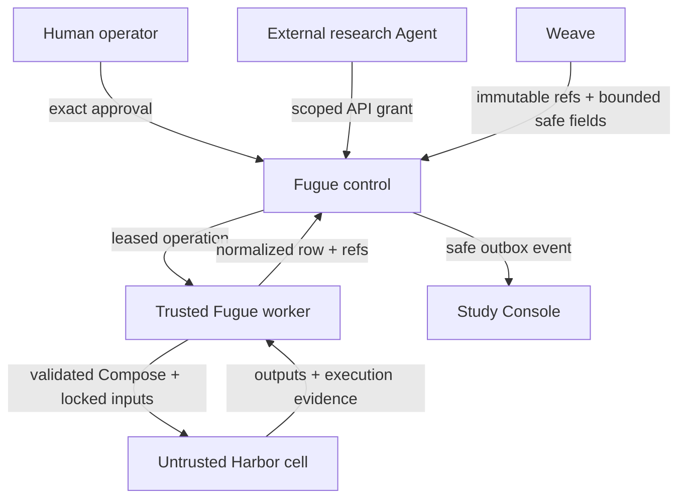

# Research and Harbor threat model

Status: implementation baseline for the local research stack

## Scope

This document covers Fugue’s research API, reviewed Weave evidence, Study
records, approval boundary, worker queue, Harbor rendering and execution,
normalized outcomes, and safe publication to Study Console.

It does not claim to secure WBAgent/Core/Aria, the Docker daemon, the host
operating system, W&B infrastructure, or Study Console itself. Study Console
has a separate application-security review. The local Fugue worker is trusted
because it owns Docker access.

## Assets

- research questions, notes, and sourced Results;
- immutable Study, preview, approval, plan, runtime, and scorer digests;
- W&B and Weave credentials;
- selected Weave Call, root, Dataset, and feedback identities;
- task inputs, private expected values, and gold artifacts;
- source checkouts and registered artifact mirrors;
- normalized predictions and evaluations;
- Docker daemon access and host filesystem access;
- publication credentials and safe research records;
- budget, usage, and cost accounting.

## Actors

| Actor | Trust |
|---|---|
| Human operator | Trusted to approve bounded spend and administer the local instance |
| External research Agent | Authenticated but not trusted to approve, administer, broaden evidence, or supply executable infrastructure |
| Fugue control service | Trusted policy and persistence boundary; has no Docker socket |
| Fugue worker | Trusted local execution authority; has Docker access |
| Harbor task container | Untrusted Agent workload |
| Weave API and records | Authoritative external evidence; record content remains untrusted input |
| Study Console sink | Untrusted for availability; trusted only to receive the configured safe projection |
| Scorer container or evaluator | Untrusted computation with explicitly mounted normalized evidence and private references |

## Trust boundaries

The critical properties are:

- the Agent cannot cross the approval boundary;
- the control service cannot reach Docker;
- the Harbor cell cannot reach Docker or arbitrary host paths;
- external evidence can select a reviewed recipe but cannot become executable
  task content;
- publication failure cannot change execution state;
- recovery cannot create a second launch identity.

## Threats and mitigations

### Evidence substitution

**Threat.** An Agent selects a lookalike Call, swaps a root, crosses into another
project, reuses stale review feedback, or changes a source row after review.

**Mitigation.** `ReviewedCohortManifestV1` locks the exact Weave project,
Dataset identity and digest, selected Call/root pairs, source-row digests,
feedback type, revision, creator class, and expected safe value. Fugue requires
exact cohort equality. Review comments and trace bodies are not copied.

**Residual risk.** The source system must preserve immutable Call and feedback
identity. Deletion or inaccessible historical revisions make the cohort
unavailable rather than silently substituting evidence.

### Prompt injection through traces or annotations

**Threat.** Trace text or reviewer comments tell the research Agent or executor
to broaden access, reveal secrets, or alter the task.

**Mitigation.** The trace adapter exposes only allowlisted aggregates, immutable
references, source markers, and safe review fields. Reviewed traces choose a
registered task recipe; their bodies never become executable prompt or
workspace content.

### Approval confusion or self-approval

**Threat.** The research Agent approves its own work, reuses an approval for a
changed preview, or changes inputs between approval and start.

**Mitigation.** Agent grants may request approval but cannot issue it or perform
administration. Approval is operator-only and bound to the exact preview
digest, cell ceiling, spend ceiling, subject, instance, and expiry. Admission
recomputes component digests and rejects drift.

### Credential theft or overreach

**Threat.** One bearer credential can read every Study, approve spend, or
administer the instance.

**Mitigation.** Opaque grants are stored only as SHA-256 digests and compared in
constant time. A grant binds subject, Fugue instance, Research IDs, expiry, and
actions. The bootstrapped Agent grant is limited to the current research flow:
read/write its Research, preview audits and Studies, request approval, start an
already approved exact preview, watch outcomes, and record bounded Results.

**Residual risk.** Local filesystem access to `.fugue/secrets` is equivalent to
credential compromise. Hosted secret rotation and centralized revocation are
future work.

### API abuse

**Threat.** Oversized payloads, high concurrency, host-header injection,
credential timing attacks, verbose errors, or cross-origin misuse exhaust or
probe the control service.

**Mitigation.** The service binds to localhost by default, validates trusted
hosts, limits body size and concurrent requests, compares credentials in
constant time, returns minimal health data and bounded redacted errors, and
adds restrictive security headers. Existing stable paths are preserved.

### Compose or container breakout

**Threat.** A rendered Compose fragment requests privilege, host namespaces,
devices, added capabilities, host networking, disabled security profiles,
arbitrary binds, a writable source mount, an unpinned image, or the Docker
socket.

**Mitigation.** Fugue validates every rendered fragment before invoking Docker.
It rejects unreviewed Compose keys and bind options, and requires
`pull_policy=never`, capability drop, `no-new-privileges`, CPU, memory, and PID
limits, approved network behavior, dedicated Fugue paths, and read-only task
inputs. Sidecars require a read-only root filesystem, non-root user, and
digest-pinned image. Candidate-specific `host.docker.internal` is allowed only
when the locked route requires the exact bridge endpoint.

`EffectiveSandboxAttestationV1` records the validated Compose assets, image,
user, mounts, network, capabilities, security options, limits, bridge
requirement, and policy digest. Fugue re-reads those assets immediately before
launch and rejects drift.

**Residual risk.** The attestation is based on Fugue’s locked launch inputs,
not an independent remote attestation of the Docker daemon. The trusted worker
and daemon can still violate the policy.

### Mutable or surprising images

**Threat.** A tag changes after preview or Docker pulls a different image.

**Mitigation.** Actual launch uses `pull_policy=never`; managed sidecars must
use digest-pinned images. Runtime preparation locks local image identity and
admission checks it.

**Residual risk.** Some Harbor main images are controlled through Harbor’s
runtime lock rather than declared in Fugue’s extra Compose fragments. Hosted
deployment needs a complete daemon-level image allowlist and signed provenance.

### Vulnerable optional or operational dependencies

**Threat.** A dependency may be safe in Fugue's usage pattern but still expose
an unsafe server, deserializer, or network path elsewhere in the package.

**Mitigation.** The core, research-service, and serving dependency profiles
have no known Python advisories at this qualification head. The research image
upgrades Debian security packages during its pinned build and has no fixable
high or critical operating-system or Python findings. Fugue does not expose
Mem0's server API, and the research worker does not install Mem0.

**Residual risk.** The optional `context` profile retains `mem0ai==0.1.118`
because the only upstream remediation currently requires the incompatible
2.0 beta API. `pip-audit` reports four Mem0 advisories, including its
unauthenticated server endpoints and pickle-backed storage. Treat the Mem0
adapter as local, experimental, and untrusted-data-ineligible until it is
ported to a stable fixed release.

Docker Compose v5.3.1 is the latest upstream release at qualification time.
The scanner reports three fixable vulnerabilities in dependencies embedded in
that binary, but upstream has not published a rebuilt Compose release containing
those versions. Compose exists only in the trusted local worker, receives
Fugue-validated files, and is not installed in the Agent-facing control
container. A fixed upstream Compose release is a hosted-deployment blocker and
must replace v5.3.1 before this boundary is described as production-hardened.

### Network exfiltration

**Threat.** An Agent uses the task network to exfiltrate prompts, private
references, or credentials.

**Mitigation.** Credentials are not mounted into active cells. Context
sidecars share only the main network namespace. The host bridge is absent
unless required by the locked model route. Tasks and task inputs are mounted
read-only.

**Residual risk.** A model route that requires an outbound bridge creates an
explicit egress path. Network policy enforcement outside Compose is required
for hosted multi-tenant use.

### Duplicate execution after failure

**Threat.** Worker expiry, crash, or reconnection launches the same paid cell
twice.

**Mitigation.** Leases use unique claim tokens, renew during side-effectful
operations, and reject writes after ownership loss. Every campaign operation
uses an idempotency key. A launched cell is reconciled; it is never silently
relaunched under the same identity.

### Scoring confusion

**Threat.** Missing evaluation is reported as task failure, or a score uses
private data without a locked revision.

**Mitigation.** Infrastructure, execution, deterministic task result, authored
evaluation, evidence health, and cost remain separate. `not_applicable` means
no additional scorer was configured. `unavailable` means an expected scorer
did not complete. Scorer inputs and revision digests are locked.

### Publication leakage

**Threat.** Trace bodies, prompts, credentials, expected values, gold paths, or
hidden reasoning enter Study Console records.

**Mitigation.** Publication uses an append-only outbox and a strict public
projection containing safe labels, aggregates, states, and immutable
references. Payloads are bounded and redaction-tested. Sink failure is
operational state only and cannot change the run outcome.

## Accepted local-worker risk

The default deployment is local and single-operator. The worker mounts a Docker
Unix socket and is therefore equivalent to a trusted host administrator.
Separating control and worker prevents the Agent-facing API from directly
owning Docker, but it does not make a compromised worker safe.

For non-local deployment, Fugue requires an explicit rootless Docker Unix
endpoint. This is a guardrail, not sufficient hosted isolation.

## Hosted blockers

Fugue must not be described as a hosted multi-tenant security boundary until
all of the following exist:

- rootless, per-tenant worker isolation outside a shared host daemon;
- signed image provenance and daemon-enforced digest allowlists;
- enforced egress policy for bridge and provider traffic;
- managed secret issuance, rotation, revocation, and audit;
- tenant-aware storage encryption and deletion;
- independent effective-container attestation after runtime composition;
- resource quotas beyond Compose hints;
- incident response and vulnerability-management processes.

## Verification

The security qualification includes:

- adversarial reviewed-cohort substitutions;
- scoped authorization and exact approval tests;
- dangerous Compose, bind, image, bridge, and drift tests;
- restart, stale-lease, and duplicate-launch tests;
- publication redaction and outbox replay;
- static analysis, dependency audit, secret scanning, image scanning, and SBOM;
- full compatibility and Atlas-publication boundary tests.
